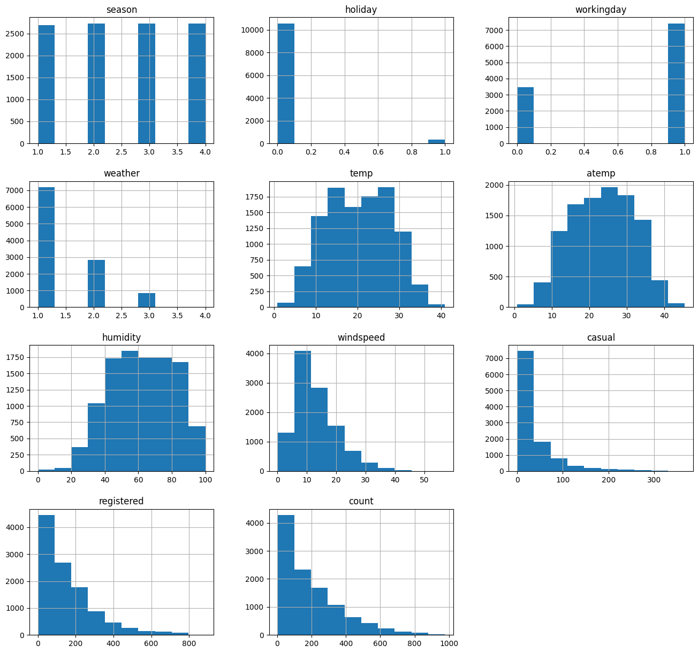
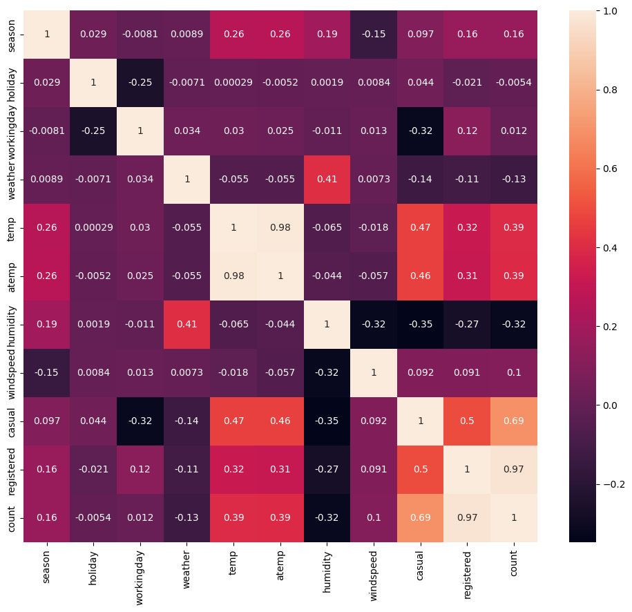
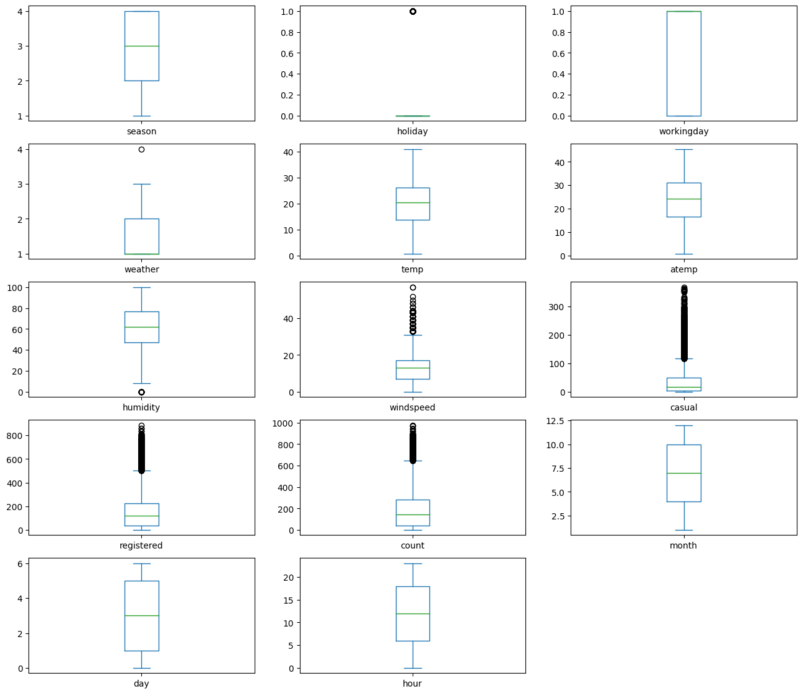
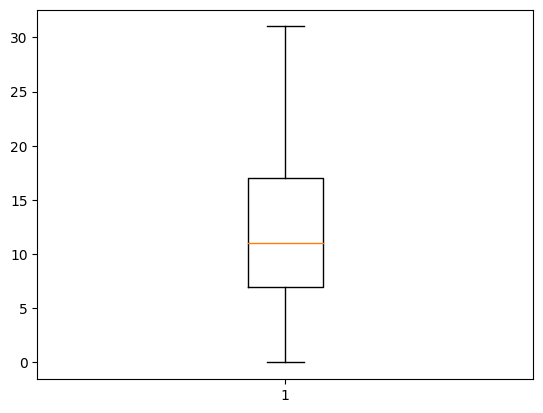
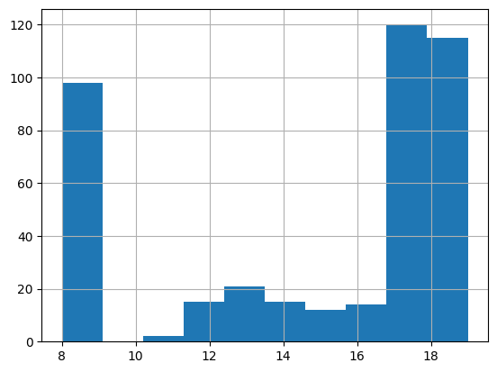
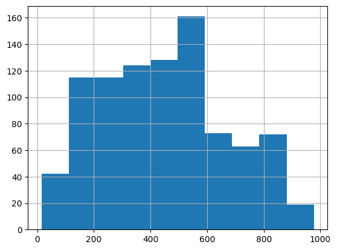
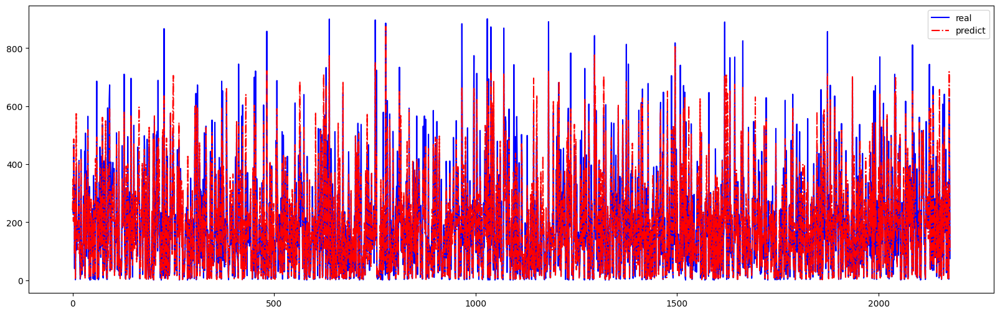
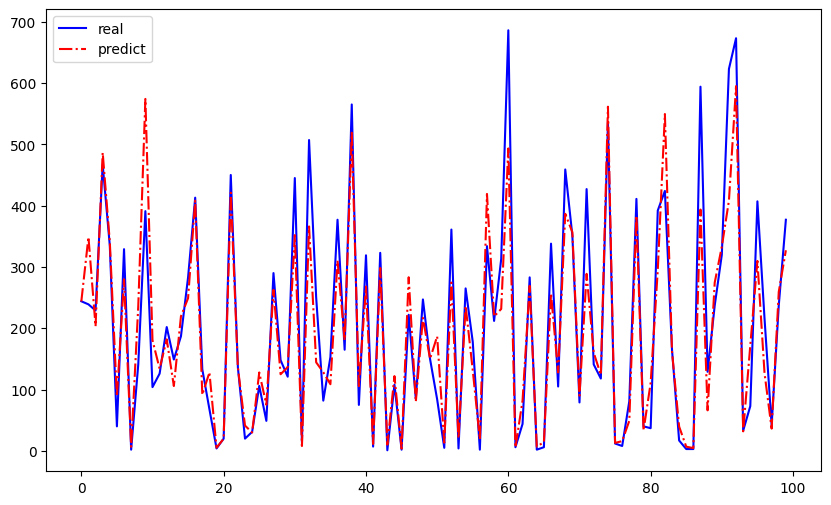
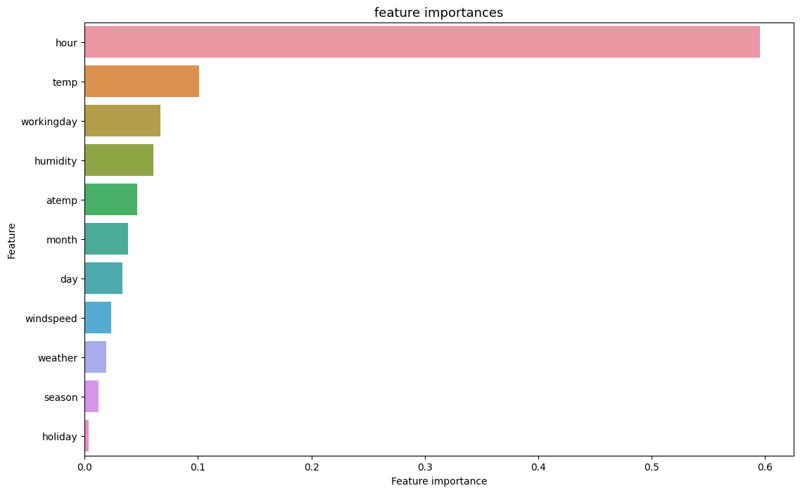

# 共享单车租赁数量预测：用随机森林和支持向量机理解需求波动

## 摘要

| 模块     | 内容                                                         |
| -------- | ------------------------------------------------------------ |
| 业务场景 | 交通出行                                                     |
| 数据来源 | 共享单车历史租赁数据，包含日期、天气、季节、温湿度、风速、工作日和租赁量等字段。 |
| 分析方法 | 特征工程、训练测试集划分、随机森林回归、支持向量机、模型评估、特征重要性可视化。 |
| 结论先行 | 天气、季节、工作日和时间特征通常是影响租赁需求的主变量。     |

本报告围绕“业务背景、分析目的、数据说明、分析思路、分析过程、核心结论和改进建议”展开，目标是用数据回答具体问题，并把分析结果转化为可执行的判断。

## 一、分析背景

共享单车运营的关键是供需匹配。预测租赁量可以帮助平台提前调度车辆、安排运维和优化热门区域供给。

## 二、分析目的

本次分析主要回答以下问题：

- 哪些变量或特征最可能影响目标结果？
- 模型能否稳定识别高风险、高价值或高需求样本？
- 模型输出应该如何转化为业务动作，而不是停留在准确率上？

先明确分析目的，再开展数据处理和指标拆解，可以保证报告围绕问题展开，而不是简单罗列代码和图表。

## 三、数据来源与指标说明

| 项目           | 说明                                                         |
| -------------- | ------------------------------------------------------------ |
| 数据来源       | 共享单车历史租赁数据，包含日期、天气、季节、温湿度、风速、工作日和租赁量等字段。 |
| 分析工具与方法 | 特征工程、训练测试集划分、随机森林回归、支持向量机、模型评估、特征重要性可视化。 |
| 重点分析指标   | 目标变量分布、特征变量、训练/测试集、准确率、召回率、精确率、AUC 或混淆矩阵。 |
| 数据口径       | 本文以项目数据集中的字段为分析范围，先完成缺失值、异常值、重复值或类别字段处理，再围绕核心指标做统计、可视化或建模。 |

数据口径会直接影响分析结论，因此报告先说明数据范围、核心指标和处理方式，便于读者理解结论的适用边界。

## 四、分析思路

| 步骤                | 目的                                                         |
| ------------------- | ------------------------------------------------------------ |
| 1. 明确业务问题     | 确定分析要回答什么，以及结论会影响什么决策。                 |
| 2. 数据读取与清洗   | 处理缺失、重复、异常和字段格式问题，保证分析基础可靠。       |
| 3. 指标拆解与可视化 | 从趋势、结构、对比、分布或空间维度观察数据现象。             |
| 4. 建模或深度分析   | 根据项目需要完成聚类、预测、分类、回归、文本分析或可视化大屏。 |
| 5. 输出结论与建议   | 把数据发现翻译成业务语言，并给出可执行的下一步动作。         |

本项目的具体分析路径如下：

- 先把业务目标转成可建模问题：明确预测对象、标签字段、样本粒度和模型输出的业务含义。
- 做数据检查和探索：查看缺失值、异常值、类别分布、关键变量分布，以及目标变量是否存在不平衡。
- 完成特征处理：对类别变量编码，对数值变量缩放或标准化，并根据业务含义保留可解释变量。
- 建立基准模型并比较效果：优先选择可解释模型作为 baseline，再根据数据复杂度尝试树模型或集成模型。
- 把模型指标翻译成业务动作：例如风控看召回和误报，营销看转化和 ROI，预测类问题看高峰期误差。

## 五、数据处理过程

本项目的数据处理主要包括以下环节：

- 读取原始数据，检查字段类型、样本规模和基础统计信息。
- 处理缺失值、重复值、异常值或文本噪声，保证后续统计和建模结果可靠。
- 根据分析目标构造必要指标、标签或特征，并统一字段口径。
- 按业务维度进行分组、聚合、可视化或模型训练，为结论提供依据。

## 六、数据分析与结果

本部分按照“分析发现 -> 结果解读”的方式组织，重点说明数据体现出的现象及其业务含义。

### 1. 天气、季节、工作日和时间特征通常是影响租赁需求的主变量。

结果解读：该发现是本项目最核心的结论之一，说明数据中存在值得关注的结构性特征。对应图表或模型结果应围绕这一判断展开，帮助读者理解结论来源。

### 2. 随机森林能够捕捉非线性关系，适合处理天气与时间组合带来的需求波动。

结果解读：该发现进一步解释了不同维度之间的差异。对业务决策而言，重点不只是看到差异，而是判断差异来自哪些对象、场景或指标。

### 3. 需求预测不应只看整体误差，还要关注高峰期误差，因为高峰期错配会直接影响用户体验。

结果解读：该发现可以作为后续优化策略或模型改进的依据。若用于真实业务，还需要结合成本、资源、实验结果或线上反馈继续验证。

## 七、结论

综合以上分析，可以得到以下结论：

- 天气、季节、工作日和时间特征通常是影响租赁需求的主变量。
- 随机森林能够捕捉非线性关系，适合处理天气与时间组合带来的需求波动。
- 需求预测不应只看整体误差，还要关注高峰期误差，因为高峰期错配会直接影响用户体验。

## 八、建议

- 行动 1：运营侧可基于预测结果做早晚高峰车辆预投放，并对恶劣天气设置弹性调度策略。
- 行动 2：模型评估应增加高峰时段和节假日分组误差，贴近真实调度场景。
- 行动 3：后续可以引入地理网格、站点库存和实时天气，升级为区域级预测系统。
- 跟进方式：为每条建议绑定一个可观察指标，后续按周或按月复盘效果。

建议部分应结合具体对象、执行动作和复盘指标，避免停留在泛泛的“加强管理”或“优化运营”。

## 九、局限性与改进方向

- 项目价值：把历史行为转化为可预测信号，支持资源投放、供给调度、用户触达或收益管理。
- 真实限制：出行和旅游需求对天气、节假日、区域活动、价格和突发事件敏感，历史数据对未来异常场景的解释能力有限。
- 业务风险：预测或分群结果如果没有接入实时库存、运力、价格和渠道策略，容易出现供需错配或收益损失。
- 改进方向：按时间切分训练集和验证集，增加线上/线下指标对齐，避免随机切分高估模型效果。
- 改进方向：补充模型监控，包括数据漂移、预测分布、召回率、误报率和业务转化效果。
- 改进方向：接入实时天气、节假日、库存/运力、价格和渠道数据，让分析结果能服务实时运营。

## 附录：完整代码与输出结果

下面内容按原 notebook 的代码单元顺序整理。如果代码单元产生了文本输出或图片输出，也一并附在对应代码后面，便于复现完整分析过程。

### 代码单元 1

```python
import numpy as np
import pandas as pd
import matplotlib.pyplot as plt
```

### 代码单元 2

```python
# 读取数据文件
df = pd.read_csv('./train.csv')
```

### 代码单元 3

```python
# 查看数据集具体情况
df.info()
```

**文本输出**

```text
<class 'pandas.core.frame.DataFrame'>
RangeIndex: 10886 entries, 0 to 10885
Data columns (total 12 columns):
 #   Column      Non-Null Count  Dtype  
---  ------      --------------  -----  
 0   datetime    10886 non-null  object 
 1   season      10886 non-null  int64  
 2   holiday     10886 non-null  int64  
 3   workingday  10886 non-null  int64  
 4   weather     10886 non-null  int64  
 5   temp        10886 non-null  float64
 6   atemp       10886 non-null  float64
 7   humidity    10886 non-null  int64  
 8   windspeed   10886 non-null  float64
 9   casual      10886 non-null  int64  
 10  registered  10886 non-null  int64  
 11  count       10886 non-null  int64  
dtypes: float64(3), int64(8), object(1)
memory usage: 1020.7+ KB
```

### 代码单元 4

```python
# 看一下前五条，看具体的数据情况
df.head()
```

**文本输出**

```text
datetime  season  holiday  workingday  weather  temp   atemp  \
0  2017-01-01 00:00:00       1        0           0        1  9.84  14.395   
1  2017-01-01 01:00:00       1        0           0        1  9.02  13.635   
2  2017-01-01 02:00:00       1        0           0        1  9.02  13.635   
3  2017-01-01 03:00:00       1        0           0        1  9.84  14.395   
4  2017-01-01 04:00:00       1        0           0        1  9.84  14.395   

   humidity  windspeed  casual  registered  count  
0        81        0.0       3          13     16  
1        80        0.0       8          32     40  
2        80        0.0       5          27     32  
3        75        0.0       3          10     13  
4        75        0.0       0           1      1
```

### 代码单元 5

```python
# 再更具体的查看信息
df.describe()
```

**文本输出**

```text
season       holiday    workingday       weather         temp  \
count  10886.000000  10886.000000  10886.000000  10886.000000  10886.00000   
mean       2.506614      0.028569      0.680875      1.418427     20.23086   
std        1.116174      0.166599      0.466159      0.633839      7.79159   
min        1.000000      0.000000      0.000000      1.000000      0.82000   
25%        2.000000      0.000000      0.000000      1.000000     13.94000   
50%        3.000000      0.000000      1.000000      1.000000     20.50000   
75%        4.000000      0.000000      1.000000      2.000000     26.24000   
max        4.000000      1.000000      1.000000      4.000000     41.00000   

              atemp      humidity     windspeed        casual    registered  \
count  10886.000000  10886.000000  10886.000000  10886.000000  10886.000000   
mean      23.655084     61.886460     12.799395     36.021955    155.552177   
std        8.474601     19.245033      8.164537     49.960477    151.039033   
min        0.760000      0.000000      0.000000      0.000000      0.000000   
25%       16.665000     47.000000      7.001500      4.000000     36.000000   
50%       24.240000     62.000000   
... 输出过长，博客中已截断
```

### 代码单元 6

```python
df.hist(figsize=(16,15))    # 使用hist查看每一列的分布直方图
```

**文本输出**

```text
array([[<AxesSubplot: title={'center': 'season'}>,
        <AxesSubplot: title={'center': 'holiday'}>,
        <AxesSubplot: title={'center': 'workingday'}>],
       [<AxesSubplot: title={'center': 'weather'}>,
        <AxesSubplot: title={'center': 'temp'}>,
        <AxesSubplot: title={'center': 'atemp'}>],
       [<AxesSubplot: title={'center': 'humidity'}>,
        <AxesSubplot: title={'center': 'windspeed'}>,
        <AxesSubplot: title={'center': 'casual'}>],
       [<AxesSubplot: title={'center': 'registered'}>,
        <AxesSubplot: title={'center': 'count'}>, <AxesSubplot: >]],
      dtype=object)
```

**图表输出 1**



### 代码单元 7

```python
# 查看相关度
df.corr()
```

**文本输出**

```text
C:\Users\Administrator\AppData\Local\Temp\2\ipykernel_3952\2666249053.py:2: FutureWarning: The default value of numeric_only in DataFrame.corr is deprecated. In a future version, it will default to False. Select only valid columns or specify the value of numeric_only to silence this warning.
  df.corr()
season   holiday  workingday   weather      temp     atemp  \
season      1.000000  0.029368   -0.008126  0.008879  0.258689  0.264744   
holiday     0.029368  1.000000   -0.250491 -0.007074  0.000295 -0.005215   
workingday -0.008126 -0.250491    1.000000  0.033772  0.029966  0.024660   
weather     0.008879 -0.007074    0.033772  1.000000 -0.055035 -0.055376   
temp        0.258689  0.000295    0.029966 -0.055035  1.000000  0.984948   
atemp       0.264744 -0.005215    0.024660 -0.055376  0.984948  1.000000   
humidity    0.190610  0.001929   -0.010880  0.406244 -0.064949 -0.043536   
windspeed  -0.147121  0.008409    0.013373  0.007261 -0.017852 -0.057473   
casual      0.096758  0.043799   -0.319111 -0.135918  0.467097  0.462067   
registered  0.164011 -0.020956    0.119460 -0.109340  0.318571  0.314635   
count       0.163439 -0.005393    0.011594 -0.128655  0.394454  0.389784 
... 输出过长，博客中已截断
```

### 代码单元 8

```python
# 使用热度图可视化这个相关系数矩阵
# 要先导入seaborn包 Seaborn是基于matplotlib的图形可视化python包。它提供了一种高度交互式界面，便于用户能够做出各种有吸引力的统计图表
import seaborn as sns
corr = df.corr()
plt.subplots(figsize=(12,10))  # 设置画布大小
# annot默认为False，当annot为True时，会在heatmap中每个方格写入数据，更便于查看
sns.heatmap(corr, annot=True)
```

**文本输出**

```text
C:\Users\Administrator\AppData\Local\Temp\2\ipykernel_3952\1675435683.py:4: FutureWarning: The default value of numeric_only in DataFrame.corr is deprecated. In a future version, it will default to False. Select only valid columns or specify the value of numeric_only to silence this warning.
  corr = df.corr()
```

**图表输出 1**



### 代码单元 9

```python
# 为了保险起见，我们还是复制一份副本来预处理，出问题了我们有原版
# deep参数默认为True，
df_copy = df.copy(deep=True)
```

### 代码单元 10

```python
df_copy.head()
```

**文本输出**

```text
datetime  season  holiday  workingday  weather  temp   atemp  \
0  2017-01-01 00:00:00       1        0           0        1  9.84  14.395   
1  2017-01-01 01:00:00       1        0           0        1  9.02  13.635   
2  2017-01-01 02:00:00       1        0           0        1  9.02  13.635   
3  2017-01-01 03:00:00       1        0           0        1  9.84  14.395   
4  2017-01-01 04:00:00       1        0           0        1  9.84  14.395   

   humidity  windspeed  casual  registered  count  
0        81        0.0       3          13     16  
1        80        0.0       8          32     40  
2        80        0.0       5          27     32  
3        75        0.0       3          10     13  
4        75        0.0       0           1      1
```

### 代码单元 11

```python
df_copy.info()
```

**文本输出**

```text
<class 'pandas.core.frame.DataFrame'>
RangeIndex: 10886 entries, 0 to 10885
Data columns (total 12 columns):
 #   Column      Non-Null Count  Dtype  
---  ------      --------------  -----  
 0   datetime    10886 non-null  object 
 1   season      10886 non-null  int64  
 2   holiday     10886 non-null  int64  
 3   workingday  10886 non-null  int64  
 4   weather     10886 non-null  int64  
 5   temp        10886 non-null  float64
 6   atemp       10886 non-null  float64
 7   humidity    10886 non-null  int64  
 8   windspeed   10886 non-null  float64
 9   casual      10886 non-null  int64  
 10  registered  10886 non-null  int64  
 11  count       10886 non-null  int64  
dtypes: float64(3), int64(8), object(1)
memory usage: 1020.7+ KB
```

### 代码单元 12

```python
# 先把这个日期处理一下
# 分为月 周几 小时 pd.DatetimeIndex 是把某一列进行转换，同时把该列的数据设置为索引 index
df_copy['month'] = pd.DatetimeIndex(df_copy.datetime).month
# 周末可能和周一到周五的不一样 所以提取一下是星期几 0-6 周一到周日
df_copy['day'] = pd.DatetimeIndex(df_copy.datetime).weekday
df_copy['hour'] = pd.DatetimeIndex(df_copy.datetime).hour
```

### 代码单元 13

```python
df_copy.head()
```

**文本输出**

```text
datetime  season  holiday  workingday  weather  temp   atemp  \
0  2017-01-01 00:00:00       1        0           0        1  9.84  14.395   
1  2017-01-01 01:00:00       1        0           0        1  9.02  13.635   
2  2017-01-01 02:00:00       1        0           0        1  9.02  13.635   
3  2017-01-01 03:00:00       1        0           0        1  9.84  14.395   
4  2017-01-01 04:00:00       1        0           0        1  9.84  14.395   

   humidity  windspeed  casual  registered  count  month  day  hour  
0        81        0.0       3          13     16      1    6     0  
1        80        0.0       8          32     40      1    6     1  
2        80        0.0       5          27     32      1    6     2  
3        75        0.0       3          10     13      1    6     3  
4        75        0.0       0           1      1      1    6     4
```

### 代码单元 14

```python
# 既然把datetime拆分为了三列，就可以把原来这个删除了
df_copy = df_copy.drop(['datetime'], axis=1)
```

### 代码单元 15

```python
# 查看一下具体信息
df_copy.info()
```

**文本输出**

```text
<class 'pandas.core.frame.DataFrame'>
RangeIndex: 10886 entries, 0 to 10885
Data columns (total 14 columns):
 #   Column      Non-Null Count  Dtype  
---  ------      --------------  -----  
 0   season      10886 non-null  int64  
 1   holiday     10886 non-null  int64  
 2   workingday  10886 non-null  int64  
 3   weather     10886 non-null  int64  
 4   temp        10886 non-null  float64
 5   atemp       10886 non-null  float64
 6   humidity    10886 non-null  int64  
 7   windspeed   10886 non-null  float64
 8   casual      10886 non-null  int64  
 9   registered  10886 non-null  int64  
 10  count       10886 non-null  int64  
 11  month       10886 non-null  int64  
 12  day         10886 non-null  int64  
 13  hour        10886 non-null  int64  
dtypes: float64(3), int64(11)
memory usage: 1.2 MB
```

### 代码单元 16

```python
df_copy.head()
```

**文本输出**

```text
season  holiday  workingday  weather  temp   atemp  humidity  windspeed  \
0       1        0           0        1  9.84  14.395        81        0.0   
1       1        0           0        1  9.02  13.635        80        0.0   
2       1        0           0        1  9.02  13.635        80        0.0   
3       1        0           0        1  9.84  14.395        75        0.0   
4       1        0           0        1  9.84  14.395        75        0.0   

   casual  registered  count  month  day  hour  
0       3          13     16      1    6     0  
1       8          32     40      1    6     1  
2       5          27     32      1    6     2  
3       3          10     13      1    6     3  
4       0           1      1      1    6     4
```

### 代码单元 17

```python
df_copy.isnull().sum()
```

**文本输出**

```text
season        0
holiday       0
workingday    0
weather       0
temp          0
atemp         0
humidity      0
windspeed     0
casual        0
registered    0
count         0
month         0
day           0
hour          0
dtype: int64
```

### 代码单元 18

```python
# 画出每个特征的箱图，分析离群点
df_copy.plot(kind='box', subplots=True, layout=(5,3), sharex=False,sharey=False, figsize=(16,14))# 每个特征的箱图
```

**文本输出**

```text
season           AxesSubplot(0.125,0.747241;0.227941x0.132759)
holiday       AxesSubplot(0.398529,0.747241;0.227941x0.132759)
workingday    AxesSubplot(0.672059,0.747241;0.227941x0.132759)
weather          AxesSubplot(0.125,0.587931;0.227941x0.132759)
temp          AxesSubplot(0.398529,0.587931;0.227941x0.132759)
atemp         AxesSubplot(0.672059,0.587931;0.227941x0.132759)
humidity         AxesSubplot(0.125,0.428621;0.227941x0.132759)
windspeed     AxesSubplot(0.398529,0.428621;0.227941x0.132759)
casual        AxesSubplot(0.672059,0.428621;0.227941x0.132759)
registered        AxesSubplot(0.125,0.26931;0.227941x0.132759)
count          AxesSubplot(0.398529,0.26931;0.227941x0.132759)
month          AxesSubplot(0.672059,0.26931;0.227941x0.132759)
day                  AxesSubplot(0.125,0.11;0.227941x0.132759)
hour              AxesSubplot(0.398529,0.11;0.227941x0.132759)
dtype: object
```

**图表输出 1**



### 代码单元 19

```python
# 处理风速的异常值
a = df_copy["windspeed"].quantile(0.75)
b = df_copy["windspeed"].quantile(0.25)
# 直接用的 “=” ，修改c的时候也会修改原数据集
c = df_copy["windspeed"]
# 超过了上四分位1.5倍四分位距或下四分位1.5倍距离都算异常值，先设置为空值
c[(c>=(a-b)*1.5+a)|(c<=b-(a-b)*1.5)]=np.nan
# 用中位数填充空值
c.fillna(c.median(),inplace=True)
```

**文本输出**

```text
C:\Users\Administrator\AppData\Local\Temp\2\ipykernel_3952\3384446724.py:7: SettingWithCopyWarning: 
A value is trying to be set on a copy of a slice from a DataFrame

See the caveats in the documentation: https://pandas.pydata.org/pandas-docs/stable/user_guide/indexing.html#returning-a-view-versus-a-copy
  c[(c>=(a-b)*1.5+a)|(c<=b-(a-b)*1.5)]=np.nan
```

### 代码单元 20

```python
# 处理后的风速的箱线图
plt.boxplot(df_copy['windspeed'])
```

**文本输出**

```text
{'whiskers': [<matplotlib.lines.Line2D at 0x217e5c92fa0>,
  <matplotlib.lines.Line2D at 0x217e5ca3280>],
 'caps': [<matplotlib.lines.Line2D at 0x217e5ca3520>,
  <matplotlib.lines.Line2D at 0x217e5ca3730>],
 'boxes': [<matplotlib.lines.Line2D at 0x217e5c92d00>],
 'medians': [<matplotlib.lines.Line2D at 0x217e5ca39d0>],
 'fliers': [<matplotlib.lines.Line2D at 0x217e5ca3ca0>],
 'means': []}
```

**图表输出 1**



### 代码单元 21

```python
a = df_copy["count"].quantile(0.75)
b = df_copy["count"].quantile(0.25)
c = df_copy["count"]
# 查看异常值的个数
c[(c>=(a-b)*1.5+a)|(c<=b-(a-b)*1.5)].value_counts().sum()
```

**文本输出**

```text
303
```

### 代码单元 22

```python
# 查看一下count中异常值真的是是异常值吗
df_copy.loc[df_copy['count'] > 600 ]['hour'].hist()
```

**图表输出 1**



### 代码单元 23

```python
df_copy.loc[(df_copy['hour'] == 18) | (df_copy['hour'] == 17) ]['count'].hist()
```

**图表输出 1**



### 代码单元 24

```python
df_copy.head()
```

**文本输出**

```text
season  holiday  workingday  weather  temp   atemp  humidity  windspeed  \
0       1        0           0        1  9.84  14.395        81        0.0   
1       1        0           0        1  9.02  13.635        80        0.0   
2       1        0           0        1  9.02  13.635        80        0.0   
3       1        0           0        1  9.84  14.395        75        0.0   
4       1        0           0        1  9.84  14.395        75        0.0   

   casual  registered  count  month  day  hour  
0       3          13     16      1    6     0  
1       8          32     40      1    6     1  
2       5          27     32      1    6     2  
3       3          10     13      1    6     3  
4       0           1      1      1    6     4
```

### 代码单元 25

```python
# 现在只剩下注册用户和非注册用户，这两列直接做删除处理
df_copy = df_copy.drop(['casual','registered'], axis=1)
df_copy.head()
```

**文本输出**

```text
season  holiday  workingday  weather  temp   atemp  humidity  windspeed  \
0       1        0           0        1  9.84  14.395        81        0.0   
1       1        0           0        1  9.02  13.635        80        0.0   
2       1        0           0        1  9.02  13.635        80        0.0   
3       1        0           0        1  9.84  14.395        75        0.0   
4       1        0           0        1  9.84  14.395        75        0.0   

   count  month  day  hour  
0     16      1    6     0  
1     40      1    6     1  
2     32      1    6     2  
3     13      1    6     3  
4      1      1    6     4
```

### 代码单元 26

```python
# 首先要明确这个是一个什么问题，对于租车数量的预测，目标变量是连续值，所以这是一个回归问题
# 对于回归问题的建模 使用sklearn里面的 支持向量机 和 随机森林 分别建模
# 分训练集和测试集，数据量还是比较多的（一万多条）所以直接按照常规划分方式，就不用k折交叉验证了
y = df_copy['count'].values
x = df_copy.drop(['count'], axis=1).values
from sklearn.model_selection import train_test_split
# 设置一下随机种子，这样无论运行几次分测试集训练集都是相同的
x_train, x_test, y_train, y_test = train_test_split(x, y, test_size = 0.2, random_state = 0)
```

### 代码单元 27

```python
print('训练数据集特征：', x_train.shape,
     '测试数据集特征：', x_test.shape)
print('训练数据集标签：', y_train.shape,
     '测试数据集标签：', y_test.shape)
```

**文本输出**

```text
训练数据集特征： (8708, 11) 测试数据集特征： (2178, 11)
训练数据集标签： (8708,) 测试数据集标签： (2178,)
```

### 代码单元 28

```python
# 随机森林建模
from sklearn.ensemble import RandomForestRegressor
# 树的个数设置为100
rf_model = RandomForestRegressor(n_estimators = 100)
rf_model.fit(x_train, y_train)
```

**文本输出**

```text
RandomForestRegressor()
```

### 代码单元 29

```python
# 看看这个模型如何
# score 得分 计算的是模型的R方值
print("训练集得分:{},测试集得分:{}".format(rf_model.score(x_train, y_train),rf_model.score(x_test, y_test)))
```

**文本输出**

```text
训练集得分:0.9834717175896198,测试集得分:0.8746210351963886
```

### 代码单元 30

```python
# 支持向量机建模
from sklearn import svm
# C 惩罚系数 越大 越不允许误差存在 容易过拟合 趋于0的时候 越允许误差 容易欠拟合
# gamma 核函数系数 越大越容易过拟合 越小越容易欠拟合
# 尝试了多次得出来这一组参数表现还是不错的
s_model = svm.SVR(kernel='rbf', C=10, gamma=0.01)
s_model.fit(x_train, y_train)
```

**文本输出**

```text
SVR(C=10, gamma=0.01)
```

### 代码单元 31

```python
# 看看如何
print("训练集得分:{},测试集得分:{}".format(s_model.score(x_train, y_train),s_model.score(x_test, y_test)))
```

**文本输出**

```text
训练集得分:0.4770298344792422,测试集得分:0.4487013950064256
```

### 代码单元 32

```python
# 模型评估
from sklearn.metrics import explained_variance_score
y_pred = rf_model.predict(x_test)
print('随机森林回归模型的可解释方差值为：',
     explained_variance_score(y_test,y_pred))
y_pred = s_model.predict(x_test)
print('支持向量机回归模型的可解释方差值为：',
     explained_variance_score(y_test,y_pred))
```

**文本输出**

```text
随机森林回归模型的可解释方差值为： 0.8747174346696318
支持向量机回归模型的可解释方差值为： 0.49800285482111617
```

### 代码单元 33

```python
# 可视化一下随机森林的预测结果
fig = plt.figure(figsize=(20,6)) ##设定空白画布，并制定大小
##用不同的颜色表示不同数据
y_pred = rf_model.predict(x_test)
plt.plot(range(y_test.shape[0]),y_test,color="blue", linewidth=1.5, linestyle="-")
plt.plot(range(y_test.shape[0]),y_pred,color="red", linewidth=1.5, linestyle="-.")
plt.legend(['real','predict'])
plt.show() ##显示图片
```

**图表输出 1**



### 代码单元 34

```python
fig = plt.figure(figsize=(10,6)) ##设定空白画布，并制定大小
##用不同的颜色表示不同数据
plt.plot(range(len(y_test[:100])),y_test[:100],color="blue", linewidth=1.5, linestyle="-")
plt.plot(range(len(y_test[:100])),y_pred[:100],color="red", linewidth=1.5, linestyle="-.")
plt.legend(['real','predict'])
# 保存一下图片
plt.savefig("随机森林预测结果.png")
plt.show() ##显示图片
```

**图表输出 1**



### 代码单元 35

```python
# 预测变量的重要性
feat_labels = df_copy.drop(['count'], axis=1).columns[0:]
```

### 代码单元 36

```python
# 查看一下提取的特征标签
feat_labels
```

**文本输出**

```text
Index(['season', 'holiday', 'workingday', 'weather', 'temp', 'atemp',
       'humidity', 'windspeed', 'month', 'day', 'hour'],
      dtype='object')
```

### 代码单元 37

```python
rf_model.feature_importances_
```

**文本输出**

```text
array([0.01240025, 0.00334546, 0.06676258, 0.01921132, 0.10073966,
       0.04633024, 0.06046684, 0.0233788 , 0.03843807, 0.03353593,
       0.59539085])
```

### 代码单元 38

```python
tmp = pd.DataFrame({'Feature': feat_labels, 'Feature importance': rf_model.feature_importances_})
# ascending 设置为false代表降序排列
tmp = tmp.sort_values(by='Feature importance',ascending=False)
plt.figure(figsize = (13,8))
plt.title('feature importances',fontsize=13)
s = sns.barplot(x='Feature importance',y='Feature',data=tmp)
plt.savefig("特征重要性可视化.png")
plt.show()
```

**图表输出 1**


