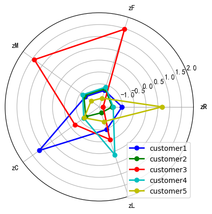

# 航空公司客户价值分析：基于 LRFCM 模型和 K-Means 的会员分层

## 摘要

| 模块     | 内容                                                         |
| -------- | ------------------------------------------------------------ |
| 业务场景 | 交通出行                                                     |
| 数据来源 | 航空公司会员数据，包含入会时长、最近乘机间隔、飞行频次、飞行里程和折扣系数等字段。 |
| 分析方法 | 数据清洗、异常值处理、LRFCM 指标构建、标准化、K-Means 聚类、客户价值画像。 |
| 结论先行 | 高频高里程客户是核心价值群体，应优先维护忠诚度和权益体验。   |

本报告围绕“业务背景、分析目的、数据说明、分析思路、分析过程、核心结论和改进建议”展开，目标是用数据回答具体问题，并把分析结果转化为可执行的判断。

## 一、分析背景

航空会员运营的重点是识别高价值客户、潜力客户和流失风险客户。LRFCM 将客户生命周期和消费贡献纳入统一框架，比单纯按消费金额排序更贴近运营决策。

## 二、分析目的

本次分析主要回答以下问题：

- 不同客户、渠道或门店能否按业务价值拆成清晰分组？
- 每一类群体的核心画像是什么？
- 不同分组应该配置什么差异化运营策略？

先明确分析目的，再开展数据处理和指标拆解，可以保证报告围绕问题展开，而不是简单罗列代码和图表。

## 三、数据来源与指标说明

| 项目           | 说明                                                         |
| -------------- | ------------------------------------------------------------ |
| 数据来源       | 航空公司会员数据，包含入会时长、最近乘机间隔、飞行频次、飞行里程和折扣系数等字段。 |
| 分析工具与方法 | 数据清洗、异常值处理、LRFCM 指标构建、标准化、K-Means 聚类、客户价值画像。 |
| 重点分析指标   | 分群指标、标准化结果、聚类类别、各类群体均值、群体规模和业务价值。 |
| 数据口径       | 本文以项目数据集中的字段为分析范围，先完成缺失值、异常值、重复值或类别字段处理，再围绕核心指标做统计、可视化或建模。 |

数据口径会直接影响分析结论，因此报告先说明数据范围、核心指标和处理方式，便于读者理解结论的适用边界。

## 四、分析思路

| 步骤                | 目的                                                         |
| ------------------- | ------------------------------------------------------------ |
| 1. 明确业务问题     | 确定分析要回答什么，以及结论会影响什么决策。                 |
| 2. 数据读取与清洗   | 处理缺失、重复、异常和字段格式问题，保证分析基础可靠。       |
| 3. 指标拆解与可视化 | 从趋势、结构、对比、分布或空间维度观察数据现象。             |
| 4. 建模或深度分析   | 根据项目需要完成聚类、预测、分类、回归、文本分析或可视化大屏。 |
| 5. 输出结论与建议   | 把数据发现翻译成业务语言，并给出可执行的下一步动作。         |

本项目的具体分析路径如下：

- 先定义分群目的：明确是为了识别高价值客户、优化广告预算，还是支持门店/会员运营。
- 选择能代表业务质量的指标：例如频次、金额、最近行为、转化效率、成本或贡献度。
- 对指标做标准化处理，避免量纲较大的变量主导聚类结果。
- 使用 K-Means 等方法得到分群，并回看每一类的指标均值和业务画像。
- 将分群结果转成运营策略：不同客群给出差异化触达、预算、权益或维护动作。

## 五、数据处理过程

本项目的数据处理主要包括以下环节：

- 读取原始数据，检查字段类型、样本规模和基础统计信息。
- 处理缺失值、重复值、异常值或文本噪声，保证后续统计和建模结果可靠。
- 根据分析目标构造必要指标、标签或特征，并统一字段口径。
- 按业务维度进行分组、聚合、可视化或模型训练，为结论提供依据。

## 六、数据分析与结果

本部分按照“分析发现 -> 结果解读”的方式组织，重点说明数据体现出的现象及其业务含义。

### 1. 高频高里程客户是核心价值群体，应优先维护忠诚度和权益体验。

结果解读：该发现是本项目最核心的结论之一，说明数据中存在值得关注的结构性特征。对应图表或模型结果应围绕这一判断展开，帮助读者理解结论来源。

### 2. 近期未飞行但历史贡献较高的客户可能存在流失风险，适合做召回运营。

结果解读：该发现进一步解释了不同维度之间的差异。对业务决策而言，重点不只是看到差异，而是判断差异来自哪些对象、场景或指标。

### 3. 低频低贡献客户不应投入过高人工成本，更适合自动化触达和低成本权益。

结果解读：该发现可以作为后续优化策略或模型改进的依据。若用于真实业务，还需要结合成本、资源、实验结果或线上反馈继续验证。

## 七、结论

综合以上分析，可以得到以下结论：

- 高频高里程客户是核心价值群体，应优先维护忠诚度和权益体验。
- 近期未飞行但历史贡献较高的客户可能存在流失风险，适合做召回运营。
- 低频低贡献客户不应投入过高人工成本，更适合自动化触达和低成本权益。

## 八、建议

- 行动 1：航空公司可按聚类结果配置差异化权益，例如升舱券、贵宾厅、里程加速和定向折扣。
- 行动 2：对高价值沉默客户应监控最近乘机间隔，提前触发召回活动。
- 行动 3：后续可加入航线偏好、舱位等级、投诉记录和会员等级变动，构建更完整的客户健康度评分。
- 跟进方式：为每条建议绑定一个可观察指标，后续按周或按月复盘效果。

建议部分应结合具体对象、执行动作和复盘指标，避免停留在泛泛的“加强管理”或“优化运营”。

## 九、局限性与改进方向

- 项目价值：把客户、渠道或门店从平均视角拆成不同群体，使运营资源可以按价值、潜力和风险差异化配置。
- 真实限制：出行和旅游需求对天气、节假日、区域活动、价格和突发事件敏感，历史数据对未来异常场景的解释能力有限。
- 业务风险：预测或分群结果如果没有接入实时库存、运力、价格和渠道策略，容易出现供需错配或收益损失。
- 改进方向：用业务结果回验分群有效性，例如复购、留存、利润、风险或转化，而不是只看聚类轮廓。
- 改进方向：建立分群更新机制，按月或按季度重新计算客户状态，避免用户行为变化后标签失效。
- 改进方向：接入实时天气、节假日、库存/运力、价格和渠道数据，让分析结果能服务实时运营。

## 附录：完整代码与输出结果

下面内容按原 notebook 的代码单元顺序整理。如果代码单元产生了文本输出或图片输出，也一并附在对应代码后面，便于复现完整分析过程。

### 代码单元 1

```python
import pandas as pd

datafile= './data/air_data.csv' #航空原始数据,第一行为属性标签
resultfile = './tmp/explore.xlsx' #数据探索结果表

data = pd.read_csv(datafile, encoding = 'utf-8') #读取原始数据，指定UTF-8编码（需要用文本编辑器将数据装换为UTF-8编码）

explore = data.describe(percentiles = [], include = 'all').T #包括对数据的基本描述，percentiles参数是指定计算多少的分位数表（如1/4分位数、中位数等）；T是转置，转置后更方便查阅
explore['null'] = len(data)-explore['count'] #describe()函数自动计算非空值数，需要手动计算空值数
explore = explore[['null', 'max', 'min']]
explore.columns = [u'空值数', u'最大值', u'最小值'] #表头重命名

'''这里只选取部分探索结果。
describe()函数自动计算的字段有count（非空值数）、unique（唯一值数）、top（频数最高者）、freq（最高频数）、mean（平均值）、std（方差）、min（最小值）、50%（中位数）、max（最大值）'''
explore.to_excel(resultfile) #导出结果
```

### 代码单元 2

```python
explore
```

**文本输出**

```text
空值数        最大值    最小值
MEMBER_NO                  0.0    62988.0    1.0
FFP_DATE                     0        NaN    NaN
FIRST_FLIGHT_DATE            0        NaN    NaN
GENDER                       3        NaN    NaN
FFP_TIER                   0.0        6.0    4.0
WORK_CITY                 2269        NaN    NaN
WORK_PROVINCE             3248        NaN    NaN
WORK_COUNTRY                26        NaN    NaN
AGE                      420.0      110.0    6.0
LOAD_TIME                    0        NaN    NaN
FLIGHT_COUNT               0.0      213.0    2.0
BP_SUM                     0.0   505308.0    0.0
EP_SUM_YR_1                0.0        0.0    0.0
EP_SUM_YR_2                0.0    74460.0    0.0
SUM_YR_1                 551.0   239560.0    0.0
SUM_YR_2                 138.0   234188.0    0.0
SEG_KM_SUM                 0.0   580717.0  368.0
WEIGHTED_SEG_KM            0.0  558440.14    0.0
LAST_FLIGHT_DATE             0        NaN    NaN
AVG_FLIGHT_COUNT           0.0     26.625   0.25
AVG_BP_SUM                 0.0    63163.5    0.0
BEGIN_TO_FIRST             0.0      729.0    0.0
LAST_TO_END                0.0      731.0    1.0
AVG_INTERVAL               0.0      728.0    0.0
MA
... 输出过长，博客中已截断
```

### 代码单元 3

```python
#数据清洗，过滤掉不符合规则的数据

import pandas as pd

datafile= './data/air_data.csv' #航空原始数据,第一行为属性标签
cleanedfile = './tmp/data_cleaned.csv' #数据清洗后保存的文件

data = pd.read_csv(datafile,encoding='utf-8') #读取原始数据，指定UTF-8编码（需要用文本编辑器将数据装换为UTF-8编码）

#票价非空值才保留
data = data[data['SUM_YR_1'].notnull()&data['SUM_YR_2'].notnull()]

#只保留票价非零的，或者平均折扣率与总飞行公里数同时为0的记录。
index1 = data['SUM_YR_1'] != 0
index2 = data['SUM_YR_2'] != 0
index3 = (data['SEG_KM_SUM'] == 0) & (data['avg_discount'] == 0) #该规则是“与”
data = data[index1 | index2 | index3] #该规则是“或”
data.head()
```

**文本输出**

```text
MEMBER_NO    FFP_DATE FIRST_FLIGHT_DATE GENDER  FFP_TIER    WORK_CITY  \
0      54993  2006/11/02        2008/12/24      男         6            .   
1      28065  2007/02/19        2007/08/03      男         6          NaN   
2      55106  2007/02/01        2007/08/30      男         6            .   
3      21189  2008/08/22        2008/08/23      男         5  Los Angeles   
4      39546  2009/04/10        2009/04/15      男         6           贵阳   

  WORK_PROVINCE WORK_COUNTRY   AGE   LOAD_TIME  ...  ADD_Point_SUM  \
0            北京           CN  31.0  2014/03/31  ...          39992   
1            北京           CN  42.0  2014/03/31  ...          12000   
2            北京           CN  40.0  2014/03/31  ...          15491   
3            CA           US  64.0  2014/03/31  ...              0   
4            贵州           CN  48.0  2014/03/31  ...          22704   

   Eli_Add_Point_Sum  L1Y_ELi_Add_Points  Points_Sum  L1Y_Points_Sum  \
0             114452              111100      619760          370211   
1              53288               53288      415768          238410   
2              55202               51711      406361          233798   
3              34890               34
... 输出过长，博客中已截断
```

### 代码单元 4

```python
data.to_csv(cleanedfile) #导出结果,由于excel读取csv文件使用ansi编码
```

### 代码单元 5

```python
outfile = './tmp/data_stipu.csv'
df = data[['FFP_DATE','LOAD_TIME','avg_discount','FLIGHT_COUNT','SEG_KM_SUM','LAST_TO_END']]
df.head()
```

**文本输出**

```text
FFP_DATE   LOAD_TIME  avg_discount  FLIGHT_COUNT  SEG_KM_SUM  LAST_TO_END
0  2006/11/02  2014/03/31      0.961639           210      580717            1
1  2007/02/19  2014/03/31      1.252314           140      293678            7
2  2007/02/01  2014/03/31      1.254676           135      283712           11
3  2008/08/22  2014/03/31      1.090870            23      281336           97
4  2009/04/10  2014/03/31      0.970658           152      309928            5
```

### 代码单元 6

```python
df.to_csv(outfile)
```

### 代码单元 7

```python
datafile = './tmp/data_stipu.csv'
standrandfile = './tmp/data_stand.csv'

data = pd.read_csv(datafile)

#数据变换
df = data[['LAST_TO_END','FLIGHT_COUNT','SEG_KM_SUM','avg_discount']].copy()#数据副本的复制
df['L'] = (pd.to_datetime(data['LOAD_TIME']) - pd.to_datetime(data['FFP_DATE'])).dt.days/30#计算日期差,单位为月
df.rename(columns={'LAST_TO_END':'R','FLIGHT_COUNT':'F','SEG_KM_SUM':'M','avg_discount':'C'},inplace = True)#列名重命名

#数据标准化
df = (df - df.mean(axis=0))/(df.std(axis=0))#均值标准化
df.columns = ['z'+i for i in df.columns]#对数据列名重命名

df.to_csv(standrandfile)
```

### 代码单元 8

```python
df
```

**文本输出**

```text
zR         zF         zM        zC        zL
0     -0.944948  14.034016  26.761154  1.295540  1.435707
1     -0.911894   9.073213  13.126864  2.868176  1.307152
2     -0.889859   8.718869  12.653481  2.880950  1.328381
3     -0.416098   0.781585  12.540622  1.994714  0.658476
4     -0.922912   9.923636  13.898736  1.344335  0.386032
...         ...        ...        ...       ...       ...
62039 -0.460169  -0.706656  -0.805297 -0.065898  2.076128
62040 -0.283886  -0.706656  -0.805297 -0.282309  0.557046
62041 -0.735611  -0.706656  -0.772332 -2.689885 -0.149421
62042  1.605649  -0.706656  -0.779837 -2.554628 -1.206173
62043  0.603039  -0.706656  -0.786677 -2.392319 -0.479656

[62044 rows x 5 columns]
```

### 代码单元 9

```python
import pandas as pd
from sklearn.cluster import KMeans #导入K均值聚类算法
import numpy as np

np.set_printoptions(threshold=np.inf)

inputfile = './tmp/data_stand.csv' #待聚类的数据文件
k = 5                    #需要进行的聚类类别数

#读取数据，选取5个特征进行聚类分析
data = pd.read_csv(inputfile).drop(['Unnamed: 0'],axis=1) #读取数据
data.head()
```

**文本输出**

```text
zR         zF         zM        zC        zL
0 -0.944948  14.034016  26.761154  1.295540  1.435707
1 -0.911894   9.073213  13.126864  2.868176  1.307152
2 -0.889859   8.718869  12.653481  2.880950  1.328381
3 -0.416098   0.781585  12.540622  1.994714  0.658476
4 -0.922912   9.923636  13.898736  1.344335  0.386032
```

### 代码单元 10

```python
#调用k-means算法，进行聚类分析
kmodel = KMeans(n_clusters = k)
kmodel.fit(data) #训练模型

print(kmodel.cluster_centers_) #查看聚类中心
```

**文本输出**

```text
C:\Users\Administrator\Envs\jv\lib\site-packages\sklearn\cluster\_kmeans.py:870: FutureWarning: The default value of `n_init` will change from 10 to 'auto' in 1.4. Set the value of `n_init` explicitly to suppress the warning
  warnings.warn(
[[-0.00270016 -0.23214985 -0.23645382  2.17019818  0.0416837 ]
 [-0.41509319 -0.16064594 -0.16035949 -0.25804693 -0.70029848]
 [-0.79940684  2.48313493  2.42423773  0.3097848   0.48354786]
 [-0.37743534 -0.08663489 -0.09454128 -0.15689175  1.16093248]
 [ 1.68695486 -0.57391605 -0.53673989 -0.17521822 -0.31318596]]
```

### 代码单元 11

```python
import numpy as np
import matplotlib.pyplot as plt

labels = data.columns.tolist() #标签
k = 5 #数据个数

plot_data = kmodel.cluster_centers_
color = ['b', 'g', 'r', 'c', 'y'] #指定颜色

angles = np.linspace(0, 2*np.pi, k, endpoint=False)
plot_data = np.concatenate((plot_data, plot_data[:,[0]]), axis=1) # 闭合
angles = np.concatenate((angles, [angles[0]])) # 闭合
labels.append('zR')

print(plot_data)
print(labels)
```

**文本输出**

```text
[[-0.00270016 -0.23214985 -0.23645382  2.17019818  0.0416837  -0.00270016]
 [-0.41509319 -0.16064594 -0.16035949 -0.25804693 -0.70029848 -0.41509319]
 [-0.79940684  2.48313493  2.42423773  0.3097848   0.48354786 -0.79940684]
 [-0.37743534 -0.08663489 -0.09454128 -0.15689175  1.16093248 -0.37743534]
 [ 1.68695486 -0.57391605 -0.53673989 -0.17521822 -0.31318596  1.68695486]]
['zR', 'zF', 'zM', 'zC', 'zL', 'zR']
```

### 代码单元 12

```python
# 对5个聚类中心点进行可视化
fig = plt.figure()
ax = fig.add_subplot(111, polar=True) #polar参数！！

for i in range(len(plot_data)):
    ax.plot(angles, plot_data[i], 'o-', color = color[i], label = u'customer'+str(i+1), linewidth=2)# 画线
ax.set_rgrids(np.arange(0.01, 3.5, 0.5), np.arange(-1, 2.5, 0.5), fontproperties="SimHei")
ax.set_thetagrids(angles * 180/np.pi, labels, fontproperties="SimHei")

plt.legend(loc = 4)
plt.show()
```

**图表输出 1**


