# 全球酒店预订分析与预测：识别取消订单风险和渠道结构

## 摘要

| 模块     | 内容                                                         |
| -------- | ------------------------------------------------------------ |
| 业务场景 | 交通旅行                                                     |
| 数据来源 | 酒店预订数据，覆盖预订渠道、入住时间、提前预订天数、客户类型、房型和是否取消等字段。 |
| 分析方法 | EDA、类别特征编码、逻辑回归、随机森林、XGBoost、分类模型评估。 |
| 结论先行 | 提前预订天数、渠道来源、客户类型和历史取消行为通常是取消风险的重要信号。 |

本报告围绕“业务背景、分析目的、数据说明、分析思路、分析过程、核心结论和改进建议”展开，目标是用数据回答具体问题，并把分析结果转化为可执行的判断。

## 一、分析背景

酒店行业的取消订单会影响房态管理、收益管理和渠道投放。通过预测取消风险，酒店可以更稳地制定超售、押金和二次营销策略。

## 二、分析目的

本次分析主要回答以下问题：

- 哪些变量或特征最可能影响目标结果？
- 模型能否稳定识别高风险、高价值或高需求样本？
- 模型输出应该如何转化为业务动作，而不是停留在准确率上？

先明确分析目的，再开展数据处理和指标拆解，可以保证报告围绕问题展开，而不是简单罗列代码和图表。

## 三、数据来源与指标说明

| 项目           | 说明                                                         |
| -------------- | ------------------------------------------------------------ |
| 数据来源       | 酒店预订数据，覆盖预订渠道、入住时间、提前预订天数、客户类型、房型和是否取消等字段。 |
| 分析工具与方法 | EDA、类别特征编码、逻辑回归、随机森林、XGBoost、分类模型评估。 |
| 重点分析指标   | 目标变量分布、特征变量、训练/测试集、准确率、召回率、精确率、AUC 或混淆矩阵。 |
| 数据口径       | 本文以项目数据集中的字段为分析范围，先完成缺失值、异常值、重复值或类别字段处理，再围绕核心指标做统计、可视化或建模。 |

数据口径会直接影响分析结论，因此报告先说明数据范围、核心指标和处理方式，便于读者理解结论的适用边界。

## 四、分析思路

| 步骤                | 目的                                                         |
| ------------------- | ------------------------------------------------------------ |
| 1. 明确业务问题     | 确定分析要回答什么，以及结论会影响什么决策。                 |
| 2. 数据读取与清洗   | 处理缺失、重复、异常和字段格式问题，保证分析基础可靠。       |
| 3. 指标拆解与可视化 | 从趋势、结构、对比、分布或空间维度观察数据现象。             |
| 4. 建模或深度分析   | 根据项目需要完成聚类、预测、分类、回归、文本分析或可视化大屏。 |
| 5. 输出结论与建议   | 把数据发现翻译成业务语言，并给出可执行的下一步动作。         |

本项目的具体分析路径如下：

- 先把业务目标转成可建模问题：明确预测对象、标签字段、样本粒度和模型输出的业务含义。
- 做数据检查和探索：查看缺失值、异常值、类别分布、关键变量分布，以及目标变量是否存在不平衡。
- 完成特征处理：对类别变量编码，对数值变量缩放或标准化，并根据业务含义保留可解释变量。
- 建立基准模型并比较效果：优先选择可解释模型作为 baseline，再根据数据复杂度尝试树模型或集成模型。
- 把模型指标翻译成业务动作：例如风控看召回和误报，营销看转化和 ROI，预测类问题看高峰期误差。

## 五、数据处理过程

本项目的数据处理主要包括以下环节：

- 读取原始数据，检查字段类型、样本规模和基础统计信息。
- 处理缺失值、重复值、异常值或文本噪声，保证后续统计和建模结果可靠。
- 根据分析目标构造必要指标、标签或特征，并统一字段口径。
- 按业务维度进行分组、聚合、可视化或模型训练，为结论提供依据。

## 六、数据分析与结果

本部分按照“分析发现 -> 结果解读”的方式组织，重点说明数据体现出的现象及其业务含义。

### 1. 提前预订天数、渠道来源、客户类型和历史取消行为通常是取消风险的重要信号。

结果解读：该发现是本项目最核心的结论之一，说明数据中存在值得关注的结构性特征。对应图表或模型结果应围绕这一判断展开，帮助读者理解结论来源。

### 2. 不同模型的价值不同：逻辑回归便于解释，随机森林和 XGBoost 更擅长处理复杂非线性关系。

结果解读：该发现进一步解释了不同维度之间的差异。对业务决策而言，重点不只是看到差异，而是判断差异来自哪些对象、场景或指标。

### 3. 取消预测不能只追求准确率，还要关注召回率和误判成本，因为漏判高风险订单会直接影响收入。

结果解读：该发现可以作为后续优化策略或模型改进的依据。若用于真实业务，还需要结合成本、资源、实验结果或线上反馈继续验证。

## 七、结论

综合以上分析，可以得到以下结论：

- 提前预订天数、渠道来源、客户类型和历史取消行为通常是取消风险的重要信号。
- 不同模型的价值不同：逻辑回归便于解释，随机森林和 XGBoost 更擅长处理复杂非线性关系。
- 取消预测不能只追求准确率，还要关注召回率和误判成本，因为漏判高风险订单会直接影响收入。

## 八、建议

- 行动 1：对高风险订单可设计定金、限时确认或入住前再营销，降低临时取消损失。
- 行动 2：渠道侧应比较不同 OTA 和直销渠道的取消率与净收入，而不是只看订单量。
- 行动 3：收益管理可结合预测结果动态调整超售比例和房价策略。
- 跟进方式：为每条建议绑定一个可观察指标，后续按周或按月复盘效果。

建议部分应结合具体对象、执行动作和复盘指标，避免停留在泛泛的“加强管理”或“优化运营”。

## 九、局限性与改进方向

- 项目价值：把历史行为转化为可预测信号，支持资源投放、供给调度、用户触达或收益管理。
- 真实限制：出行和旅游需求对天气、节假日、区域活动、价格和突发事件敏感，历史数据对未来异常场景的解释能力有限。
- 业务风险：预测或分群结果如果没有接入实时库存、运力、价格和渠道策略，容易出现供需错配或收益损失。
- 改进方向：按时间切分训练集和验证集，增加线上/线下指标对齐，避免随机切分高估模型效果。
- 改进方向：补充模型监控，包括数据漂移、预测分布、召回率、误报率和业务转化效果。
- 改进方向：接入实时天气、节假日、库存/运力、价格和渠道数据，让分析结果能服务实时运营。

## 附录：完整代码与输出结果

下面内容按原 notebook 的代码单元顺序整理。如果代码单元产生了文本输出或图片输出，也一并附在对应代码后面，便于复现完整分析过程。

### 代码单元 1

```python
import numpy as np               # linear algebra
import pandas as pd              # data processing, CSV file I/O (e.g. pd.read_csv)
import matplotlib.pyplot as plt
import seaborn as sns
import warnings
warnings.filterwarnings('ignore')
```

### 代码单元 2

```python
df=pd.read_csv('./2022_hotel_bookings.csv')
df.head()
```

**文本输出**

```text
hotel  is_canceled  lead_time  arrival_date_year arrival_date_month  \
0  Resort Hotel            0        342               2015               July   
1  Resort Hotel            0        737               2015               July   
2  Resort Hotel            0          7               2015               July   
3  Resort Hotel            0         13               2015               July   
4  Resort Hotel            0         14               2015               July   

   arrival_date_week_number  arrival_date_day_of_month  \
0                        27                          1   
1                        27                          1   
2                        27                          1   
3                        27                          1   
4                        27                          1   

   stays_in_weekend_nights  stays_in_week_nights  adults  ...  deposit_type  \
0                        0                     0       2  ...    No Deposit   
1                        0                     0       2  ...    No Deposit   
2                        0                     1       1  ...    No Deposit   
3                        0                     1       1  
... 输出过长，博客中已截断
```

### 代码单元 3

```python
df.isnull().mean()
#查看每列空值占比
```

**文本输出**

```text
hotel                             0.000000
is_canceled                       0.000000
lead_time                         0.000000
arrival_date_year                 0.000000
arrival_date_month                0.000000
arrival_date_week_number          0.000000
arrival_date_day_of_month         0.000000
stays_in_weekend_nights           0.000000
stays_in_week_nights              0.000000
adults                            0.000000
children                          0.000034
babies                            0.000000
meal                              0.000000
country                           0.004087
market_segment                    0.000000
distribution_channel              0.000000
is_repeated_guest                 0.000000
previous_cancellations            0.000000
previous_bookings_not_canceled    0.000000
reserved_room_type                0.000000
assigned_room_type                0.000000
booking_changes                   0.000000
deposit_type                      0.000000
agent                             0.136862
company                           0.943069
days_in_waiting_list              0.000000
customer_type                     0.000000
adr                               0.000
... 输出过长，博客中已截断
```

### 代码单元 4

```python
df.info()
```

**文本输出**

```text
<class 'pandas.core.frame.DataFrame'>
RangeIndex: 119390 entries, 0 to 119389
Data columns (total 32 columns):
 #   Column                          Non-Null Count   Dtype  
---  ------                          --------------   -----  
 0   hotel                           119390 non-null  object 
 1   is_canceled                     119390 non-null  int64  
 2   lead_time                       119390 non-null  int64  
 3   arrival_date_year               119390 non-null  int64  
 4   arrival_date_month              119390 non-null  object 
 5   arrival_date_week_number        119390 non-null  int64  
 6   arrival_date_day_of_month       119390 non-null  int64  
 7   stays_in_weekend_nights         119390 non-null  int64  
 8   stays_in_week_nights            119390 non-null  int64  
 9   adults                          119390 non-null  int64  
 10  children                        119386 non-null  float64
 11  babies                          119390 non-null  int64  
 12  meal                            119390 non-null  object 
 13  country                         118902 non-null  object 
 14  market_segment                  119390 non-null  object 
 15  distribution_channel          
... 输出过长，博客中已截断
```

### 代码单元 5

```python
df.describe([0.01,0.05,0.1,0.25,0.5,0.75,0.99]).T
```

**文本输出**

```text
count         mean         std      min  \
is_canceled                     119390.0     0.370416    0.482918     0.00   
lead_time                       119390.0   104.011416  106.863097     0.00   
arrival_date_year               119390.0  2016.156554    0.707476  2015.00   
arrival_date_week_number        119390.0    27.165173   13.605138     1.00   
arrival_date_day_of_month       119390.0    15.798241    8.780829     1.00   
stays_in_weekend_nights         119390.0     0.927599    0.998613     0.00   
stays_in_week_nights            119390.0     2.500302    1.908286     0.00   
adults                          119390.0     1.856403    0.579261     0.00   
children                        119386.0     0.103890    0.398561     0.00   
babies                          119390.0     0.007949    0.097436     0.00   
is_repeated_guest               119390.0     0.031912    0.175767     0.00   
previous_cancellations          119390.0     0.087118    0.844336     0.00   
previous_bookings_not_canceled  119390.0     0.137097    1.497437     0.00   
booking_changes                 119390.0     0.221124    0.652306     0.00   
agent                           103050.0    86.693382  110.774548
... 输出过长，博客中已截断
```

### 代码单元 6

```python
df.hist(figsize=(20,15))
plt.show()
```

**图表输出 1**

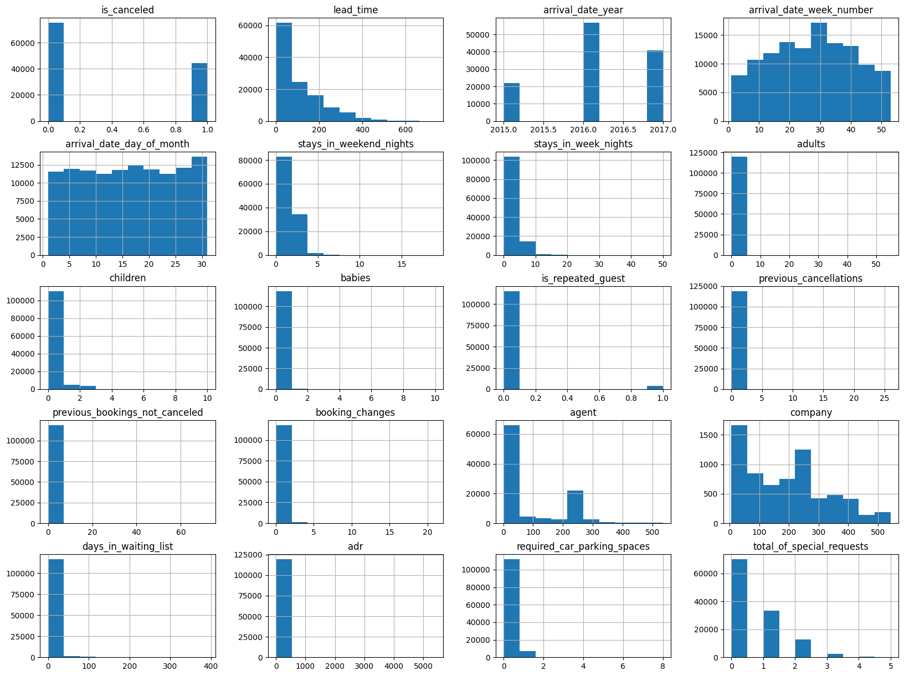

### 代码单元 7

```python
plt.figure(figsize=(15,8))
sns.countplot(x='hotel'
             ,data=df
             ,hue='is_canceled'
             ,palette=sns.color_palette('Set2',2)
            )
```

**图表输出 1**

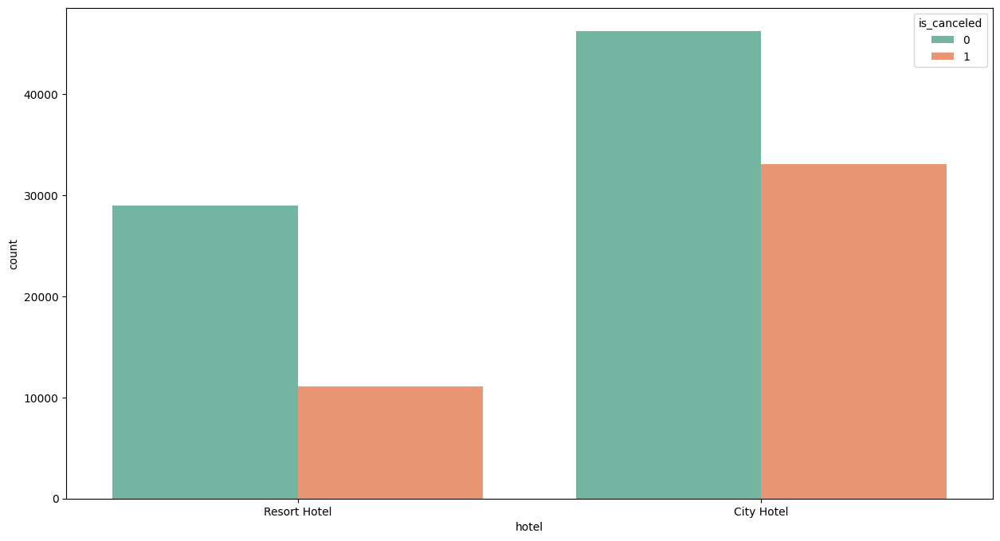

### 代码单元 8

```python
hotel_cancel=(df.loc[df['is_canceled']==1]['hotel'].value_counts()/df['hotel'].value_counts()).sort_values(ascending=False)
print('酒店取消率'.center(20),hotel_cancel,sep='\n')
```

**文本输出**

```text
酒店取消率        
City Hotel      0.417270
Resort Hotel    0.277634
Name: hotel, dtype: float64
```

### 代码单元 9

```python
city_hotel=df[(df['hotel']=='City Hotel') & (df['is_canceled']==0)]
resort_hotel=df[(df['hotel']=='Resort Hotel') & (df['is_canceled']==0)]
for i in [city_hotel,resort_hotel]:
    i.index=range(i.shape[0])
```

### 代码单元 10

```python
city_month=city_hotel['arrival_date_month'].value_counts()
resort_month=resort_hotel['arrival_date_month'].value_counts()
name=resort_month.index
x=list(range(len(city_month.index)))
y=city_month.values
x1=[i+0.3 for i in x]
y1=resort_month.values
width=0.3
plt.figure(figsize=(15,8),dpi=80)
plt.plot(x,y,label='City Hotel',color='lightsalmon')
plt.plot(x1,y1,label='Resort Hotel',color='lightseagreen')
plt.xticks(x,name)
plt.legend()
plt.xlabel('Month')
plt.ylabel('Count')
plt.title('Month Book')
for x,y in zip(x,y):
    plt.text(x,y+0.1,'%d' % y,ha = 'center',va = 'bottom')
    
for x,y in zip(x1,y1):
    plt.text(x,y+0.1,'%d' % y,ha = 'center',va = 'bottom')
```

**图表输出 1**

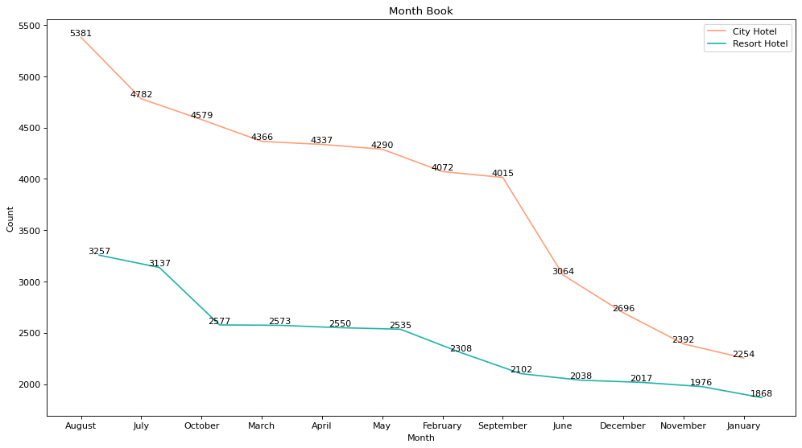

### 代码单元 11

```python
country_book=df['country'].value_counts()[:10]
country_cancel=df[(df.country.isin (country_book.index)) & (df.is_canceled==1)]['country'].value_counts()
plt.figure(figsize=(15,8))
sns.countplot(x='country'
              ,data=df[df.country.isin (country_book.index)]
              ,hue='is_canceled'
              ,palette=sns.color_palette('Set2',2)
             )
plt.title('Main Source of Guests')
```

**文本输出**

```text
Text(0.5, 1.0, 'Main Source of Guests')
```

**图表输出 1**

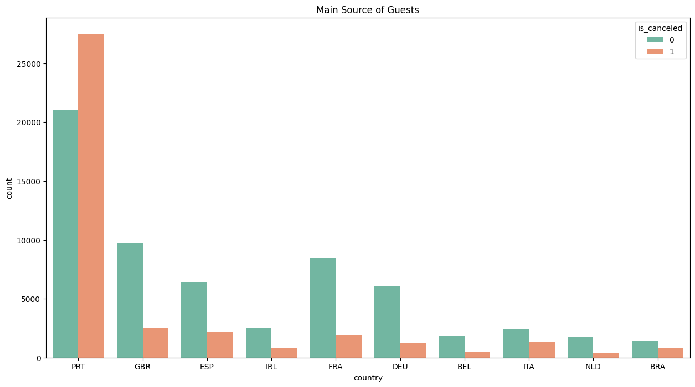

### 代码单元 12

```python
country_cancel_rate=(country_cancel/country_book).sort_values(ascending=False)
print('各国客户取消率'.center(10),country_cancel_rate,sep='\n')
```

**文本输出**

```text
各国客户取消率  
PRT    0.566351
BRA    0.373201
ITA    0.353956
ESP    0.254085
IRL    0.246519
BEL    0.202391
GBR    0.202243
FRA    0.185694
NLD    0.183935
DEU    0.167147
Name: country, dtype: float64
```

### 代码单元 13

```python
city_customer=city_hotel.customer_type.value_counts()
resort_customer=resort_hotel.customer_type.value_counts()
plt.figure(figsize=(21,12),dpi=80)
plt.subplot(1,2,1)
plt.pie(city_customer,labels=city_customer.index,autopct='%.2f%%')
plt.legend(loc=1)
plt.title('City Hotel Customer Type')
plt.subplot(1,2,2)
plt.pie(resort_customer,labels=resort_customer.index,autopct='%.2f%%')
plt.title('Resort Hotel Customer Type')
plt.legend()
plt.show()
```

**图表输出 1**

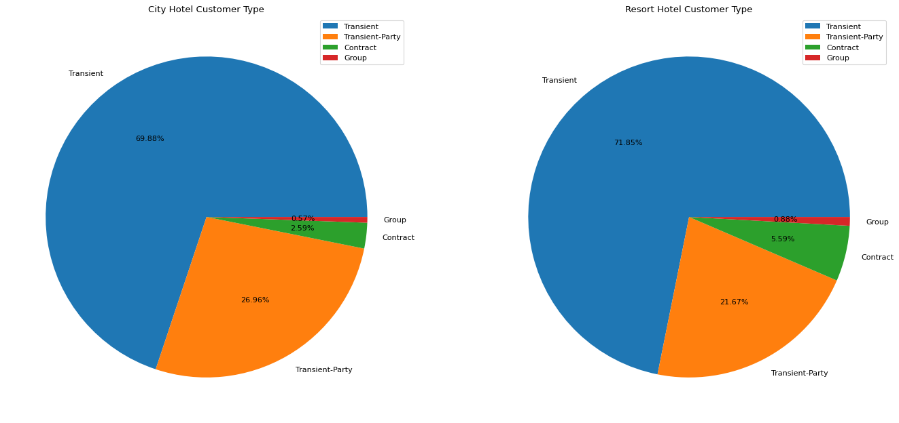

### 代码单元 14

```python
city_segment=city_hotel.market_segment.value_counts()
resort_segment=resort_hotel.market_segment.value_counts()
plt.figure(figsize=(21,12),dpi=80)
plt.subplot(1,2,1)
plt.pie(city_segment,labels=city_segment.index,autopct='%.2f%%')
plt.legend()
plt.title('City Hotel Market Segment')
plt.subplot(1,2,2)
plt.pie(resort_segment,labels=resort_segment.index,autopct='%.2f%%')
plt.title('Resort Hotel Market Segment')
plt.legend()
plt.show()
```

**图表输出 1**

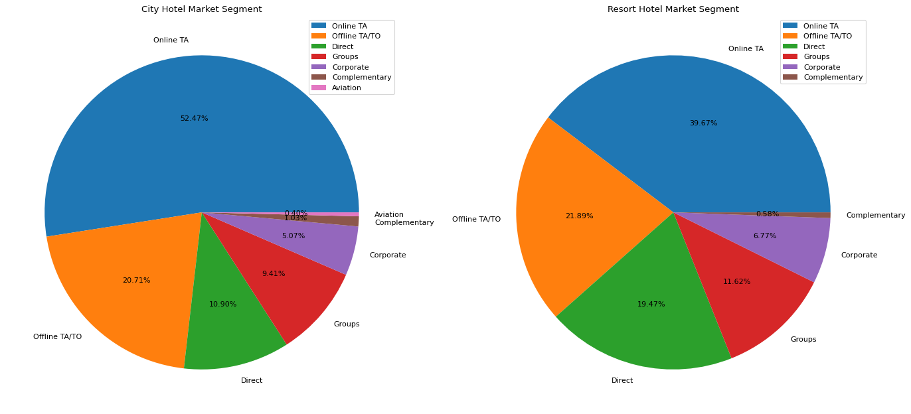

### 代码单元 15

```python
plt.figure(figsize=(15,8))
sns.boxplot(x='customer_type'
            ,y='adr'
            ,hue='hotel'
            ,data=df[df.is_canceled==0]
            ,palette=sns.color_palette('Set2',2)
           )
plt.title('Average Daily Rate of Different Customer Type')
```

**文本输出**

```text
Text(0.5, 1.0, 'Average Daily Rate of Different Customer Type')
```

**图表输出 1**

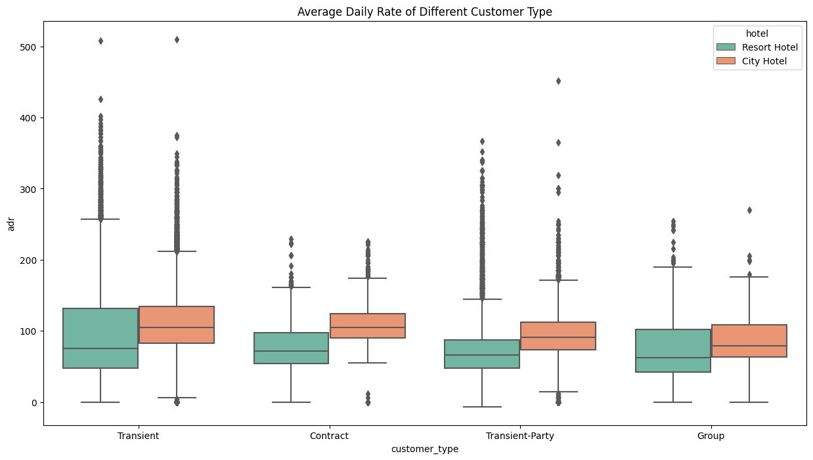

### 代码单元 16

```python
plt.figure(figsize=(15,8))
sns.countplot(x='is_repeated_guest'
              ,data=df
              ,hue='is_canceled'
              ,palette=sns.color_palette('Set2',2)
             )
plt.title('New/Repeated Guest Amount')
plt.xticks(range(2),['no','yes'])
```

**文本输出**

```text
([<matplotlib.axis.XTick at 0x1d1218bdee0>,
  <matplotlib.axis.XTick at 0x1d1218bd6a0>],
 [Text(0, 0, 'no'), Text(1, 0, 'yes')])
```

**图表输出 1**

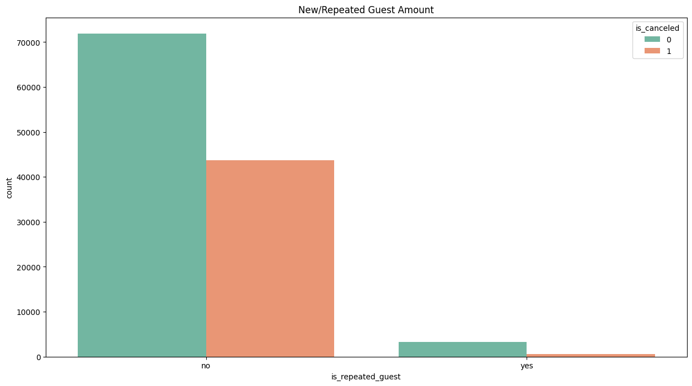

### 代码单元 17

```python
guest_cancel=(df.loc[df['is_canceled']==1]['is_repeated_guest'].value_counts()/df['is_repeated_guest'].value_counts()).sort_values(ascending=False)
guest_cancel.index=['New Guest', 'Repeated Guest']
print('新老客取消率'.center(15),guest_cancel,sep='\n')
```

**文本输出**

```text
新老客取消率    
New Guest         0.377851
Repeated Guest    0.144882
Name: is_repeated_guest, dtype: float64
```

### 代码单元 18

```python
print('三种押金方式预定量'.center(15),df['deposit_type'].value_counts(),sep='\n')
```

**文本输出**

```text
三种押金方式预定量   
No Deposit    104641
Non Refund     14587
Refundable       162
Name: deposit_type, dtype: int64
```

### 代码单元 19

```python
deposit_cancel=(df.loc[df['is_canceled']==1]['deposit_type'].value_counts()/df['deposit_type'].value_counts()).sort_values(ascending=False)
plt.figure(figsize=(8,5))
x=range(len(deposit_cancel.index))
y=deposit_cancel.values
plt.bar(x,y,label='Cancel_Rate',color=['orangered','lightsalmon','lightseagreen'],width=0.4)
plt.xticks(x,deposit_cancel.index)
plt.legend()
plt.title('Cancel Rate of Deposite Type')
for x,y in zip(x,y):
    plt.text(x,y,'%.2f' % y,ha = 'center',va = 'bottom')
```

**图表输出 1**

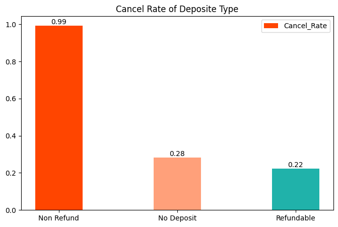

### 代码单元 20

```python
plt.figure(figsize=(15,8))
sns.countplot(x='assigned_room_type'
              ,data=df
              ,hue='is_canceled'
              ,palette=sns.color_palette('Set2',2)
             )
plt.title('Book & Cancel Amount of Room Type')
```

**文本输出**

```text
Text(0.5, 1.0, 'Book & Cancel Amount of Room Type')
```

**图表输出 1**

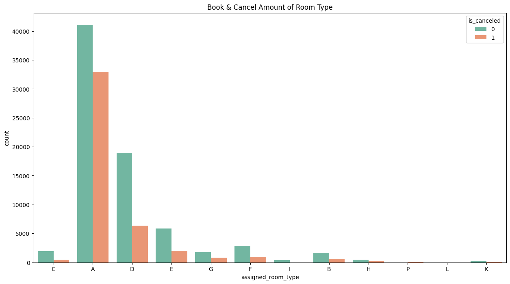

### 代码单元 21

```python
room_cancel=df.loc[df['is_canceled']==1]['assigned_room_type'].value_counts()[:7]/df['assigned_room_type'].value_counts()[:7]
print('不同房型取消率'.center(5),room_cancel.sort_values(ascending=False),sep='\n')
```

**文本输出**

```text
不同房型取消率
A    0.444925
G    0.305523
E    0.252114
D    0.251244
F    0.247134
B    0.236708
C    0.187789
Name: assigned_room_type, dtype: float64
```

### 代码单元 22

```python
df1=df.drop(labels=['reservation_status_date'],axis=1)
```

### 代码单元 23

```python
cate=df1.columns[df1.dtypes == "object"].tolist()
#用数字表现的分类型变量
num_cate=['agent','company','is_repeated_guest']
cate=cate+num_cate
```

### 代码单元 24

```python
results={}
for i in ['agent','company']:
    result=np.sort(df1[i].unique())
    results[i]=result
results
```

**文本输出**

```text
{'agent': array([  1.,   2.,   3.,   4.,   5.,   6.,   7.,   8.,   9.,  10.,  11.,
         12.,  13.,  14.,  15.,  16.,  17.,  19.,  20.,  21.,  22.,  23.,
         24.,  25.,  26.,  27.,  28.,  29.,  30.,  31.,  32.,  33.,  34.,
         35.,  36.,  37.,  38.,  39.,  40.,  41.,  42.,  44.,  45.,  47.,
         50.,  52.,  53.,  54.,  55.,  56.,  57.,  58.,  59.,  60.,  61.,
         63.,  64.,  66.,  67.,  68.,  69.,  70.,  71.,  72.,  73.,  74.,
         75.,  77.,  78.,  79.,  81.,  82.,  83.,  85.,  86.,  87.,  88.,
         89.,  90.,  91.,  92.,  93.,  94.,  95.,  96.,  98.,  99., 103.,
        104., 105., 106., 107., 110., 111., 112., 114., 115., 117., 118.,
        119., 121., 122., 126., 127., 128., 129., 132., 133., 134., 135.,
        138., 139., 141., 142., 143., 144., 146., 147., 148., 149., 150.,
        151., 152., 153., 154., 155., 156., 157., 158., 159., 162., 163.,
        165., 167., 168., 170., 171., 173., 174., 175., 177., 179., 180.,
        181., 182., 183., 184., 185., 187., 191., 192., 193., 195., 196.,
        197., 201., 205., 208., 210., 211., 213., 214., 215., 216., 219.,
        220., 223., 227., 229., 232., 234., 235., 236., 240., 241., 242.,
       
... 输出过长，博客中已截断
```

### 代码单元 25

```python
# agent和company列空值占比较多且无0值，所以用0填补
df1[['agent','company']]=df1[['agent','company']].fillna(0,axis=0)
```

### 代码单元 26

```python
df1.loc[:,cate].isnull().mean()
```

**文本输出**

```text
hotel                   0.000000
arrival_date_month      0.000000
meal                    0.000000
country                 0.004087
market_segment          0.000000
distribution_channel    0.000000
reserved_room_type      0.000000
assigned_room_type      0.000000
deposit_type            0.000000
customer_type           0.000000
reservation_status      0.000000
agent                   0.000000
company                 0.000000
is_repeated_guest       0.000000
dtype: float64
```

### 代码单元 27

```python
# 创造新变量in_company和in_agent对旅客分类,company和agent为0的设为NO,非0的为YES
df1.loc[df1['company'] == 0,'in_company']='NO'
df1.loc[df1['company'] != 0,'in_company']='YES'
df1.loc[df1['agent'] == 0,'in_agent']='NO'
df1.loc[df1['agent'] != 0,'in_agent']='YES'
```

### 代码单元 28

```python
#创造新特征same_assignment,若预订的房间类型和分配的类型一致则为yes，反之为no
df1.loc[df1['reserved_room_type'] == df1['assigned_room_type'],'same_assignment']='Yes'
df1.loc[df1['reserved_room_type'] != df1['assigned_room_type'],'same_assignment']='No'
```

### 代码单元 29

```python
# 删除'reserved_room_type','assigned_room_type','agent','company'四个特征
df1=df1.drop(labels=['reserved_room_type','assigned_room_type','agent','company'],axis=1)
```

### 代码单元 30

```python
# 重新设置'is_repeated_guest'，常客标为YES，非常客为NO
df1['is_repeated_guest'][df1['is_repeated_guest']==0]='NO'
df1['is_repeated_guest'][df1['is_repeated_guest']==1]='YES'
```

### 代码单元 31

```python
df1['country']=df1['country'].fillna(df1['country'].mode()[0])
```

### 代码单元 32

```python
for i in ['in_company','in_agent','same_assignment']:
    cate.append(i)

for i in ['reserved_room_type','assigned_room_type','agent','company']:
    cate.remove(i)
cate
```

**文本输出**

```text
['hotel',
 'arrival_date_month',
 'meal',
 'country',
 'market_segment',
 'distribution_channel',
 'deposit_type',
 'customer_type',
 'reservation_status',
 'is_repeated_guest',
 'in_company',
 'in_agent',
 'same_assignment']
```

### 代码单元 33

```python
# 对分类型特征进行编码
from sklearn.preprocessing import OrdinalEncoder

oe = OrdinalEncoder()
oe = oe.fit(df1.loc[:,cate])
df1.loc[:,cate] = oe.transform(df1.loc[:,cate])
```

### 代码单元 34

```python
# 筛选出连续型变量，需要先删除'is_canceled'这一标签
col=df1.columns.tolist()
col.remove('is_canceled')
for i in cate:
    col.remove(i)
col
```

**文本输出**

```text
['lead_time',
 'arrival_date_year',
 'arrival_date_week_number',
 'arrival_date_day_of_month',
 'stays_in_weekend_nights',
 'stays_in_week_nights',
 'adults',
 'children',
 'babies',
 'previous_cancellations',
 'previous_bookings_not_canceled',
 'booking_changes',
 'days_in_waiting_list',
 'adr',
 'required_car_parking_spaces',
 'total_of_special_requests']
```

### 代码单元 35

```python
df1[col].isnull().sum()
```

**文本输出**

```text
lead_time                         0
arrival_date_year                 0
arrival_date_week_number          0
arrival_date_day_of_month         0
stays_in_weekend_nights           0
stays_in_week_nights              0
adults                            0
children                          4
babies                            0
previous_cancellations            0
previous_bookings_not_canceled    0
booking_changes                   0
days_in_waiting_list              0
adr                               0
required_car_parking_spaces       0
total_of_special_requests         0
dtype: int64
```

### 代码单元 36

```python
# 使用众数填补xtrain children列的空值
df1['children']=df1['children'].fillna(df1['children'].mode()[0])
```

### 代码单元 37

```python
# 连续型变量进行无量纲化
from sklearn.preprocessing import StandardScaler
ss = StandardScaler()
ss = ss.fit(df1.loc[:,col])
df1.loc[:,col] = ss.transform(df1.loc[:,col])
```

### 代码单元 38

```python
cor=df1.corr()
cor=abs(cor['is_canceled']).sort_values()
cor
```

**文本输出**

```text
arrival_date_month                0.001491
stays_in_weekend_nights           0.001791
children                          0.005036
arrival_date_day_of_month         0.006130
arrival_date_week_number          0.008148
arrival_date_year                 0.016660
meal                              0.017678
stays_in_week_nights              0.024765
babies                            0.032491
adr                               0.047557
days_in_waiting_list              0.054186
previous_bookings_not_canceled    0.057358
market_segment                    0.059338
adults                            0.060017
customer_type                     0.068140
is_repeated_guest                 0.084793
in_company                        0.099310
in_agent                          0.102068
previous_cancellations            0.110133
hotel                             0.136531
booking_changes                   0.144381
distribution_channel              0.167600
required_car_parking_spaces       0.195498
total_of_special_requests         0.234658
same_assignment                   0.247770
country                           0.267502
lead_time                         0.293123
deposit_type                      0.468
... 输出过长，博客中已截断
```

### 代码单元 39

```python
plt.figure(figsize=(8,15))
x=range(len(cor.index))
name=cor.index
y=abs(cor.values)
plt.barh(x,y,color='salmon')
plt.yticks(x,name)
for x,y in zip(x,y):
    plt.text(y,x-0.1,'%.2f' % y,ha = 'center',va = 'bottom')
plt.xlabel('Corrleation')
plt.ylabel('Varriance')
plt.show()
```

**图表输出 1**

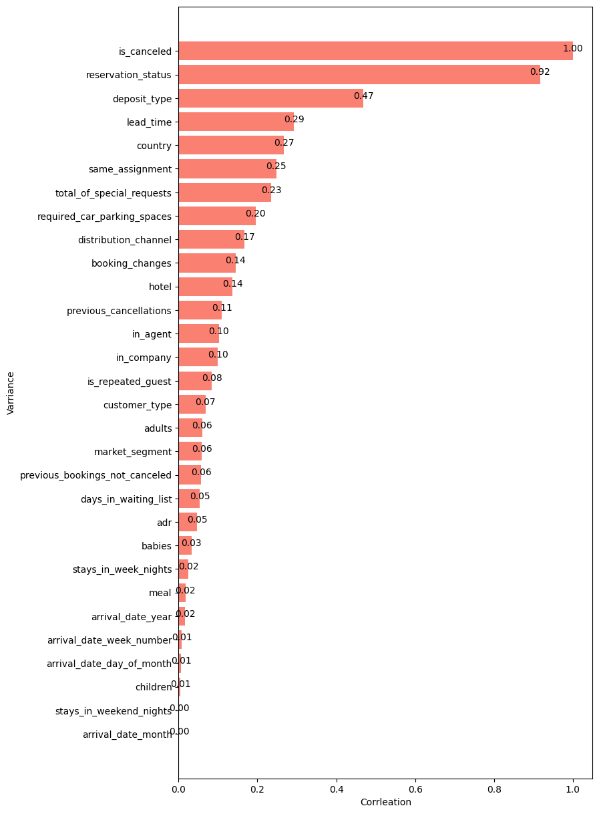

### 代码单元 40

```python
df2=df1.drop('reservation_status',axis=1)
```

### 代码单元 41

```python
# 划分特征x和标签y
x=df2.loc[:,df2.columns != 'is_canceled' ]
y=df2.loc[:,'is_canceled']
from sklearn.model_selection import train_test_split as tts
xtrain,xtest,ytrain,ytest=tts(x,y,test_size=0.3,random_state=90)
for i in [xtrain,xtest,ytrain,ytest]:
    i.index=range(i.shape[0])
```

### 代码单元 42

```python
from sklearn.ensemble import RandomForestClassifier
from sklearn.model_selection import cross_val_score as cvs,KFold
from sklearn.metrics import accuracy_score
rfc=RandomForestClassifier(n_estimators=100,random_state=90)
cv=KFold(n_splits=10, shuffle = True, random_state=90)
rfc_score=cvs(rfc,xtrain,ytrain,cv=cv).mean()
rfc.fit(xtrain,ytrain)
y_score=rfc.predict_proba(xtest)[:,1]
rfc_pred=rfc.predict(xtest)
from sklearn.metrics import roc_curve
from sklearn.metrics import roc_auc_score as AUC
FPR, recall, thresholds = roc_curve(ytest,y_score, pos_label=1)
rfc_auc = AUC(ytest,y_score)
```

### 代码单元 43

```python
# 绘制ROC曲线
plt.figure(figsize=(8,8))
plt.plot(FPR, recall, color='red',label='ROC curve (area = %0.2f)' % rfc_auc)
plt.plot([0, 1], [0, 1], color='black', linestyle='--')
plt.xlim([-0.05, 1.05])
plt.ylim([-0.05, 1.05])
plt.xlabel('False Positive Rate')
plt.ylabel('Recall')
plt.title('Random Forest Classifier ROC Curve')
plt.legend(loc="lower right")
plt.show()
```

**图表输出 1**

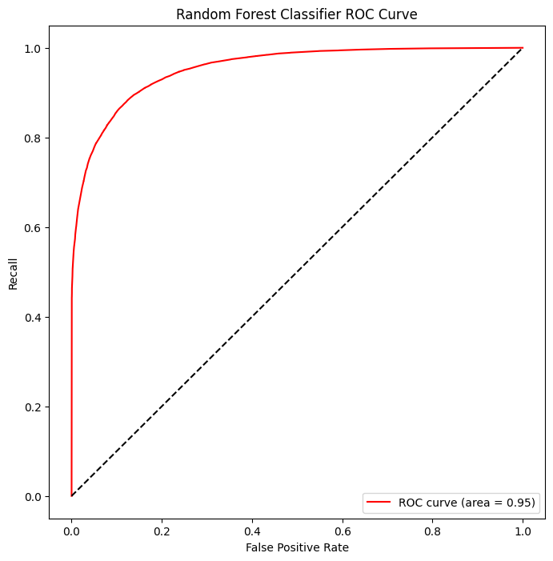

### 代码单元 44

```python
xtrain.info()
```

**文本输出**

```text
<class 'pandas.core.frame.DataFrame'>
RangeIndex: 83573 entries, 0 to 83572
Data columns (total 28 columns):
 #   Column                          Non-Null Count  Dtype  
---  ------                          --------------  -----  
 0   hotel                           83573 non-null  float64
 1   lead_time                       83573 non-null  float64
 2   arrival_date_year               83573 non-null  float64
 3   arrival_date_month              83573 non-null  float64
 4   arrival_date_week_number        83573 non-null  float64
 5   arrival_date_day_of_month       83573 non-null  float64
 6   stays_in_weekend_nights         83573 non-null  float64
 7   stays_in_week_nights            83573 non-null  float64
 8   adults                          83573 non-null  float64
 9   children                        83573 non-null  float64
 10  babies                          83573 non-null  float64
 11  meal                            83573 non-null  float64
 12  country                         83573 non-null  float64
 13  market_segment                  83573 non-null  float64
 14  distribution_channel            83573 non-null  float64
 15  is_repeated_guest               83573 non-null  f
... 输出过长，博客中已截断
```

### 代码单元 45

```python
from xgboost import XGBClassifier
xgbr=XGBClassifier(n_estimators=100,random_state=90)
xgbr_score=cvs(xgbr,xtrain,ytrain,cv=cv).mean()
xgbr.fit(xtrain,ytrain)
y_score=xgbr.predict_proba(xtest)[:,1]
xgbr_pred=xgbr.predict(xtest)
FPR, recall, thresholds = roc_curve(ytest,y_score, pos_label=1)
xgbr_auc = AUC(ytest,y_score)
```

### 代码单元 46

```python
plt.figure(figsize=(8,8))
plt.plot(FPR, recall, color='red',label='ROC curve (area = %0.2f)' % xgbr_auc)
plt.plot([0, 1], [0, 1], color='black', linestyle='--')
plt.xlim([-0.05, 1.05])
plt.ylim([-0.05, 1.05])
plt.xlabel('False Positive Rate')
plt.ylabel('Recall')
plt.title('XGBoost Classifier ROC Curve')
plt.legend(loc="lower right")
plt.show()
```

**图表输出 1**

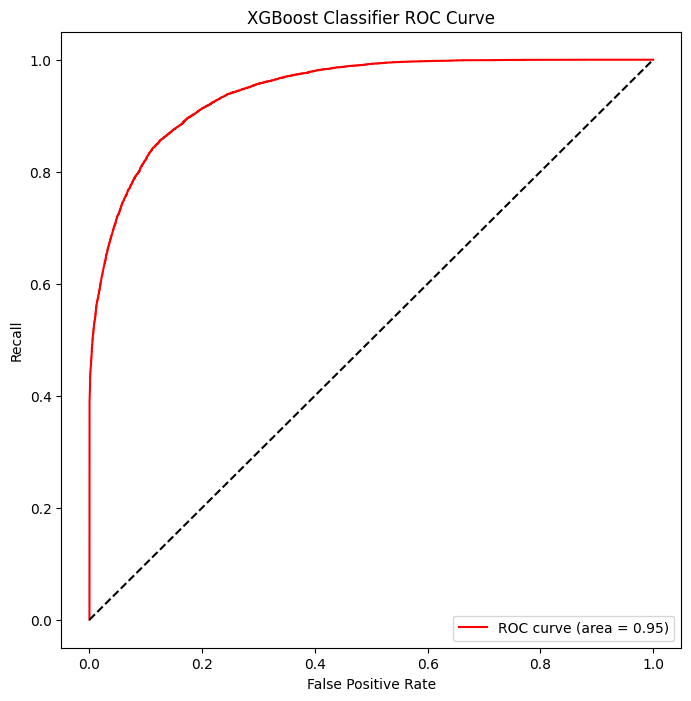

### 代码单元 47

```python
from sklearn.linear_model import LogisticRegression as LR
lr = LR(penalty='l2',solver='liblinear',max_iter=1000)
lr_score=cvs(lr,xtrain,ytrain,cv=cv).mean()
lr.fit(xtrain,ytrain)
y_score=lr.predict_proba(xtest)[:,1]
lr_pred=lr.predict(xtest)
FPR, recall, thresholds = roc_curve(ytest,y_score, pos_label=1)
lr_auc = AUC(ytest,y_score)
```

### 代码单元 48

```python
plt.figure(figsize=(8,8))
plt.plot(FPR, recall, color='red',label='ROC curve (area = %0.2f)' % lr_auc)
plt.plot([0, 1], [0, 1], color='black', linestyle='--')
plt.xlim([-0.05, 1.05])
plt.ylim([-0.05, 1.05])
plt.xlabel('False Positive Rate')
plt.ylabel('Recall')
plt.title('LogisticRegression ROC Curve')
plt.legend(loc="lower right")
plt.show()
```

**图表输出 1**

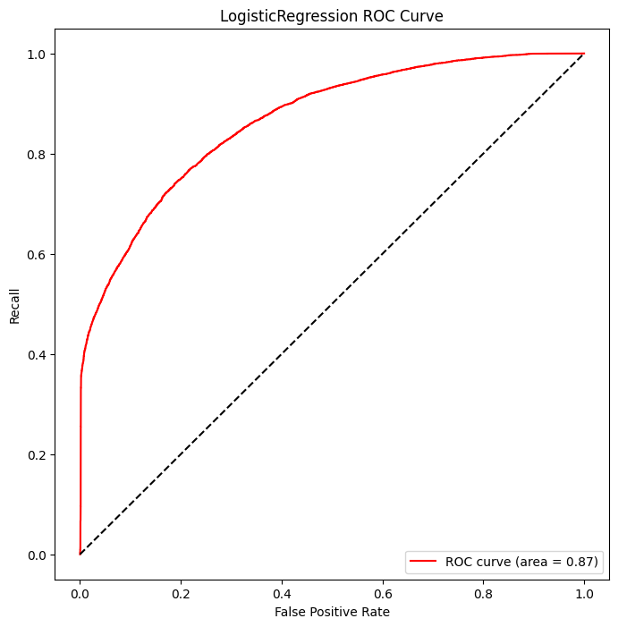

### 代码单元 49

```python
# 查看各模型classification_report
from sklearn.metrics import classification_report as CR
print('随机森林'.center(50), CR(ytest,rfc_pred),sep='\n')
print('XGBoost'.center(55),CR(ytest,xgbr_pred),sep='\n')
print('逻辑回归'.center(50),CR(ytest,lr_pred),sep='\n')
```

**文本输出**

```text
随机森林                       
              precision    recall  f1-score   support

           0       0.89      0.93      0.91     22684
           1       0.87      0.81      0.84     13133

    accuracy                           0.89     35817
   macro avg       0.88      0.87      0.88     35817
weighted avg       0.89      0.89      0.89     35817

                        XGBoost                        
              precision    recall  f1-score   support

           0       0.89      0.92      0.90     22684
           1       0.85      0.80      0.82     13133

    accuracy                           0.87     35817
   macro avg       0.87      0.86      0.86     35817
weighted avg       0.87      0.87      0.87     35817

                       逻辑回归                       
              precision    recall  f1-score   support

           0       0.80      0.91      0.85     22684
           1       0.80      0.60      0.68     13133

    accuracy                           0.80     35817
   macro avg       0.80      0.75      0.77     35817
weighted avg       0.80      0.80      0.79     35817
```

### 代码单元 50

```python
score={'Model_score':[rfc_score,xgbr_score,lr_score],'Auc_area':[rfc_auc,xgbr_auc,lr_auc]}
score_com=pd.DataFrame(data=score,index=['RandomForest','XGBoost','LogisticRegression'])
score_com.sort_values(by=['Model_score'],ascending=False)
```

**文本输出**

```
Model_score  Auc_area
RandomForest           0.887894  0.954030
XGBoost                0.873261  0.945595
LogisticRegression     0.796083  0.866906
```

