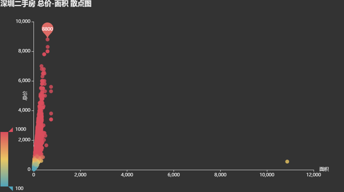
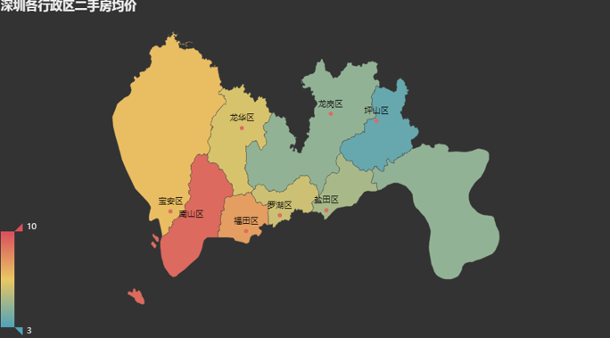
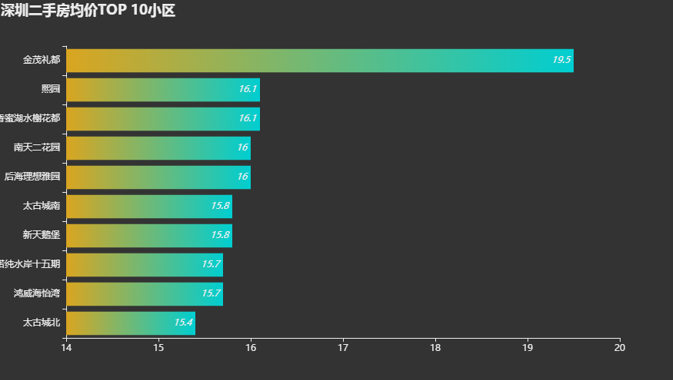
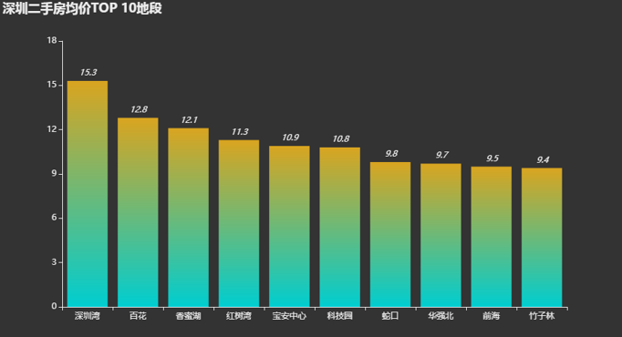
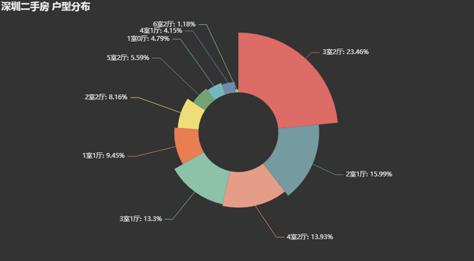

# 链家二手房信息抓取与可视化：从数据采集到地图看板

## 摘要

| 模块     | 内容                                                         |
| -------- | ------------------------------------------------------------ |
| 业务场景 | 房地产                                                       |
| 数据来源 | 链家二手房挂牌信息，包含区域、标题、小区、价格、面积、户型等字段。 |
| 分析方法 | 网页抓取、数据字段解析、CSV 持久化、pyecharts 地图与交互图表展示。 |
| 结论先行 | 采集链路决定后续分析质量，字段缺失、反爬限制和页面结构变化都会影响数据稳定性。 |

本报告围绕“业务背景、分析目的、数据说明、分析思路、分析过程、核心结论和改进建议”展开，目标是用数据回答具体问题，并把分析结果转化为可执行的判断。

## 一、分析背景

数据分析不只依赖现成数据集，很多业务问题需要先搭建采集链路。本项目覆盖了从网页数据获取、结构化整理到可视化呈现的流程，适合展示端到端项目能力。

## 二、分析目的

本次分析主要回答以下问题：

- 数据在时间、区域、类别或人群维度上呈现什么结构？
- 哪些图表最适合承载趋势、对比、分布和异常信息？
- 可视化结果如何帮助读者快速定位重点？

先明确分析目的，再开展数据处理和指标拆解，可以保证报告围绕问题展开，而不是简单罗列代码和图表。

## 三、数据来源与指标说明

| 项目           | 说明                                                         |
| -------------- | ------------------------------------------------------------ |
| 数据来源       | 链家二手房挂牌信息，包含区域、标题、小区、价格、面积、户型等字段。 |
| 分析工具与方法 | 网页抓取、数据字段解析、CSV 持久化、pyecharts 地图与交互图表展示。 |
| 重点分析指标   | 总量、占比、趋势、排名、区域分布、类别结构和异常变化。       |
| 数据口径       | 本文以项目数据集中的字段为分析范围，先完成缺失值、异常值、重复值或类别字段处理，再围绕核心指标做统计、可视化或建模。 |

数据口径会直接影响分析结论，因此报告先说明数据范围、核心指标和处理方式，便于读者理解结论的适用边界。

## 四、分析思路

| 步骤                | 目的                                                         |
| ------------------- | ------------------------------------------------------------ |
| 1. 明确业务问题     | 确定分析要回答什么，以及结论会影响什么决策。                 |
| 2. 数据读取与清洗   | 处理缺失、重复、异常和字段格式问题，保证分析基础可靠。       |
| 3. 指标拆解与可视化 | 从趋势、结构、对比、分布或空间维度观察数据现象。             |
| 4. 建模或深度分析   | 根据项目需要完成聚类、预测、分类、回归、文本分析或可视化大屏。 |
| 5. 输出结论与建议   | 把数据发现翻译成业务语言，并给出可执行的下一步动作。         |

本项目的具体分析路径如下：

- 先梳理展示对象和受众：判断这篇分析主要给业务、管理层还是面试官阅读。
- 根据问题选择图表：趋势看折线，结构看占比，对比看柱状图，空间分布看地图。
- 先用 pandas 聚合出清晰指标，再用可视化表达核心结论。
- 按照故事线组织图表顺序，避免图很多但结论分散。
- 每张图都配业务解释，让读者知道图表对应什么判断和行动。

## 五、数据处理过程

本项目的数据处理主要包括以下环节：

- 读取原始数据，检查字段类型、样本规模和基础统计信息。
- 处理缺失值、重复值、异常值或文本噪声，保证后续统计和建模结果可靠。
- 根据分析目标构造必要指标、标签或特征，并统一字段口径。
- 按业务维度进行分组、聚合、可视化或模型训练，为结论提供依据。

## 六、数据分析与结果

本部分按照“分析发现 -> 结果解读”的方式组织，重点说明数据体现出的现象及其业务含义。

### 1. 采集链路决定后续分析质量，字段缺失、反爬限制和页面结构变化都会影响数据稳定性。

结果解读：该发现是本项目最核心的结论之一，说明数据中存在值得关注的结构性特征。对应图表或模型结果应围绕这一判断展开，帮助读者理解结论来源。

### 2. 地图可视化适合展示房源空间分布，但价格分析仍需要和区域供给、交通、成交周期结合。

结果解读：该发现进一步解释了不同维度之间的差异。对业务决策而言，重点不只是看到差异，而是判断差异来自哪些对象、场景或指标。

### 3. 爬虫项目更适合作为数据工程能力展示，需要强调合规采集、频率控制和数据使用边界。

结果解读：该发现可以作为后续优化策略或模型改进的依据。若用于真实业务，还需要结合成本、资源、实验结果或线上反馈继续验证。

## 七、结论

综合以上分析，可以得到以下结论：

- 采集链路决定后续分析质量，字段缺失、反爬限制和页面结构变化都会影响数据稳定性。
- 地图可视化适合展示房源空间分布，但价格分析仍需要和区域供给、交通、成交周期结合。
- 爬虫项目更适合作为数据工程能力展示，需要强调合规采集、频率控制和数据使用边界。

## 八、建议

- 行动 1：实际业务中应设置定时采集、失败重试和字段校验，避免一次性脚本难以维护。
- 行动 2：可将抓取数据沉淀为区域行情监控面板，追踪挂牌量、均价和新增房源变化。
- 行动 3：对外展示时建议隐藏敏感字段，并说明数据仅用于学习分析，避免合规风险。
- 跟进方式：为每条建议绑定一个可观察指标，后续按周或按月复盘效果。

建议部分应结合具体对象、执行动作和复盘指标，避免停留在泛泛的“加强管理”或“优化运营”。

## 九、局限性与改进方向

- 项目价值：把分散数据组织成趋势、结构、对比和空间分布，让管理者能快速识别重点对象和异常变化。
- 真实限制：房源挂牌价不等于成交价，若缺少成交周期、议价空间、楼龄、学区、地铁距离和税费信息，价格判断容易偏向表面行情。
- 业务风险：如果直接用挂牌数据做推荐或估价，可能高估部分滞销房源价值，也可能低估稀缺小区、优质楼层和学区房溢价。
- 改进方向：将静态分析升级为可定期刷新的监控看板，并为异常指标设置阈值提醒。
- 改进方向：为关键图表补充下钻维度，使管理者能从总览进一步定位到地区、品类、用户或时间段。
- 改进方向：接入成交价、挂牌时长、楼龄、地铁距离、学区和小区成交频次，提高价格解释和推荐可信度。

## 附录：完整代码与输出结果

下面内容按原 notebook 的代码单元顺序整理。如果代码单元产生了文本输出或图片输出，也一并附在对应代码后面，便于复现完整分析过程。

### 代码单元 1

```python
from bs4 import BeautifulSoup
import pandas as pd
from tqdm import tqdm
import math
import requests
import lxml
import re
import time
```

### 代码单元 2

```python
area_dic = {'罗湖区':'luohuqu',
            '福田区':'futianqu',
            '南山区':'nanshanqu',
            '盐田区':'yantianqu',
            '宝安区':'baoanqu',
            '龙岗区':'longgangqu',
            '龙华区':'longhuaqu',
            '坪山区':'pingshanqu'}
area_dic = {'罗湖区':'luohuqu'}

# 加个header以示尊敬
headers = {'User-Agent': 'Mozilla/5.0 (Windows NT 10.0; Win64; x64) AppleWebKit/537.36 (KHTML, like Gecko) Chrome/65.0.3325.146 Safari/537.36',
           'Referer': 'https://sz.lianjia.com/ershoufang/'}

# 新建一个会话
sess = requests.session()
sess.get('https://sz.lianjia.com/ershoufang/', headers=headers)

# url示例：https://sz.lianjia.com/ershoufang/luohuqu/pg2/
url = 'https://sz.lianjia.com/ershoufang/{}/pg{}/'
```

### 代码单元 3

```python
# 当正则表达式匹配失败时，返回默认值（errif）
def re_match(re_pattern, string, errif=None):
    try:
        return re.findall(re_pattern, string)[0].strip()
    except IndexError:
        return errif
```

### 代码单元 4

```python
import time

#新建一个DataFrame存储信息
data = pd.DataFrame()

for key_, value_ in area_dic.items():
    # 获取该行政区下房源记录数
    start_url = 'https://sz.lianjia.com/ershoufang/{}/'.format(value_)
    html = sess.get(start_url).text
    house_num = re.findall('共找到<span> (.*?) </span>套.*二手房', html)[0].strip()
    print('{}: 二手房源共计「{}」套'.format(key_, house_num))
    time.sleep(1)
    # 页面限制 每个行政区只能获取最多100页共计3000条房源信息
    total_page = int(math.ceil(min(3000, int(house_num)) / 30.0))
    
    for i in tqdm(range(total_page), desc=key_):
        #print('开始抓取',url.format(value_, i+1))
        html = sess.get(url.format(value_, i+1)).text
        soup = BeautifulSoup(html, 'lxml')
        info_collect = soup.find_all(class_="info clear")
        
        for info in info_collect:
            info_dic = {}
            # 行政区
            info_dic['area'] = key_
            # 房源的标题
            info_dic['title'] = re_match('target="_blank">(.*?)</a><!--', str(info))
            # 小区名
            info_dic['community'] = re_match('xiaoqu.*?target="_blank">(.*?)</a>', str(info))
            # 位置
            info_dic['position'] = re_match('<a href.*?target="_blank">(.*?)</a>.*?class="address">', str(info))
            # 税相关，如房本满5年
            info_dic['tax'] = re_match('class="taxfree">(.*?)</span>', str(info))
            try:
                # 总价
                info_dic['total_price'] = float(re_match('<span class="">(.*?)</span><i>万', str(info)))
            except:
                info_dic['total_price'] =None
            # 单价
            try:
                info_dic['unit_price'] = float(re_match('<span>(.*?)元/平</span>', str(info)).replace(',',''))
            except:
                info_dic['unit_price'] =None
            
            # 匹配房源标签信息，通过|切割
            # 包括面积，朝向，装修等信息
            icons = re.findall('class="houseIcon"></span>(.*?)</div>', str(info))[0].strip().split('|')
            info_dic['hourseType'] = icons[0].strip()
            info_dic['hourseSize'] = float(icons[1].replace('平米', ''))
            info_dic['direction'] = icons[2].strip()
            info_dic['fitment'] = icons[3].strip()
            
            # 存入DataFrame
            if data.empty:
                data = pd.DataFrame(info_dic,index=[0])
            else:
                data1 = pd.DataFrame(info_dic,index=[0])
                data = pd.concat([data,data1],ignore_index=True)
```

**文本输出**

```text
罗湖区: 二手房源共计「5372」套
罗湖区: 100%|█████████████████████████████████████████████████████████████████████████████| 100/100 [01:02<00:00,  1.61it/s]
```

### 代码单元 5

```python
# 去掉一条面积10000+平米的房源记录
data = data[data['hourseSize'] < 10000]
data.head()
```

**文本输出**

```text
area                       title community position    tax  total_price  \
0  罗湖区  国贸商圈，正规大两房，70年产权，红本满5年，有钥匙      天俊大厦      春风路  房本满五年        381.0   
1  罗湖区   中海天钻大社区 绿化好 正对小区园林景观 只交契税      中海天钻      万象城  房本满五年       1039.0   
2  罗湖区      地铁口物业，精装修，高层采光好，带大露台养花      兴业大厦      春风路   None        358.0   
3  罗湖区       自如的装修，业主1998年买回来，价格好谈      庐山花园     罗湖口岸  房本满五年        132.0   
4  罗湖区      国贸精装一房一厅，业主诚心出售。看房随时欢迎      银座金钻      春风路  房本满五年        183.0   

   unit_price hourseType  hourseSize direction fitment  
0     45400.0       2室2厅       83.77        东南      精装  
1     85600.0       3室2厅      121.36         南      精装  
2     42000.0       3室2厅       85.18        东南      精装  
3     36700.0       1室0厅       35.85        西南      精装  
4     48600.0       1室1厅       37.53         南      精装
```

### 代码单元 6

```python
# 保存数据
# data.to_csv('./shenzhen2.csv')
```

### 代码单元 7

```python
from pyecharts.charts import *
from pyecharts import options as opts
from pyecharts.commons.utils import JsCode
from jieba import posseg as psg
import collections
import pandas as pd
```

### 代码单元 8

```python
from pyecharts.globals import CurrentConfig, NotebookType
CurrentConfig.NOTEBOOK_TYPE = NotebookType.JUPYTER_NOTEBOOK
```

### 代码单元 9

```python
data = pd.read_csv('./shenzhen.csv')
data = data.drop(columns=['Unnamed: 0'])
data.head()
```

**文本输出**

```text
area                       title community position    tax  total_price  \
0  罗湖区   满五红本， 户型方正朝南，自住装修保养好，花园社区      金城华庭       螺岭  房本满五年        710.0   
1  罗湖区  7号线洪湖站前59万平洪湖公园后京基水贝*2个万象城      洪湖东岸       翠竹  房本满五年        408.0   
2  罗湖区   《供电南苑。复式三层四房户型》万象城，地理位置优越      供电南苑      万象城  房本满五年        850.0   
3  罗湖区   不用明额 满两年红本 高层东南三房 有钥匙随时可看      翡翠公寓       翠竹  房本满五年        360.0   
4  罗湖区              都市名园 2室1厅 370万      都市名园      万象城    NaN        370.0   

   unit_price hourseType  hourseSize direction fitment  
0     79552.0       3室1厅       89.25         南      精装  
1     54736.0       3室1厅       74.54         西      精装  
2     67649.0       4室1厅      125.65         西      简装  
3     60627.0       3室2厅       59.38         南      精装  
4     48259.0       2室1厅       76.67        东北      简装
```

### 代码单元 10

```python
scatter = (Scatter(init_opts=opts.InitOpts(theme='dark'))
           .add_xaxis(data['hourseSize'])
           .add_yaxis("房价", data['total_price'])
           .set_series_opts(label_opts=opts.LabelOpts(is_show=False),
                           markpoint_opts=opts.MarkPointOpts(data=[opts.MarkPointItem(type_="max", name="最大值"),]))
           .set_global_opts(
               legend_opts=opts.LegendOpts(is_show=False),
               title_opts=opts.TitleOpts(title="深圳二手房 总价-面积 散点图"),
               xaxis_opts=opts.AxisOpts(
                   name='面积',
                   # 设置坐标轴为数值类型
                   type_="value",
                   # 不显示分割线
                   splitline_opts=opts.SplitLineOpts(is_show=False)),
               yaxis_opts=opts.AxisOpts(
                   name='总价',
                   name_location='middle',
                   # 设置坐标轴为数值类型
                   type_="value",
                   # 默认为False表示起始为0
                   is_scale=True,
                   splitline_opts=opts.SplitLineOpts(is_show=False),),
               visualmap_opts=opts.VisualMapOpts(is_show=True, type_='color', min_=100, max_=1000)
    ))

scatter.render_notebook()
```

### 代码单元 11

```python
temp = data.groupby(['area'])['unit_price'].mean().reset_index()
data_pair = [(row['area'], round(row['unit_price']/10000, 1)) for _, row in temp.iterrows()]

map_ = (Map(init_opts=opts.InitOpts(theme='dark'))
        .add("二手房均价", data_pair, '深圳', is_roam=False)
        .set_series_opts(label_opts=opts.LabelOpts(is_show=True))
        .set_global_opts(
            title_opts=opts.TitleOpts(title="深圳各行政区二手房均价"),
            legend_opts=opts.LegendOpts(is_show=False),
            tooltip_opts=opts.TooltipOpts(formatter='{b}:{c}万元'),
            visualmap_opts=opts.VisualMapOpts(min_=3, max_=10)
        )
       )

        
# map_.render_notebook()
map_.render('map.html')
```

**文本输出**

```text
'C:\\myproject\\cx_xiangmu\\Python数据分析\\上架\\2301-Python数据分析与可视化项目\\房地产-二手房信息抓取+可视化-约300行（爬虫+pyecharts可视化）\\map.html'
```

### 代码单元 12

```python
temp = data.groupby(['community'])['unit_price'].agg(['mean', 'count']).reset_index()

# 该小区内至少3套在售房源才统计
data_pair = sorted([(row['community'], round(row['mean']/10000, 1)) if row['count']>=3 else (0, 0)
                    for _, row in temp.iterrows()], key=lambda x: x[1], reverse=True)[:10]

bar = (Bar(init_opts=opts.InitOpts(theme='dark'))
       .add_xaxis([x[0] for x in data_pair[::-1]])
       .add_yaxis('二手房均价', [x[1] for x in data_pair[::-1]])
       .set_series_opts(label_opts=opts.LabelOpts(is_show=True,
                                                       position='insideRight',
                                                       font_style='italic'),
                            itemstyle_opts=opts.ItemStyleOpts(
                                color=JsCode("""new echarts.graphic.LinearGradient(1, 0, 0, 0,
                                             [{
                                                 offset: 0,
                                                 color: 'rgb(0,206,209)'
                                             }, {
                                                 offset: 1,
                                                 color: 'rgb(218,165,32)'
                                             }])"""))
                            )
       .set_global_opts(
           title_opts=opts.TitleOpts(title="深圳二手房均价TOP 10小区"),
           legend_opts=opts.LegendOpts(is_show=False),
           tooltip_opts=opts.TooltipOpts(formatter='{b}:{c}万元'),
           xaxis_opts=opts.AxisOpts(min_=14),
       )
       .reversal_axis()
      )

bar.render_notebook()
```

### 代码单元 13

```python
temp = data.groupby(['position'])['unit_price'].mean().reset_index()
data_pair = sorted([(row['position'], round(row['unit_price']/10000, 1))
                    for _, row in temp.iterrows()], key=lambda x: x[1], reverse=True)[:10]

bar = (Bar(init_opts=opts.InitOpts(theme='dark'))
       .add_xaxis([x[0] for x in data_pair])
       .add_yaxis('二手房均价', [x[1] for x in data_pair])
       .set_series_opts(label_opts=opts.LabelOpts(is_show=True, font_style='italic'),
                            itemstyle_opts=opts.ItemStyleOpts(
                                color=JsCode("""new echarts.graphic.LinearGradient(0, 1, 0, 0,
                                             [{
                                                 offset: 0,
                                                 color: 'rgb(0,206,209)'
                                             }, {
                                                 offset: 1,
                                                 color: 'rgb(218,165,32)'
                                             }])"""))
                            )
       .set_global_opts(
           title_opts=opts.TitleOpts(title="深圳二手房均价TOP 10地段"),
           legend_opts=opts.LegendOpts(is_show=False),
           tooltip_opts=opts.TooltipOpts(formatter='{b}:{c}万元'))
      )

bar.render_notebook()
```

### 代码单元 14

```python
temp = data.groupby(['hourseType'])['area'].count().reset_index()
data_pair = sorted([(row['hourseType'], row['area'])
                    for _, row in temp.iterrows()], key=lambda x: x[1], reverse=True)[:10]

pie = (Pie(init_opts=opts.InitOpts(theme='dark'))
       .add('', data_pair,
            radius=["30%", "75%"],
            rosetype="radius")
       .set_global_opts(title_opts=opts.TitleOpts(title="深圳二手房 户型分布"),
                       legend_opts=opts.LegendOpts(is_show=False),)
       .set_series_opts(label_opts=opts.LabelOpts(formatter="{b}: {d}%"))
      )

pie.render_notebook()
```

### 代码单元 15

```python
word_list = []
stop_words = ['花园','业主','出售']
string =  str(''.join([i for i in data['title'] if isinstance(i, str)]))

words = psg.cut(string)
for x in words:
    if len(x.word)==1:
        pass
    elif x.flag in ('m', 'x'):
        pass
    elif x.word in stop_words:
        pass
    else:
        word_list.append(x.word)
```

**文本输出**

```text
Building prefix dict from the default dictionary ...
Loading model from cache C:\Users\ADMINI~1\AppData\Local\Temp\2\jieba.cache
Loading model cost 0.937 seconds.
Prefix dict has been built successfully.
```

### 代码单元 16

```
data_pair = collections.Counter(word_list).most_common(100)

wc = (WordCloud()
      .add("", data_pair, word_size_range=[20, 100], shape='triangle')
      .set_global_opts(title_opts=opts.TitleOpts(title="房源描述词云图"))
    )

wc.render_notebook()
```











