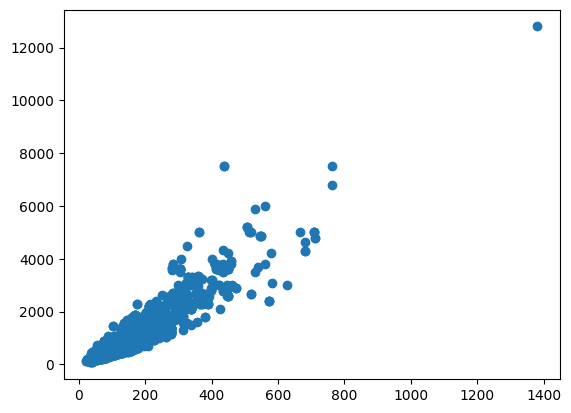
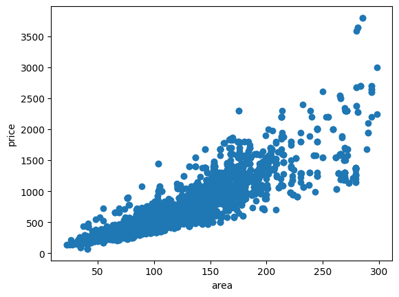
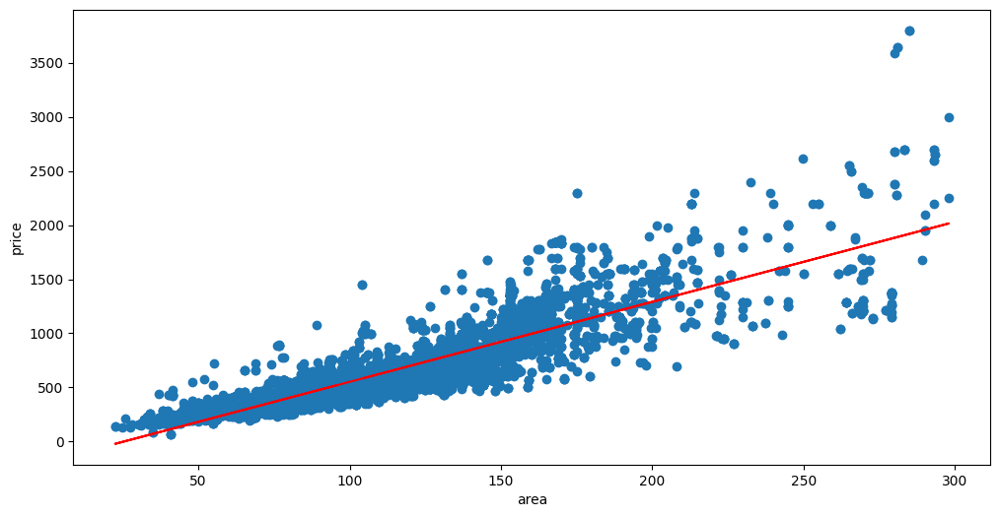

# 二手房房价分析与预测：用多元线性回归解释价格形成

## 摘要

| 模块     | 内容                                                         |
| -------- | ------------------------------------------------------------ |
| 业务场景 | 房地产                                                       |
| 数据来源 | 二手房房源信息数据，包含房屋面积、户型、区域、楼层、装修等与价格相关的结构化字段。 |
| 分析方法 | 数据清洗、类别变量编码、相关性分析、多元线性回归、模型评估和残差理解。 |
| 结论先行 | 面积通常是总价的基础解释变量，但区域和配套决定了单位面积溢价。 |

本报告围绕“业务背景、分析目的、数据说明、分析思路、分析过程、核心结论和改进建议”展开，目标是用数据回答具体问题，并把分析结果转化为可执行的判断。

## 一、分析背景

房价预测模型的价值不只在于给出一个估值结果，更重要的是解释哪些因素影响价格。对于平台、经纪人和购房者来说，可解释的定价逻辑比黑箱预测更容易落地。

## 二、分析目的

本次分析主要回答以下问题：

- 哪些变量或特征最可能影响目标结果？
- 模型能否稳定识别高风险、高价值或高需求样本？
- 模型输出应该如何转化为业务动作，而不是停留在准确率上？

先明确分析目的，再开展数据处理和指标拆解，可以保证报告围绕问题展开，而不是简单罗列代码和图表。

## 三、数据来源与指标说明

| 项目           | 说明                                                         |
| -------------- | ------------------------------------------------------------ |
| 数据来源       | 二手房房源信息数据，包含房屋面积、户型、区域、楼层、装修等与价格相关的结构化字段。 |
| 分析工具与方法 | 数据清洗、类别变量编码、相关性分析、多元线性回归、模型评估和残差理解。 |
| 重点分析指标   | 目标变量、解释变量、相关性、回归系数、R2、残差和预测误差。   |
| 数据口径       | 本文以项目数据集中的字段为分析范围，先完成缺失值、异常值、重复值或类别字段处理，再围绕核心指标做统计、可视化或建模。 |

数据口径会直接影响分析结论，因此报告先说明数据范围、核心指标和处理方式，便于读者理解结论的适用边界。

## 四、分析思路

| 步骤                | 目的                                                         |
| ------------------- | ------------------------------------------------------------ |
| 1. 明确业务问题     | 确定分析要回答什么，以及结论会影响什么决策。                 |
| 2. 数据读取与清洗   | 处理缺失、重复、异常和字段格式问题，保证分析基础可靠。       |
| 3. 指标拆解与可视化 | 从趋势、结构、对比、分布或空间维度观察数据现象。             |
| 4. 建模或深度分析   | 根据项目需要完成聚类、预测、分类、回归、文本分析或可视化大屏。 |
| 5. 输出结论与建议   | 把数据发现翻译成业务语言，并给出可执行的下一步动作。         |

本项目的具体分析路径如下：

- 先把业务目标转成可建模问题：明确预测对象、标签字段、样本粒度和模型输出的业务含义。
- 做数据检查和探索：查看缺失值、异常值、类别分布、关键变量分布，以及目标变量是否存在不平衡。
- 完成特征处理：对类别变量编码，对数值变量缩放或标准化，并根据业务含义保留可解释变量。
- 建立基准模型并比较效果：优先选择可解释模型作为 baseline，再根据数据复杂度尝试树模型或集成模型。
- 把模型指标翻译成业务动作：例如风控看召回和误报，营销看转化和 ROI，预测类问题看高峰期误差。

## 五、数据处理过程

本项目的数据处理主要包括以下环节：

- 读取原始数据，检查字段类型、样本规模和基础统计信息。
- 处理缺失值、重复值、异常值或文本噪声，保证后续统计和建模结果可靠。
- 根据分析目标构造必要指标、标签或特征，并统一字段口径。
- 按业务维度进行分组、聚合、可视化或模型训练，为结论提供依据。

## 六、数据分析与结果

本部分按照“分析发现 -> 结果解读”的方式组织，重点说明数据体现出的现象及其业务含义。

### 1. 面积通常是总价的基础解释变量，但区域和配套决定了单位面积溢价。

结果解读：该发现是本项目最核心的结论之一，说明数据中存在值得关注的结构性特征。对应图表或模型结果应围绕这一判断展开，帮助读者理解结论来源。

### 2. 户型、楼层和装修属于体验型特征，对同一区域内的价格排序有明显意义。

结果解读：该发现进一步解释了不同维度之间的差异。对业务决策而言，重点不只是看到差异，而是判断差异来自哪些对象、场景或指标。

### 3. 线性回归适合做基准模型，可以快速判断特征方向是否符合业务常识。

结果解读：该发现可以作为后续优化策略或模型改进的依据。若用于真实业务，还需要结合成本、资源、实验结果或线上反馈继续验证。

## 七、结论

综合以上分析，可以得到以下结论：

- 面积通常是总价的基础解释变量，但区域和配套决定了单位面积溢价。
- 户型、楼层和装修属于体验型特征，对同一区域内的价格排序有明显意义。
- 线性回归适合做基准模型，可以快速判断特征方向是否符合业务常识。

## 八、建议

- 行动 1：上线估价工具时应把模型预测区间和相似房源一起展示，避免给用户造成绝对定价错觉。
- 行动 2：对异常高价房源应单独识别，可能包含学区、景观、稀缺户型等未被模型捕捉的隐含变量。
- 行动 3：后续可加入随机森林、XGBoost 或 LightGBM，并用 SHAP 解释特征贡献，提高准确率和可解释性。
- 跟进方式：为每条建议绑定一个可观察指标，后续按周或按月复盘效果。

建议部分应结合具体对象、执行动作和复盘指标，避免停留在泛泛的“加强管理”或“优化运营”。

## 九、局限性与改进方向

- 项目价值：用可量化模型辅助判断关键结果，减少只依赖经验决策带来的不稳定性。
- 真实限制：房源挂牌价不等于成交价，若缺少成交周期、议价空间、楼龄、学区、地铁距离和税费信息，价格判断容易偏向表面行情。
- 业务风险：如果直接用挂牌数据做推荐或估价，可能高估部分滞销房源价值，也可能低估稀缺小区、优质楼层和学区房溢价。
- 改进方向：按时间切分训练集和验证集，增加线上/线下指标对齐，避免随机切分高估模型效果。
- 改进方向：补充模型监控，包括数据漂移、预测分布、召回率、误报率和业务转化效果。
- 改进方向：接入成交价、挂牌时长、楼龄、地铁距离、学区和小区成交频次，提高价格解释和推荐可信度。

## 附录：完整代码与输出结果

下面内容按原 notebook 的代码单元顺序整理。如果代码单元产生了文本输出或图片输出，也一并附在对应代码后面，便于复现完整分析过程。

### 代码单元 1

```python
import numpy as np
import pandas as pd
```

### 代码单元 2

```python
data = pd.read_csv(r'house_information.csv') # 如果用pandas打不开数据，可以使用记事本打开把编码格式改成utf-8另存
data.head()
```

**文本输出**

```text
index         单价     小区名称      建筑面积      户型   房屋总价  朝向  楼层    装修
0      0  41117元/平米     仙岳山庄  104.58平米  2室2厅2卫   430万  南北  低层   简装修
1      1  63489元/平米  禹洲华侨海景城  201.61平米  5室2厅2卫  1280万  东北  高层  豪华装修
2      2  58339元/平米     汇丰家园  128.56平米  3室2厅2卫   750万  南北  中层   中装修
3      3  46739元/平米     嘉盛豪园      92平米  3室2厅1卫   430万  南北  中层   精装修
4      4  43952元/平米     金帝花园  118.31平米  3室2厅2卫   520万  南北  高层   简装修
```

### 代码单元 3

```python
data.drop('index',axis=1,inplace=True) # 删除index列（用del更方便）
data.head()
```

**文本输出**

```text
单价     小区名称      建筑面积      户型   房屋总价  朝向  楼层    装修
0  41117元/平米     仙岳山庄  104.58平米  2室2厅2卫   430万  南北  低层   简装修
1  63489元/平米  禹洲华侨海景城  201.61平米  5室2厅2卫  1280万  东北  高层  豪华装修
2  58339元/平米     汇丰家园  128.56平米  3室2厅2卫   750万  南北  中层   中装修
3  46739元/平米     嘉盛豪园      92平米  3室2厅1卫   430万  南北  中层   精装修
4  43952元/平米     金帝花园  118.31平米  3室2厅2卫   520万  南北  高层   简装修
```

### 代码单元 4

```python
# Series的extract支持正则匹配抽取，返回的值是字符串
data[['室','厅','卫']] = data['户型'].str.extract(r'(\d+)室(\d+)厅(\d+)卫')
```

### 代码单元 5

```python
# 把字符串格式转化为float，并删除户型
data['室'] = data['室'].astype(float)
data['厅'] = data['厅'].astype(float)
data['卫'] = data['卫'].astype(float)
del data['户型']
data.head()
```

**文本输出**

```text
单价     小区名称      建筑面积   房屋总价  朝向  楼层    装修    室    厅    卫
0  41117元/平米     仙岳山庄  104.58平米   430万  南北  低层   简装修  2.0  2.0  2.0
1  63489元/平米  禹洲华侨海景城  201.61平米  1280万  东北  高层  豪华装修  5.0  2.0  2.0
2  58339元/平米     汇丰家园  128.56平米   750万  南北  中层   中装修  3.0  2.0  2.0
3  46739元/平米     嘉盛豪园      92平米   430万  南北  中层   精装修  3.0  2.0  1.0
4  43952元/平米     金帝花园  118.31平米   520万  南北  高层   简装修  3.0  2.0  2.0
```

### 代码单元 6

```python
# 将建筑面积后的平方米去除，并将数据类型改成浮点型
data['建筑面积'] = data['建筑面积'].map(lambda e:e.replace('平米',''))# Series中的map
data['建筑面积'] = data['建筑面积'].astype(float)
data.head()
```

**文本输出**

```text
单价     小区名称    建筑面积   房屋总价  朝向  楼层    装修    室    厅    卫
0  41117元/平米     仙岳山庄  104.58   430万  南北  低层   简装修  2.0  2.0  2.0
1  63489元/平米  禹洲华侨海景城  201.61  1280万  东北  高层  豪华装修  5.0  2.0  2.0
2  58339元/平米     汇丰家园  128.56   750万  南北  中层   中装修  3.0  2.0  2.0
3  46739元/平米     嘉盛豪园   92.00   430万  南北  中层   精装修  3.0  2.0  1.0
4  43952元/平米     金帝花园  118.31   520万  南北  高层   简装修  3.0  2.0  2.0
```

### 代码单元 7

```python
# 将单价后的元/平米去除，并将数据类型改成浮点型
data['单价'] = data['单价'].map(lambda e:e.replace(r'元/平米',''))
data['单价'] = data['单价'].astype(float)
data.head()
```

**文本输出**

```text
单价     小区名称    建筑面积   房屋总价  朝向  楼层    装修    室    厅    卫
0  41117.0     仙岳山庄  104.58   430万  南北  低层   简装修  2.0  2.0  2.0
1  63489.0  禹洲华侨海景城  201.61  1280万  东北  高层  豪华装修  5.0  2.0  2.0
2  58339.0     汇丰家园  128.56   750万  南北  中层   中装修  3.0  2.0  2.0
3  46739.0     嘉盛豪园   92.00   430万  南北  中层   精装修  3.0  2.0  1.0
4  43952.0     金帝花园  118.31   520万  南北  高层   简装修  3.0  2.0  2.0
```

### 代码单元 8

```python
# 将房屋总价后的万去除，并将数据类型改成浮点型
data['房屋总价'] = data['房屋总价'].map(lambda e:e.replace('万',''))
data['房屋总价'] = data['房屋总价'].astype(float)
data.head()
```

**文本输出**

```text
单价     小区名称    建筑面积    房屋总价  朝向  楼层    装修    室    厅    卫
0  41117.0     仙岳山庄  104.58   430.0  南北  低层   简装修  2.0  2.0  2.0
1  63489.0  禹洲华侨海景城  201.61  1280.0  东北  高层  豪华装修  5.0  2.0  2.0
2  58339.0     汇丰家园  128.56   750.0  南北  中层   中装修  3.0  2.0  2.0
3  46739.0     嘉盛豪园   92.00   430.0  南北  中层   精装修  3.0  2.0  1.0
4  43952.0     金帝花园  118.31   520.0  南北  高层   简装修  3.0  2.0  2.0
```

### 代码单元 9

```python
# 使用pd.get_dummies() 量化数据
data_direction = pd.get_dummies(data['朝向'])
data_direction.head()
```

**文本输出**

```text
东  东北  东南  东西  北  南  南北  暂无  西  西北  西南
0  0   0   0   0  0  0   1   0  0   0   0
1  0   1   0   0  0  0   0   0  0   0   0
2  0   0   0   0  0  0   1   0  0   0   0
3  0   0   0   0  0  0   1   0  0   0   0
4  0   0   0   0  0  0   1   0  0   0   0
```

### 代码单元 10

```python
# 使用pd.get_dummies() 量化数据
data_floor = pd.get_dummies(data['楼层'])
data_floor.head()
```

**文本输出**

```text
中层  低层  高层
0   0   1   0
1   0   0   1
2   1   0   0
3   1   0   0
4   0   0   1
```

### 代码单元 11

```python
# 使用pd.get_dummies() 量化数据
data_decoration = pd.get_dummies(data['装修'])
data_decoration.head()
```

**文本输出**

```text
中装修  暂无  毛坯  简装修  精装修  豪华装修
0    0   0   0    1    0     0
1    0   0   0    0    0     1
2    1   0   0    0    0     0
3    0   0   0    0    1     0
4    0   0   0    1    0     0
```

### 代码单元 12

```python
# 使用pd.concat矩阵拼接，axis=1：水平拼接
data = pd.concat([data,data_direction,data_floor,data_decoration],axis=1)
```

### 代码单元 13

```python
# 拼接后的列名
data.columns
```

**文本输出**

```text
Index(['单价', '小区名称', '建筑面积', '房屋总价', '朝向', '楼层', '装修', '室', '厅', '卫', '东',
       '东北', '东南', '东西', '北', '南', '南北', '暂无', '西', '西北', '西南', '中层', '低层',
       '高层', '中装修', '暂无', '毛坯', '简装修', '精装修', '豪华装修'],
      dtype='object')
```

### 代码单元 14

```python
# 特征帅选
del data['小区名称']
del data['朝向']
del data['楼层']
del data['装修']
del data['东西']
del data['南北']
del data['暂无'] # 两列都删除
del data['中层'] # 多重共线性问题（线性回归）
del data['中装修']
data.columns
```

**文本输出**

```text
Index(['单价', '建筑面积', '房屋总价', '室', '厅', '卫', '东', '东北', '东南', '北', '南', '西',
       '西北', '西南', '低层', '高层', '毛坯', '简装修', '精装修', '豪华装修'],
      dtype='object')
```

### 代码单元 15

```python
data.head()
```

**文本输出**

```text
单价    建筑面积    房屋总价    室    厅    卫  东  东北  东南  北  南  西  西北  西南  低层  高层  \
0  41117.0  104.58   430.0  2.0  2.0  2.0  0   0   0  0  0  0   0   0   1   0   
1  63489.0  201.61  1280.0  5.0  2.0  2.0  0   1   0  0  0  0   0   0   0   1   
2  58339.0  128.56   750.0  3.0  2.0  2.0  0   0   0  0  0  0   0   0   0   0   
3  46739.0   92.00   430.0  3.0  2.0  1.0  0   0   0  0  0  0   0   0   0   0   
4  43952.0  118.31   520.0  3.0  2.0  2.0  0   0   0  0  0  0   0   0   0   1   

   毛坯  简装修  精装修  豪华装修  
0   0    1    0     0  
1   0    0    0     1  
2   0    0    0     0  
3   0    0    1     0  
4   0    1    0     0
```

### 代码单元 16

```python
data.info() # 发现 室厅卫中 有缺失值
```

**文本输出**

```text
<class 'pandas.core.frame.DataFrame'>
RangeIndex: 5830 entries, 0 to 5829
Data columns (total 20 columns):
 #   Column  Non-Null Count  Dtype  
---  ------  --------------  -----  
 0   单价      5830 non-null   float64
 1   建筑面积    5830 non-null   float64
 2   房屋总价    5830 non-null   float64
 3   室       5748 non-null   float64
 4   厅       5748 non-null   float64
 5   卫       5748 non-null   float64
 6   东       5830 non-null   uint8  
 7   东北      5830 non-null   uint8  
 8   东南      5830 non-null   uint8  
 9   北       5830 non-null   uint8  
 10  南       5830 non-null   uint8  
 11  西       5830 non-null   uint8  
 12  西北      5830 non-null   uint8  
 13  西南      5830 non-null   uint8  
 14  低层      5830 non-null   uint8  
 15  高层      5830 non-null   uint8  
 16  毛坯      5830 non-null   uint8  
 17  简装修     5830 non-null   uint8  
 18  精装修     5830 non-null   uint8  
 19  豪华装修    5830 non-null   uint8  
dtypes: float64(6), uint8(14)
memory usage: 353.1 KB
```

### 代码单元 17

```python
# 删除缺失值
data.dropna(inplace=True)
data.info()                       # 到这里数据预处理完毕
```

**文本输出**

```text
<class 'pandas.core.frame.DataFrame'>
Int64Index: 5748 entries, 0 to 5829
Data columns (total 20 columns):
 #   Column  Non-Null Count  Dtype  
---  ------  --------------  -----  
 0   单价      5748 non-null   float64
 1   建筑面积    5748 non-null   float64
 2   房屋总价    5748 non-null   float64
 3   室       5748 non-null   float64
 4   厅       5748 non-null   float64
 5   卫       5748 non-null   float64
 6   东       5748 non-null   uint8  
 7   东北      5748 non-null   uint8  
 8   东南      5748 non-null   uint8  
 9   北       5748 non-null   uint8  
 10  南       5748 non-null   uint8  
 11  西       5748 non-null   uint8  
 12  西北      5748 non-null   uint8  
 13  西南      5748 non-null   uint8  
 14  低层      5748 non-null   uint8  
 15  高层      5748 non-null   uint8  
 16  毛坯      5748 non-null   uint8  
 17  简装修     5748 non-null   uint8  
 18  精装修     5748 non-null   uint8  
 19  豪华装修    5748 non-null   uint8  
dtypes: float64(6), uint8(14)
memory usage: 392.9 KB
```

### 代码单元 18

```python
data['建筑面积']
```

**文本输出**

```text
0       104.58
1       201.61
2       128.56
3        92.00
4       118.31
         ...  
5825    152.22
5826    433.00
5827     47.00
5828    117.00
5829     95.50
Name: 建筑面积, Length: 5748, dtype: float64
```

### 代码单元 19

```python
import matplotlib.pyplot as plt
area = data['建筑面积']
price = data['房屋总价']
plt.scatter(area,price)
plt.show() # 有离群点数据，对线性分析不利，需要过滤
```

**图表输出 1**



### 代码单元 20

```python
df = data[data['建筑面积'] <=300] # 正常住宅面积小于等于300平米
area = df['建筑面积']
price = df['房屋总价']
#print(area.count()) #过滤后的数据量
plt.scatter(area,price)
plt.xlabel("area")
plt.ylabel("price")
plt.show()
```

**图表输出 1**



### 代码单元 21

```python
# 先根据建筑面积和房屋总价训练模型（一元线性回归）
from sklearn.linear_model import LinearRegression
linear = LinearRegression()
area = np.array(area).reshape(-1,1) # 这里需要注意新版的sklearn需要将数据转换为矩阵才能进行计算
price = np.array(price).reshape(-1,1)
# 训练模型
model = linear.fit(area,price)
# 打印截距和回归系数
print(model.intercept_, model.coef_)
```

**文本输出**

```text
[-187.73888919] [[7.39200324]]
```

### 代码单元 22

```python
# 线性回归可视化(数据拟合)
linear_p = model.predict(area)
plt.figure(figsize=(12,6))
plt.scatter(area,price)
plt.plot(area,linear_p,'red')
plt.xlabel("area")
plt.ylabel("price")
plt.show()
```

**图表输出 1**



### 代码单元 23

```python
cols = ['建筑面积','室', '厅', '卫', '东', '东北', '东南', '北', '南', '西',
       '西北', '西南', '低层', '高层', '毛坯', '简装修', '精装修', '豪华装修']
```

### 代码单元 24

```python
X = df[cols]
X.head()
```

**文本输出**

```text
建筑面积    室    厅    卫  东  东北  东南  北  南  西  西北  西南  低层  高层  毛坯  简装修  精装修  \
0  104.58  2.0  2.0  2.0  0   0   0  0  0  0   0   0   1   0   0    1    0   
1  201.61  5.0  2.0  2.0  0   1   0  0  0  0   0   0   0   1   0    0    0   
2  128.56  3.0  2.0  2.0  0   0   0  0  0  0   0   0   0   0   0    0    0   
3   92.00  3.0  2.0  1.0  0   0   0  0  0  0   0   0   0   0   0    0    1   
4  118.31  3.0  2.0  2.0  0   0   0  0  0  0   0   0   0   1   0    1    0   

   豪华装修  
0     0  
1     1  
2     0  
3     0  
4     0
```

### 代码单元 25

```python
y = df['房屋总价']
y.head()
```

**文本输出**

```text
0     430.0
1    1280.0
2     750.0
3     430.0
4     520.0
Name: 房屋总价, dtype: float64
```

### 代码单元 26

```python
print(type(X))
print(type(y))
# 使用train_test_split进行交叉验证
from sklearn.model_selection import train_test_split
x_train, x_test, y_train, y_test = train_test_split(X,y,test_size=0.2,random_state=12)
print(x_train.shape,y_train.shape)
print(x_test.shape,y_test.shape)
```

**文本输出**

```text
<class 'pandas.core.frame.DataFrame'>
<class 'pandas.core.series.Series'>
(4406, 18) (4406,)
(1102, 18) (1102,)
```

### 代码单元 27

```python
# 模型训练
linear = LinearRegression()
model = linear.fit(x_train,y_train)
print(model.intercept_, model.coef_)
```

**文本输出**

```text
-194.10059828632757 [  6.81080385  32.66440227 -36.27370796   8.17388714  22.82870564
 -34.63169345   0.9396494   31.52349203  73.23243807  36.57946634
 -20.85576479  35.85073408   4.13506426 -10.09803905  70.75146155
  -3.6000263   48.66249505 124.16793037]
```

### 代码单元 28

```python
# 模型性能评分
price_end = model.predict(x_test)
score = model.score(x_test,y_test)
print("模型得分：",score)# 一般模型在0.6以上就表现的不错
```

**文本输出**

```text
模型得分： 0.7639142687890217
```

### 代码单元 29

```python
# 使用假设验证法，选出最佳特征组合
cols = ['建筑面积','室', '厅', '卫', '东', '东北', '东南', '北', '南', '西',
       '西北', '西南', '低层', '高层', '毛坯', '简装修', '精装修', '豪华装修']
import statsmodels.api as sm
Y = df['房屋总价']
X = df[cols]
X_ = sm.add_constant(X) #增加一列值为1的const列，保证偏置项的正常
#print(X_)
# 使用最小平方法
result = sm.OLS(Y,X_)
# 使用fit方法进行计算
summary = result.fit()
# 调用summary2方法打印出假设验证信息（性能指标）
summary.summary2() # R-squared:模型评分 AIC：组合完越小越好
```

### 代码单元 30

```python
import itertools

list1 = [1, 2,3, 4, 5,6,7,8,9,10,11,12,13,14,15,16] #特征超过16个将发生异常
list2 = []
for i in range(1, len(list1)+1):
    iter1 = itertools.combinations(list1, i)
    list2.append(list(iter1))
#print(list2)
```

### 代码单元 31

```python
import itertools
# 使用itertools，找出AIC最小值的特征组合作为模型训练的特征
# 寻找最小AIC值的特征组合
fileds = ['建筑面积','室', '厅', '卫', '东','北', '南', '西','低层', '高层', '毛坯', '简装修', '精装修', '豪华装修']
acis = {}
for i in range(1,len(fileds)+1):
    for virables in itertools.combinations(fileds,i): #从fileds中随机选择i个特征机型组合，返回的virables为元组类型
        x1 = sm.add_constant(df[list(virables)])
        x2 = sm.OLS(Y,x1)
        res = x2.fit()
        acis[virables] = res.aic # AIC评分越小越好
```

### 代码单元 32

```python
from collections import Counter
# 对字典进行统计
counter = Counter(acis)
# 降序选出AIC最小的10个数，也就是最佳特征组合
counter.most_common()[-10:]
```

**文本输出**

```text
[(('建筑面积', '室', '厅', '东', '南', '西', '低层', '毛坯', '精装修', '豪华装修'),
  74023.56464247877),
 (('建筑面积', '室', '厅', '东', '北', '南', '西', '高层', '毛坯', '精装修', '豪华装修'),
  74023.41564227329),
 (('建筑面积', '室', '厅', '卫', '东', '南', '高层', '毛坯', '精装修', '豪华装修'),
  74023.36778965591),
 (('建筑面积', '室', '厅', '东', '北', '南', '低层', '高层', '毛坯', '精装修', '豪华装修'),
  74023.31766334853),
 (('建筑面积', '室', '厅', '东', '南', '西', '高层', '毛坯', '精装修', '豪华装修'),
  74023.14955002116),
 (('建筑面积', '室', '厅', '东', '北', '南', '低层', '毛坯', '精装修', '豪华装修'),
  74023.14910923649),
 (('建筑面积', '室', '厅', '东', '南', '低层', '高层', '毛坯', '精装修', '豪华装修'),
  74023.02854387014),
 (('建筑面积', '室', '厅', '东', '北', '南', '高层', '毛坯', '精装修', '豪华装修'),
  74022.91373410511),
 (('建筑面积', '室', '厅', '东', '南', '低层', '毛坯', '精装修', '豪华装修'), 74022.8722434788),
 (('建筑面积', '室', '厅', '东', '南', '高层', '毛坯', '精装修', '豪华装修'), 74022.56669895534)]
```

### 代码单元 33

```python
# 接下来使用AIC值最小的特征组合进行预测
col2 = ['建筑面积', '室', '厅', '东', '南', '高层', '毛坯', '精装修', '豪华装修']
X = df[col2]
y = df['房屋总价']
x_train, x_test, y_train, y_test = train_test_split(X,y,test_size=0.2,random_state=13)
linear = LinearRegression()
model = linear.fit(x_train,y_train)
model.score(x_test,y_test) # 模型性能有所提高，但是提升的不明显
```

**文本输出**

```text
0.764510909319327
```

### 代码单元 34

```python
# 假设我要买一套房子（想想就觉得很美），房子面积120平米，3室，1厅，南面，高层，精装修
my_house = [120,3,1,0,1,1,0,1,0] #根据col2特征
my_house = np.array(my_house).reshape(-1,1).T
#print(x_test)
model.predict(my_house)# 预测价格
```

**文本输出**

```
C:\Users\Administrator\Envs\jv\lib\site-packages\sklearn\base.py:420: UserWarning: X does not have valid feature names, but LinearRegression was fitted with feature names
  warnings.warn(
array([811.49301398])
```

