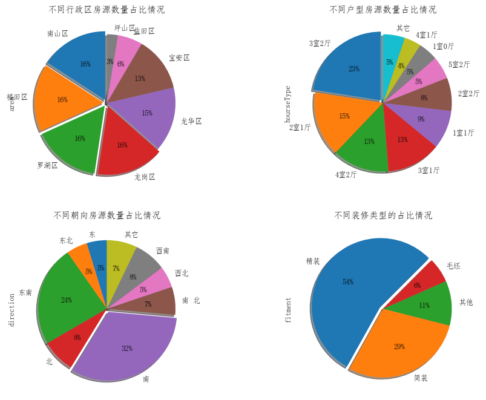
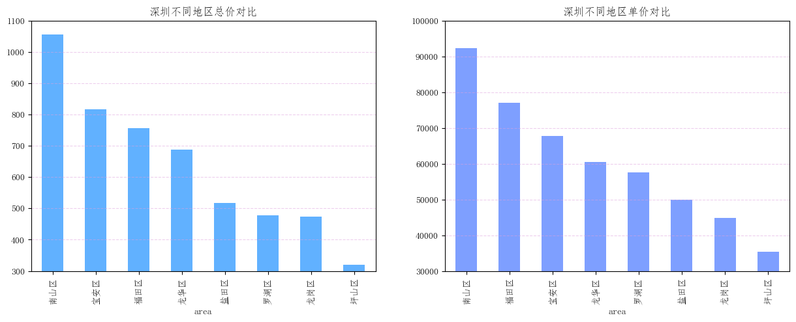
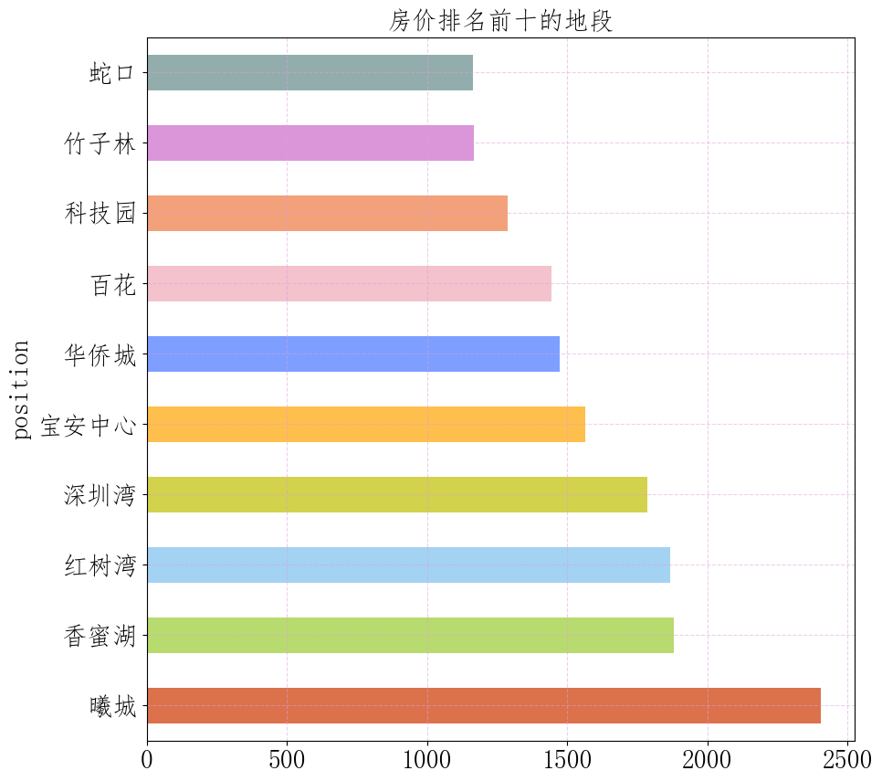
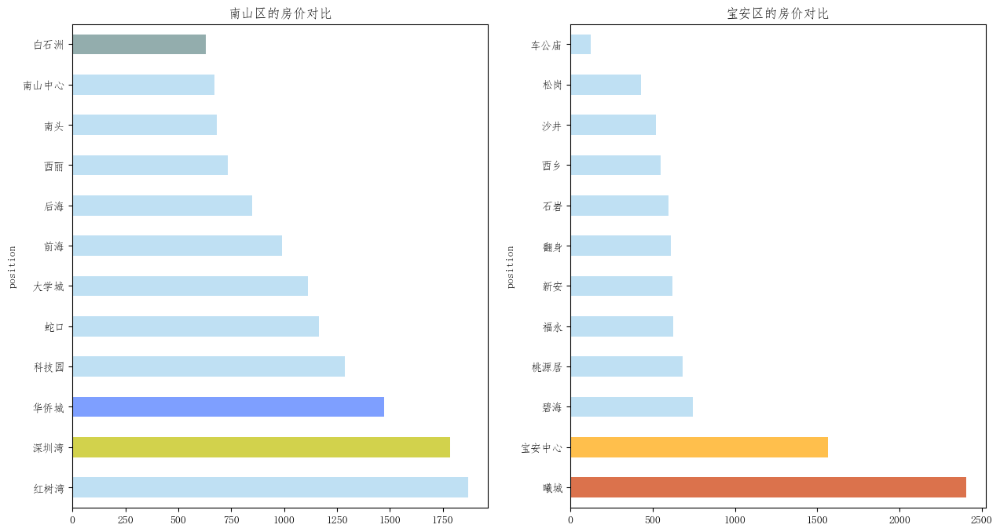
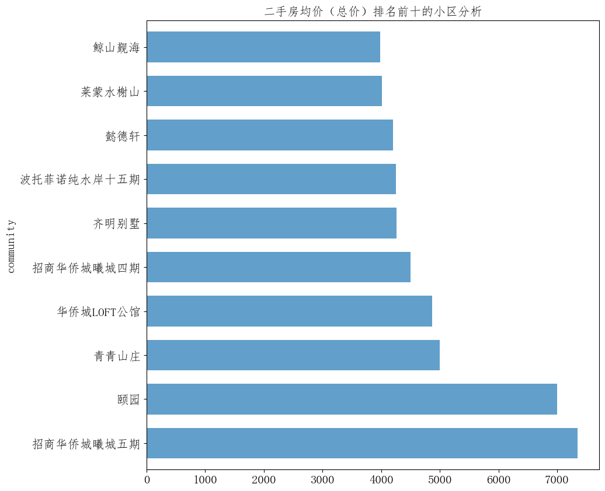
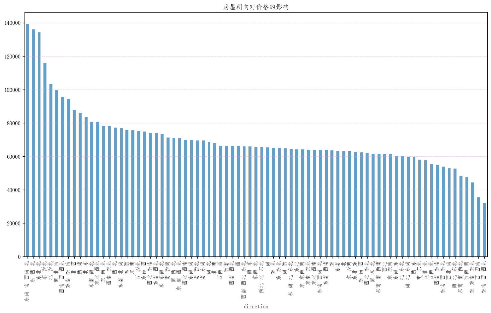
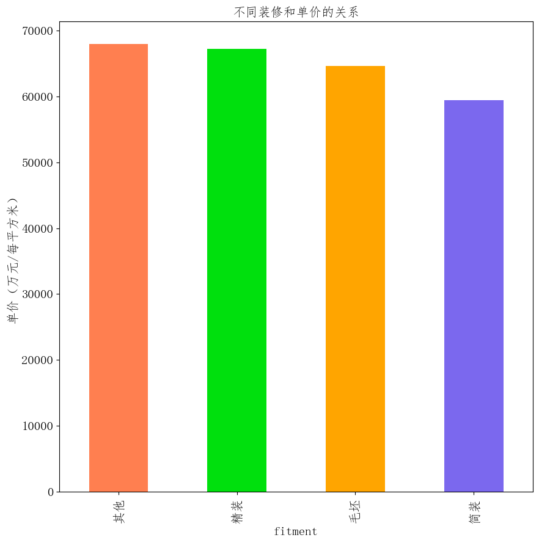
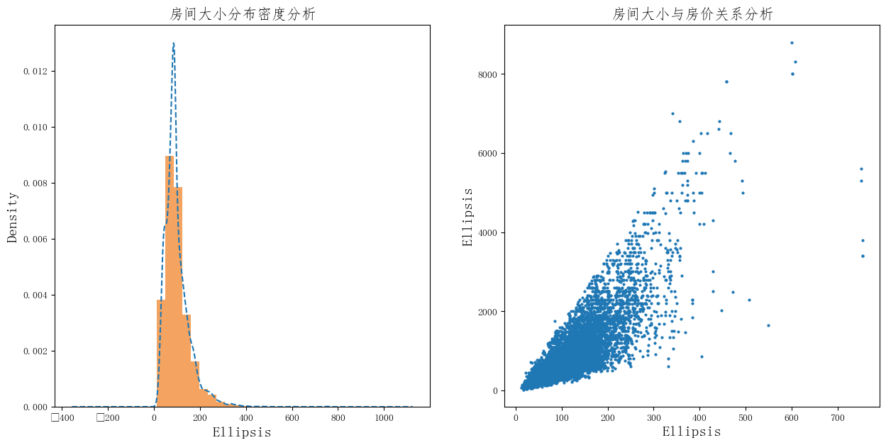
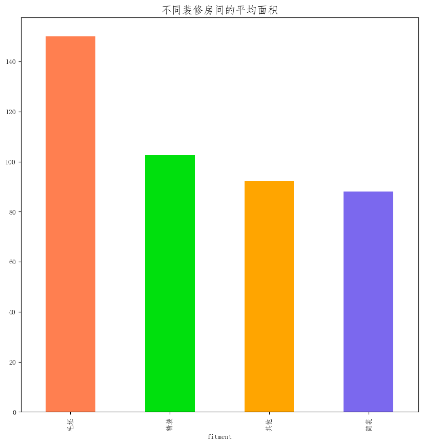
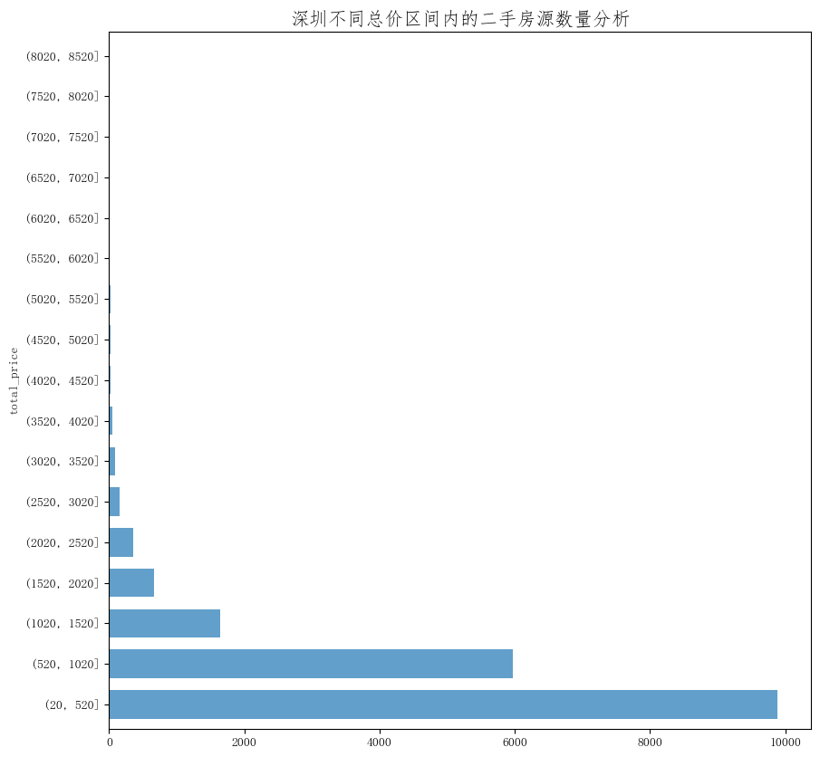

# 深圳链家二手房数据分析：从区域、户型和单价看购房决策

## 摘要

| 模块     | 内容                                                         |
| -------- | ------------------------------------------------------------ |
| 业务场景 | 房地产                                                       |
| 数据来源 | 深圳链家二手房源数据，约 1.9 万条记录，字段覆盖区域、小区、商圈、总价、单价、面积、户型、朝向和装修。 |
| 分析方法 | pandas 数据清洗、重复值与异常值处理、分组聚合、matplotlib 可视化、价格分布分析。 |
| 结论先行 | 区域是解释深圳二手房价格差异的核心维度，核心区和产业聚集区通常兼具高单价和高流动性。 |

本报告围绕“业务背景、分析目的、数据说明、分析思路、分析过程、核心结论和改进建议”展开，目标是用数据回答具体问题，并把分析结果转化为可执行的判断。

## 一、分析背景

二手房不是单纯的价格比较问题，而是预算、通勤、面积、税费、学区或商圈预期之间的权衡。本项目把房源拆成区域、户型、面积、装修和朝向等维度，帮助购房者先建立市场基准，再缩小候选范围。

## 二、分析目的

本次分析主要回答以下问题：

- 当前业务场景下最需要解释的核心指标是什么？
- 不同维度之间是否存在明显差异或异常？
- 分析结果可以转化为哪些具体决策建议？

先明确分析目的，再开展数据处理和指标拆解，可以保证报告围绕问题展开，而不是简单罗列代码和图表。

## 三、数据来源与指标说明

| 项目           | 说明                                                         |
| -------------- | ------------------------------------------------------------ |
| 数据来源       | 深圳链家二手房源数据，约 1.9 万条记录，字段覆盖区域、小区、商圈、总价、单价、面积、户型、朝向和装修。 |
| 分析工具与方法 | pandas 数据清洗、重复值与异常值处理、分组聚合、matplotlib 可视化、价格分布分析。 |
| 重点分析指标   | 总量、占比、趋势、排名、区域分布、类别结构和异常变化。       |
| 数据口径       | 本文以项目数据集中的字段为分析范围，先完成缺失值、异常值、重复值或类别字段处理，再围绕核心指标做统计、可视化或建模。 |

数据口径会直接影响分析结论，因此报告先说明数据范围、核心指标和处理方式，便于读者理解结论的适用边界。

## 四、分析思路

| 步骤                | 目的                                                         |
| ------------------- | ------------------------------------------------------------ |
| 1. 明确业务问题     | 确定分析要回答什么，以及结论会影响什么决策。                 |
| 2. 数据读取与清洗   | 处理缺失、重复、异常和字段格式问题，保证分析基础可靠。       |
| 3. 指标拆解与可视化 | 从趋势、结构、对比、分布或空间维度观察数据现象。             |
| 4. 建模或深度分析   | 根据项目需要完成聚类、预测、分类、回归、文本分析或可视化大屏。 |
| 5. 输出结论与建议   | 把数据发现翻译成业务语言，并给出可执行的下一步动作。         |

本项目的具体分析路径如下：

- 先从业务背景出发，明确这份数据要回答什么问题，以及结论会影响什么决策。
- 检查数据口径，包括样本量、字段含义、缺失值、重复值和异常值。
- 围绕核心指标做拆解，例如价格、销量、转化、风险、留存、区域或人群结构。
- 用分组统计和可视化寻找差异，再结合业务常识判断差异是否有解释价值。
- 最后把发现转化为建议，并说明局限性和下一步需要补充的数据。

## 五、数据处理过程

本项目的数据处理主要包括以下环节：

- 读取原始数据，检查字段类型、样本规模和基础统计信息。
- 处理缺失值、重复值、异常值或文本噪声，保证后续统计和建模结果可靠。
- 根据分析目标构造必要指标、标签或特征，并统一字段口径。
- 按业务维度进行分组、聚合、可视化或模型训练，为结论提供依据。

## 六、数据分析与结果

本部分按照“分析发现 -> 结果解读”的方式组织，重点说明数据体现出的现象及其业务含义。

### 1. 区域是解释深圳二手房价格差异的核心维度，核心区和产业聚集区通常兼具高单价和高流动性。

结果解读：该发现是本项目最核心的结论之一，说明数据中存在值得关注的结构性特征。对应图表或模型结果应围绕这一判断展开，帮助读者理解结论来源。

### 2. 总价和单价需要分开看：低总价房源未必便宜，可能来自小面积或非核心户型；高单价也不一定不合理，可能对应更强的区位和配套。

结果解读：该发现进一步解释了不同维度之间的差异。对业务决策而言，重点不只是看到差异，而是判断差异来自哪些对象、场景或指标。

### 3. 户型、面积和装修共同影响成交吸引力。刚需房更关注总价门槛，改善型房源更关注面积、居住舒适度和社区品质。

结果解读：该发现可以作为后续优化策略或模型改进的依据。若用于真实业务，还需要结合成本、资源、实验结果或线上反馈继续验证。

## 七、结论

综合以上分析，可以得到以下结论：

- 区域是解释深圳二手房价格差异的核心维度，核心区和产业聚集区通常兼具高单价和高流动性。
- 总价和单价需要分开看：低总价房源未必便宜，可能来自小面积或非核心户型；高单价也不一定不合理，可能对应更强的区位和配套。
- 户型、面积和装修共同影响成交吸引力。刚需房更关注总价门槛，改善型房源更关注面积、居住舒适度和社区品质。

## 八、建议

- 行动 1：购房分析应先按预算设定总价区间，再在目标区域内比较单位面积价格，避免被单一低价标题吸引。
- 行动 2：中介平台可基于区域均价、面积段、满五税费和装修状态构建房源评分，提升用户筛选效率。
- 行动 3：如果用于真实业务，应补充成交价、挂牌时长、地铁距离、学区和小区楼龄，进一步区分挂牌噪声和真实购买价值。
- 跟进方式：为每条建议绑定一个可观察指标，后续按周或按月复盘效果。

建议部分应结合具体对象、执行动作和复盘指标，避免停留在泛泛的“加强管理”或“优化运营”。

## 九、局限性与改进方向

- 项目价值：把分散数据组织成趋势、结构、对比和空间分布，让管理者能快速识别重点对象和异常变化。
- 真实限制：房源挂牌价不等于成交价，若缺少成交周期、议价空间、楼龄、学区、地铁距离和税费信息，价格判断容易偏向表面行情。
- 业务风险：如果直接用挂牌数据做推荐或估价，可能高估部分滞销房源价值，也可能低估稀缺小区、优质楼层和学区房溢价。
- 改进方向：将静态分析升级为可定期刷新的监控看板，并为异常指标设置阈值提醒。
- 改进方向：为关键图表补充下钻维度，使管理者能从总览进一步定位到地区、品类、用户或时间段。
- 改进方向：接入成交价、挂牌时长、楼龄、地铁距离、学区和小区成交频次，提高价格解释和推荐可信度。

## 附录：完整代码与输出结果

下面内容按原 notebook 的代码单元顺序整理。如果代码单元产生了文本输出或图片输出，也一并附在对应代码后面，便于复现完整分析过程。

### 代码单元 1

```python
# 引入使用的库
import numpy as np
import pandas as pd
import matplotlib.pyplot as plt
from pylab import mpl
mpl.rcParams['font.sans-serif'] = ['FangSong'] # 指定默认字体
plt.rc('figure', figsize=(10, 10))  #把plt默认的图片size调大一点
```

### 代码单元 2

```python
#读取数据文件，查看数据大体情况
df = pd.read_csv('./shenzhen.csv')
df.head()
```

**文本输出**

```text
Unnamed: 0 area                       title community position    tax  \
0           0  罗湖区   满五红本， 户型方正朝南，自住装修保养好，花园社区      金城华庭       螺岭  房本满五年   
1           1  罗湖区  7号线洪湖站前59万平洪湖公园后京基水贝*2个万象城      洪湖东岸       翠竹  房本满五年   
2           2  罗湖区   《供电南苑。复式三层四房户型》万象城，地理位置优越      供电南苑      万象城  房本满五年   
3           3  罗湖区   不用明额 满两年红本 高层东南三房 有钥匙随时可看      翡翠公寓       翠竹  房本满五年   
4           4  罗湖区              都市名园 2室1厅 370万      都市名园      万象城    NaN   

   total_price  unit_price hourseType  hourseSize direction fitment  
0        710.0     79552.0       3室1厅       89.25         南      精装  
1        408.0     54736.0       3室1厅       74.54         西      精装  
2        850.0     67649.0       4室1厅      125.65         西      简装  
3        360.0     60627.0       3室2厅       59.38         南      精装  
4        370.0     48259.0       2室1厅       76.67        东北      简装
```

### 代码单元 3

```python
df.describe()
```

**文本输出**

```text
Unnamed: 0   total_price     unit_price    hourseSize
count  18907.000000  18907.000000   18907.000000  18907.000000
mean    9453.000000    686.988634   64893.523721    100.622215
std     5458.125105    621.063940   25713.800191     95.858442
min        0.000000     24.000000     506.000000     13.150000
25%     4726.500000    345.000000   46263.500000     66.830000
50%     9453.000000    505.000000   59441.000000     88.260000
75%    14179.500000    786.000000   78108.000000    121.065000
max    18906.000000   8800.000000  225635.000000  10871.000000
```

### 代码单元 4

```python
#房间大小超过10000平米的数据
df[df['hourseSize']>10000]
```

**文本输出**

```text
Unnamed: 0 area                   title community position    tax  \
12546       12546  宝安区  弘雅二期花园中间，中间楼层，满五年，红本在手   弘雅花园第二期       新安  房本满五年   

       total_price  unit_price hourseType  hourseSize direction fitment  
12546        550.0       506.0       3室2厅     10871.0        东南      其他
```

### 代码单元 5

```python
# 删除超过10000平米的数据
print(len(df))
df = df.drop(df[df['hourseSize']>10000].index)
print(len(df))
```

**文本输出**

```text
18907
18906
```

### 代码单元 6

```python
#查看每列的总数、数据类型
df.info()
```

**文本输出**

```text
<class 'pandas.core.frame.DataFrame'>
Int64Index: 18906 entries, 0 to 18906
Data columns (total 12 columns):
 #   Column       Non-Null Count  Dtype  
---  ------       --------------  -----  
 0   Unnamed: 0   18906 non-null  int64  
 1   area         18906 non-null  object 
 2   title        18898 non-null  object 
 3   community    18906 non-null  object 
 4   position     18906 non-null  object 
 5   tax          10710 non-null  object 
 6   total_price  18906 non-null  float64
 7   unit_price   18906 non-null  float64
 8   hourseType   18906 non-null  object 
 9   hourseSize   18906 non-null  float64
 10  direction    18906 non-null  object 
 11  fitment      18906 non-null  object 
dtypes: float64(3), int64(1), object(8)
memory usage: 1.9+ MB
```

### 代码单元 7

```python
# 查看重复值
df[df.duplicated()]
```

**文本输出**

```text
Empty DataFrame
Columns: [Unnamed: 0, area, title, community, position, tax, total_price, unit_price, hourseType, hourseSize, direction, fitment]
Index: []
```

### 代码单元 8

```python
# 不同行政区房源数量占比
area_house_count = df.groupby('area')['area'].count()
area_house_count.sort_values(ascending=False,inplace=True)  #按照降序排列
# area_house_count

# 不同户型房源数量占比
hourseType_count = df.groupby('hourseType')['hourseType'].count()
hourseType_count.sort_values(ascending=False,inplace=True)  #按照降序排列
new_hourseType_count = hourseType_count[hourseType_count>700]
new_hourseType_count['其它'] = hourseType_count[hourseType_count<700].sum()
# new_hourseType_count

# 不同朝向房源数量占比()
direction_count = df.groupby('direction')['direction'].count()
new_direction_count =direction_count[direction_count>800]
new_direction_count['其它'] = direction_count[direction_count<800].sum()
new_direction_count.sort_values(ascending=False)

# 不同装修
fitment_count = df.groupby('fitment')['fitment'].count().sort_values(ascending=False)
fitment_count.sort_values(ascending=False,inplace=True)
```

### 代码单元 9

```python
fig=plt.figure(figsize=(12,9),dpi=90)
ax1=fig.add_subplot(2,2,1)
plt.title("不同行政区房源数量占比情况")
area_house_count.plot.pie(shadow=True,autopct='%0.f%%',explode=[0.05,0.05,0.05,0.05,0,0,0,0],labeldistance=1.1,startangle=90)

ax2=fig.add_subplot(2,2,2)
plt.title("不同户型房源数量占比情况")
new_hourseType_count.plot.pie(shadow=True,autopct='%0.f%%',explode=[0.05,0,0,0,0,0,0,0,0,0],labeldistance=1.1,startangle=90)

ax3=fig.add_subplot(2,2,3)
plt.title("不同朝向房源数量占比情况")
new_direction_count.plot.pie(shadow=True,autopct='%0.f%%',explode=[0,0,0,0,0.05,0,0,0,0],labeldistance=1.1,startangle=90)

ax4=fig.add_subplot(2,2,4)
plt.title("不同装修类型的占比情况")
fitment_count.plot.pie(shadow=True,autopct='%0.f%%',labeldistance=1.1,explode=[0.05,0,0,0],startangle=45)
plt.show()
```

**图表输出 1**



### 代码单元 10

```python
# 不同区的总价对比
area_house_mean_totalprice = df.groupby('area')['total_price'].mean()
area_house_mean_totalprice.sort_values(ascending=False,inplace=True)
area_house_mean_totalprice
```

**文本输出**

```text
area
南山区    1055.371167
宝安区     815.907730
福田区     757.017633
龙华区     687.321865
盐田区     517.372137
罗湖区     478.523033
龙岗区     474.388533
坪山区     318.978323
Name: total_price, dtype: float64
```

### 代码单元 11

```python
# 不同区的单价对比
area_house_mean_unitprice = df.groupby('area')['unit_price'].mean()
area_house_mean_unitprice.sort_values(ascending=False,inplace=True)
area_house_mean_unitprice
```

**文本输出**

```text
area
南山区    92239.793667
福田区    77030.074333
宝安区    67826.517791
龙华区    60516.629759
罗湖区    57632.523000
盐田区    49925.460775
龙岗区    44816.287667
坪山区    35425.415133
Name: unit_price, dtype: float64
```

### 代码单元 12

```python
fig = plt.figure(figsize=(15,5),dpi=100)
ax1 = fig.add_subplot(1,2,1)
plt.title("深圳不同地区总价对比")
plt.ylim([300,1100])  #设置y坐标轴的范围
rects = area_house_mean_totalprice.plot.bar(alpha=0.7,color='#1E90FF')
plt.grid(alpha=0.5,color='#DDA0DD',linestyle='--',axis='y')

ax2 = fig.add_subplot(1,2,2)
plt.title("深圳不同地区单价对比")
plt.ylim([30000,100000])
area_house_mean_unitprice.plot.bar(alpha=0.7,color='#4876FF')
plt.grid(alpha=0.5,color='#DDA0DD',linestyle='--',axis='y')

plt.show()
```

**图表输出 1**



### 代码单元 13

```python
position_house_mean_price = df.groupby('position')['total_price'].mean()
position_house_mean_price.sort_values(ascending=False,inplace=True)

#绘图  只展示排名前十的地段

ax = plt.subplot(111)
plt.title("房价排名前十的地段",fontsize=20) # 设置标题字体大小
# 设置刻度字体大小
plt.xticks(fontsize=20)
plt.yticks(fontsize=20)
# 设置坐标标签字体大小
ax.set_xlabel(..., fontsize=20)
ax.set_ylabel(..., fontsize=20)

position_house_mean_price.head(10).plot.barh(alpha=0.7,color=[
    '#CD3700','#9ACD32','#7EC0EE','y','orange','#4876FF','#EEA9B8','#EE7942','#CD69C9','#668B8B'])
plt.grid(color='#DDA0DD',linestyle='--',alpha=0.5)
plt.show()
```

**图表输出 1**



### 代码单元 14

```python
# 南山区的不同地段的均价对比
area_nanshan_price = df[df['area']=='南山区'].groupby('position')['total_price'].mean()
area_nanshan_price.sort_values(ascending=False,inplace=True)
#area_nanshan_price

# 宝安区的不同地段的均价对比
area_baoan_price = df[df['area']=='宝安区'].groupby('position')['total_price'].mean()
area_baoan_price.sort_values(ascending=False,inplace=True)
#area_baoan_price

fig = plt.figure(figsize=(15,8),dpi=100)
ax1 = fig.add_subplot(1,2,1)
plt.title("南山区的房价对比")
area_nanshan_price.plot.barh(alpha=0.7,color=['#A4D3EE','y','#4876FF','#A4D3EE','#A4D3EE','#A4D3EE','#A4D3EE','#A4D3EE','#A4D3EE','#A4D3EE','#A4D3EE','#668B8B'])

ax2 = fig.add_subplot(1,2,2)
plt.title("宝安区的房价对比")
area_baoan_price.plot.barh(alpha=0.7,color=['#CD3700','orange','#A4D3EE','#A4D3EE','#A4D3EE','#A4D3EE','#A4D3EE','#A4D3EE','#A4D3EE','#A4D3EE','#A4D3EE','#A4D3EE'])
plt.show()
```

**图表输出 1**



### 代码单元 15

```python
community_top10 = df.groupby('community')['total_price'].mean().sort_values(ascending=False).head(10)

# fig = plt.figure(figsize=(12,8),dpi=100)
# ax = fig.add_subplot(1,1,1)
ax = plt.subplot(111)
# 设置刻度字体大小
plt.xticks(fontsize=15)
plt.yticks(fontsize=15)
# 设置坐标标签字体大小
ax.set_xlabel(..., fontsize=15)
ax.set_ylabel(..., fontsize=15)

plt.title("二手房均价（总价）排名前十的小区分析",fontsize=15)
community_top10.plot.barh(alpha=0.7,width=0.7)
plt.show()
```

**图表输出 1**



### 代码单元 16

```python
# 房屋朝向对价格的影响，只分析单价
direction_unit_price = df.groupby('direction')['unit_price'].mean().sort_values(ascending=False)
plt.figure(figsize=(15,8),dpi=120)
plt.title("房屋朝向对价格的影响")
direction_unit_price.plot.bar(alpha=0.7)
plt.grid(color='#DDA0DD',linestyle='--',alpha=0.5,axis='y')
plt.show()
```

**图表输出 1**



### 代码单元 17

```python
fit_price = df.groupby('fitment')['unit_price'].mean().sort_values(ascending=False)

ax = plt.subplot(111)
# 设置刻度字体大小
plt.xticks(fontsize=15)
plt.yticks(fontsize=15)
# 设置坐标标签字体大小
ax.set_xlabel(..., fontsize=15)
ax.set_ylabel(..., fontsize=15)
plt.title("不同装修和单价的关系", fontsize=15)
plt.ylabel("单价（万元/每平方米）", fontsize=15)

fit_price.plot.bar(color=['#FF7F50','#00E00D','#FFA500','#7B68EE'])
plt.show()
```

**图表输出 1**



### 代码单元 18

```python
# 通过密度图和散点图来分析房屋特征
fig = plt.figure(figsize=(15,7))
ax1 = fig.add_subplot(1,2,1)
# 设置坐标标签字体大小
ax1.set_xlabel(..., fontsize=15)
ax1.set_ylabel(..., fontsize=15)

plt.title("房间大小分布密度分析",fontsize=15)
df['hourseSize'].hist(bins=20,ax=ax1,color='#F4A460',density= True)  #直方图  desity=True显示频率，为False显示频数
df['hourseSize'].plot(kind='kde',style='--',ax=ax1)     #折线图 kind='kde'(是与直方图相关的密度图)

ax2 = fig.add_subplot(1,2,2)
# 设置坐标标签字体大小
ax2.set_xlabel(..., fontsize=15)
ax2.set_ylabel(..., fontsize=15)

plt.title("房间大小与房价关系分析",fontsize=15)
plt.scatter(df['hourseSize'],df['total_price'],s=4)
plt.show()
```

**文本输出**

```text
C:\Users\Administrator\Envs\jv\lib\site-packages\IPython\core\pylabtools.py:152: UserWarning: Glyph 8722 (\N{MINUS SIGN}) missing from current font.
  fig.canvas.print_figure(bytes_io, **kw)
```

**图表输出 1**



### 代码单元 19

```python
# 不同装修房间的平均面积
fit_average_size = df.groupby('fitment')['hourseSize'].mean().sort_values(ascending=False)
fit_average_size
plt.title("不同装修房间的平均面积",fontsize=15)
# plt.ylable("面积（平米）")
fit_average_size .plot.bar(color=['#FF7F50','#00E00D','#FFA500','#7B68EE'])
plt.show()
```

**图表输出 1**



### 代码单元 20

```python
# 不同价格区间内的房源数量

bins_arr = np.arange(20,9000,500)
bins = pd.cut(df['total_price'],bins_arr)
totalprice_counts = df['total_price'].groupby(bins).count()

plt.title("深圳不同总价区间内的二手房源数量分析",fontsize=15)
plt.ylabel("二手房数量")
totalprice_counts.plot.barh(alpha=0.7,width=0.7)
plt.show()
```

**图表输出 1**


