# 时令蔬菜价格时间序列分析：理解农产品价格波动和预测变量

## 摘要

| 模块     | 内容                                                         |
| -------- | ------------------------------------------------------------ |
| 业务场景 | 生活日常                                                     |
| 数据来源 | 农产品批发价格数据，包含日期、品类和价格等字段。             |
| 分析方法 | 时间序列整理、趋势可视化、季节性分析、seaborn 图表、多元回归。 |
| 结论先行 | 蔬菜价格通常存在季节性波动，同一品类在不同时间段的供需关系不同。 |

本报告围绕“业务背景、分析目的、数据说明、分析思路、分析过程、核心结论和改进建议”展开，目标是用数据回答具体问题，并把分析结果转化为可执行的判断。

## 一、分析背景

农产品价格受季节、供给、运输、天气和节假日共同影响。价格分析可服务采购、库存和消费者价格预期管理。

## 二、分析目的

本次分析主要回答以下问题：

- 当前业务场景下最需要解释的核心指标是什么？
- 不同维度之间是否存在明显差异或异常？
- 分析结果可以转化为哪些具体决策建议？

先明确分析目的，再开展数据处理和指标拆解，可以保证报告围绕问题展开，而不是简单罗列代码和图表。

## 三、数据来源与指标说明

| 项目           | 说明                                                         |
| -------------- | ------------------------------------------------------------ |
| 数据来源       | 农产品批发价格数据，包含日期、品类和价格等字段。             |
| 分析工具与方法 | 时间序列整理、趋势可视化、季节性分析、seaborn 图表、多元回归。 |
| 重点分析指标   | 总量、占比、趋势、排名、区域分布、类别结构和异常变化。       |
| 数据口径       | 本文以项目数据集中的字段为分析范围，先完成缺失值、异常值、重复值或类别字段处理，再围绕核心指标做统计、可视化或建模。 |

数据口径会直接影响分析结论，因此报告先说明数据范围、核心指标和处理方式，便于读者理解结论的适用边界。

## 四、分析思路

| 步骤                | 目的                                                         |
| ------------------- | ------------------------------------------------------------ |
| 1. 明确业务问题     | 确定分析要回答什么，以及结论会影响什么决策。                 |
| 2. 数据读取与清洗   | 处理缺失、重复、异常和字段格式问题，保证分析基础可靠。       |
| 3. 指标拆解与可视化 | 从趋势、结构、对比、分布或空间维度观察数据现象。             |
| 4. 建模或深度分析   | 根据项目需要完成聚类、预测、分类、回归、文本分析或可视化大屏。 |
| 5. 输出结论与建议   | 把数据发现翻译成业务语言，并给出可执行的下一步动作。         |

本项目的具体分析路径如下：

- 先从业务背景出发，明确这份数据要回答什么问题，以及结论会影响什么决策。
- 检查数据口径，包括样本量、字段含义、缺失值、重复值和异常值。
- 围绕核心指标做拆解，例如价格、销量、转化、风险、留存、区域或人群结构。
- 用分组统计和可视化寻找差异，再结合业务常识判断差异是否有解释价值。
- 最后把发现转化为建议，并说明局限性和下一步需要补充的数据。

## 五、数据处理过程

本项目的数据处理主要包括以下环节：

- 读取原始数据，检查字段类型、样本规模和基础统计信息。
- 处理缺失值、重复值、异常值或文本噪声，保证后续统计和建模结果可靠。
- 根据分析目标构造必要指标、标签或特征，并统一字段口径。
- 按业务维度进行分组、聚合、可视化或模型训练，为结论提供依据。

## 六、数据分析与结果

本部分按照“分析发现 -> 结果解读”的方式组织，重点说明数据体现出的现象及其业务含义。

### 1. 蔬菜价格通常存在季节性波动，同一品类在不同时间段的供需关系不同。

结果解读：该发现是本项目最核心的结论之一，说明数据中存在值得关注的结构性特征。对应图表或模型结果应围绕这一判断展开，帮助读者理解结论来源。

### 2. 短期价格异常可能来自天气、物流或节假日备货，不能简单外推为长期趋势。

结果解读：该发现进一步解释了不同维度之间的差异。对业务决策而言，重点不只是看到差异，而是判断差异来自哪些对象、场景或指标。

### 3. 多元回归可帮助识别相关变量，但农产品场景还需要关注外部冲击。

结果解读：该发现可以作为后续优化策略或模型改进的依据。若用于真实业务，还需要结合成本、资源、实验结果或线上反馈继续验证。

## 七、结论

综合以上分析，可以得到以下结论：

- 蔬菜价格通常存在季节性波动，同一品类在不同时间段的供需关系不同。
- 短期价格异常可能来自天气、物流或节假日备货，不能简单外推为长期趋势。
- 多元回归可帮助识别相关变量，但农产品场景还需要关注外部冲击。

## 八、建议

- 行动 1：采购侧可根据历史季节性提前制定备货和替代品策略。
- 行动 2：零售侧可将价格波动与促销、损耗和库存联动管理。
- 行动 3：后续可引入天气、产地供应和节假日变量，提高预测解释力。
- 跟进方式：为每条建议绑定一个可观察指标，后续按周或按月复盘效果。

建议部分应结合具体对象、执行动作和复盘指标，避免停留在泛泛的“加强管理”或“优化运营”。

## 九、局限性与改进方向

- 项目价值：把分散数据组织成趋势、结构、对比和空间分布，让管理者能快速识别重点对象和异常变化。
- 真实限制：农产品价格受天气、产地供给、运输成本、节假日和批发市场波动影响，单一历史价格序列难以解释全部波动。
- 业务风险：如果直接按历史均值做采购或定价，可能在极端天气和供应冲击下产生库存积压或缺货。
- 改进方向：将静态分析升级为可定期刷新的监控看板，并为异常指标设置阈值提醒。
- 改进方向：为关键图表补充下钻维度，使管理者能从总览进一步定位到地区、品类、用户或时间段。

## 附录：完整代码与输出结果

下面内容按原 notebook 的代码单元顺序整理。如果代码单元产生了文本输出或图片输出，也一并附在对应代码后面，便于复现完整分析过程。

### 代码单元 1

```python
import os
import numpy as np
import pandas as pd
import matplotlib as mpl
from matplotlib import pyplot as plt
from matplotlib import cycler
import seaborn as sns

plt.style.use("seaborn-darkgrid")

colors = mpl.cm.Dark2(range(7))

mpl_config = {
    "font.family": "Microsoft YaHei",
    "figure.figsize": (16, 5),
    "axes.titlesize": 16,
    "axes.titleweight": "bold",
    "axes.titlepad":8,
    "axes.labelsize":12,
    'axes.prop_cycle':cycler(color=colors)
}

mpl.rcParams.update(mpl_config)
```

**文本输出**

```text
C:\Users\Administrator\AppData\Local\Temp\2\ipykernel_11204\4024306048.py:9: MatplotlibDeprecationWarning: The seaborn styles shipped by Matplotlib are deprecated since 3.6, as they no longer correspond to the styles shipped by seaborn. However, they will remain available as 'seaborn-v0_8-<style>'. Alternatively, directly use the seaborn API instead.
  plt.style.use("seaborn-darkgrid")
```

### 代码单元 2

```python
raw_df = pd.read_csv('./wholesale_price_of_agricultural_products.csv')
raw_df.head()
```

**文本输出**

```text
year_month product  price category
0      202012      芹菜   3.76       蔬菜
1      202012     西红柿   4.56       蔬菜
2      202012      豆角   7.90       蔬菜
3      202012     白萝卜   1.93       蔬菜
4      202012      茄子   4.97       蔬菜
```

### 代码单元 3

```python
# 为贴近常用的农产品标价单价，将原本的价格单位`元/公斤`转化为`元/斤`。（一公斤等于一千克，一斤等于500克）

df = raw_df.assign(
    year_month = raw_df["year_month"].astype("str")
).rename({"price":"price_1kg"},axis=1)

df = df.assign(
    year = df["year_month"].map(lambda x:int(x[:4])),
    month = df["year_month"].map(lambda x:int(x[-2:])),
    year_month = df["year_month"].map(lambda x:f"{x[:4]}-{x[-2:]}"),
    price_500g = df["price_1kg"]/2
)

df.head(10)
```

**文本输出**

```text
year_month product  price_1kg category  year  month  price_500g
0    2020-12      芹菜       3.76       蔬菜  2020     12       1.880
1    2020-12     西红柿       4.56       蔬菜  2020     12       2.280
2    2020-12      豆角       7.90       蔬菜  2020     12       3.950
3    2020-12     白萝卜       1.93       蔬菜  2020     12       0.965
4    2020-12      茄子       4.97       蔬菜  2020     12       2.485
5    2020-12     胡萝卜       2.45       蔬菜  2020     12       1.225
6    2020-12      黄瓜       4.40       蔬菜  2020     12       2.200
7    2020-12      莴笋       3.16       蔬菜  2020     12       1.580
8    2020-12      青椒       6.15       蔬菜  2020     12       3.075
9    2020-12      菜花       3.86       蔬菜  2020     12       1.930
```

### 代码单元 4

```python
def get_season(month):
    """将月份映射到季度上"""
    if month in (12,1,2):
        return 0
    elif month in (3,4,5):
        return 1
    elif month in (6,7,8):
        return 2
    elif month in (9,10,11):
        return 3
```

### 代码单元 5

```python
def get_title(products,category):
    if category is not None:
        target_name = f"各种{category}"
    else:
        max_target_show = 3
        target_name = "、".join(products[:max_target_show])
        if len(products) > max_target_show:
            target_name += "等"
    title = f"{target_name}的价格历史变化（2020年6月 - 2022年5月）"
    return title
```

### 代码单元 6

```python
from collections.abc import Iterable

UNIQUE_YEAR_MONTH = sorted(set(df["year_month"].values))

def plot_ts(products=None, category=None, ax=None, fig=None):
    """绘制部分产品的价格历史变化图

    Parameters
    ----------
    products : list or str, optional
        产品名称或产品名称的列表
    category : str, optional
        品类名称
    ax: mpl.axes.Axes, optional
        如果为空，则会重新创建图层
    fig: matplotlib.Figure, optional
        如果为空，则会重新创建画布
    """

    if isinstance(products, Iterable):
        _products = products
    elif isinstance(products, str):
        _products = [products]
    elif isinstance(category, str):
        _products = list(
            set(df.query(f"category == '{category}'")["product"].values))
    else:
        raise Exception("未正确设置products或category")

    if ((ax is None) or (fig is None)):
        _fig, _ax = plt.subplots(figsize=(16, 10))
    else:
        _fig, _ax = fig, ax

    # 绘制价格历史变化折线图

    y_max = 0
    for product in _products:
        cdf = df.query(f"product == '{product}'").sort_values("year_month")
        y = cdf["price_500g"].values
        y_max = max(max(y), y_max)
        _ax.plot(UNIQUE_YEAR_MONTH, y, "-o", label=product)
    _ax.set_ylim(0,)
    tick_labels = [i[-5:] for i in UNIQUE_YEAR_MONTH]
    _ax.set_xticks(range(len(UNIQUE_YEAR_MONTH)), tick_labels)

    title = get_title(products, category)
    _ax.set_title(title, pad=20)
    _ax.set_ylabel("批发价（元/斤）", labelpad=30)
    _ax.set_xlabel("年月", labelpad=10)

    # 使用imshow绘制四季背景色

    data = [[get_season(int(x[-2:])) for x in UNIQUE_YEAR_MONTH]]

    cmap = mpl.colors.ListedColormap(
        ['LightBlue', "YellowGreen", "Tomato", "SandyBrown"])

    ims = _ax.imshow(
        data,
        extent=(0, len(UNIQUE_YEAR_MONTH), 0, y_max*1.1),
        cmap=cmap,
        alpha=0.8)

    # 调整ticks的位置，使得label可以对应到每个颜色的中央
    colorbar_ticks = [0.4, 1.15, 1.85, 2.6]
    colorbar_labels = ["冬", "春", "夏", "秋"]
    colorbar = _fig.colorbar(ims,
                             ax=_ax,
                             label="四季",
                             ticks=colorbar_ticks,
                             orientation='horizontal',
                             shrink=0.2)
    colorbar.set_ticklabels(colorbar_labels)
    _ax.legend(loc='upper right', bbox_to_anchor=(0.6, 0.5, 0.5, 0.5))
    _ax.set_aspect("auto")

# plot_ts(category='水产品')
```

### 代码单元 7

```python
plot_ts(category="畜禽产品")
```

**图表输出 1**

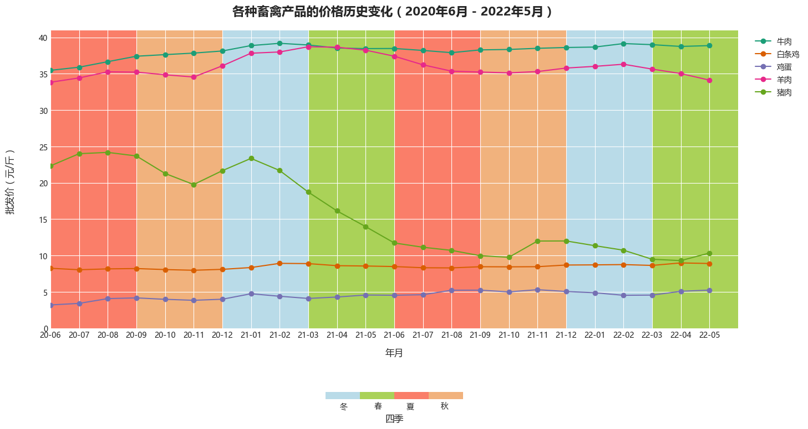

### 代码单元 8

```python
plot_ts(category="水产品")
```

**图表输出 1**

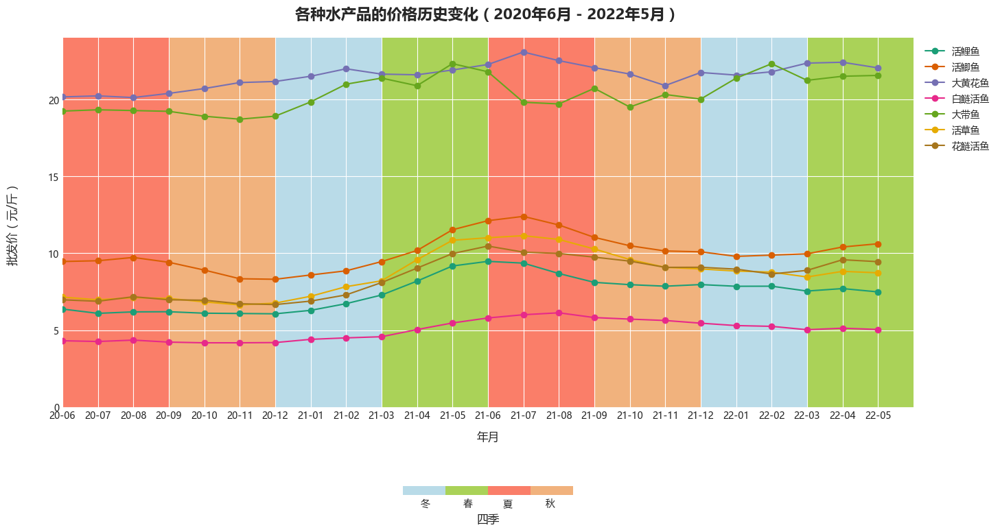

### 代码单元 9

```python
plot_ts(category="水果")
```

**图表输出 1**

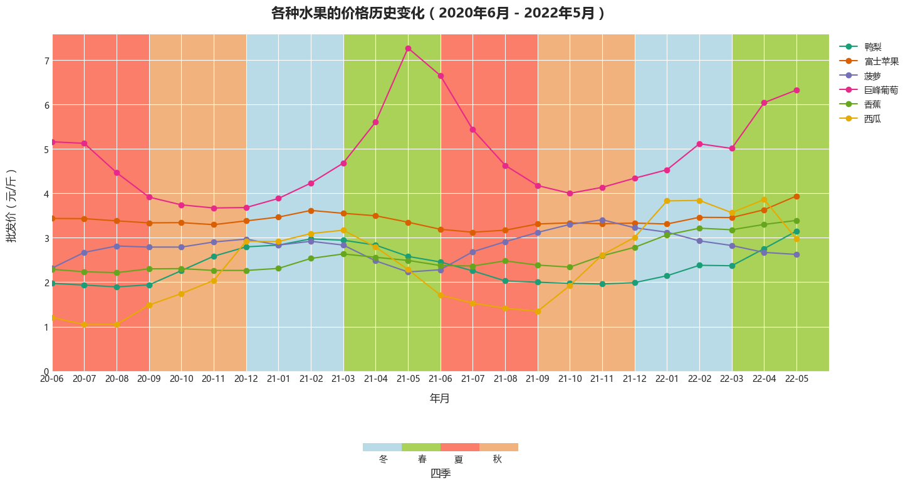

### 代码单元 10

```python
plot_ts(category="蔬菜")
```

**图表输出 1**

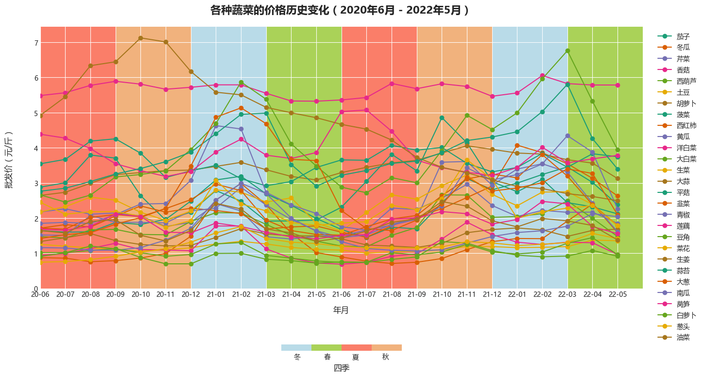

### 代码单元 11

```python
# 基于农产品和品类的数据汇总
product_gdf = df.groupby(["product", "category"]).agg(
    price_500g_std=("price_500g", "std"),
    price_500g_max=("price_500g", "max"),
    price_500g_min=("price_500g", "min"),
    price_500g_mean=("price_500g", "mean")
)

# 计算价格的变异系数（coefficient of variation）
product_gdf = product_gdf.assign(
    price_500g_varc=product_gdf["price_500g_std"] /
    product_gdf["price_500g_mean"]
)

def plot_price_varc_chart():
    _, ax = plt.subplots(figsize=(16, 10))

    sns.scatterplot(data=product_gdf.reset_index().sort_values("category",ascending=False), x="price_500g_varc", y="price_500g_mean",
                    hue="category", alpha=0.6, ax=ax, s=400)
    for product, i, j in product_gdf.reset_index()[["product", "price_500g_varc", "price_500g_mean"]].values:
        ax.text(i, j, product)

    ax.set_title("各个农产品的历史平均价格和价格波动幅度的对比")
    ax.set_xlabel("历史价格波动幅度（历史价格的变异系数）")
    ax.set_ylabel("历史平均价格（元/斤）")

plot_price_varc_chart()
```

**图表输出 1**

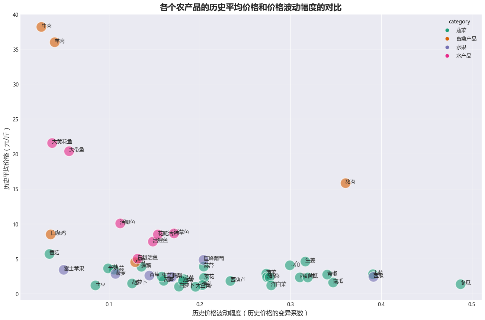

### 代码单元 12

```python
import statsmodels.api as sm

def fit_regression_model(product):

    sdf = df.query(f"product == '{product}'")
    sdf = sdf.sort_values("year_month").assign(
        ts_rank = range(1,sdf.shape[0]+1),
        constant = 1,
        month = sdf["month"].map(lambda x:f"month-{x:02}")
    )
    sdf = pd.concat([sdf,pd.get_dummies(sdf["month"])],axis=1)

    # 包含1个序列，12个月和一个常数列，所以是最后14列
    feature_names = sdf.columns[-14:]
    target_name = "price_500g"
    X = sdf[feature_names].values
    y = sdf[target_name]

    model = sm.OLS(y, sdf[feature_names])
    fit_result = model.fit()
    return model,fit_result,X,y

product = '西瓜'
model,fit_result,X,y = fit_regression_model(product)
```

### 代码单元 13

```python
fit_result.summary()
```

### 代码单元 14

```python
def plot_regression_result(model, fit_result, X, y):
    """
    绘制回归拟合后的图表，包括
    - 估计值和实际值的对比
    - 趋势
    - 季节性
    """
    year_month = [x[-5:] for x in UNIQUE_YEAR_MONTH]

    fig,(ax1,ax2,ax3) = plt.subplots(nrows=3,ncols=1,figsize=(16,10))

    params = fit_result.params
    
    ax1.plot(year_month,model.predict(params, X),label="估计值")
    ax1.plot(year_month,y,label="实际值")
    ax1.legend()
    ax1.set_ylim(0,)
    ax1.set_title("估计值和实际值对比")

    x = range(1,len(year_month)+1)

    trend = lambda x:params["ts_rank"] * x + params["constant"]

    trend_value = [trend(i) for  i in x]
    ax2.plot(year_month, trend_value)
    ax2.set_ylim(min(0,min(trend_value) * 1.5),max(trend_value) *1.5)
    ax2.set_title("趋势")

    month_coef = params.drop(["ts_rank","constant"])
    month_coef_values = month_coef.values.tolist()
    ax3.plot(month_coef.index.values.tolist(),month_coef_values )
    ax3.set_ylim(min(0,min(month_coef_values) *1.5),max(month_coef_values) *1.5)
    ax3.set_title("季节性")
    fig.suptitle(f"针对{product}的时间序列分析", fontsize=20, fontweight="bold")
    fig.tight_layout()
    
    

def plot_product_regression(product):
    model,fit_result,X,y = fit_regression_model(product)
    plot_regression_result(model,fit_result,X,y)

plot_product_regression(product)
```

**图表输出 1**

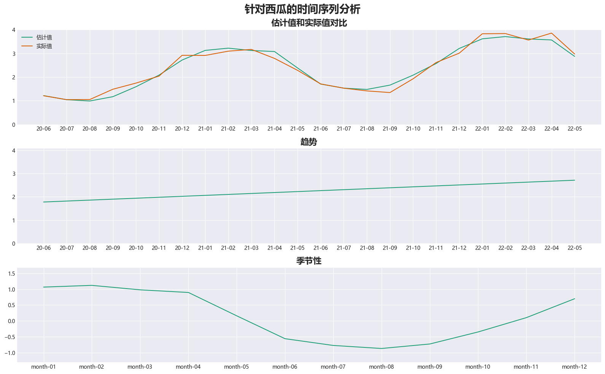

### 代码单元 15

```python
TEST_ALPHA_VALUE = 0.05

def get_season_info(fit_result,):
    
    pvalue_check = fit_result.pvalues < TEST_ALPHA_VALUE
    params = fit_result.params

    x = range(1,len(UNIQUE_YEAR_MONTH)+1)

    trend = lambda x:params["ts_rank"] * x + params["constant"]
    trend_value = [trend(i) for  i in x]
    
    season_params = params.drop(["ts_rank","constant"])
    return {
        "is_trend_significant":pvalue_check["ts_rank"],
        "trend_std":np.round(np.std(trend_value),4),
        "trend_slope":np.round(params["ts_rank"],4),
        "season_significant_rate":np.round(pvalue_check.drop(["ts_rank","constant"]).mean(),4),
        "season_std":np.round(season_params.std(),4),
        "season_values":np.round(season_params.values,4),
        "season_pvalues":np.round(fit_result.pvalues.drop(["ts_rank","constant"]).values,4)

    }

# get_season_info(fit_result)
```

### 代码单元 16

```python
def get_all_prdocut_season_info():
    products = list(set(df["product"].values))
    season_info_collect  = []
    for product in products:
        model,fit_result,X,y = fit_regression_model(product)
        season_info = get_season_info(fit_result)
        season_info.update(
            {
                "product":product
            }
        )
        season_info_collect.append(season_info)
    season_df = pd.DataFrame(season_info_collect)
    return season_df

season_df = get_all_prdocut_season_info()
# season_df.head()
```

### 代码单元 17

```python
season_mdf = pd.merge(season_df,product_gdf.reset_index(),on="product")
season_mdf = season_mdf.assign(
    season_varc = season_mdf["season_std"]/season_mdf["price_500g_mean"],
    trend_varc = season_mdf["trend_std"]/season_mdf["price_500g_mean"],
    season_varc_percent = season_mdf["season_std"]/season_mdf["price_500g_std"],
    trend_varc_percent = season_mdf["trend_std"]/season_mdf["price_500g_std"],
)

# season_mdf.sort_values("season_varc",ascending=False).head(1)
```

### 代码单元 18

```python
def plot_seasonal_comapre():
    fig,ax=plt.subplots(figsize=(16,10))
    x_col = "season_varc"
    y_col ="price_500g_mean"
    size_col = "season_significant_rate"

    x_col = "season_significant_rate"
    y_col = "season_varc"
    size_col = "season_varc_percent"

    sns.scatterplot(data=season_mdf.sort_values("category",ascending=False),x=x_col,y=y_col,
        size=size_col,hue="category",ax=ax,sizes=(200,400),alpha=0.7)
    ax.set_xlabel("季节性的统计意义显著性程度")
    ax.set_xlim(-0.1,1.1)
    ax.set_ylabel("季节性对于价格的实际影响程度")
    ax.set_ylim(-0.1,)
    for i,j,product in season_mdf[[x_col,y_col,"product"]].values:
        ax.text(i,j,product)
    ax.set_title("不同农产品的季节性程度对比")
    ax.plot([0.2,0.2],[-0.1,0.5],"--",color=colors[-1])
    ax.plot([-0.1,1.1],[0.1,0.1],"--",color=colors[-1])

    ax.text(0.6,0.3,"①",fontdict={"size":20,"color":colors[-1]})
    ax.text(0.0,0.3,"②",fontdict={"size":20,"color":colors[-1]})
    ax.text(0.0,0.0,"③",fontdict={"size":20,"color":colors[-1]})
    ax.text(0.6,0.0,"④",fontdict={"size":20,"color":colors[-1]})
plot_seasonal_comapre()
```

**图表输出 1**

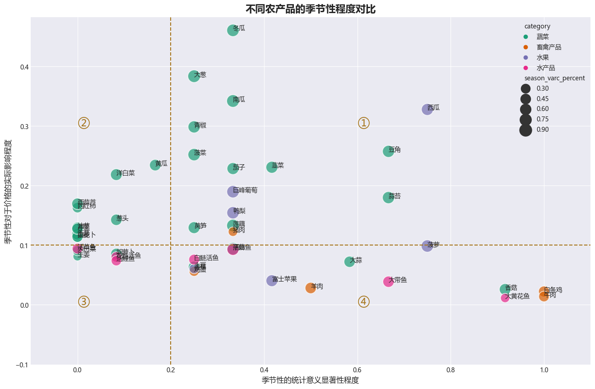

### 代码单元 19

```python
product="豆角"
# product="西瓜"
plot_product_regression(product)
```

**图表输出 1**

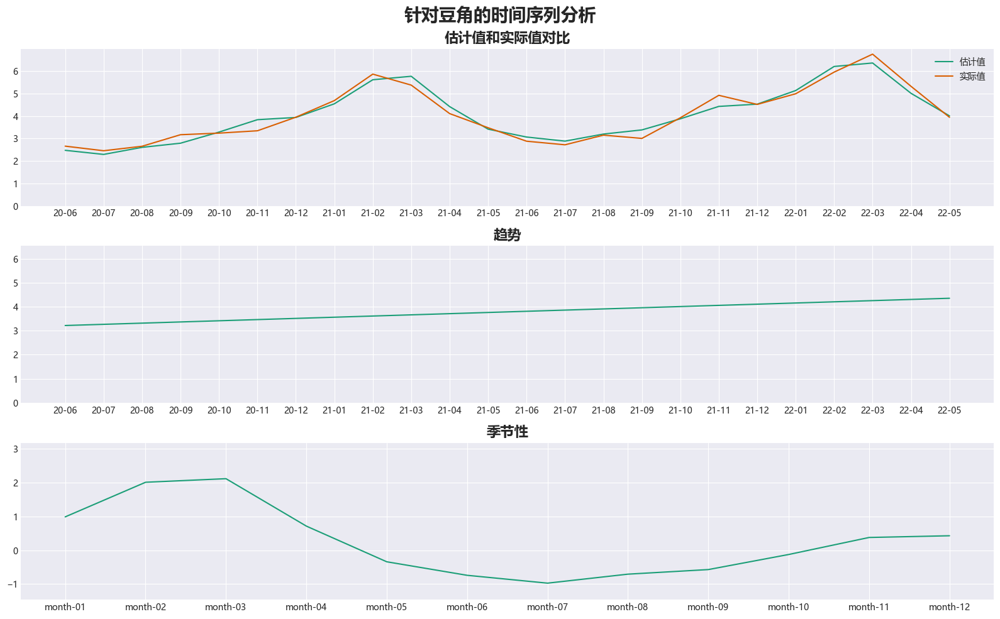

### 代码单元 20

```python
def plot_seasonal_heatmap(min_season_significant_rate=0.2, min_season_varc=0.1,season_varc_percent=0.4):
    query = f"season_significant_rate > {min_season_significant_rate} and season_varc > {min_season_varc} and season_varc_percent > {season_varc_percent}"
    season_sdf = season_mdf.query(query)
    n_product = season_sdf.shape[0]
    season_sdf = season_sdf[["product", "season_values"]].explode(
        "season_values")
    season_sdf = season_sdf.assign(
        year_month=list(range(1, 13)) * n_product,
        season_value=season_sdf["season_values"].map(float)
    )

    season_table = season_sdf.pivot("product", "year_month", "season_value")

    fig, ax = plt.subplots(figsize=(16, 6))
    sns.heatmap(season_table,cmap=mpl.cm.RdYlGn_r,
                norm=mpl.colors.Normalize(-2, 2), annot=True, fmt=".02f", ax=ax)
    ax.set_xlabel("月份")
    ax.set_ylabel("")
    ax.set_title("时令蔬菜的季节性价格变化热力图",pad=20)

plot_seasonal_heatmap(min_season_significant_rate=0.2, min_season_varc=0.1,season_varc_percent=0.4)
```

**文本输出**

```text
C:\Users\Administrator\AppData\Local\Temp\2\ipykernel_11204\758783678.py:12: FutureWarning: In a future version of pandas all arguments of DataFrame.pivot will be keyword-only.
  season_table = season_sdf.pivot("product", "year_month", "season_value")
```

**图表输出 1**

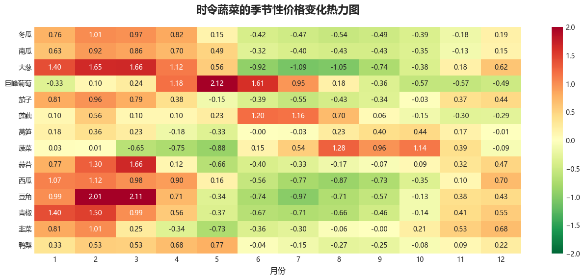

### 代码单元 21

```python
def plot_trend_chart():
    trend_significant_count_df = season_mdf.groupby("is_trend_significant").agg(count=("product","count"))
    trend_product_df = season_mdf.query("is_trend_significant == True")

    x_col = "trend_slope"
    y_col = "trend_varc"
    fig, [ax1,ax2] = plt.subplots(nrows=1,ncols=2,figsize=(16, 5))
    trend_significant_count_df.rename({True:"是",False:"否"}).plot.pie(ax=ax1,y="count",autopct='%1.1f%%',startangle=90)
    ax1.set_title("农产品是否有显著的价格变化趋势")
    ax1.set_ylabel("是否有显著价格变化趋势")
    
    sns.scatterplot(
        data=trend_product_df.sort_values("category", ascending=False),
        x=x_col,
        y=y_col,
        hue="category",
        ax=ax2,
        alpha=0.7,
        s=200
    )
    for i, j, product in season_mdf[[x_col, y_col, "product"]].values:
        if np.abs(i) > 0.05 or j > 0.1:
            ax2.text(i, j, product)
    ax2.set_title("有显著趋势的农产品的价格变化趋势")
    ax2.set_xlabel("价格的逐月变化率（元/斤月）")
    ax2.set_ylabel("趋势对于价格的实际影响程度")
    fig.tight_layout()

plot_trend_chart()
```

**图表输出 1**

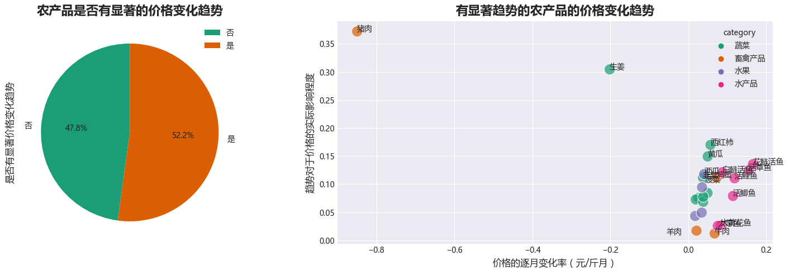

### 代码单元 22

```python
plot_ts(products=["生姜","西红柿","西瓜"])
```

**图表输出 1**

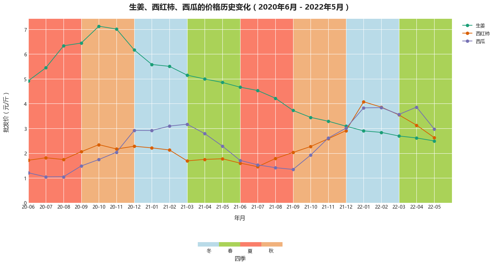
