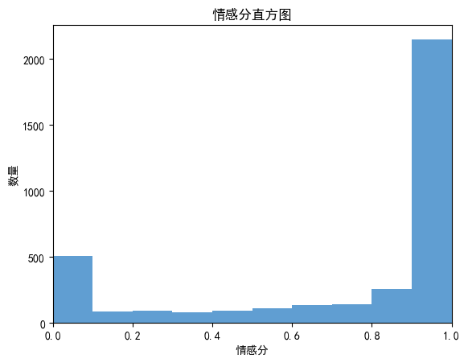
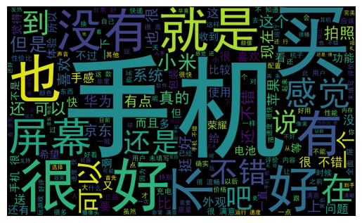
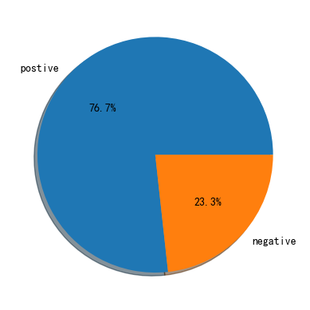

# 京东评论数据情感分析：从关键词、词云和情绪倾向看产品体验

## 摘要

| 模块     | 内容                                                         |
| -------- | ------------------------------------------------------------ |
| 业务场景 | 电商                                                         |
| 数据来源 | 京东商品评论数据，包含评论文本和相关评价信息。               |
| 分析方法 | 中文分词、停用词处理、关键词提取、情感倾向分析、词云可视化。 |
| 结论先行 | 高频词可以快速呈现用户关注点，例如价格、物流、包装、质量和售后。 |

本报告围绕“业务背景、分析目的、数据说明、分析思路、分析过程、核心结论和改进建议”展开，目标是用数据回答具体问题，并把分析结果转化为可执行的判断。

## 一、分析背景

评论文本是电商平台最直接的用户反馈。相比只看评分，文本分析能定位用户满意和不满的具体原因，帮助商品运营、客服和供应链优化。

## 二、分析目的

本次分析主要回答以下问题：

- 文本中用户最关注的主题和关键词是什么？
- 正负向反馈分别集中在哪些具体问题上？
- 这些文本信号能沉淀成哪些产品、运营或服务改进动作？

先明确分析目的，再开展数据处理和指标拆解，可以保证报告围绕问题展开，而不是简单罗列代码和图表。

## 三、数据来源与指标说明

| 项目           | 说明                                                         |
| -------------- | ------------------------------------------------------------ |
| 数据来源       | 京东商品评论数据，包含评论文本和相关评价信息。               |
| 分析工具与方法 | 中文分词、停用词处理、关键词提取、情感倾向分析、词云可视化。 |
| 重点分析指标   | 文本样本量、分词结果、关键词、词频、情感倾向、正负向主题和典型问题。 |
| 数据口径       | 本文以项目数据集中的字段为分析范围，先完成缺失值、异常值、重复值或类别字段处理，再围绕核心指标做统计、可视化或建模。 |

数据口径会直接影响分析结论，因此报告先说明数据范围、核心指标和处理方式，便于读者理解结论的适用边界。

## 四、分析思路

| 步骤                | 目的                                                         |
| ------------------- | ------------------------------------------------------------ |
| 1. 明确业务问题     | 确定分析要回答什么，以及结论会影响什么决策。                 |
| 2. 数据读取与清洗   | 处理缺失、重复、异常和字段格式问题，保证分析基础可靠。       |
| 3. 指标拆解与可视化 | 从趋势、结构、对比、分布或空间维度观察数据现象。             |
| 4. 建模或深度分析   | 根据项目需要完成聚类、预测、分类、回归、文本分析或可视化大屏。 |
| 5. 输出结论与建议   | 把数据发现翻译成业务语言，并给出可执行的下一步动作。         |

本项目的具体分析路径如下：

- 先明确文本分析目标：是识别用户关注点、判断情绪倾向，还是提取岗位/产品关键词。
- 对文本做清洗、分词和停用词过滤，减少无意义词对结果的干扰。
- 通过词频、关键词、词云或情感模型提炼主要信息。
- 结合业务场景解释文本结果，避免只停留在高频词罗列。
- 把文本洞察沉淀成标签、问题清单或运营建议。

## 五、数据处理过程

本项目的数据处理主要包括以下环节：

- 读取原始数据，检查字段类型、样本规模和基础统计信息。
- 处理缺失值、重复值、异常值或文本噪声，保证后续统计和建模结果可靠。
- 根据分析目标构造必要指标、标签或特征，并统一字段口径。
- 按业务维度进行分组、聚合、可视化或模型训练，为结论提供依据。

## 六、数据分析与结果

本部分按照“分析发现 -> 结果解读”的方式组织，重点说明数据体现出的现象及其业务含义。

### 1. 高频词可以快速呈现用户关注点，例如价格、物流、包装、质量和售后。

结果解读：该发现是本项目最核心的结论之一，说明数据中存在值得关注的结构性特征。对应图表或模型结果应围绕这一判断展开，帮助读者理解结论来源。

### 2. 负面评论词云更适合用于问题发现，因为它能聚焦影响购买决策的痛点。

结果解读：该发现进一步解释了不同维度之间的差异。对业务决策而言，重点不只是看到差异，而是判断差异来自哪些对象、场景或指标。

### 3. 情感分析要结合业务语境，部分词在不同品类中含义不同，不能只依赖通用词典。

结果解读：该发现可以作为后续优化策略或模型改进的依据。若用于真实业务，还需要结合成本、资源、实验结果或线上反馈继续验证。

## 七、结论

综合以上分析，可以得到以下结论：

- 高频词可以快速呈现用户关注点，例如价格、物流、包装、质量和售后。
- 负面评论词云更适合用于问题发现，因为它能聚焦影响购买决策的痛点。
- 情感分析要结合业务语境，部分词在不同品类中含义不同，不能只依赖通用词典。

## 八、建议

- 行动 1：运营侧应把负面关键词沉淀为问题标签，并追踪问题出现频率的变化。
- 行动 2：商品详情页可强化正向高频卖点，客服和供应链则优先处理负向高频问题。
- 行动 3：后续可使用监督学习或大模型做方面级情感分析，细分到物流、价格、质量和服务。
- 跟进方式：为每条建议绑定一个可观察指标，后续按周或按月复盘效果。

建议部分应结合具体对象、执行动作和复盘指标，避免停留在泛泛的“加强管理”或“优化运营”。

## 九、局限性与改进方向

- 项目价值：把非结构化文本转化为可统计的问题标签和情绪信号，帮助业务更快定位用户关注点和负面体验。
- 真实限制：评论数据容易受到刷评、极端评价、促销节点和沉默用户影响，文本情绪不能完全代表全部购买人群真实体验。
- 业务风险：如果只按高频词处理问题，可能忽略低频但高损害的质量、售后或安全问题，需要结合退款、投诉和复购数据验证。
- 改进方向：建立人工抽检样本集，评估分词、情感判断和主题归类是否符合业务语境。
- 改进方向：把文本标签与订单、退款、投诉、复购或客服工单关联，验证文本问题对经营结果的影响。
- 改进方向：补充价格、库存、优惠、曝光、退款和复购数据，把短期转化与长期用户价值结合起来评估。

## 附录：完整代码与输出结果

下面内容按原 notebook 的代码单元顺序整理。如果代码单元产生了文本输出或图片输出，也一并附在对应代码后面，便于复现完整分析过程。

### 代码单元 1

```python
import pandas as pd
data = pd.read_csv('./京东评论数据.csv')
data.head(2)
```

**文本输出**

```text
sku_id                                   _id item_name   comment_id  \
0  7534113  03b51aa9-2b5e-41c3-a40b-343164a1d23a   comment  11801751173   
1  7534113  03b51aa9-2b5e-41c3-a40b-343164a1d23a   comment  11525358140   

                                             content        creation_time  \
0                                 还可以刷脸解锁，帮朋友买的，她很满意  2018-08-13 12:24:59   
1  第一次买vivo，真心不错，1498的机子，没想到照相很清晰，性价比很高，买值了，还送了小音...  2018-05-27 17:49:17   

   reply_count  score  useful_vote_count  useless_vote_count  ...  \
0            0      5                  0                   0  ...   
1            7      5                 19                   0  ...   

   user_province  nickname user_level_name user_client  user_client_show  \
0            NaN     k***0          PLUS会员           2     来自京东iPhone客户端   
1            NaN     呢***呐          PLUS会员           4    来自京东Android客户端   

  is_mobile  days       reference_time after_days  after_user_comment  
0       1.0   4.0  2018-08-09 13:38:15        0.0          NO_MESSAGE  
1       1.0   5.0  2018-05-22 09:32:37        0.0          NO_MESSAGE  

[2 rows x 21 columns]
```

### 代码单元 2

```python
data.describe()
```

**文本输出**

```text
sku_id    comment_id  reply_count        score  \
count  3.637000e+03  3.637000e+03  3637.000000  3637.000000   
mean   7.936312e+09  1.161979e+10     6.291724     4.880946   
std    1.165137e+10  2.520618e+08    41.624571     0.591341   
min    1.592994e+06  1.045844e+10     0.000000     1.000000   
25%    5.920651e+06  1.155459e+10     0.000000     5.000000   
50%    7.651903e+06  1.174154e+10     0.000000     5.000000   
75%    2.034912e+10  1.178850e+10     1.000000     5.000000   
max    3.032369e+10  1.180889e+10  1355.000000     5.000000   

       useful_vote_count  useless_vote_count  user_level_id  user_province  \
count        3637.000000              3637.0    3637.000000            0.0   
mean           13.532307                 0.0      75.692329            NaN   
std            72.564442                 0.0      21.125683            NaN   
min             0.000000                 0.0      50.000000            NaN   
25%             0.000000                 0.0      61.000000            NaN   
50%             0.000000                 0.0      62.000000            NaN   
75%             2.000000                 0.0     105.000000            NaN   
max          2318.000
... 输出过长，博客中已截断
```

### 代码单元 3

```python
#取出sku_id','content'字段
data1 = data[['sku_id','content']]
data1.head(10)
```

**文本输出**

```text
sku_id                                            content
0  7534113                                 还可以刷脸解锁，帮朋友买的，她很满意
1  7534113  第一次买vivo，真心不错，1498的机子，没想到照相很清晰，性价比很高，买值了，还送了小音...
2  7534113                                         手机好用快递送的快。
3  8240587  手机收到。外观设计很好！美观大方。我喜欢！一直使用华为手机。从荣耀七，荣耀八，荣耀九。反正一...
4  5942439                  收到了，挺好的，声音大，电池大，好用发货速度快，非常满意，好好好。
5  5089275  本来觉得双十一还会便宜的，想不到和11月初的价格差不多，想想还是感觉入手了，早买早享受。我的...
6  7081550  没有真正意义上的窄边框，不过已经不错了，手机流畅，另外还有51G空间可用，同时试了下近距拍摄...
7  5663902                       幻夜黑颜色很漂亮，2.5D屏幕，圆润。2K屏很清晰，惊艳
8  7283905  特地用了一段时间才来评价，这手机值得这个价钱，打游戏还行，就是电池很不耐用，摄像头也很突出，...
9  5001213  机器没得说，价格也合理，虽说仍有不足，但还是比较满意的，首发就抢到了，暂时发现的不足就是扬声...
```

### 代码单元 4

```python
#安装snownlp包
```

**文本输出**

```text
Looking in indexes: https://pypi.tuna.tsinghua.edu.cn/simple
Collecting snownlp
  Downloading https://pypi.tuna.tsinghua.edu.cn/packages/3d/b3/37567686662100d3bce62d3b0f2adec18ab4b9ff2b61abd7a61c39343c1d/snownlp-0.12.3.tar.gz (37.6 MB)
     ---------------------------------------- 37.6/37.6 MB 3.1 MB/s eta 0:00:00
  Preparing metadata (setup.py): started
  Preparing metadata (setup.py): finished with status 'done'
Building wheels for collected packages: snownlp
  Building wheel for snownlp (setup.py): started
  Building wheel for snownlp (setup.py): finished with status 'done'
  Created wheel for snownlp: filename=snownlp-0.12.3-py3-none-any.whl size=37760953 sha256=400f03511ccda3443b1a0c80aa51754ac9840c0a2e37c47eadb04472268b8d67
  Stored in directory: c:\users\administrator\appdata\local\pip\cache\wheels\e3\39\48\6bf6f2fdb44ab1aeb2bbbc27b79941ff05d39d181fdaad0fb5
Successfully built snownlp
Installing collected packages: snownlp
Successfully installed snownlp-0.12.3
[notice] A new release of pip available: 22.3.1 -> 23.0
[notice] To update, run: python.exe -m pip install --upgrade pip
```

### 代码单元 5

```python
from snownlp import SnowNLP
data1['emotion'] = data1['content'].apply(lambda x:SnowNLP(x).sentiments)
data1.head(10)
```

**文本输出**

```text
C:\Users\Administrator\AppData\Local\Temp\2\ipykernel_14348\3076741958.py:2: SettingWithCopyWarning: 
A value is trying to be set on a copy of a slice from a DataFrame.
Try using .loc[row_indexer,col_indexer] = value instead

See the caveats in the documentation: https://pandas.pydata.org/pandas-docs/stable/user_guide/indexing.html#returning-a-view-versus-a-copy
  data1['emotion'] = data1['content'].apply(lambda x:SnowNLP(x).sentiments)
sku_id                                            content   emotion
0  7534113                                 还可以刷脸解锁，帮朋友买的，她很满意  0.470635
1  7534113  第一次买vivo，真心不错，1498的机子，没想到照相很清晰，性价比很高，买值了，还送了小音...  0.999999
2  7534113                                         手机好用快递送的快。  0.561609
3  8240587  手机收到。外观设计很好！美观大方。我喜欢！一直使用华为手机。从荣耀七，荣耀八，荣耀九。反正一...  0.868183
4  5942439                  收到了，挺好的，声音大，电池大，好用发货速度快，非常满意，好好好。  0.983088
5  5089275  本来觉得双十一还会便宜的，想不到和11月初的价格差不多，想想还是感觉入手了，早买早享受。我的...  0.984574
6  7081550  没有真正意义上的窄边框，不过已经不错了，手机流畅，另外还有51G空间可用，同时试了下近距拍摄...  0.956682
7  5663902                       幻夜黑颜色很漂亮，2.5D屏幕，圆润。2K屏很清晰，惊艳  0.999839
8  7283905  特地用了一段时间才来评价，这手机值得这个价钱，打游戏还行，就是电池很不耐用，摄像头也很突出，...  0.996540
9  5001213  机器没得说，价格也合理，虽说仍有不足，但还是比较满意的，首发就
... 输出过长，博客中已截断
```

### 代码单元 6

```python
data1.describe()
```

**文本输出**

```text
sku_id      emotion
count  3.637000e+03  3637.000000
mean   7.936312e+09     0.746161
std    1.165137e+10     0.354481
min    1.592994e+06     0.000000
25%    5.920651e+06     0.562240
50%    7.651903e+06     0.962449
75%    2.034912e+10     0.999123
max    3.032369e+10     1.000000
```

### 代码单元 7

```python
#情感分直方图
import matplotlib.pyplot as plt
import numpy as np

plt.rcParams['font.sans-serif']=['SimHei']
plt.rcParams['axes.unicode_minus'] = False

bins=np.arange(0,1.1,0.1)
plt.hist(data1['emotion'],bins,color='#4F94CD',alpha=0.9)
plt.xlim(0,1)
plt.xlabel('情感分')
plt.ylabel('数量')
plt.title('情感分直方图')

plt.show()
```

**图表输出 1**



### 代码单元 8

```python
from wordcloud import WordCloud
import jieba
w = WordCloud()
text = ''
for s in data['content']:
    text += s
data_cut = ' '.join(jieba.lcut(text))

w = WordCloud(font_path="./SimHei.ttf",
                      stopwords=['的','我','了','是','和','都','就','用'],  # 去掉停用词
                      #max_words=100,
                      width=2000,
                      height=1200).generate(data_cut)
# 保存词云
w.to_file('词云图.png')
# 显示词云文件
plt.imshow(w)
plt.axis("off")
plt.show()
```

**文本输出**

```text
Building prefix dict from the default dictionary ...
Loading model from cache C:\Users\ADMINI~1\AppData\Local\Temp\2\jieba.cache
Loading model cost 1.096 seconds.
Prefix dict has been built successfully.
```

**图表输出 1**



### 代码单元 9

```python
#关键词top10
from jieba import analyse
key_words = jieba.analyse.extract_tags(sentence=text, topK=10, withWeight=True, allowPOS=())
key_words
```

**文本输出**

```text
[('手机', 0.20904023041744998),
 ('不错', 0.10491967558213072),
 ('京东', 0.09431019624843097),
 ('屏幕', 0.054966423247022445),
 ('华为', 0.05061411737589104),
 ('小米', 0.04731076382922812),
 ('拍照', 0.04647606302614274),
 ('非常', 0.044200923839597485),
 ('手感', 0.04270424332006433),
 ('感觉', 0.040063432512755605)]
```

### 代码单元 10

```python
#计算积极评论与消极评论各自的数目
pos = 0
neg = 0
for i in data1['emotion']:
    if i >= 0.5:
        pos += 1
    else:
        neg += 1
print('积极评论，消极评论数目分别为：',pos,neg)
```

**文本输出**

```text
积极评论，消极评论数目分别为： 2791 846
```

### 代码单元 11

```python
# 积极评论占比
import matplotlib.pyplot as plt

plt.rcParams['font.sans-serif']=['SimHei']
plt.rcParams['axes.unicode_minus'] = False

pie_labels='postive','negative'
plt.pie([pos,neg],labels=pie_labels,autopct='%1.1f%%',shadow=True)

plt.show()
```

**图表输出 1**



### 代码单元 12

```python
#获取消极评论数据
data2=data1[data1['emotion']<0.5]
data2.head(10)
```

**文本输出**

```text
sku_id                                            content   emotion
0   7534113                                 还可以刷脸解锁，帮朋友买的，她很满意  0.470635
13  5942439                       收到货，声音很大，功能也多，适合老人用，就是重量有点重，  0.461794
17  7283905  27号下的单，今天收到1星期内，坐标河南商丘，手机是武汉仓过来的。充电头是5V2A的 不支持...  0.001627
18  5001213  今天刚收到！\n看到京东的快递包装盒，我内心是一群奔腾而过的！几千块钱的物品包装，没有防压提...  0.495955
22  5942439                         用着目前还可以，就是不知道可以用多久。希望久一些吧。  0.239150
32  5001213  第一批抢到，两天后才收到，机器没一代惊艳，边框略粗，全面屏？解决了通话，回归正常手机行列！！...  0.444317
35  8240587  总体来说，颜值非常高，很好看，虽然说是后置指纹，但是后背看起来还是挺不错的。用起来整体体验还...  0.000012
44  3901175  手机还可以，就刚开始把卡放进去的时候不显示卡，过了第二天才显示出来，耳机也没有，还有就是怎么...  0.005839
48  7534113          像素不行，反正买都买了用都用了总体来说还行吧不讨厌也不喜欢一般般，暂时没有什么问题  0.499447
51  5089275  总之还是挺好的，挺不错、虽然没有什么优惠吧，抢了个神券还不能用！！！也是用的上了第三个苹果、...  0.457264
```

### 代码单元 13

```python
#消极评论词云图
text2 = ''
for s in data2['content']:
    text2 += s
data_cut2 = ' '.join(jieba.lcut(text2))
w.generate(data_cut2)
image = w.to_file('消极评论词云.png')

# 显示词云文件
plt.imshow(w)
plt.axis("off")
plt.show()
```

**图表输出 1**


### 代码单元 14

```python
#消极评论关键词top10
key_words = jieba.analyse.extract_tags(sentence=text2, topK=10, withWeight=True, allowPOS=())
key_words
```

**文本输出**

```
[('手机', 0.19237764869875004),
 ('京东', 0.08930157104159077),
 ('未填写', 0.08087213276666493),
 ('评价', 0.06602737843353074),
 ('屏幕', 0.05285184715212572),
 ('快递', 0.050103021155518554),
 ('用户', 0.05005720904465942),
 ('充电', 0.04605195695403029),
 ('收到', 0.038929704221495554),
 ('没有', 0.03758001077768642)]
```

