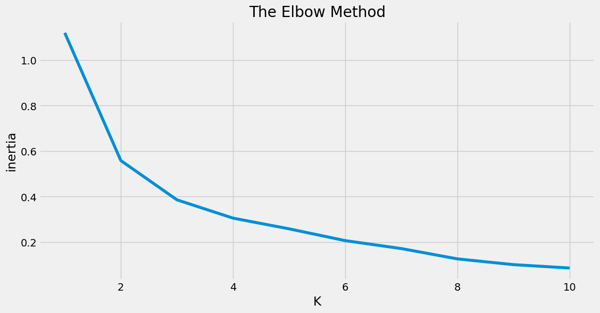
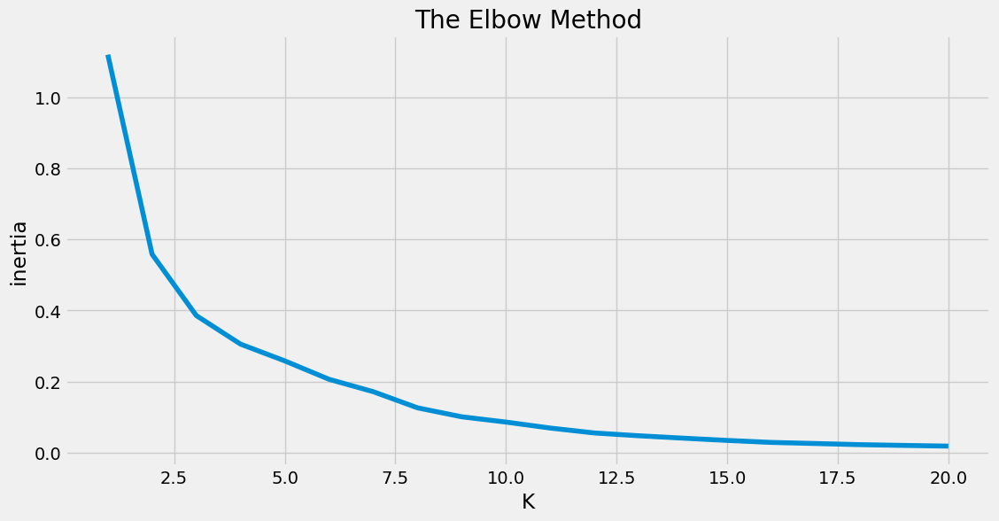

# 优衣库门店可视化与顾客分组：用地图和聚类理解线下零售

## 摘要

| 模块     | 内容                                                         |
| -------- | ------------------------------------------------------------ |
| 业务场景 | 电商                                                         |
| 数据来源 | 优衣库门店与顾客拜访数据，包含门店地理分布、访问行为和相关消费特征。 |
| 分析方法 | 地图可视化、门店分布分析、K-Means 顾客分组、可视化大屏。     |
| 结论先行 | 门店分布通常与城市商业中心、人口密度和消费能力相关。         |

本报告围绕“业务背景、分析目的、数据说明、分析思路、分析过程、核心结论和改进建议”展开，目标是用数据回答具体问题，并把分析结果转化为可执行的判断。

## 一、分析背景

线下零售的增长依赖门店布局、客流结构和顾客运营。地图展示解决空间认知，聚类分析解决顾客差异化运营。

## 二、分析目的

本次分析主要回答以下问题：

- 不同客户、渠道或门店能否按业务价值拆成清晰分组？
- 每一类群体的核心画像是什么？
- 不同分组应该配置什么差异化运营策略？

先明确分析目的，再开展数据处理和指标拆解，可以保证报告围绕问题展开，而不是简单罗列代码和图表。

## 三、数据来源与指标说明

| 项目           | 说明                                                         |
| -------------- | ------------------------------------------------------------ |
| 数据来源       | 优衣库门店与顾客拜访数据，包含门店地理分布、访问行为和相关消费特征。 |
| 分析工具与方法 | 地图可视化、门店分布分析、K-Means 顾客分组、可视化大屏。     |
| 重点分析指标   | 分群指标、标准化结果、聚类类别、各类群体均值、群体规模和业务价值。 |
| 数据口径       | 本文以项目数据集中的字段为分析范围，先完成缺失值、异常值、重复值或类别字段处理，再围绕核心指标做统计、可视化或建模。 |

数据口径会直接影响分析结论，因此报告先说明数据范围、核心指标和处理方式，便于读者理解结论的适用边界。

## 四、分析思路

| 步骤                | 目的                                                         |
| ------------------- | ------------------------------------------------------------ |
| 1. 明确业务问题     | 确定分析要回答什么，以及结论会影响什么决策。                 |
| 2. 数据读取与清洗   | 处理缺失、重复、异常和字段格式问题，保证分析基础可靠。       |
| 3. 指标拆解与可视化 | 从趋势、结构、对比、分布或空间维度观察数据现象。             |
| 4. 建模或深度分析   | 根据项目需要完成聚类、预测、分类、回归、文本分析或可视化大屏。 |
| 5. 输出结论与建议   | 把数据发现翻译成业务语言，并给出可执行的下一步动作。         |

本项目的具体分析路径如下：

- 先定义分群目的：明确是为了识别高价值客户、优化广告预算，还是支持门店/会员运营。
- 选择能代表业务质量的指标：例如频次、金额、最近行为、转化效率、成本或贡献度。
- 对指标做标准化处理，避免量纲较大的变量主导聚类结果。
- 使用 K-Means 等方法得到分群，并回看每一类的指标均值和业务画像。
- 将分群结果转成运营策略：不同客群给出差异化触达、预算、权益或维护动作。

## 五、数据处理过程

本项目的数据处理主要包括以下环节：

- 读取原始数据，检查字段类型、样本规模和基础统计信息。
- 处理缺失值、重复值、异常值或文本噪声，保证后续统计和建模结果可靠。
- 根据分析目标构造必要指标、标签或特征，并统一字段口径。
- 按业务维度进行分组、聚合、可视化或模型训练，为结论提供依据。

## 六、数据分析与结果

本部分按照“分析发现 -> 结果解读”的方式组织，重点说明数据体现出的现象及其业务含义。

### 1. 门店分布通常与城市商业中心、人口密度和消费能力相关。

结果解读：该发现是本项目最核心的结论之一，说明数据中存在值得关注的结构性特征。对应图表或模型结果应围绕这一判断展开，帮助读者理解结论来源。

### 2. 顾客分组可以帮助门店识别高频客、潜力客和低活跃客。

结果解读：该发现进一步解释了不同维度之间的差异。对业务决策而言，重点不只是看到差异，而是判断差异来自哪些对象、场景或指标。

### 3. 线下数据分析需要把地理位置和消费行为结合，单独看销售额容易遗漏客流质量。

结果解读：该发现可以作为后续优化策略或模型改进的依据。若用于真实业务，还需要结合成本、资源、实验结果或线上反馈继续验证。

## 七、结论

综合以上分析，可以得到以下结论：

- 门店分布通常与城市商业中心、人口密度和消费能力相关。
- 顾客分组可以帮助门店识别高频客、潜力客和低活跃客。
- 线下数据分析需要把地理位置和消费行为结合，单独看销售额容易遗漏客流质量。

## 八、建议

- 行动 1：门店运营可按顾客分群设计会员券、搭配推荐和新品触达策略。
- 行动 2：选址分析应补充商圈客流、竞品门店、交通可达性和租金成本。
- 行动 3：可视化大屏适合管理层巡检，但一线运营更需要可执行的门店清单和行动建议。
- 跟进方式：为每条建议绑定一个可观察指标，后续按周或按月复盘效果。

建议部分应结合具体对象、执行动作和复盘指标，避免停留在泛泛的“加强管理”或“优化运营”。

## 九、局限性与改进方向

- 项目价值：把客户、渠道或门店从平均视角拆成不同群体，使运营资源可以按价值、潜力和风险差异化配置。
- 真实限制：商品、用户和渠道指标会受到促销周期、库存、价格带和平台流量分配影响，单次分析无法完全代表长期经营规律。
- 业务风险：只看销量、点击或转化等单点指标，可能牺牲毛利、复购和用户质量，需要把 GMV、利润和留存放在一起评估。
- 改进方向：用业务结果回验分群有效性，例如复购、留存、利润、风险或转化，而不是只看聚类轮廓。
- 改进方向：建立分群更新机制，按月或按季度重新计算客户状态，避免用户行为变化后标签失效。
- 改进方向：补充价格、库存、优惠、曝光、退款和复购数据，把短期转化与长期用户价值结合起来评估。

## 附录：完整代码与输出结果

下面内容按原 notebook 的代码单元顺序整理。如果代码单元产生了文本输出或图片输出，也一并附在对应代码后面，便于复现完整分析过程。

### 代码单元 1

```python
#读取不含经纬度信息的拜访数据

import pandas as pd

data = pd.read_csv('./uniqlo.csv')
data.head()
```

**文本输出**

```text
姓名  剩余拜访次数           地址
0   余杭       1     优衣库南京西路店
1  沈一苇       2  优衣库浦东商场成山路店
2  杨舒琦       1    优衣库大拇指广场店
3   罗丹       1   优衣库宝山万达广场店
4   刘远       2      优衣库光启城店
```

### 代码单元 2

```python
#查看数据形状

data.shape
```

**文本输出**

```text
(80, 3)
```

### 代码单元 3

```python
#检查各列有无缺失值

data.isnull().sum()
```

**文本输出**

```text
姓名        0
剩余拜访次数    0
地址        0
dtype: int64
```

### 代码单元 4

```python
#检查各列独立元素的数目

print('姓名数目为：',data['姓名'].nunique())
print('剩余拜访次数枚举值为：',data['剩余拜访次数'].unique())
print('地址数目为：',data['地址'].nunique())
```

**文本输出**

```text
姓名数目为： 80
剩余拜访次数枚举值为： [1 2 3]
地址数目为： 73
```

### 代码单元 5

```python
#读取含详细地址的数据

data = pd.read_csv('./uniqlo1.csv')
data.head()
```

**文本输出**

```text
姓名  剩余拜访次数           地址          详细地址
0   余杭       1     优衣库南京西路店    上海市黄浦区南京西路
1  沈一苇       2  优衣库浦东商场成山路店    上海市浦东新区成山路
2  杨舒琦       1    优衣库大拇指广场店    上海市浦东新区芳甸路
3   罗丹       1   优衣库宝山万达广场店  上海市宝山区一二八纪念路
4   刘远       2      优衣库光启城店     上海市徐汇区宜山路
```

### 代码单元 6

```python
#安装geopy包,并指定清华源下载

print('-'*60)
print('geopy包安装完成！')
```

**文本输出**

```text
Looking in indexes: https://pypi.tuna.tsinghua.edu.cn/simple/
Requirement already satisfied: geopy in c:\users\administrator\envs\jv\lib\site-packages (2.3.0)
Requirement already satisfied: geographiclib<3,>=1.52 in c:\users\administrator\envs\jv\lib\site-packages (from geopy) (2.0)
------------------------------------------------------------
geopy包安装完成！
```

### 代码单元 7

```python
# #根据详细地址获取经纬度

# # 速度较慢，可直接读取经纬度解析完成的数据uniqlo2.csv

# import warnings
# warnings.filterwarnings('ignore')

# from geopy.geocoders import Nominatim
# geolocator = Nominatim(user_agent='Mozilla/5.0(Windows NT 10.0;WOW64)ApplewebKit/537.36(KHTML,like Gecko)Chrome/55.0.2883.75 Safari/537.36')

# from geopy.extra.rate_limiter import RateLimiter
# geocode = RateLimiter(geolocator.geocode, min_delay_seconds=1)

# #获取location
# data['location'] = data['详细地址'].apply(geocode)

# #获取经度
# data['经度'] = data['location'].apply(lambda loc: loc.longitude if loc else None)

# #获取纬度
# data['纬度'] = data['location'].apply(lambda loc: loc.latitude if loc else None)

# print('经纬度解析完成！')
```

### 代码单元 8

```python
# data.head()
```

### 代码单元 9

```python
#读取含经纬度的地点数据

data2 = pd.read_csv('./uniqlo2.csv')
data2.head()
```

**文本输出**

```text
姓名  剩余拜访次数           地址              详细地址          经度         纬度
0   余杭       1     优衣库南京西路店    上海市静安区南京西路969号  121.465285  31.235748
1  沈一苇       2  优衣库浦东商场成山路店    上海市浦东新区成山路500号  121.513909  31.177723
2  杨舒琦       1    优衣库大拇指广场店    上海市浦东新区芳甸路199弄  121.566506  31.233415
3   罗丹       1   优衣库宝山万达广场店  上海市宝山区一二八纪念路988弄  121.452854  31.330385
4   刘远       2      优衣库光启城店     上海市徐汇区宜山路455号  121.434446  31.190694
```

### 代码单元 10

```python
#根据地址字段筛选出含'优衣库'的数据行

uniqlo = data2[data2['地址'].str.contains('优衣库')]
uniqlo.head()
```

**文本输出**

```text
姓名  剩余拜访次数           地址              详细地址          经度         纬度
0   余杭       1     优衣库南京西路店    上海市静安区南京西路969号  121.465285  31.235748
1  沈一苇       2  优衣库浦东商场成山路店    上海市浦东新区成山路500号  121.513909  31.177723
2  杨舒琦       1    优衣库大拇指广场店    上海市浦东新区芳甸路199弄  121.566506  31.233415
3   罗丹       1   优衣库宝山万达广场店  上海市宝山区一二八纪念路988弄  121.452854  31.330385
4   刘远       2      优衣库光启城店     上海市徐汇区宜山路455号  121.434446  31.190694
```

### 代码单元 11

```python
#一共筛选出了多少条数据

uniqlo.shape
```

**文本输出**

```text
(44, 6)
```

### 代码单元 12

```python
#去重后的门店数

uniqlo['地址'].nunique()
```

**文本输出**

```text
40
```

### 代码单元 13

```python
#40个门店分别是哪些

uniqlo['地址'].unique()
```

**文本输出**

```text
array(['优衣库南京西路店', '优衣库浦东商场成山路店', '优衣库大拇指广场店', '优衣库宝山万达广场店', '优衣库光启城店',
       '优衣库西郊百联店', '优衣库日月光店', '优衣库曹安公路店', '优衣库安亭嘉亭荟店', '优衣库太平洋不夜城店',
       '优衣库浦东中房金谊广场', '优衣库南京东路第一百货店', '优衣库淮海路太平洋店', '优衣库百联南桥店',
       '优衣库开元地中海店', '优衣库金山百联店', '优衣库我格广场店', '优衣库江桥万达店', '优衣库大悦城店',
       '优衣库成山路巴黎春天店', '优衣库宝山巴黎春天店', '优衣库莲花国际广场店', '优衣库七宝凯德店', '优衣库金桥店',
       '优衣库塘桥巴黎春天店', '优衣库永新城店', '优衣库百联中环店', '优衣库龙之梦店', '优衣库陕西路巴黎春天店',
       '优衣库大宁国际店', '优衣库新梅联合广场店', '优衣库五角场店', '优衣库正大广场店', '优衣库港汇广场店',
       '优衣库南京东路中联店', '优衣库莘庄仲盛店', '优衣库五角场又一城店', '优衣库上海长泰广场店', '优衣库正大乐城店',
       '优衣库闵行浦江镇店'], dtype=object)
```

### 代码单元 14

```python
#获取40个门店的名称及经纬度数据

import numpy as np

uniqlo = uniqlo.groupby('地址',as_index=False).agg({'剩余拜访次数':sum,'经度':np.mean,'纬度':np.mean})
uniqlo.head()
```

**文本输出**

```text
地址  剩余拜访次数          经度         纬度
0    优衣库七宝凯德店       2  121.348318  31.171320
1  优衣库上海长泰广场店       3  121.607512  31.210366
2  优衣库五角场又一城店       2  121.521831  31.307534
3     优衣库五角场店       1  121.520314  31.306632
4     优衣库光启城店       2  121.434446  31.190694
```

### 代码单元 15

```python
#使用pyecharts中的Geo类绘制散点图

from pyecharts.charts import Geo
from pyecharts import options as opts
from pyecharts.globals import GeoType

city = '上海'

#实例化一个Geo类
geo = Geo()
#以上海市地图为底景
geo.add_schema(maptype=city)
# #添加地点坐标至坐标库中
for i in range(40):
    geo.add_coordinate(uniqlo.iloc[i]['地址'],uniqlo.iloc[i]['经度'],uniqlo.iloc[i]['纬度'])

data_pair = [(uniqlo.iloc[i]['地址'],int(uniqlo.iloc[i]['剩余拜访次数'])) for i in range(40)]
    
# 将数据添加到地图上
geo.add('',data_pair,type_=GeoType.EFFECT_SCATTER, symbol_size=9)
# 设置样式
geo.set_series_opts(label_opts=opts.LabelOpts(is_show=False))
#自定义分级
pieces = [
        {'min': 0, 'max': 1, 'label': '1', 'color': '#50A3BA'},
        {'min': 1, 'max': 2, 'label': '2', 'color': '#DD675E'},
        {'min': 2, 'max': 3, 'label': '3', 'color': '#E2C568'},
        {'min': 3, 'label': '4', 'color': '#3700A4'}
]
#是否自定义分段
geo.set_global_opts(
        visualmap_opts=opts.VisualMapOpts(is_piecewise=True, pieces=pieces),
        title_opts=opts.TitleOpts(title='上海市优衣库门店可视化'),
    )
    
geo.render_notebook()
```

### 代码单元 16

```python
city = '上海'

#实例化一个Geo类
geo2 = Geo()
#以上海市地图为底景
geo2.add_schema(maptype=city)
# #添加地点坐标至坐标库中
for i in range(40):
    geo2.add_coordinate(uniqlo.iloc[i]['地址'],uniqlo.iloc[i]['经度'],uniqlo.iloc[i]['纬度'])

data_pair = [(uniqlo.iloc[i]['地址'],int(uniqlo.iloc[i]['剩余拜访次数'])) for i in range(40)]
    
# 将数据添加到地图上
geo2.add('',data_pair,type_=GeoType.HEATMAP, symbol_size=5)
# 设置样式
geo2.set_series_opts(label_opts=opts.LabelOpts(is_show=False))

#自定义分级
pieces = [
        {'min': 0, 'max': 1, 'label': '1', 'color': '#50A3BA'},
        {'min': 1, 'max': 2, 'label': '2', 'color': '#E2C568'},
        {'min': 2, 'max': 3, 'label': '3', 'color': '#DD675E'},
        {'min': 3, 'label': '4', 'color': '#DD0200'}
]
#是否自定义分段
geo2.set_global_opts(
        visualmap_opts=opts.VisualMapOpts(is_piecewise=True, pieces=pieces),
        title_opts=opts.TitleOpts(title='上海市优衣库门店可视化'),
    )
    
geo2.render_notebook()
```

### 代码单元 17

```python
#拜访地点数据获取

visit = data2[['地址','经度','纬度']]
visit.head()
```

**文本输出**

```text
地址          经度         纬度
0     优衣库南京西路店  121.465285  31.235748
1  优衣库浦东商场成山路店  121.513909  31.177723
2    优衣库大拇指广场店  121.566506  31.233415
3   优衣库宝山万达广场店  121.452854  31.330385
4      优衣库光启城店  121.434446  31.190694
```

### 代码单元 18

```python
#使用KMeans算法将拜访数据分为8组

from sklearn.cluster import KMeans

kmeans = KMeans(n_clusters=8,
init='k-means++',)

X = visit[['经度','纬度']]
y = [0,1,2,3,4,5,6,7]
kmeans.fit(X,y)
y_pred = kmeans.predict(X)

y_pred
```

**文本输出**

```text
C:\Users\Administrator\Envs\jv\lib\site-packages\sklearn\cluster\_kmeans.py:870: FutureWarning: The default value of `n_init` will change from 10 to 'auto' in 1.4. Set the value of `n_init` explicitly to suppress the warning
  warnings.warn(
array([1, 0, 0, 4, 1, 3, 1, 3, 7, 1, 0, 1, 1, 5, 6, 2, 1, 3, 1, 0, 1, 3,
       3, 0, 0, 1, 3, 4, 1, 4, 0, 4, 1, 1, 1, 3, 4, 0, 1, 0, 1, 0, 1, 1,
       4, 0, 1, 4, 1, 1, 1, 1, 1, 1, 1, 4, 2, 4, 1, 4, 4, 4, 1, 1, 1, 4,
       1, 1, 4, 1, 1, 1, 1, 1, 3, 3, 1, 4, 1, 1])
```

### 代码单元 19

```python
#将各点分组结果添加到数据中

visit_result = visit
visit_result['分组'] = y_pred

visit_result.head()
```

**文本输出**

```text
C:\Users\Administrator\AppData\Local\Temp\2\ipykernel_27036\1956377192.py:4: SettingWithCopyWarning: 
A value is trying to be set on a copy of a slice from a DataFrame.
Try using .loc[row_indexer,col_indexer] = value instead

See the caveats in the documentation: https://pandas.pydata.org/pandas-docs/stable/user_guide/indexing.html#returning-a-view-versus-a-copy
  visit_result['分组'] = y_pred
地址          经度         纬度  分组
0     优衣库南京西路店  121.465285  31.235748   1
1  优衣库浦东商场成山路店  121.513909  31.177723   0
2    优衣库大拇指广场店  121.566506  31.233415   0
3   优衣库宝山万达广场店  121.452854  31.330385   4
4      优衣库光启城店  121.434446  31.190694   1
```

### 代码单元 20

```python
#中心点坐标

center = kmeans.cluster_centers_
center
```

**文本输出**

```text
array([[121.54159609,  31.19906845],
       [121.4622371 ,  31.2227638 ],
       [121.2775555 ,  30.7676925 ],
       [121.37352322,  31.18662689],
       [121.49704807,  31.29351427],
       [121.490514  ,  30.92182   ],
       [121.225779  ,  31.043855  ],
       [121.169161  ,  31.293966  ]])
```

### 代码单元 21

```python
#获取中心点详细地址
import time
from geopy.geocoders import Nominatim
geolocator = Nominatim(user_agent='Mozilla/5.0 (Windows NT 10.0; WOW64) AppleWebKit/537.36 (KHTML, like Gecko) Chrome/80.0.3987.87 Safari/537.36 SE 2.X MetaSr 1.0',
                      timeout=5)
```

### 代码单元 22

```python
# 注意：建议访问速度不要太快，否则报timeout错误
# for x,y in center:
#     print(x,y)
#     location = geolocator.reverse((y,x))
#     print(location.address)
#     time.sleep(1.5)
```

### 代码单元 23

```python
#对不同的K值分别计算误差和

from sklearn.cluster import KMeans

inertia = []
for i in range(1,21):
    
    kmeans = KMeans(n_clusters=i,
    init='k-means++')
    
    X = visit[['经度','纬度']]
    kmeans.fit(X)
    inertia.append(kmeans.inertia_)
    
inertia
```

**文本输出**

```text
C:\Users\Administrator\Envs\jv\lib\site-packages\sklearn\cluster\_kmeans.py:870: FutureWarning: The default value of `n_init` will change from 10 to 'auto' in 1.4. Set the value of `n_init` explicitly to suppress the warning
  warnings.warn(
C:\Users\Administrator\Envs\jv\lib\site-packages\sklearn\cluster\_kmeans.py:870: FutureWarning: The default value of `n_init` will change from 10 to 'auto' in 1.4. Set the value of `n_init` explicitly to suppress the warning
  warnings.warn(
C:\Users\Administrator\Envs\jv\lib\site-packages\sklearn\cluster\_kmeans.py:870: FutureWarning: The default value of `n_init` will change from 10 to 'auto' in 1.4. Set the value of `n_init` explicitly to suppress the warning
  warnings.warn(
C:\Users\Administrator\Envs\jv\lib\site-packages\sklearn\cluster\_kmeans.py:870: FutureWarning: The default value of `n_init` will change from 10 to 'auto' in 1.4. Set the value of `n_init` explicitly to suppress the warning
  warnings.warn(
C:\Users\Administrator\Envs\jv\lib\site-packages\sklearn\cluster\_kmeans.py:870: FutureWarning: The default value of `n_init` will change from 10 to 'auto' in 1.4. Set the value of `n_init` explicitly to suppress the warning
  warni
... 输出过长，博客中已截断
```

### 代码单元 24

```python
#绘制误差和随K值的变化曲线图

import matplotlib.pyplot as plt

plt.style.use('fivethirtyeight')
plt.figure(figsize=(12,6))
plt.plot(range(1,11),inertia[0:10])

plt.title('The Elbow Method')
plt.xlabel('K')
plt.ylabel('inertia')

plt.show()
```

**图表输出 1**



### 代码单元 25

```python
#绘制误差和随K值的变化曲线图

plt.figure(figsize=(12,6))
plt.plot(range(1,21),inertia)

plt.title('The Elbow Method')
plt.xlabel('K')
plt.ylabel('inertia')

plt.show()
```

**图表输出 1**



### 代码单元 26

```python
#使用KMeans算法将拜访数据分为3组

from sklearn.cluster import KMeans

kmeans = KMeans(n_clusters=3,
init='k-means++',)

X = visit[['经度','纬度']]
kmeans.fit(X)
y_pred = kmeans.predict(X)

y_pred
```

**文本输出**

```text
C:\Users\Administrator\Envs\jv\lib\site-packages\sklearn\cluster\_kmeans.py:870: FutureWarning: The default value of `n_init` will change from 10 to 'auto' in 1.4. Set the value of `n_init` explicitly to suppress the warning
  warnings.warn(
array([0, 0, 0, 0, 0, 1, 0, 1, 1, 0, 0, 0, 0, 2, 1, 2, 0, 1, 0, 0, 0, 1,
       1, 0, 0, 0, 1, 0, 0, 0, 0, 0, 0, 0, 0, 1, 0, 0, 0, 0, 0, 0, 0, 0,
       0, 0, 0, 0, 0, 0, 0, 0, 0, 0, 0, 0, 2, 0, 0, 0, 0, 0, 0, 0, 0, 0,
       0, 0, 0, 0, 0, 0, 0, 0, 1, 1, 0, 0, 0, 0])
```

### 代码单元 27

```python
#K=3时拜访数据分组可视化

from pyecharts.charts import Geo
from pyecharts import options as opts
from pyecharts.globals import GeoType

city = '上海'

#实例化一个Geo类
geo3 = Geo()
#以上海市地图为底景
geo3.add_schema(maptype=city)
# #添加地点坐标至坐标库中
for i in range(80):
    geo3.add_coordinate(visit.iloc[i]['地址'],visit.iloc[i]['经度'],visit.iloc[i]['纬度'])

data_pair = [(visit.iloc[i]['地址'],int(y_pred[i])) for i in range(80)]
    
# 将数据添加到地图上
geo3.add('',data_pair,type_=GeoType.EFFECT_SCATTER, symbol_size=9)
# 设置样式
geo3.set_series_opts(label_opts=opts.LabelOpts(is_show=False))
#自定义分级
pieces = [
        {'min': 0, 'max': 0, 'label': '1', 'color': '#50A3BA'},
        {'min': 0, 'max': 1, 'label': '2', 'color': '#DD0200'},
        {'min': 1, 'max': 2, 'label': '3', 'color': '#E2C568'}
]
#是否自定义分段
geo3.set_global_opts(
        visualmap_opts=opts.VisualMapOpts(is_piecewise=True, pieces=pieces),
        title_opts=opts.TitleOpts(title='上海市热门地点分组可视化'),
    )
    
geo3.render_notebook()
```

### 代码单元 28

```python
#获取聚类中心坐标

center_ = kmeans.cluster_centers_
center_
```

**文本输出**

```text
array([[121.48337518,  31.23489423],
       [121.34151355,  31.18340573],
       [121.34854167,  30.81906833]])
```

### 代码单元 29

```python
# 可以到 https://lbs.amap.com/tools/picker 输入经纬度121.48337518,31.23489423查看地图位置

#获取聚类中心点详细地址

# from geopy.geocoders import Nominatim
# geolocator = Nominatim(user_agent='Mozilla/5.0 (Windows NT 10.0; WOW64) AppleWebKit/537.36 (KHTML, like Gecko) Chrome/72.0.3626.81 Safari/537.36 SE 2.X MetaSr 1.0',
#                       timeout=5)

# for i in range(3):
#     location = geolocator.reverse((center_[i][1],center_[i][0]))
#     print(location.address)
#     time.sleep(1.5)
```

### 代码单元 30

```python
from pyecharts.charts import Page
page = Page(layout=Page.DraggablePageLayout, page_title="大屏展示")

page.add(
    geo,
    geo2,
    geo3)
# 先保存到test.html 然后打开，拖拽图片自定义布局， 之后记得点击左上角“save config”对布局文件进行保存。
# 会生成一个chart_config.json的文件，这其中包含了每个图表ID对应的布局位置
page.render('test.html')
```

**文本输出**

```text
'C:\\Users\\Administrator\\cx_xiangmu\\Python数据分析\\上架\\2301-Python数据分析与可视化项目\\电商-优衣库门店可视化与顾客分组-约500行（pyecharts地图可视化、KMeans聚类）\\test.html'
```

### 代码单元 31

```python
# 然后运行下面这行代码。保存布局好的的仪表盘文件。
page.save_resize_html('test.html', cfg_file='chart_config.json', dest='大屏展示1.html')
```
