# 天猫双十一美妆销售分析：从品牌、品类和价格看促销增长

## 摘要

| 模块     | 内容                                                         |
| -------- | ------------------------------------------------------------ |
| 业务场景 | 电商                                                         |
| 数据来源 | 天猫双十一美妆商品数据，约 2.7 万条记录，包含商品标题、价格、销量、评论数和店铺品牌。 |
| 分析方法 | 重复值处理、缺失值填充、jieba 分词、品类标签构建、销量和销售额分析、matplotlib 可视化。 |
| 结论先行 | 品牌 SKU 数不等于销售能力，真正要看销量、销售额和评论热度的组合。 |

本报告围绕“业务背景、分析目的、数据说明、分析思路、分析过程、核心结论和改进建议”展开，目标是用数据回答具体问题，并把分析结果转化为可执行的判断。

## 一、分析背景

双十一美妆竞争的核心是品牌声量、品类结构、价格带和促销节奏。通过商品粒度数据，可以判断哪些品牌负责拉新，哪些品类贡献 GMV。

## 二、分析目的

本次分析主要回答以下问题：

- 当前业务场景下最需要解释的核心指标是什么？
- 不同维度之间是否存在明显差异或异常？
- 分析结果可以转化为哪些具体决策建议？

先明确分析目的，再开展数据处理和指标拆解，可以保证报告围绕问题展开，而不是简单罗列代码和图表。

## 三、数据来源与指标说明

| 项目           | 说明                                                         |
| -------------- | ------------------------------------------------------------ |
| 数据来源       | 天猫双十一美妆商品数据，约 2.7 万条记录，包含商品标题、价格、销量、评论数和店铺品牌。 |
| 分析工具与方法 | 重复值处理、缺失值填充、jieba 分词、品类标签构建、销量和销售额分析、matplotlib 可视化。 |
| 重点分析指标   | 总量、占比、趋势、排名、区域分布、类别结构和异常变化。       |
| 数据口径       | 本文以项目数据集中的字段为分析范围，先完成缺失值、异常值、重复值或类别字段处理，再围绕核心指标做统计、可视化或建模。 |

数据口径会直接影响分析结论，因此报告先说明数据范围、核心指标和处理方式，便于读者理解结论的适用边界。

## 四、分析思路

| 步骤                | 目的                                                         |
| ------------------- | ------------------------------------------------------------ |
| 1. 明确业务问题     | 确定分析要回答什么，以及结论会影响什么决策。                 |
| 2. 数据读取与清洗   | 处理缺失、重复、异常和字段格式问题，保证分析基础可靠。       |
| 3. 指标拆解与可视化 | 从趋势、结构、对比、分布或空间维度观察数据现象。             |
| 4. 建模或深度分析   | 根据项目需要完成聚类、预测、分类、回归、文本分析或可视化大屏。 |
| 5. 输出结论与建议   | 把数据发现翻译成业务语言，并给出可执行的下一步动作。         |

本项目的具体分析路径如下：

- 先从业务背景出发，明确这份数据要回答什么问题，以及结论会影响什么决策。
- 检查数据口径，包括样本量、字段含义、缺失值、重复值和异常值。
- 围绕核心指标做拆解，例如价格、销量、转化、风险、留存、区域或人群结构。
- 用分组统计和可视化寻找差异，再结合业务常识判断差异是否有解释价值。
- 最后把发现转化为建议，并说明局限性和下一步需要补充的数据。

## 五、数据处理过程

本项目的数据处理主要包括以下环节：

- 读取原始数据，检查字段类型、样本规模和基础统计信息。
- 处理缺失值、重复值、异常值或文本噪声，保证后续统计和建模结果可靠。
- 根据分析目标构造必要指标、标签或特征，并统一字段口径。
- 按业务维度进行分组、聚合、可视化或模型训练，为结论提供依据。

## 六、数据分析与结果

本部分按照“分析发现 -> 结果解读”的方式组织，重点说明数据体现出的现象及其业务含义。

### 1. 品牌 SKU 数不等于销售能力，真正要看销量、销售额和评论热度的组合。

结果解读：该发现是本项目最核心的结论之一，说明数据中存在值得关注的结构性特征。对应图表或模型结果应围绕这一判断展开，帮助读者理解结论来源。

### 2. 护肤品和彩妆的消费逻辑不同：护肤更偏复购和功效信任，彩妆更容易受内容和爆品驱动。

结果解读：该发现进一步解释了不同维度之间的差异。对业务决策而言，重点不只是看到差异，而是判断差异来自哪些对象、场景或指标。

### 3. 评论数可以作为用户关注度代理指标，但需要警惕历史积累和刷评噪声。

结果解读：该发现可以作为后续优化策略或模型改进的依据。若用于真实业务，还需要结合成本、资源、实验结果或线上反馈继续验证。

## 七、结论

综合以上分析，可以得到以下结论：

- 品牌 SKU 数不等于销售能力，真正要看销量、销售额和评论热度的组合。
- 护肤品和彩妆的消费逻辑不同：护肤更偏复购和功效信任，彩妆更容易受内容和爆品驱动。
- 评论数可以作为用户关注度代理指标，但需要警惕历史积累和刷评噪声。

## 八、建议

- 行动 1：品牌应按价格带设计引流款、利润款和形象款，避免所有商品都参与同质化打折。
- 行动 2：平台可通过品类热度和评论情绪识别潜力爆品，提高活动资源分配效率。
- 行动 3：后续可加入活动前后价格、优惠券和直播曝光，分析促销真实增量。
- 跟进方式：为每条建议绑定一个可观察指标，后续按周或按月复盘效果。

建议部分应结合具体对象、执行动作和复盘指标，避免停留在泛泛的“加强管理”或“优化运营”。

## 九、局限性与改进方向

- 项目价值：把分散数据组织成趋势、结构、对比和空间分布，让管理者能快速识别重点对象和异常变化。
- 真实限制：商品、用户和渠道指标会受到促销周期、库存、价格带和平台流量分配影响，单次分析无法完全代表长期经营规律。
- 业务风险：只看销量、点击或转化等单点指标，可能牺牲毛利、复购和用户质量，需要把 GMV、利润和留存放在一起评估。
- 改进方向：将静态分析升级为可定期刷新的监控看板，并为异常指标设置阈值提醒。
- 改进方向：为关键图表补充下钻维度，使管理者能从总览进一步定位到地区、品类、用户或时间段。
- 改进方向：补充价格、库存、优惠、曝光、退款和复购数据，把短期转化与长期用户价值结合起来评估。

## 附录：完整代码与输出结果

下面内容按原 notebook 的代码单元顺序整理。如果代码单元产生了文本输出或图片输出，也一并附在对应代码后面，便于复现完整分析过程。

### 代码单元 1

```python
import pandas as pd
import numpy as np

data = pd.read_csv('双十一淘宝美妆数据.csv')
data.head()
```

**文本输出**

```text
update_time            id                                  title  price  \
0  2016/11/14  A18164178225    CHANDO/自然堂 雪域精粹纯粹滋润霜50g 补水保湿 滋润水润面霜  139.0   
1  2016/11/14  A18177105952   CHANDO/自然堂凝时鲜颜肌活乳液120ML 淡化细纹补水滋润专柜正品  194.0   
2  2016/11/14  A18177226992   CHANDO/自然堂活泉保湿修护精华水（滋润型135ml 补水控油爽肤水   99.0   
3  2016/11/14  A18178033846  CHANDO/自然堂 男士劲爽控油洁面膏 100g 深层清洁  男士洗面奶   38.0   
4  2016/11/14  A18178045259     CHANDO/自然堂雪域精粹纯粹滋润霜（清爽型）50g补水保湿滋润霜  139.0   

   sale_count  comment_count   店名  
0     26719.0         2704.0  自然堂  
1      8122.0         1492.0  自然堂  
2     12668.0          589.0  自然堂  
3     25805.0         4287.0  自然堂  
4      5196.0          618.0  自然堂
```

### 代码单元 2

```python
# 查看各字段信息
data.info()
```

**文本输出**

```text
<class 'pandas.core.frame.DataFrame'>
RangeIndex: 27598 entries, 0 to 27597
Data columns (total 7 columns):
 #   Column         Non-Null Count  Dtype  
---  ------         --------------  -----  
 0   update_time    27598 non-null  object 
 1   id             27598 non-null  object 
 2   title          27598 non-null  object 
 3   price          27598 non-null  float64
 4   sale_count     25244 non-null  float64
 5   comment_count  25244 non-null  float64
 6   店名             27598 non-null  object 
dtypes: float64(3), object(4)
memory usage: 1.5+ MB
```

### 代码单元 3

```python
# 分店铺统计
data['店名'].value_counts()
```

**文本输出**

```text
悦诗风吟    3021
佰草集     2265
欧莱雅     1974
雅诗兰黛    1810
倩碧      1704
美加净     1678
欧珀莱     1359
妮维雅     1329
相宜本草    1313
兰蔻      1285
娇兰      1193
自然堂     1190
玉兰油     1135
兰芝      1091
美宝莲      825
资生堂      821
植村秀      750
薇姿       746
雅漾       663
雪花秀      543
SKII     469
蜜丝佛陀     434
Name: 店名, dtype: int64
```

### 代码单元 4

```python
# 对重复数据做删除处理
print(data.shape)
data = data.drop_duplicates(inplace=False)
print(data.shape)
```

**文本输出**

```text
(27598, 7)
(27512, 7)
```

### 代码单元 5

```python
# 此处虽然删除了重复值，但索引未变，因此应用以下方法进行重置索引
print(data.index)
data = data.reset_index(drop=True)
print('新索引：',data.index)
```

**文本输出**

```text
Int64Index([    0,     1,     2,     3,     4,     5,     6,     7,     8,
                9,
            ...
            27588, 27589, 27590, 27591, 27592, 27593, 27594, 27595, 27596,
            27597],
           dtype='int64', length=27512)
新索引： RangeIndex(start=0, stop=27512, step=1)
```

### 代码单元 6

```python
# 查看缺失值
data.isnull().any()
```

**文本输出**

```text
update_time      False
id               False
title            False
price            False
sale_count        True
comment_count     True
店名               False
dtype: bool
```

### 代码单元 7

```python
# 查看数据结构
data.describe()
```

**文本输出**

```text
price    sale_count  comment_count
count  27512.000000  2.516200e+04   25162.000000
mean     363.423512  1.231605e+04    1121.741197
std      614.876153  5.241236e+04    5277.781581
min        1.000000  0.000000e+00       0.000000
25%       99.000000  2.780000e+02      21.000000
50%      205.000000  1.443000e+03     153.000000
75%      390.000000  6.353000e+03     669.000000
max    11100.000000  1.923160e+06  202930.000000
```

### 代码单元 8

```python
# 查看sale_count列的众数
mode_01 = data.sale_count.mode()
print(mode_01)

# 查看comment_count列的众数
mode_02 = data.comment_count.mode()
print(mode_02)
```

**文本输出**

```text
0    0.0
Name: sale_count, dtype: float64
0    0.0
Name: comment_count, dtype: float64
```

### 代码单元 9

```python
# 填充缺失值
data = data.fillna(0)
# 对空值行数求和
data.isnull().sum()
```

**文本输出**

```text
update_time      0
id               0
title            0
price            0
sale_count       0
comment_count    0
店名               0
dtype: int64
```

### 代码单元 10

```python
# 结巴分词库
import jieba
# jieba.load_userdict('addwords.txt')
title_cut = []
for i in data.title:
    j = jieba.lcut(i)
    title_cut.append(j)
    
# 对标题进行分词，新增item_name_cut列
data['item_name_cut'] = title_cut
data[['title','item_name_cut']].head()
```

**文本输出**

```text
Building prefix dict from the default dictionary ...
Loading model from cache C:\Users\ADMINI~1\AppData\Local\Temp\2\jieba.cache
Loading model cost 1.347 seconds.
Prefix dict has been built successfully.
title  \
0    CHANDO/自然堂 雪域精粹纯粹滋润霜50g 补水保湿 滋润水润面霜   
1   CHANDO/自然堂凝时鲜颜肌活乳液120ML 淡化细纹补水滋润专柜正品   
2   CHANDO/自然堂活泉保湿修护精华水（滋润型135ml 补水控油爽肤水   
3  CHANDO/自然堂 男士劲爽控油洁面膏 100g 深层清洁  男士洗面奶   
4     CHANDO/自然堂雪域精粹纯粹滋润霜（清爽型）50g补水保湿滋润霜   

                                       item_name_cut  
0  [CHANDO, /, 自然, 堂,  , 雪域, 精粹, 纯粹, 滋润霜, 50g,  ,...  
1  [CHANDO, /, 自然, 堂, 凝, 时鲜, 颜肌活, 乳液, 120ML,  , 淡...  
2  [CHANDO, /, 自然, 堂, 活泉, 保湿, 修护, 精华, 水, （, 滋润, 型...  
3  [CHANDO, /, 自然, 堂,  , 男士, 劲爽, 控油, 洁面膏,  , 100g...  
4  [CHANDO, /, 自然, 堂, 雪域, 精粹, 纯粹, 滋润霜, （, 清爽型, ）,...
```

### 代码单元 11

```python
# 给商品添加分类
basic_config_data = """护肤品    套装    套装
护肤品    乳液类    乳液    美白乳    润肤乳    凝乳    柔肤液'    亮肤乳    菁华乳    修护乳
护肤品    眼部护理    眼霜    眼部精华    眼膜
护肤品    面膜类    面膜
护肤品    清洁类    洗面    洁面    清洁    卸妆    洁颜    洗颜    去角质    磨砂
护肤品    化妆水    化妆水    爽肤水    柔肤水    补水露    凝露    柔肤液    精粹水    亮肤水    润肤水    保湿水    菁华水    保湿喷雾    舒缓喷雾
护肤品    面霜类    面霜    日霜    晚霜    柔肤霜    滋润霜    保湿霜    凝霜    日间霜    晚间霜    乳霜    修护霜    亮肤霜    底霜    菁华霜
护肤品    精华类    精华液    精华水    精华露    精华素
护肤品    防晒类    防晒霜    防晒喷雾
化妆品    口红类    唇釉    口红    唇彩
化妆品    底妆类    散粉    蜜粉    粉底液    定妆粉     气垫    粉饼    BB    CC    遮瑕    粉霜    粉底膏    粉底霜
化妆品    眼部彩妆    眉粉    染眉膏    眼线    眼影    睫毛膏
化妆品    修容类    鼻影    修容粉    高光    腮红
其他    其他    其他"""

# 将字符串basic_config_data 转为字典 category_config_map
category_config_map = {}
for config_line in basic_config_data.split('\n'):
    basic_cateogry_list = config_line.strip().strip('\n').strip('    ').split('    ')
    main_category = basic_cateogry_list[0]
    sub_category = basic_cateogry_list[1]
    unit_category_list = basic_cateogry_list[2:-1]
    for unit_category in unit_category_list:
        if unit_category and unit_category.strip().strip('    '):
            category_config_map[unit_category] = (main_category,sub_category)
            
category_config_map
```

**文本输出**

```text
{'乳液': ('护肤品', '乳液类'),
 '美白乳': ('护肤品', '乳液类'),
 '润肤乳': ('护肤品', '乳液类'),
 '凝乳': ('护肤品', '乳液类'),
 "柔肤液'": ('护肤品', '乳液类'),
 '亮肤乳': ('护肤品', '乳液类'),
 '菁华乳': ('护肤品', '乳液类'),
 '眼霜': ('护肤品', '眼部护理'),
 '眼部精华': ('护肤品', '眼部护理'),
 '洗面': ('护肤品', '清洁类'),
 '洁面': ('护肤品', '清洁类'),
 '清洁': ('护肤品', '清洁类'),
 '卸妆': ('护肤品', '清洁类'),
 '洁颜': ('护肤品', '清洁类'),
 '洗颜': ('护肤品', '清洁类'),
 '去角质': ('护肤品', '清洁类'),
 '化妆水': ('护肤品', '化妆水'),
 '爽肤水': ('护肤品', '化妆水'),
 '柔肤水': ('护肤品', '化妆水'),
 '补水露': ('护肤品', '化妆水'),
 '凝露': ('护肤品', '化妆水'),
 '柔肤液': ('护肤品', '化妆水'),
 '精粹水': ('护肤品', '化妆水'),
 '亮肤水': ('护肤品', '化妆水'),
 '润肤水': ('护肤品', '化妆水'),
 '保湿水': ('护肤品', '化妆水'),
 '菁华水': ('护肤品', '化妆水'),
 '保湿喷雾': ('护肤品', '化妆水'),
 '面霜': ('护肤品', '面霜类'),
 '日霜': ('护肤品', '面霜类'),
 '晚霜': ('护肤品', '面霜类'),
 '柔肤霜': ('护肤品', '面霜类'),
 '滋润霜': ('护肤品', '面霜类'),
 '保湿霜': ('护肤品', '面霜类'),
 '凝霜': ('护肤品', '面霜类'),
 '日间霜': ('护肤品', '面霜类'),
 '晚间霜': ('护肤品', '面霜类'),
 '乳霜': ('护肤品', '面霜类'),
 '修护霜': ('护肤品', '面霜类'),
 '亮肤霜': ('护肤品', '面霜类'),
 '底霜': ('护肤品', '面霜类'),
 '精华液': ('护肤品', '精华类'),
 '精华水': ('护肤品', '精华类'),
 '精华露': ('护肤品', '精华类'),
 '防晒霜': ('护肤品', '防晒类'),
 '唇釉': ('化妆品', '口红类'),
 '口红': ('化妆品', '口红类'),
 '散粉': ('化妆品', '底妆类'),
 '蜜粉': ('化妆品', '底妆类'),
 '粉底液': ('化妆品', '底妆类'),
 '定妆粉': ('化妆品',
... 输出过长，博客中已截断
```

### 代码单元 12

```python
def func1(row):
    sub_type = ''   #子类别
    main_type = '' #主类别
    exist = False
    # 遍历item_name_cut 里每个词语
    for temp in row:
        # 如果词语包含在category_config_map里面，打上子类和主类标签
        if temp in category_config_map:
            sub_type = category_config_map.get(temp)[1]
            main_type = category_config_map.get(temp)[0]
            exist = True
            break
    if not exist:
        sub_type= '其他'
        main_type = '其他'
        
    return [sub_type, main_type]
```

### 代码单元 13

```python
# 将子类别sub_type新增为一列
data['sub_type'] = data['item_name_cut'].map(lambda r:func1(r)[0])
# 将主类别main-type新增为一列
data['main_type'] = data['item_name_cut'].map(lambda r:func1(r)[1])
data.head()
```

**文本输出**

```text
update_time            id                                  title  price  \
0  2016/11/14  A18164178225    CHANDO/自然堂 雪域精粹纯粹滋润霜50g 补水保湿 滋润水润面霜  139.0   
1  2016/11/14  A18177105952   CHANDO/自然堂凝时鲜颜肌活乳液120ML 淡化细纹补水滋润专柜正品  194.0   
2  2016/11/14  A18177226992   CHANDO/自然堂活泉保湿修护精华水（滋润型135ml 补水控油爽肤水   99.0   
3  2016/11/14  A18178033846  CHANDO/自然堂 男士劲爽控油洁面膏 100g 深层清洁  男士洗面奶   38.0   
4  2016/11/14  A18178045259     CHANDO/自然堂雪域精粹纯粹滋润霜（清爽型）50g补水保湿滋润霜  139.0   

   sale_count  comment_count   店名  \
0     26719.0         2704.0  自然堂   
1      8122.0         1492.0  自然堂   
2     12668.0          589.0  自然堂   
3     25805.0         4287.0  自然堂   
4      5196.0          618.0  自然堂   

                                       item_name_cut sub_type main_type  
0  [CHANDO, /, 自然, 堂,  , 雪域, 精粹, 纯粹, 滋润霜, 50g,  ,...      面霜类       护肤品  
1  [CHANDO, /, 自然, 堂, 凝, 时鲜, 颜肌活, 乳液, 120ML,  , 淡...      乳液类       护肤品  
2  [CHANDO, /, 自然, 堂, 活泉, 保湿, 修护, 精华, 水, （, 滋润, 型...      化妆水       护肤品  
3  [CHANDO, /, 自然, 堂,  , 男士, 劲爽, 控油, 洁面膏,  , 100g...      清洁类       护肤品  
4  [CHANDO, /, 自然, 堂, 雪域, 精粹, 纯粹, 滋润霜, （, 清爽型, ）,...      面霜类       护肤品
```

### 代码单元 14

```python
# 将“是否男士专用”新增为一列
gender = []
for i in range(len(data)):
    if '男' in data.item_name_cut[i]:
        gender.append('是')
    elif '男士' in data.item_name_cut[i]:
        gender.append('是')
    elif '男生' in data.item_name_cut[i]:
        gender.append('是')
    else:
        gender.append('否')
        
# 将“是否男士专用”新增为一列
data['是否男士专用'] = gender
data.head()
```

**文本输出**

```text
update_time            id                                  title  price  \
0  2016/11/14  A18164178225    CHANDO/自然堂 雪域精粹纯粹滋润霜50g 补水保湿 滋润水润面霜  139.0   
1  2016/11/14  A18177105952   CHANDO/自然堂凝时鲜颜肌活乳液120ML 淡化细纹补水滋润专柜正品  194.0   
2  2016/11/14  A18177226992   CHANDO/自然堂活泉保湿修护精华水（滋润型135ml 补水控油爽肤水   99.0   
3  2016/11/14  A18178033846  CHANDO/自然堂 男士劲爽控油洁面膏 100g 深层清洁  男士洗面奶   38.0   
4  2016/11/14  A18178045259     CHANDO/自然堂雪域精粹纯粹滋润霜（清爽型）50g补水保湿滋润霜  139.0   

   sale_count  comment_count   店名  \
0     26719.0         2704.0  自然堂   
1      8122.0         1492.0  自然堂   
2     12668.0          589.0  自然堂   
3     25805.0         4287.0  自然堂   
4      5196.0          618.0  自然堂   

                                       item_name_cut sub_type main_type 是否男士专用  
0  [CHANDO, /, 自然, 堂,  , 雪域, 精粹, 纯粹, 滋润霜, 50g,  ,...      面霜类       护肤品      否  
1  [CHANDO, /, 自然, 堂, 凝, 时鲜, 颜肌活, 乳液, 120ML,  , 淡...      乳液类       护肤品      否  
2  [CHANDO, /, 自然, 堂, 活泉, 保湿, 修护, 精华, 水, （, 滋润, 型...      化妆水       护肤品      否  
3  [CHANDO, /, 自然, 堂,  , 男士, 劲爽, 控油, 洁面膏,  , 100g...      清洁类       护肤品      是  
4  [CHANDO, /, 自然, 堂, 雪域, 精粹, 纯粹, 滋润霜, （, 清爽型, ）,...      面霜类       护肤品      否
```

### 代码单元 15

```python
# 新增销售额、购买日期（天）为一列
# 销售额=销售量*价格
data['销售额'] = data.sale_count*data.price

# 新增购买日期为一列
# 转换时间格式
data['update_time'] = pd.to_datetime(data['update_time'])

data[['update_time']].head()
```

**文本输出**

```text
update_time
0  2016-11-14
1  2016-11-14
2  2016-11-14
3  2016-11-14
4  2016-11-14
```

### 代码单元 16

```python
# 将时间设置为新的index
data = data.set_index('update_time')

# 新增时间“天”为一列
data['day'] = data.index.day

# 删除中文分词的一列
del data['item_name_cut']
```

### 代码单元 17

```python
# 查看最终数据表格
data.head()
```

**文本输出**

```text
id                                  title  price  \
update_time                                                               
2016-11-14   A18164178225    CHANDO/自然堂 雪域精粹纯粹滋润霜50g 补水保湿 滋润水润面霜  139.0   
2016-11-14   A18177105952   CHANDO/自然堂凝时鲜颜肌活乳液120ML 淡化细纹补水滋润专柜正品  194.0   
2016-11-14   A18177226992   CHANDO/自然堂活泉保湿修护精华水（滋润型135ml 补水控油爽肤水   99.0   
2016-11-14   A18178033846  CHANDO/自然堂 男士劲爽控油洁面膏 100g 深层清洁  男士洗面奶   38.0   
2016-11-14   A18178045259     CHANDO/自然堂雪域精粹纯粹滋润霜（清爽型）50g补水保湿滋润霜  139.0   

             sale_count  comment_count   店名 sub_type main_type 是否男士专用  \
update_time                                                             
2016-11-14      26719.0         2704.0  自然堂      面霜类       护肤品      否   
2016-11-14       8122.0         1492.0  自然堂      乳液类       护肤品      否   
2016-11-14      12668.0          589.0  自然堂      化妆水       护肤品      否   
2016-11-14      25805.0         4287.0  自然堂      清洁类       护肤品      是   
2016-11-14       5196.0          618.0  自然堂      面霜类       护肤品      否   

                   销售额  day  
update_time                  
2016-11-14   3713941.0   14  
2016-11-14   1575668.0   14  
2016-11-14   1254132.0   14  
2016-11-14    980590.0   14  
2016-
... 输出过长，博客中已截断
```

### 代码单元 18

```python
# 保存清理好的数据为Excel格式
data.to_excel('./clean_beautymakeup.xlsx',sheet_name='clean_data')
```

### 代码单元 19

```python
import matplotlib.pyplot as plt
import seaborn as sns

data.columns
```

**文本输出**

```text
Index(['id', 'title', 'price', 'sale_count', 'comment_count', '店名', 'sub_type',
       'main_type', '是否男士专用', '销售额', 'day'],
      dtype='object')
```

### 代码单元 20

```python
plt.rcParams['font.sans-serif']=['SimHei']  #指定默认字体
plt.rcParams['axes.unicode_minus']=False  #解决负号'-'显示为方块的问题

plt.figure(figsize=(12,7))
# 计算各店铺的商品数量
data['店名'].value_counts().sort_values(ascending=False).plot.bar(width=0.8,alpha=0.6,color='b')

plt.title('各品牌SKU数',fontsize=18)
plt.ylabel('商品数量',fontsize=14)
plt.show()
```

**图表输出 1**

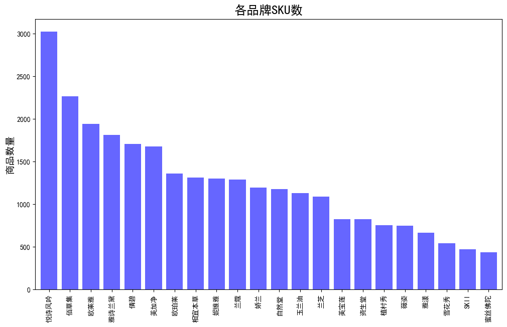

### 代码单元 21

```python
fig,axes = plt.subplots(1,2,figsize=(12,10))

ax1 = data.groupby('店名').sale_count.sum().sort_values(ascending=True).plot(kind='barh',ax=axes[0],width=0.6)
ax1.set_title('品牌总销售量',fontsize=12)
ax1.set_xlabel('总销售量')

ax2 = data.groupby('店名')['销售额'].sum().sort_values(ascending=True).plot(kind='barh',ax=axes[1],width=0.6)
ax2.set_title('品牌总销售额',fontsize=12)
ax2.set_xlabel('总销售额')

plt.subplots_adjust(wspace=0.4)
plt.show()
```

**图表输出 1**

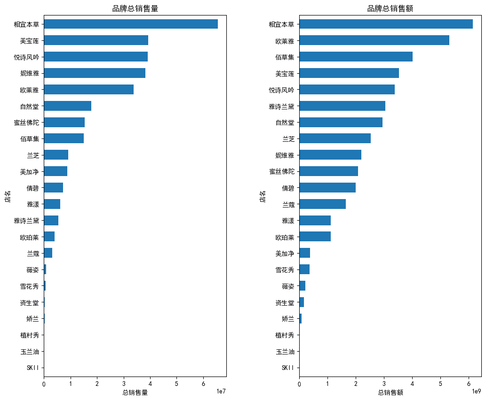

### 代码单元 22

```python
fig,axes = plt.subplots(1,2,figsize=(18,12))

data1 = data.groupby('main_type')['sale_count'].sum()
ax1 = data1.plot(kind='pie',ax=axes[0],autopct='%.1f%%', # 设置百分比的格式，这里保留一位小数
pctdistance=0.8, # 设置百分比标签与圆心的距离
labels= data1.index,
labeldistance = 1.05, # 设置标签与圆心的距离
startangle = 60, # 设置饼图的初始角度
radius = 1.2, # 设置饼图的半径
counterclock = False, # 是否逆时针，这里设置为顺时针方向
wedgeprops = {'linewidth': 1.2, },# 设置饼图内外边界的属性值
textprops = {'fontsize':16, 'color':'k','rotation':80}, # 设置文本标签的属性值
)
ax1.set_title('主类别销售量占比',fontsize=20)

data2 = data.groupby('sub_type')['sale_count'].sum()
ax2 = data2.plot(kind='pie',ax=axes[1],autopct='%.1f%%',
pctdistance=0.8,
labels= data2.index,
labeldistance = 1.05,
startangle = 230,
radius = 1.2,
counterclock = False,
wedgeprops = {'linewidth': 1.2, },
textprops = {'fontsize':16, 'color':'k','rotation':80},
)

ax2.set_title('子类别销售量占比',fontsize=20)

# 设置坐标标签
ax1.set_xlabel(..., fontsize=16,labelpad=38.5)
ax1.set_ylabel(..., fontsize=16,labelpad=38.5)
ax2.set_xlabel(..., fontsize=16,labelpad=38.5)
ax2.set_ylabel(..., fontsize=16,labelpad=38.5)
plt.subplots_adjust(wspace=0.4)
plt.show()
```

**图表输出 1**

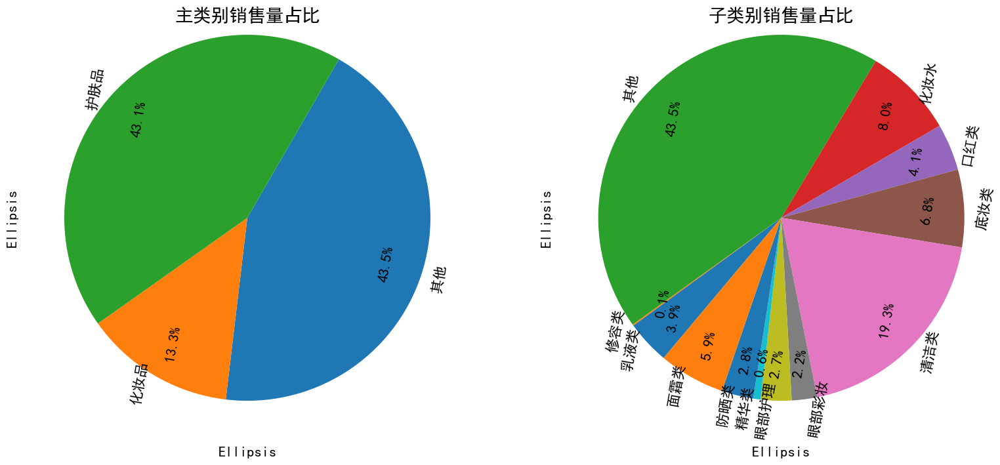

### 代码单元 23

```python
plt.figure(figsize=(18,8))
sns.barplot(x='店名',y='sale_count',hue='main_type',data=data,saturation=0.75,ci=0)
plt.title('各品牌各总类的总销量', fontsize=20)
plt.ylabel('销量',fontsize=16)
plt.xlabel('店名',fontsize=16)
plt.text(0,78000,'注：此处也可使用堆叠图，对比效果更直观',
         verticalalignment='top', horizontalalignment='left',color='gray', fontsize=10)
# 设置刻度字体大小

plt.xticks(fontsize=16,rotation=45)
plt.yticks(fontsize=16)
plt.show()
```

**文本输出**

```text
C:\Users\Administrator\AppData\Local\Temp\2\ipykernel_9388\933251388.py:2: FutureWarning: 

The `ci` parameter is deprecated. Use `errorbar=('ci', 0)` for the same effect.

  sns.barplot(x='店名',y='sale_count',hue='main_type',data=data,saturation=0.75,ci=0)
```

**图表输出 1**

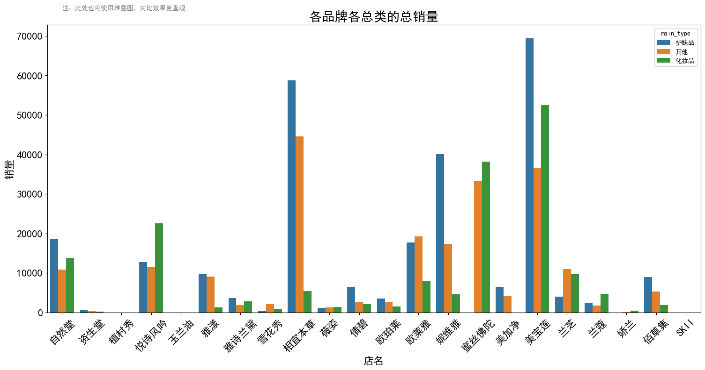

### 代码单元 24

```python
plt.figure(figsize=(18,8))
sns.barplot( x = '店名',
y = '销售额',hue = 'main_type',data =data,saturation = 0.75,ci=0,)
plt.ylabel('销售额',fontsize=16)
plt.xlabel('店名',fontsize=16)
plt.title('各品牌各总类的总销售额',fontsize=20)
# 设置刻度字体大小
plt.xticks(fontsize=16,rotation=45)
plt.yticks(fontsize=16)
plt.show()
```

**文本输出**

```text
C:\Users\Administrator\AppData\Local\Temp\2\ipykernel_9388\966973743.py:2: FutureWarning: 

The `ci` parameter is deprecated. Use `errorbar=('ci', 0)` for the same effect.

  sns.barplot( x = '店名',
```

**图表输出 1**

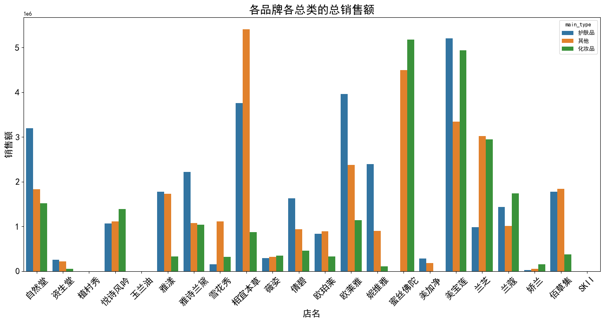

### 代码单元 25

```python
plt.figure(figsize = (16,6))
sns.barplot( x = '店名',
y = 'sale_count',hue = 'sub_type',data =data,saturation = 0.75,ci=0)
plt.title('各品牌各子类的总销量')
plt.ylabel('销量')
plt.show()
```

**文本输出**

```text
C:\Users\Administrator\AppData\Local\Temp\2\ipykernel_9388\2937992612.py:2: FutureWarning: 

The `ci` parameter is deprecated. Use `errorbar=('ci', 0)` for the same effect.

  sns.barplot( x = '店名',
```

**图表输出 1**

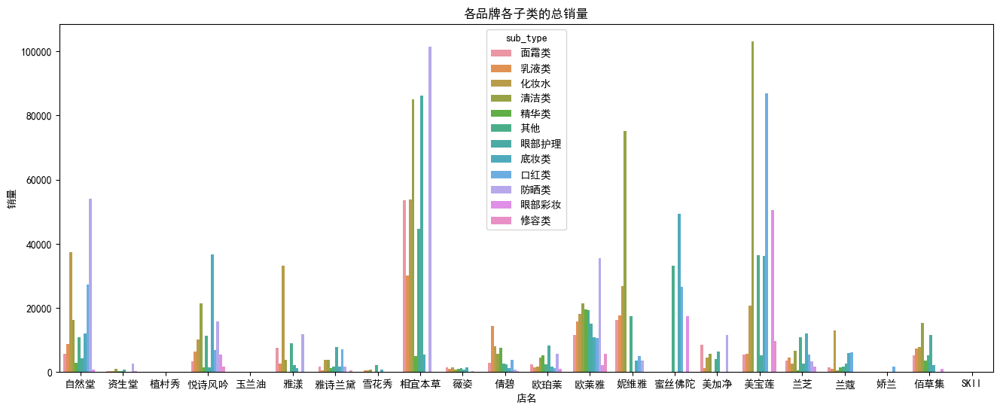

### 代码单元 26

```python
plt.figure(figsize = (14,6))
sns.barplot( x = '店名',
y = '销售额',hue = 'sub_type',data =data,saturation = 0.75,ci=0)
plt.title('各品牌各子类的总销售额')
plt.ylabel('销售额')
plt.show()
```

**文本输出**

```text
C:\Users\Administrator\AppData\Local\Temp\2\ipykernel_9388\2102189727.py:2: FutureWarning: 

The `ci` parameter is deprecated. Use `errorbar=('ci', 0)` for the same effect.

  sns.barplot( x = '店名',
```

**图表输出 1**

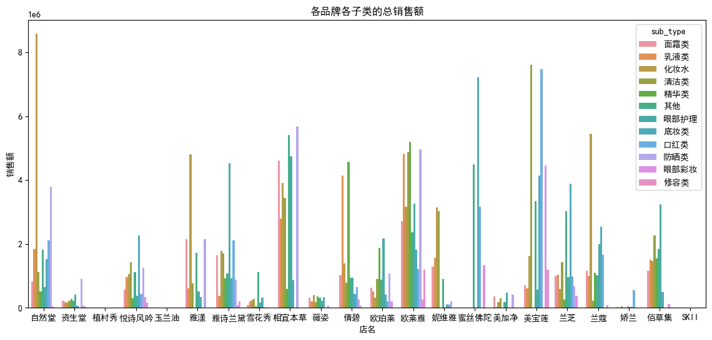

### 代码单元 27

```python
plt.figure(figsize = (12,6))
data.groupby('店名').comment_count.mean().sort_values(ascending=False).plot(kind='bar',width=0.8)
plt.title('各品牌商品的平均评论数')
plt.ylabel('评论数')
plt.show()
```

**图表输出 1**

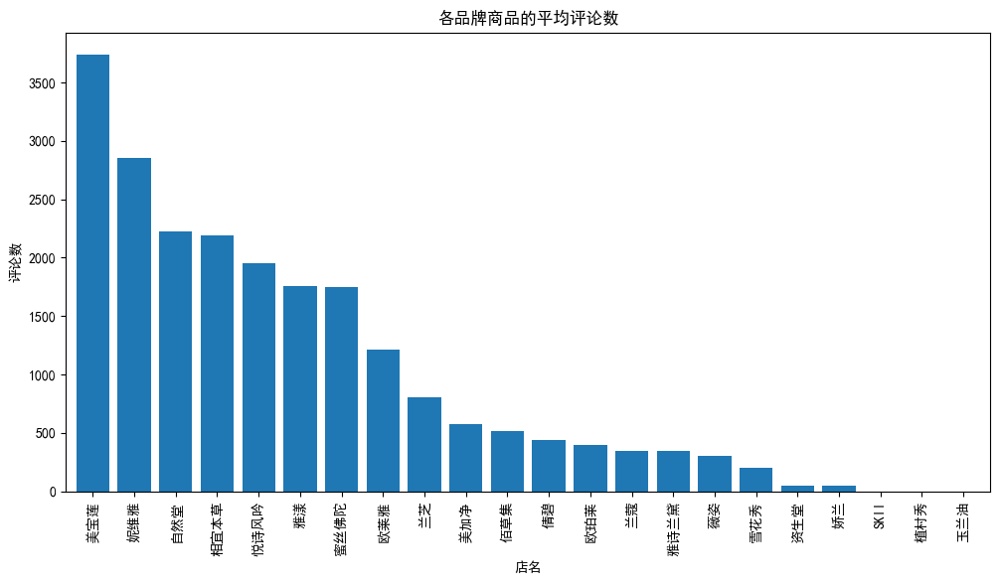

### 代码单元 28

```python
data
```

**文本输出**

```text
id                                    title   price  \
update_time                                                                   
2016-11-14    A18164178225      CHANDO/自然堂 雪域精粹纯粹滋润霜50g 补水保湿 滋润水润面霜   139.0   
2016-11-14    A18177105952     CHANDO/自然堂凝时鲜颜肌活乳液120ML 淡化细纹补水滋润专柜正品   194.0   
2016-11-14    A18177226992     CHANDO/自然堂活泉保湿修护精华水（滋润型135ml 补水控油爽肤水    99.0   
2016-11-14    A18178033846    CHANDO/自然堂 男士劲爽控油洁面膏 100g 深层清洁  男士洗面奶    38.0   
2016-11-14    A18178045259       CHANDO/自然堂雪域精粹纯粹滋润霜（清爽型）50g补水保湿滋润霜   139.0   
...                    ...                                      ...     ...   
2016-11-05   A535642405757       SK-II【11-11】全新大眼眼霜skii放大双眼眼部修护精华紧致   590.0   
2016-11-05   A535911851408     SK-II 11-11预售skii大眼眼霜sk2眼部修护精华霜淡化黑眼圈   590.0   
2016-11-05   A537027211850     SK-II 11-11预售skii前男友护肤面膜sk2精华面膜贴密集修护  1740.0   
2016-11-05   A538212160126  SK-II 11-11预售skiisk2神仙水护肤精华油面部套装滋润补水密集修  1190.0   
2016-11-05   A538677326709          SK-II【11-11】神仙水护肤精华油面部套装滋润补水密集修  1190.0   

             sale_count  comment_count    店名 sub_type main_type 是否男士专用  \
update_time                                                              
2016-11-14      26719.0         2704.0   自然堂    
... 输出过长，博客中已截断
```

### 代码单元 29

```python
plt.figure(figsize=(18,12))

x = data.groupby('店名')['sale_count'].mean()
y = data.groupby('店名')['comment_count'].mean()
s = data.groupby('店名')['price'].mean()
txt = data.groupby('店名').id.count().index

sns.scatterplot(x=x,y=y,size=s,hue=s,sizes=(100,1500),data=data)

for i in range(len(txt)):
    plt.annotate(txt[i],xy=(x[i],y[i]))
    
plt.ylabel('热度')
plt.xlabel('销量')

plt.legend(loc='upper left')
plt.show()
```

**图表输出 1**

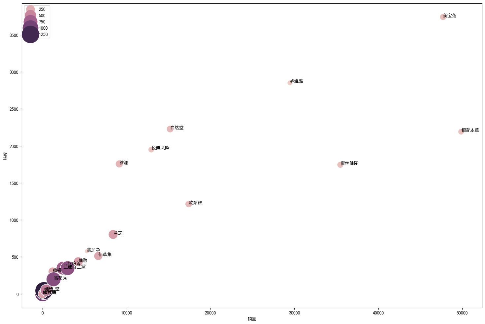

### 代码单元 30

```python
#查看价格的箱型图
plt.figure(figsize=(18,10))
sns.boxplot(x='店名',y='price',data=data)
plt.ylim(0,3000)#如果不限制，就不容易看清箱型，所以把Y轴刻度缩小为0-3000
plt.show()
```

**图表输出 1**

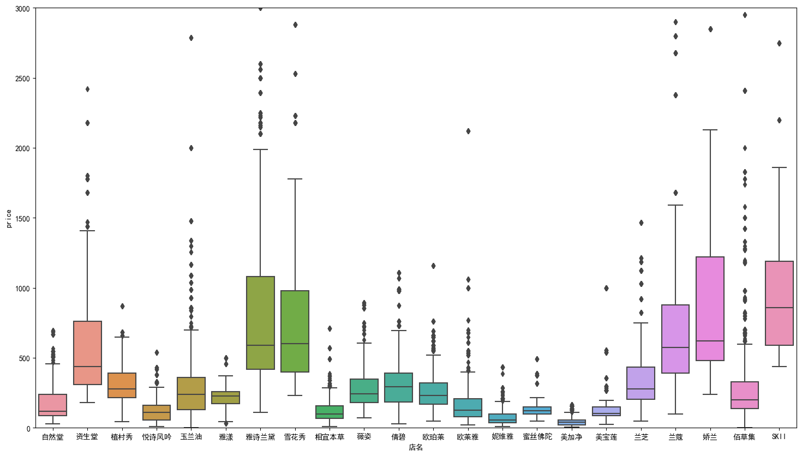

### 代码单元 31

```python
data.groupby('店名').price.sum()
avg_price=data.groupby('店名').price.sum()/data.groupby('店名').price.count()
avg_price
```

**文本输出**

```text
店名
SKII    1011.727079
佰草集      289.823171
倩碧       346.092190
兰芝       356.615809
兰蔻       756.400778
妮维雅       73.789053
娇兰      1361.043588
悦诗风吟     121.245945
植村秀      311.786667
欧珀莱      276.218543
欧莱雅      167.282698
玉兰油      329.657294
相宜本草     122.958446
美加净       44.694619
美宝莲      148.757576
自然堂      180.130213
薇姿       281.085791
蜜丝佛陀     142.118894
资生堂      577.438490
雅漾       212.618401
雅诗兰黛     872.470718
雪花秀      901.082873
Name: price, dtype: float64
```

### 代码单元 32

```python
fig = plt.figure(figsize=(12,6))
avg_price.sort_values(ascending=False).plot(kind='bar',width=0.8,alpha=0.6,color='b',label='各品牌平均价格')
y = data['price'].mean()
plt.axhline(y,0,5,color='r',label='全品牌平均价格')
plt.ylabel('各品牌平均价格')
plt.title('各品牌产品的平均价格',fontsize=24)
plt.legend(loc='best')
plt.show()
```

**图表输出 1**

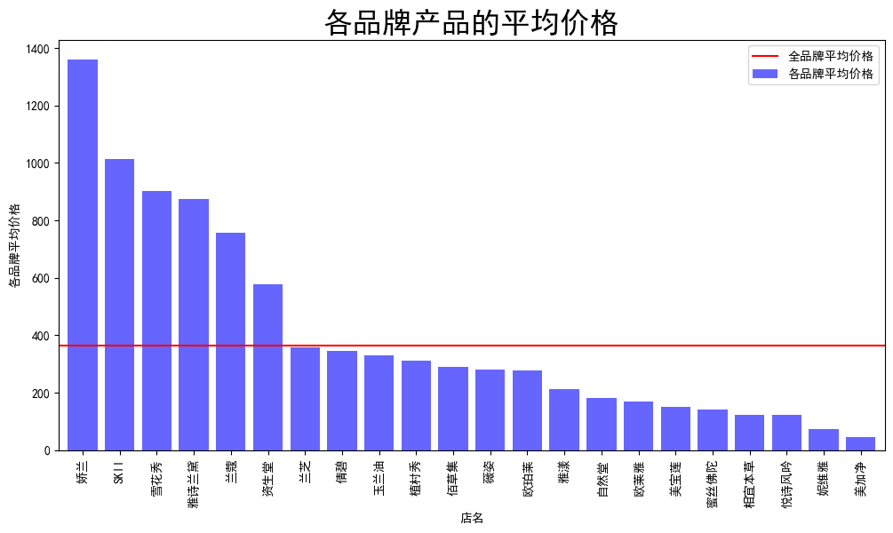

### 代码单元 33

```python
plt.figure(figsize=(18,10))

x = data.groupby('店名')['sale_count'].mean()
y = data.groupby('店名')['销售额'].mean()
s = avg_price
txt = data.groupby('店名').id.count().index

sns.scatterplot(x=x,y=x,size=s,sizes=(100,1500),marker='v',alpha=0.5,color='b',data=data)

for i in range(len(txt)):
    plt.annotate(txt[i],xy=(x[i],y[i]),xytext = (x[i]+0.2, y[i]+0.2))  #在散点后面增加品牌信息的标签
    
plt.ylabel('销售额')
plt.xlabel('销量')

plt.legend(loc='upper left')
plt.show()
```

**图表输出 1**

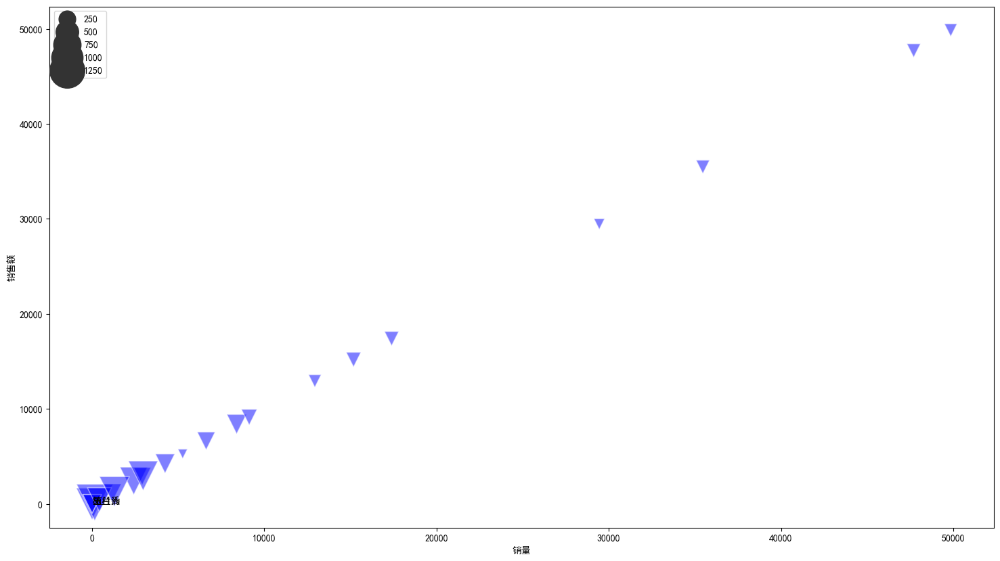

### 代码单元 34

```python
gender_data=data[data['是否男士专用']=='是']
gender_data_1=gender_data[(gender_data.main_type =='护肤品')| (gender_data.main_type=='化妆品')]
plt.figure(figsize = (12,6))
sns.barplot(x='店名',y='sale_count',hue='main_type',data =gender_data_1,saturation=0.75,ci=0,)
plt.show()
```

**文本输出**

```text
C:\Users\Administrator\AppData\Local\Temp\2\ipykernel_9388\977641307.py:4: FutureWarning: 

The `ci` parameter is deprecated. Use `errorbar=('ci', 0)` for the same effect.

  sns.barplot(x='店名',y='sale_count',hue='main_type',data =gender_data_1,saturation=0.75,ci=0,)
```

**图表输出 1**

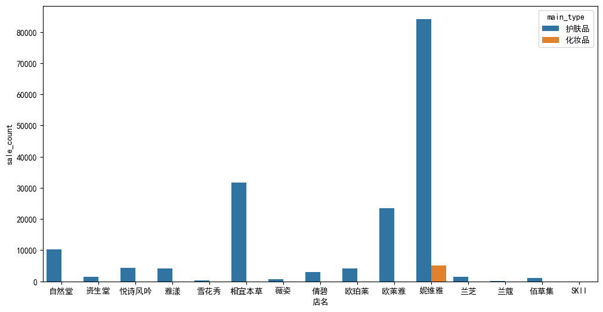

### 代码单元 35

```python
f,[ax1,ax2]=plt.subplots(1,2,figsize=(12,6))
gender_data.groupby('店名').sale_count.sum().sort_values(ascending=True).plot(kind='barh',width=0.8,ax=ax1)
ax1.set_title('男士护肤品销量排名')

gender_data.groupby('店名').销售额.sum().sort_values(ascending=True).plot(kind='barh',width=0.8,ax=ax2)
ax2.set_title('男士护肤品销售额排名')

plt.subplots_adjust(wspace=0.4)
plt.show()
```

**图表输出 1**

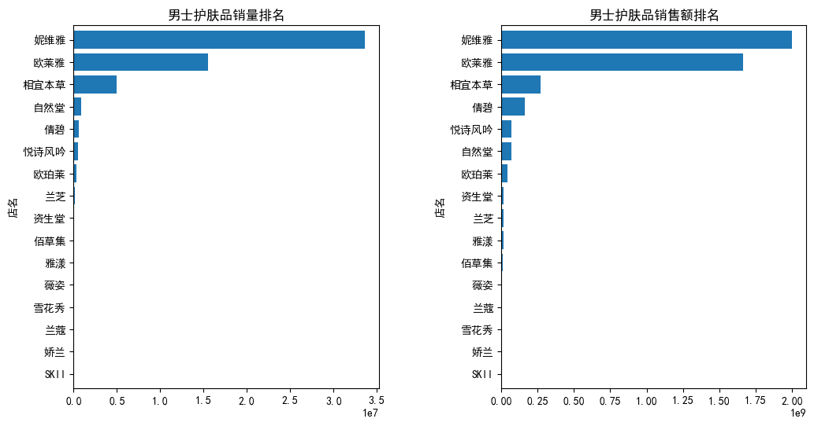

### 代码单元 36

```python
from matplotlib.pyplot import MultipleLocator
plt.figure(figsize = (12,6))
day_sale=data.groupby('day')['sale_count'].sum()
day_sale.plot()
plt.grid(linestyle="-.",color="gray",axis="x",alpha=0.5)
x_major_locator=MultipleLocator(1)  #把x轴的刻度间隔设置为1，并存在变量里
ax=plt.gca()  #ax为两条坐标轴的实例
ax.xaxis.set_major_locator(x_major_locator)
#把x轴的主刻度设置为1的倍数
plt.xlabel('日期（11月）',fontsize=12)
plt.ylabel('销量',fontsize=12)
plt.show()
```

**图表输出 1**

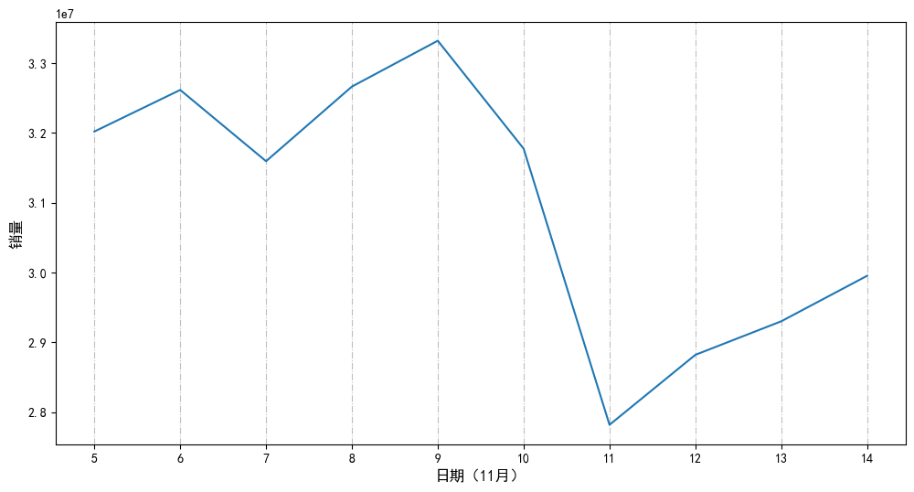
