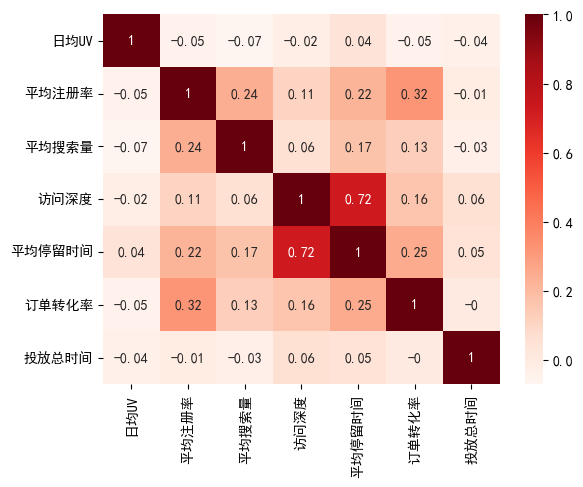
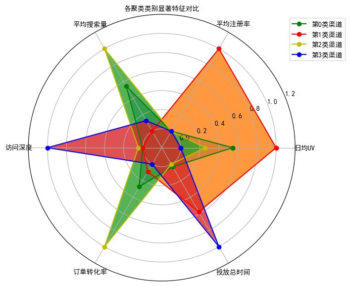

# 广告投放效果聚类分析：用 K-Means 识别渠道质量和优化方向

## 摘要

| 模块     | 内容                                                         |
| -------- | ------------------------------------------------------------ |
| 业务场景 | 电商                                                         |
| 数据来源 | 广告投放效果数据，包含曝光、点击、转化、成本、转化率等投放指标。 |
| 分析方法 | 指标标准化、K-Means 聚类、投放效果分群、聚类结果解释。       |
| 结论先行 | 广告效果需要同时观察流量规模、点击效率、转化效率和成本。     |

本报告围绕“业务背景、分析目的、数据说明、分析思路、分析过程、核心结论和改进建议”展开，目标是用数据回答具体问题，并把分析结果转化为可执行的判断。

## 一、分析背景

广告优化不能只看单个指标。高点击不一定高转化，低成本也不一定高质量。聚类可以把渠道或广告计划按综合表现分组，辅助预算调整。

## 二、分析目的

本次分析主要回答以下问题：

- 不同客户、渠道或门店能否按业务价值拆成清晰分组？
- 每一类群体的核心画像是什么？
- 不同分组应该配置什么差异化运营策略？

先明确分析目的，再开展数据处理和指标拆解，可以保证报告围绕问题展开，而不是简单罗列代码和图表。

## 三、数据来源与指标说明

| 项目           | 说明                                                         |
| -------------- | ------------------------------------------------------------ |
| 数据来源       | 广告投放效果数据，包含曝光、点击、转化、成本、转化率等投放指标。 |
| 分析工具与方法 | 指标标准化、K-Means 聚类、投放效果分群、聚类结果解释。       |
| 重点分析指标   | 分群指标、标准化结果、聚类类别、各类群体均值、群体规模和业务价值。 |
| 数据口径       | 本文以项目数据集中的字段为分析范围，先完成缺失值、异常值、重复值或类别字段处理，再围绕核心指标做统计、可视化或建模。 |

数据口径会直接影响分析结论，因此报告先说明数据范围、核心指标和处理方式，便于读者理解结论的适用边界。

## 四、分析思路

| 步骤                | 目的                                                         |
| ------------------- | ------------------------------------------------------------ |
| 1. 明确业务问题     | 确定分析要回答什么，以及结论会影响什么决策。                 |
| 2. 数据读取与清洗   | 处理缺失、重复、异常和字段格式问题，保证分析基础可靠。       |
| 3. 指标拆解与可视化 | 从趋势、结构、对比、分布或空间维度观察数据现象。             |
| 4. 建模或深度分析   | 根据项目需要完成聚类、预测、分类、回归、文本分析或可视化大屏。 |
| 5. 输出结论与建议   | 把数据发现翻译成业务语言，并给出可执行的下一步动作。         |

本项目的具体分析路径如下：

- 先定义分群目的：明确是为了识别高价值客户、优化广告预算，还是支持门店/会员运营。
- 选择能代表业务质量的指标：例如频次、金额、最近行为、转化效率、成本或贡献度。
- 对指标做标准化处理，避免量纲较大的变量主导聚类结果。
- 使用 K-Means 等方法得到分群，并回看每一类的指标均值和业务画像。
- 将分群结果转成运营策略：不同客群给出差异化触达、预算、权益或维护动作。

## 五、数据处理过程

本项目的数据处理主要包括以下环节：

- 读取原始数据，检查字段类型、样本规模和基础统计信息。
- 处理缺失值、重复值、异常值或文本噪声，保证后续统计和建模结果可靠。
- 根据分析目标构造必要指标、标签或特征，并统一字段口径。
- 按业务维度进行分组、聚合、可视化或模型训练，为结论提供依据。

## 六、数据分析与结果

本部分按照“分析发现 -> 结果解读”的方式组织，重点说明数据体现出的现象及其业务含义。

### 1. 广告效果需要同时观察流量规模、点击效率、转化效率和成本。

结果解读：该发现是本项目最核心的结论之一，说明数据中存在值得关注的结构性特征。对应图表或模型结果应围绕这一判断展开，帮助读者理解结论来源。

### 2. 聚类结果可帮助识别高质量投放、低效高耗投放和潜力待优化投放。

结果解读：该发现进一步解释了不同维度之间的差异。对业务决策而言，重点不只是看到差异，而是判断差异来自哪些对象、场景或指标。

### 3. K-Means 的关键不是算法本身，而是选取能代表业务质量的指标。

结果解读：该发现可以作为后续优化策略或模型改进的依据。若用于真实业务，还需要结合成本、资源、实验结果或线上反馈继续验证。

## 七、结论

综合以上分析，可以得到以下结论：

- 广告效果需要同时观察流量规模、点击效率、转化效率和成本。
- 聚类结果可帮助识别高质量投放、低效高耗投放和潜力待优化投放。
- K-Means 的关键不是算法本身，而是选取能代表业务质量的指标。

## 八、建议

- 行动 1：对高转化低成本组加预算，对高点击低转化组检查落地页和人群匹配。
- 行动 2：对低曝光高转化组可以测试扩量，但要监控扩量后的 CPA 是否恶化。
- 行动 3：后续应接入 LTV 和复购数据，避免只按短期转化优化导致用户质量下降。
- 跟进方式：为每条建议绑定一个可观察指标，后续按周或按月复盘效果。

建议部分应结合具体对象、执行动作和复盘指标，避免停留在泛泛的“加强管理”或“优化运营”。

## 九、局限性与改进方向

- 项目价值：把客户、渠道或门店从平均视角拆成不同群体，使运营资源可以按价值、潜力和风险差异化配置。
- 真实限制：商品、用户和渠道指标会受到促销周期、库存、价格带和平台流量分配影响，单次分析无法完全代表长期经营规律。
- 业务风险：只看销量、点击或转化等单点指标，可能牺牲毛利、复购和用户质量，需要把 GMV、利润和留存放在一起评估。
- 改进方向：用业务结果回验分群有效性，例如复购、留存、利润、风险或转化，而不是只看聚类轮廓。
- 改进方向：建立分群更新机制，按月或按季度重新计算客户状态，避免用户行为变化后标签失效。
- 改进方向：补充价格、库存、优惠、曝光、退款和复购数据，把短期转化与长期用户价值结合起来评估。

## 附录：完整代码与输出结果

下面内容按原 notebook 的代码单元顺序整理。如果代码单元产生了文本输出或图片输出，也一并附在对应代码后面，便于复现完整分析过程。

### 代码单元 1

```python
import pandas as pd
import numpy as np
import matplotlib as mpl
import matplotlib.pyplot as plt
from sklearn.preprocessing import MinMaxScaler,OneHotEncoder
from sklearn.metrics import silhouette_score # 导入轮廓系数指标
from sklearn.cluster import KMeans # KMeans模块
## 设置属性防止中文乱码
mpl.rcParams['font.sans-serif'] = [u'SimHei']
mpl.rcParams['axes.unicode_minus'] = False
```

### 代码单元 2

```python
raw_data = pd.read_csv(r'./ad_performance.csv')
raw_data.head()
```

**文本输出**

```text
渠道代号    日均UV   平均注册率   平均搜索量    访问深度  平均停留时间   订单转化率  投放总时间 素材类型    广告类型  \
0  A203    3.69  0.0071  0.0214  2.3071  419.77  0.0258     20  jpg  banner   
1  A387  178.70  0.0040  0.0324  2.0489  157.94  0.0030     19  jpg  banner   
2  A388   91.77  0.0022  0.0530  1.8771  357.93  0.0026      4  jpg  banner   
3  A389    1.09  0.0074  0.3382  4.2426  364.07  0.0153     10  jpg  banner   
4  A390    3.37  0.0028  0.1740  2.1934  313.34  0.0007     30  jpg  banner   

  合作方式    广告尺寸 广告卖点  
0  roi  140*40   打折  
1  cpc  140*40   满减  
2  cpc  140*40   满减  
3  cpc  140*40   满减  
4  cpc  140*40   满减
```

### 代码单元 3

```python
# 查看基本状态
raw_data.head(2)  # 打印输出前2条数据
```

**文本输出**

```text
渠道代号    日均UV   平均注册率   平均搜索量    访问深度  平均停留时间   订单转化率  投放总时间 素材类型    广告类型  \
0  A203    3.69  0.0071  0.0214  2.3071  419.77  0.0258     20  jpg  banner   
1  A387  178.70  0.0040  0.0324  2.0489  157.94  0.0030     19  jpg  banner   

  合作方式    广告尺寸 广告卖点  
0  roi  140*40   打折  
1  cpc  140*40   满减
```

### 代码单元 4

```python
raw_data.info()# 打印数据类型分布
```

**文本输出**

```text
<class 'pandas.core.frame.DataFrame'>
RangeIndex: 889 entries, 0 to 888
Data columns (total 13 columns):
 #   Column  Non-Null Count  Dtype  
---  ------  --------------  -----  
 0   渠道代号    889 non-null    object 
 1   日均UV    889 non-null    float64
 2   平均注册率   889 non-null    float64
 3   平均搜索量   889 non-null    float64
 4   访问深度    889 non-null    float64
 5   平均停留时间  887 non-null    float64
 6   订单转化率   889 non-null    float64
 7   投放总时间   889 non-null    int64  
 8   素材类型    889 non-null    object 
 9   广告类型    889 non-null    object 
 10  合作方式    889 non-null    object 
 11  广告尺寸    889 non-null    object 
 12  广告卖点    889 non-null    object 
dtypes: float64(6), int64(1), object(6)
memory usage: 90.4+ KB
```

### 代码单元 5

```python
raw_data.describe().round(2).T # 打印原始数据基本描述性信息
```

**文本输出**

```text
count    mean      std   min     25%     50%     75%       max
日均UV    889.0  540.85  1634.41  0.06    6.18  114.18  466.87  25294.77
平均注册率   889.0    0.00     0.00  0.00    0.00    0.00    0.00      0.04
平均搜索量   889.0    0.03     0.11  0.00    0.00    0.00    0.01      1.04
访问深度    889.0    2.17     3.80  1.00    1.39    1.79    2.22     98.98
平均停留时间  887.0  262.67   224.36  1.64  126.02  236.55  357.98   4450.83
订单转化率   889.0    0.00     0.01  0.00    0.00    0.00    0.00      0.22
投放总时间   889.0   16.05     8.51  1.00    9.00   16.00   24.00     30.00
```

### 代码单元 6

```python
# 缺失值审查
na_cols = raw_data.isnull().any(axis=0)  # 查看每一列是否具有缺失值
na_cols
```

**文本输出**

```text
渠道代号      False
日均UV      False
平均注册率     False
平均搜索量     False
访问深度      False
平均停留时间     True
订单转化率     False
投放总时间     False
素材类型      False
广告类型      False
合作方式      False
广告尺寸      False
广告卖点      False
dtype: bool
```

### 代码单元 7

```python
raw_data.isnull().sum().sort_values(ascending=False)# 查看具有缺失值的行总记录数
```

**文本输出**

```text
平均停留时间    2
渠道代号      0
日均UV      0
平均注册率     0
平均搜索量     0
访问深度      0
订单转化率     0
投放总时间     0
素材类型      0
广告类型      0
合作方式      0
广告尺寸      0
广告卖点      0
dtype: int64
```

### 代码单元 8

```python
# 相关性分析
raw_data.corr(numeric_only=True).round(2).T # 打印原始数据相关性信息
```

**文本输出**

```text
日均UV  平均注册率  平均搜索量  访问深度  平均停留时间  订单转化率  投放总时间
日均UV    1.00  -0.05  -0.07 -0.02    0.04  -0.05  -0.04
平均注册率  -0.05   1.00   0.24  0.11    0.22   0.32  -0.01
平均搜索量  -0.07   0.24   1.00  0.06    0.17   0.13  -0.03
访问深度   -0.02   0.11   0.06  1.00    0.72   0.16   0.06
平均停留时间  0.04   0.22   0.17  0.72    1.00   0.25   0.05
订单转化率  -0.05   0.32   0.13  0.16    0.25   1.00  -0.00
投放总时间  -0.04  -0.01  -0.03  0.06    0.05  -0.00   1.00
```

### 代码单元 9

```python
# 相关性可视化展示
import seaborn as sns
corr = raw_data.corr().round(2)
sns.heatmap(corr,cmap='Reds',annot = True)
```

**文本输出**

```text
C:\Users\Administrator\AppData\Local\Temp\2\ipykernel_14424\3904037074.py:3: FutureWarning: The default value of numeric_only in DataFrame.corr is deprecated. In a future version, it will default to False. Select only valid columns or specify the value of numeric_only to silence this warning.
  corr = raw_data.corr().round(2)
```

**图表输出 1**



### 代码单元 10

```python
# 1 删除平均平均停留时间列
raw_data2 = raw_data.drop(['平均停留时间'],axis=1)
```

### 代码单元 11

```python
# 类别变量取值
cols=["素材类型","广告类型","合作方式","广告尺寸","广告卖点"]
for x in cols:
    data=raw_data2[x].unique()
    print("变量【{0}】的取值有：\n{1}".format(x,data))
    print("-·"*20)
```

**文本输出**

```text
变量【素材类型】的取值有：
['jpg' 'swf' 'gif' 'sp']
-·-·-·-·-·-·-·-·-·-·-·-·-·-·-·-·-·-·-·-·
变量【广告类型】的取值有：
['banner' 'tips' '不确定' '横幅' '暂停']
-·-·-·-·-·-·-·-·-·-·-·-·-·-·-·-·-·-·-·-·
变量【合作方式】的取值有：
['roi' 'cpc' 'cpm' 'cpd']
-·-·-·-·-·-·-·-·-·-·-·-·-·-·-·-·-·-·-·-·
变量【广告尺寸】的取值有：
['140*40' '308*388' '450*300' '600*90' '480*360' '960*126' '900*120'
 '390*270']
-·-·-·-·-·-·-·-·-·-·-·-·-·-·-·-·-·-·-·-·
变量【广告卖点】的取值有：
['打折' '满减' '满赠' '秒杀' '直降' '满返']
-·-·-·-·-·-·-·-·-·-·-·-·-·-·-·-·-·-·-·-·
```

### 代码单元 12

```python
# 字符串分类独热编码处理
cols = ['素材类型','广告类型','合作方式','广告尺寸','广告卖点']
model_ohe = OneHotEncoder(sparse=False)  # 建立OneHotEncode对象
ohe_matrix = model_ohe.fit_transform(raw_data2[cols])  # 直接转换
print(ohe_matrix[:2])
```

**文本输出**

```text
[[0. 1. 0. 0. 1. 0. 0. 0. 0. 0. 0. 0. 1. 1. 0. 0. 0. 0. 0. 0. 0. 1. 0. 0.
  0. 0. 0.]
 [0. 1. 0. 0. 1. 0. 0. 0. 0. 1. 0. 0. 0. 1. 0. 0. 0. 0. 0. 0. 0. 0. 1. 0.
  0. 0. 0.]]
C:\Users\Administrator\Envs\jv\lib\site-packages\sklearn\preprocessing\_encoders.py:828: FutureWarning: `sparse` was renamed to `sparse_output` in version 1.2 and will be removed in 1.4. `sparse_output` is ignored unless you leave `sparse` to its default value.
  warnings.warn(
```

### 代码单元 13

```python
# 用pandas的方法
ohe_matrix1=pd.get_dummies(raw_data2[cols])
ohe_matrix1.head(5)
```

**文本输出**

```text
素材类型_gif  素材类型_jpg  素材类型_sp  素材类型_swf  广告类型_banner  广告类型_tips  广告类型_不确定  \
0         0         1        0         0            1          0         0   
1         0         1        0         0            1          0         0   
2         0         1        0         0            1          0         0   
3         0         1        0         0            1          0         0   
4         0         1        0         0            1          0         0   

   广告类型_暂停  广告类型_横幅  合作方式_cpc  ...  广告尺寸_480*360  广告尺寸_600*90  广告尺寸_900*120  \
0        0        0         0  ...             0            0             0   
1        0        0         1  ...             0            0             0   
2        0        0         1  ...             0            0             0   
3        0        0         1  ...             0            0             0   
4        0        0         1  ...             0            0             0   

   广告尺寸_960*126  广告卖点_打折  广告卖点_满减  广告卖点_满赠  广告卖点_满返  广告卖点_直降  广告卖点_秒杀  
0             0        1        0        0        0        0        0  
1             0        0        1        0        0        0        0  
2             0        0        1        0 
... 输出过长，博客中已截断
```

### 代码单元 14

```python
# 数据标准化
sacle_matrix = raw_data2.iloc[:, 1:7]  # 获得要转换的矩阵
model_scaler = MinMaxScaler()  # 建立MinMaxScaler模型对象
data_scaled = model_scaler.fit_transform(sacle_matrix)  # MinMaxScaler标准化处理
print(data_scaled.round(2))
```

**文本输出**

```text
[[0.   0.18 0.02 0.01 0.12 0.66]
 [0.01 0.1  0.03 0.01 0.01 0.62]
 [0.   0.06 0.05 0.01 0.01 0.1 ]
 ...
 [0.01 0.01 0.   0.   0.   0.72]
 [0.05 0.   0.   0.   0.   0.31]
 [0.   0.   0.   0.53 0.   0.62]]
```

### 代码单元 15

```python
# # 合并所有维度
X = np.hstack((data_scaled, ohe_matrix))
```

### 代码单元 16

```python
# 通过平均轮廓系数检验得到最佳KMeans聚类模型
score_list = list()  # 用来存储每个K下模型的平局轮廓系数
silhouette_int = -1  # 初始化的平均轮廓系数阀值
for n_clusters in range(2, 8):  # 遍历从2到5几个有限组
    model_kmeans = KMeans(n_clusters=n_clusters)  # 建立聚类模型对象
    labels_tmp = model_kmeans.fit_predict(X)  # 训练聚类模型
    silhouette_tmp = silhouette_score(X, labels_tmp)  # 得到每个K下的平均轮廓系数
    if silhouette_tmp > silhouette_int:  # 如果平均轮廓系数更高
        best_k = n_clusters  # 保存K将最好的K存储下来
        silhouette_int = silhouette_tmp  # 保存平均轮廓得分
        best_kmeans = model_kmeans  # 保存模型实例对象
        cluster_labels_k = labels_tmp  # 保存聚类标签
    score_list.append([n_clusters, silhouette_tmp])  # 将每次K及其得分追加到列表
print('{:*^60}'.format('K值对应的轮廓系数:'))
print(np.array(score_list))  # 打印输出所有K下的详细得分
print('最优的K值是:{0} \n对应的轮廓系数是:{1}'.format(best_k, silhouette_int))
```

**文本输出**

```text
C:\Users\Administrator\Envs\jv\lib\site-packages\sklearn\cluster\_kmeans.py:870: FutureWarning: The default value of `n_init` will change from 10 to 'auto' in 1.4. Set the value of `n_init` explicitly to suppress the warning
  warnings.warn(
C:\Users\Administrator\Envs\jv\lib\site-packages\sklearn\cluster\_kmeans.py:870: FutureWarning: The default value of `n_init` will change from 10 to 'auto' in 1.4. Set the value of `n_init` explicitly to suppress the warning
  warnings.warn(
C:\Users\Administrator\Envs\jv\lib\site-packages\sklearn\cluster\_kmeans.py:870: FutureWarning: The default value of `n_init` will change from 10 to 'auto' in 1.4. Set the value of `n_init` explicitly to suppress the warning
  warnings.warn(
C:\Users\Administrator\Envs\jv\lib\site-packages\sklearn\cluster\_kmeans.py:870: FutureWarning: The default value of `n_init` will change from 10 to 'auto' in 1.4. Set the value of `n_init` explicitly to suppress the warning
  warnings.warn(
*************************K值对应的轮廓系数:*************************
[[2.         0.38655493]
 [3.         0.45757883]
 [4.         0.50209812]
 [5.         0.4800359 ]
 [6.         0.47761127]
 [7.         0.48317001]]
最优的K值是:4 
对应的轮廓系数是:0
... 输出过长，博客中已截断
```

### 代码单元 17

```python
# 将原始数据与聚类标签整合
cluster_labels = pd.DataFrame(cluster_labels_k, columns=['clusters'])  # 获得训练集下的标签信息
merge_data = pd.concat((raw_data2, cluster_labels), axis=1)  # 将原始处理过的数据跟聚类标签整合
merge_data.head()
```

**文本输出**

```text
渠道代号    日均UV   平均注册率   平均搜索量    访问深度   订单转化率  投放总时间 素材类型    广告类型 合作方式  \
0  A203    3.69  0.0071  0.0214  2.3071  0.0258     20  jpg  banner  roi   
1  A387  178.70  0.0040  0.0324  2.0489  0.0030     19  jpg  banner  cpc   
2  A388   91.77  0.0022  0.0530  1.8771  0.0026      4  jpg  banner  cpc   
3  A389    1.09  0.0074  0.3382  4.2426  0.0153     10  jpg  banner  cpc   
4  A390    3.37  0.0028  0.1740  2.1934  0.0007     30  jpg  banner  cpc   

     广告尺寸 广告卖点  clusters  
0  140*40   打折         1  
1  140*40   满减         1  
2  140*40   满减         1  
3  140*40   满减         1  
4  140*40   满减         1
```

### 代码单元 18

```python
# 计算每个聚类类别下的样本量和样本占比
clustering_count = pd.DataFrame(merge_data['渠道代号'].groupby(merge_data['clusters']).count()).T.rename({'渠道代号': 'counts'})  # 计算每个聚类类别的样本量
clustering_ratio = (clustering_count / len(merge_data)).round(2).rename({'counts': 'percentage'})  # 计算每个聚类类别的样本量占比
print(clustering_count)
print("#"*30)
print(clustering_ratio)
```

**文本输出**

```text
clusters   0    1    2    3
counts    73  154  313  349
##############################
clusters       0     1     2     3
percentage  0.08  0.17  0.35  0.39
```

### 代码单元 19

```python
# 计算各个聚类类别内部最显著特征值
cluster_features = []  # 空列表，用于存储最终合并后的所有特征信息
for line in range(best_k):  # 读取每个类索引
    label_data = merge_data[merge_data['clusters'] == line]  # 获得特定类的数据

    part1_data = label_data.iloc[:, 1:7]  # 获得数值型数据特征
    part1_desc = part1_data.describe().round(3)  # 得到数值型特征的描述性统计信息
    merge_data1 = part1_desc.iloc[2, :]  # 得到数值型特征的均值

    part2_data = label_data.iloc[:, 7:-1]  # 获得字符串型数据特征
    part2_desc = part2_data.describe(include='all')  # 获得字符串型数据特征的描述性统计信息
    merge_data2 = part2_desc.iloc[2, :]  # 获得字符串型数据特征的最频繁值

    merge_line = pd.concat((merge_data1, merge_data2), axis=0)  # 将数值型和字符串型典型特征沿行合并
    cluster_features.append(merge_line)  # 将每个类别下的数据特征追加到列表

#  输出完整的类别特征信息
cluster_pd = pd.DataFrame(cluster_features).T  # 将列表转化为矩阵
print('{:*^60}'.format('每个类别主要的特征:'))
all_cluster_set = pd.concat((clustering_count, clustering_ratio, cluster_pd),axis=0)  # 将每个聚类类别的所有信息合并
all_cluster_set
```

**文本输出**

```text
*************************每个类别主要的特征:*************************
0         1         2        3
counts            73       154       313      349
percentage      0.08      0.17      0.35     0.39
日均UV        1904.371  2717.419  1390.013  933.015
平均注册率          0.003     0.005     0.003    0.003
平均搜索量          0.106     0.051     0.152    0.064
访问深度           0.943     0.947     1.168    5.916
订单转化率          0.009     0.007     0.017    0.006
投放总时间          8.217     8.529     8.199     8.77
素材类型             swf       jpg       swf      jpg
广告类型            tips    banner       不确定       横幅
合作方式             cpm       cpc       roi      cpc
广告尺寸         450*300   308*388    600*90   600*90
广告卖点              打折        满减        打折       直降
```

### 代码单元 20

```python
#各类别数据预处理
num_sets = cluster_pd.iloc[:6, :].T.astype(np.float64)  # 获取要展示的数据
num_sets_max_min = model_scaler.fit_transform(num_sets)  # 获得标准化后的数据
print(num_sets)
print('-'*20)
print(num_sets_max_min)
```

**文本输出**

```text
日均UV  平均注册率  平均搜索量   访问深度  订单转化率  投放总时间
0  1904.371  0.003  0.106  0.943  0.009  8.217
1  2717.419  0.005  0.051  0.947  0.007  8.529
2  1390.013  0.003  0.152  1.168  0.017  8.199
3   933.015  0.003  0.064  5.916  0.006  8.770
--------------------
[[5.44358789e-01 0.00000000e+00 5.44554455e-01 0.00000000e+00
  2.72727273e-01 3.15236427e-02]
 [1.00000000e+00 1.00000000e+00 0.00000000e+00 8.04343455e-04
  9.09090909e-02 5.77933450e-01]
 [2.56106801e-01 0.00000000e+00 1.00000000e+00 4.52443193e-02
  1.00000000e+00 0.00000000e+00]
 [0.00000000e+00 0.00000000e+00 1.28712871e-01 1.00000000e+00
  0.00000000e+00 1.00000000e+00]]
```

### 代码单元 21

```python
# 画图
fig = plt.figure(figsize=(7,7))  # 建立画布
ax = fig.add_subplot(111, polar=True)  # 增加子网格，注意polar参数
labels = np.array(merge_data1.index)  # 设置要展示的数据标签
cor_list = ['g', 'r', 'y', 'b']  # 定义不同类别的颜色
angles = np.linspace(0, 2 * np.pi, len(labels), endpoint=False)  # 计算各个区间的角度
angles = np.concatenate((angles, [angles[0]]))  # 建立相同首尾字段以便于闭合
# 画雷达图
for i in range(len(num_sets)):  # 循环每个类别
    data_tmp = num_sets_max_min[i, :]  # 获得对应类数据
    data = np.concatenate((data_tmp, [data_tmp[0]]))  # 建立相同首尾字段以便于闭合
    ax.plot(angles, data, 'o-', c=cor_list[i], label="第%d类渠道"%(i))  # 画线
    ax.fill(angles, data,alpha=0.8)
    
# 设置图像显示格式
print(angles)
print(labels)

ax.set_thetagrids(angles[0:-1] * 180 / np.pi, labels, fontproperties="SimHei")  # 设置极坐标轴
ax.set_title("各聚类类别显著特征对比", fontproperties="SimHei")  # 设置标题放置
ax.set_rlim(-0.2, 1.2)  # 设置坐标轴尺度范围
plt.legend(loc="upper right" ,bbox_to_anchor=(1.2,1.0))  # 设置图例位置
```

**文本输出**

```text
[0.         1.04719755 2.0943951  3.14159265 4.1887902  5.23598776
 0.        ]
['日均UV' '平均注册率' '平均搜索量' '访问深度' '订单转化率' '投放总时间']
```

**图表输出 1**


