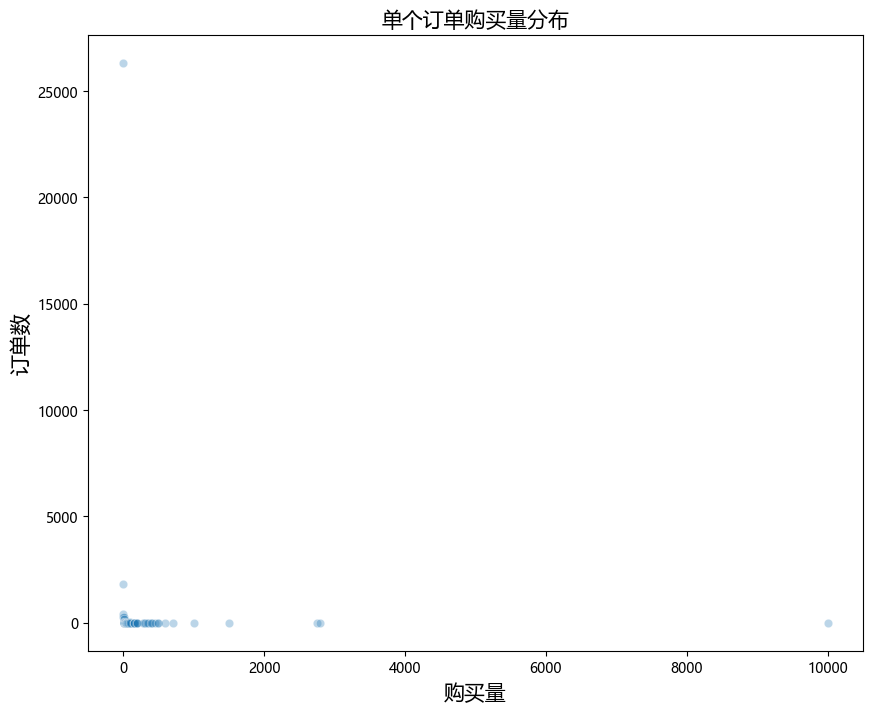
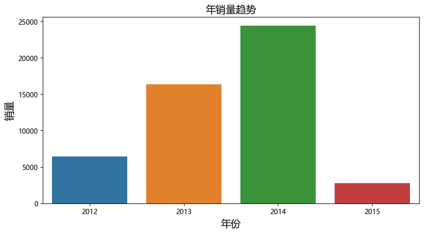
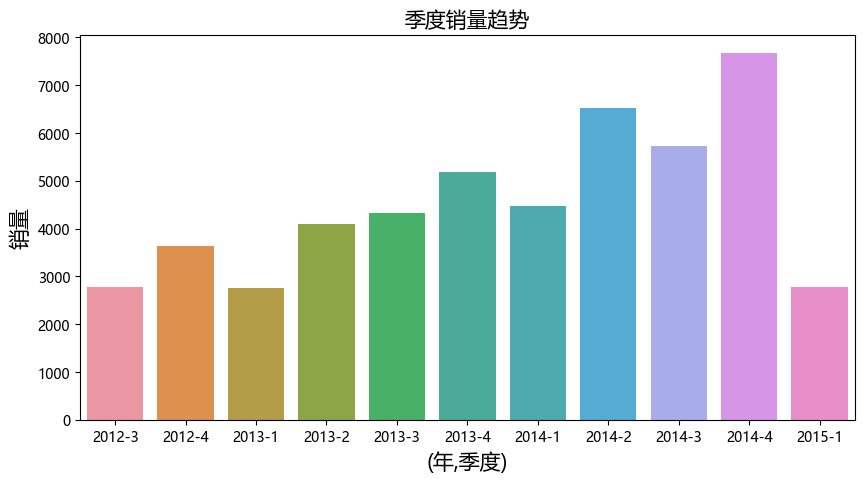
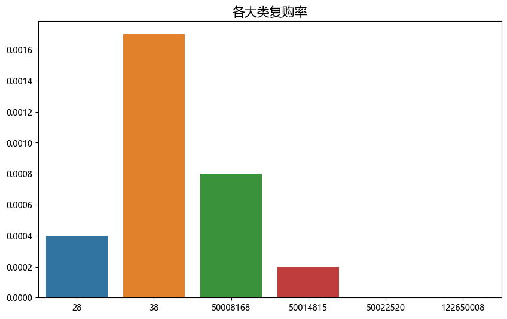
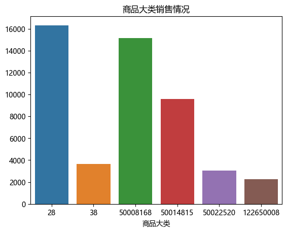
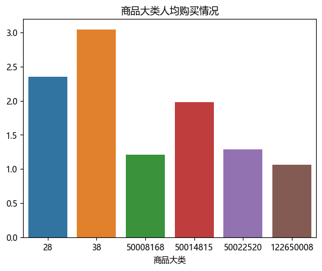
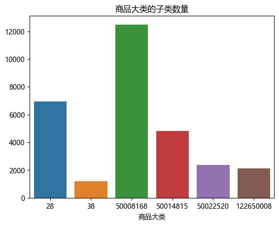

# 母婴市场消费数据分析：从用户生命周期看品类运营机会

## 摘要

| 模块     | 内容                                                         |
| -------- | ------------------------------------------------------------ |
| 业务场景 | 电商                                                         |
| 数据来源 | 天池母婴消费样本数据，包含用户、婴儿信息、商品类别和交易记录。 |
| 分析方法 | 用户与交易表关联、消费频次分析、品类分析、pyecharts 可视化。 |
| 结论先行 | 母婴用户的需求随宝宝成长快速变化，纸尿裤、喂养、玩具和服饰的购买节奏不同。 |

本报告围绕“业务背景、分析目的、数据说明、分析思路、分析过程、核心结论和改进建议”展开，目标是用数据回答具体问题，并把分析结果转化为可执行的判断。

## 一、分析背景

母婴消费有很强的生命周期属性，宝宝年龄、家庭阶段和品类需求密切相关。理解用户所处阶段，比单纯推荐热销商品更重要。

## 二、分析目的

本次分析主要回答以下问题：

- 数据在时间、区域、类别或人群维度上呈现什么结构？
- 哪些图表最适合承载趋势、对比、分布和异常信息？
- 可视化结果如何帮助读者快速定位重点？

先明确分析目的，再开展数据处理和指标拆解，可以保证报告围绕问题展开，而不是简单罗列代码和图表。

## 三、数据来源与指标说明

| 项目           | 说明                                                         |
| -------------- | ------------------------------------------------------------ |
| 数据来源       | 天池母婴消费样本数据，包含用户、婴儿信息、商品类别和交易记录。 |
| 分析工具与方法 | 用户与交易表关联、消费频次分析、品类分析、pyecharts 可视化。 |
| 重点分析指标   | 总量、占比、趋势、排名、区域分布、类别结构和异常变化。       |
| 数据口径       | 本文以项目数据集中的字段为分析范围，先完成缺失值、异常值、重复值或类别字段处理，再围绕核心指标做统计、可视化或建模。 |

数据口径会直接影响分析结论，因此报告先说明数据范围、核心指标和处理方式，便于读者理解结论的适用边界。

## 四、分析思路

| 步骤                | 目的                                                         |
| ------------------- | ------------------------------------------------------------ |
| 1. 明确业务问题     | 确定分析要回答什么，以及结论会影响什么决策。                 |
| 2. 数据读取与清洗   | 处理缺失、重复、异常和字段格式问题，保证分析基础可靠。       |
| 3. 指标拆解与可视化 | 从趋势、结构、对比、分布或空间维度观察数据现象。             |
| 4. 建模或深度分析   | 根据项目需要完成聚类、预测、分类、回归、文本分析或可视化大屏。 |
| 5. 输出结论与建议   | 把数据发现翻译成业务语言，并给出可执行的下一步动作。         |

本项目的具体分析路径如下：

- 先梳理展示对象和受众：判断这篇分析主要给业务、管理层还是面试官阅读。
- 根据问题选择图表：趋势看折线，结构看占比，对比看柱状图，空间分布看地图。
- 先用 pandas 聚合出清晰指标，再用可视化表达核心结论。
- 按照故事线组织图表顺序，避免图很多但结论分散。
- 每张图都配业务解释，让读者知道图表对应什么判断和行动。

## 五、数据处理过程

本项目的数据处理主要包括以下环节：

- 读取原始数据，检查字段类型、样本规模和基础统计信息。
- 处理缺失值、重复值、异常值或文本噪声，保证后续统计和建模结果可靠。
- 根据分析目标构造必要指标、标签或特征，并统一字段口径。
- 按业务维度进行分组、聚合、可视化或模型训练，为结论提供依据。

## 六、数据分析与结果

本部分按照“分析发现 -> 结果解读”的方式组织，重点说明数据体现出的现象及其业务含义。

### 1. 母婴用户的需求随宝宝成长快速变化，纸尿裤、喂养、玩具和服饰的购买节奏不同。

结果解读：该发现是本项目最核心的结论之一，说明数据中存在值得关注的结构性特征。对应图表或模型结果应围绕这一判断展开，帮助读者理解结论来源。

### 2. 用户复购价值高，但信任成本也高，商品质量和售后体验会影响长期留存。

结果解读：该发现进一步解释了不同维度之间的差异。对业务决策而言，重点不只是看到差异，而是判断差异来自哪些对象、场景或指标。

### 3. 品类交叉购买可以帮助识别家庭阶段，并用于下一阶段商品推荐。

结果解读：该发现可以作为后续优化策略或模型改进的依据。若用于真实业务，还需要结合成本、资源、实验结果或线上反馈继续验证。

## 七、结论

综合以上分析，可以得到以下结论：

- 母婴用户的需求随宝宝成长快速变化，纸尿裤、喂养、玩具和服饰的购买节奏不同。
- 用户复购价值高，但信任成本也高，商品质量和售后体验会影响长期留存。
- 品类交叉购买可以帮助识别家庭阶段，并用于下一阶段商品推荐。

## 八、建议

- 行动 1：平台可按宝宝月龄构建生命周期运营脚本，提前推送下一阶段刚需商品。
- 行动 2：对高频刚需品类可设计订阅购或周期购，提高复购稳定性。
- 行动 3：后续可引入 RFM、优惠敏感度和商品评价，构建更完整的母婴用户分层。
- 跟进方式：为每条建议绑定一个可观察指标，后续按周或按月复盘效果。

建议部分应结合具体对象、执行动作和复盘指标，避免停留在泛泛的“加强管理”或“优化运营”。

## 九、局限性与改进方向

- 项目价值：把分散数据组织成趋势、结构、对比和空间分布，让管理者能快速识别重点对象和异常变化。
- 真实限制：商品、用户和渠道指标会受到促销周期、库存、价格带和平台流量分配影响，单次分析无法完全代表长期经营规律。
- 业务风险：只看销量、点击或转化等单点指标，可能牺牲毛利、复购和用户质量，需要把 GMV、利润和留存放在一起评估。
- 改进方向：将静态分析升级为可定期刷新的监控看板，并为异常指标设置阈值提醒。
- 改进方向：为关键图表补充下钻维度，使管理者能从总览进一步定位到地区、品类、用户或时间段。
- 改进方向：补充价格、库存、优惠、曝光、退款和复购数据，把短期转化与长期用户价值结合起来评估。

## 附录：完整代码与输出结果

下面内容按原 notebook 的代码单元顺序整理。如果代码单元产生了文本输出或图片输出，也一并附在对应代码后面，便于复现完整分析过程。

### 代码单元 1

```python
import numpy as np
import pandas as pd
import matplotlib.pyplot as plt
import seaborn as sns
import pyecharts.charts as pyc
import pyecharts.options as opts
import warnings
from datetime import datetime
warnings.filterwarnings("ignore")
plt.rcParams['font.sans-serif'] = ['Microsoft YaHei']
plt.rcParams['axes.unicode_minus'] = False
# 作图的字体默认设置
fontdict = {'fontsize': 15,
            'horizontalalignment': 'center'}
```

### 代码单元 2

```python
baby = pd.read_csv("./(sample)sam_tianchi_mum_baby.csv")
trade = pd.read_csv("./(sample)sam_tianchi_mum_baby_trade_history.csv")
```

### 代码单元 3

```python
baby.head()
```

**文本输出**

```text
user_id  birthday  gender
0      2757  20130311       1
1    415971  20121111       0
2   1372572  20120130       1
3  10339332  20110910       0
4  10642245  20130213       0
```

### 代码单元 4

```python
trade.head()
```

**文本输出**

```text
user_id   auction_id    cat_id      cat1  \
0  786295544  41098319944  50014866  50022520   
1  532110457  17916191097  50011993        28   
2  249013725  21896936223  50012461  50014815   
3  917056007  12515996043  50018831  50014815   
4  444069173  20487688075  50013636  50008168   

                                            property  buy_mount       day  
0  21458:86755362;13023209:3593274;10984217:21985...          2  20140919  
1  21458:11399317;1628862:3251296;21475:137325;16...          1  20131011  
2  21458:30992;1628665:92012;1628665:3233938;1628...          1  20131011  
3  21458:15841995;21956:3494076;27000458:59723383...          2  20141023  
4  21458:30992;13658074:3323064;1628665:3233941;1...          1  20141103
```

### 代码单元 5

```python
baby.info()
```

**文本输出**

```text
<class 'pandas.core.frame.DataFrame'>
RangeIndex: 953 entries, 0 to 952
Data columns (total 3 columns):
 #   Column    Non-Null Count  Dtype
---  ------    --------------  -----
 0   user_id   953 non-null    int64
 1   birthday  953 non-null    int64
 2   gender    953 non-null    int64
dtypes: int64(3)
memory usage: 22.5 KB
```

### 代码单元 6

```python
trade.info()
```

**文本输出**

```text
<class 'pandas.core.frame.DataFrame'>
RangeIndex: 29971 entries, 0 to 29970
Data columns (total 7 columns):
 #   Column      Non-Null Count  Dtype 
---  ------      --------------  ----- 
 0   user_id     29971 non-null  int64 
 1   auction_id  29971 non-null  int64 
 2   cat_id      29971 non-null  int64 
 3   cat1        29971 non-null  int64 
 4   property    29827 non-null  object
 5   buy_mount   29971 non-null  int64 
 6   day         29971 non-null  int64 
dtypes: int64(6), object(1)
memory usage: 1.6+ MB
```

### 代码单元 7

```python
trade.buy_mount.describe()
```

**文本输出**

```text
count    29971.000000
mean         2.544126
std         63.986879
min          1.000000
25%          1.000000
50%          1.000000
75%          1.000000
max      10000.000000
Name: buy_mount, dtype: float64
```

### 代码单元 8

```python
quantity = trade.buy_mount.value_counts().sort_index()
plt.figure(figsize=(10, 8))
sns.scatterplot(x=quantity.index, y=quantity.values, alpha=0.3)
plt.title("单个订单购买量分布", fontdict=fontdict)
plt.ylabel("订单数", fontdict=fontdict)
plt.xlabel("购买量", fontdict=fontdict)
plt.show()
```

**图表输出 1**



### 代码单元 9

```python
# 保留buy_mount[0,195]以内的记录
trade = trade[(trade.buy_mount >= 1) & (trade.buy_mount <= 195)]
# 列重命名
trade.rename({"auction_id": "item_id"}, axis=1, inplace=True)
# 先将property暂且取出放在一边，后续再分析
property = trade.property
trade.drop('property', axis=1, inplace=True)
# 日期类型转换
baby['birthday'] = pd.to_datetime(baby.birthday.astype('str'))
trade['day'] = pd.to_datetime(trade.day.astype('str'))
```

### 代码单元 10

```python
# 本次统计数据的时间范围是2012/7/2-2015/2/5
trade.day.describe()
```

**文本输出**

```text
count                   29942
unique                    949
top       2014-11-11 00:00:00
freq                      454
first     2012-07-02 00:00:00
last      2015-02-05 00:00:00
Name: day, dtype: object
```

### 代码单元 11

```python
count_cat1 = trade.cat1.nunique()
count_cat = trade.cat_id.nunique()
count_item = trade.item_id.nunique()
sales_volume = trade.buy_mount.sum()
count_user = trade.user_id.nunique()
print("商品类目数：", count_cat1)
print("商品类别数：", count_cat)
print("商品数：", count_item)
print("总销量：", sales_volume)
print("用户数", count_user)
```

**文本输出**

```text
商品类目数： 6
商品类别数： 662
商品数： 28394
总销量： 49973
用户数 29915
```

### 代码单元 12

```python
# 根据年月查看销量趋势
# 根据年分组
year_item = trade[['item_id', 'buy_mount', 'day']].groupby(by=trade.day.dt.year)[
    'buy_mount'].sum()
# 各年季度销量情况
year_quarter_item = trade[['item_id', 'buy_mount', 'day']].groupby(by=[trade.day.dt.year, trade.day.dt.quarter])[
    'buy_mount'].sum()
# 根据年月分组
year_month_item = trade[['item_id', 'buy_mount', 'day']].groupby(
    by=[trade.day.dt.year, trade.day.dt.month])['buy_mount'].sum()
```

### 代码单元 13

```python
# 各年销量情况
plt.figure(figsize=(10, 5))
sns.barplot(x=year_item.index, y=year_item.values)
plt.title("年销量趋势", fontdict=fontdict)
plt.xlabel("年份", fontdict=fontdict)
plt.ylabel("销量", fontdict=fontdict)
plt.show()
```

**图表输出 1**



### 代码单元 14

```python
index_list = year_quarter_item.index.tolist()
index_list = ['-'.join([str(x[0]),str(x[1])]) for x in index_list]
index_list
```

**文本输出**

```text
['2012-3',
 '2012-4',
 '2013-1',
 '2013-2',
 '2013-3',
 '2013-4',
 '2014-1',
 '2014-2',
 '2014-3',
 '2014-4',
 '2015-1']
```

### 代码单元 15

```python
# 各季度销售情况
plt.figure(figsize=(10, 5))
sns.barplot(x=index_list, y=year_quarter_item.values)
plt.title("季度销量趋势", fontdict=fontdict)
plt.xlabel("(年,季度)", fontdict=fontdict)
plt.ylabel("销量", fontdict=fontdict)
plt.show()
```

**图表输出 1**



### 代码单元 16

```python
# 各月份销量情况
x = [str(x[0])+"/"+str(x[1]) for x in year_month_item.index]
y = [int(x) for x in year_month_item.values]
p  =pyc.Bar().add_xaxis(xaxis_data=x
                    ).add_yaxis(series_name="销量", y_axis=y,
                        markpoint_opts=opts.MarkPointOpts(data=[opts.MarkPointItem(coord=[x[4], y[4]], value=y[4]),
                        opts.MarkPointItem(coord=[x[10], y[10]], value=y[10]),
                    opts.MarkPointItem(coord=[x[16], y[16]], value=y[16]),
                    opts.MarkPointItem(coord=[x[22], y[22]], value=y[22]), opts.MarkPointItem(coord=[x[28], y[28]], value=y[28])])
                    ).set_series_opts(label_opts=opts.LabelOpts(is_show=False)
                ).set_global_opts(title_opts=opts.TitleOpts(title="月销量趋势", subtitle="2012/7-2015/2的销量趋势图"), toolbox_opts=opts.ToolboxOpts())
p.render_notebook()
```

### 代码单元 17

```python
def quarterData(trade: pd.DataFrame, low: tuple, high: tuple) -> list:
    """
    输入日期型字符串,返回日期范围内的销量和用户量
    """
    from datetime import datetime
    low = datetime.strptime(low, "%Y/%m/%d")
    high = datetime.strptime(high, "%Y/%m/%d")
    trade_low = trade[(trade.day >= datetime(low.year, low.month, low.day)) & (
        trade.day <= datetime(high.year, high.month, high.day))]
    group_low = trade_low[['buy_mount', 'day', 'user_id']].groupby(
        by=[trade_low.day.dt.month, trade_low.day.dt.day])
    mount = group_low.buy_mount.sum()
    user = group_low.user_id.nunique()

    return [mount, user]
```

### 代码单元 18

```python
def lineMountUser(mount, user, title):
    """
    输入销量和用户量数据以及标题，生成折线图
    """
    plot = pyc.Line().add_xaxis(xaxis_data=[str(x[0])+"/"+str(x[1]) for x in mount.index]
                                ).add_yaxis(series_name="销量", y_axis=[int(x) for x in mount.values], markline_opts=opts.MarkLineOpts(data=[opts.MarkLineItem(name='当月销量均值', type_="average")])
                                            ).add_yaxis(series_name="用户量", y_axis=[int(x) for x in user.values], markline_opts=opts.MarkLineOpts(data=[opts.MarkLineItem(name='当月用户量量均值', type_="average")])
                                                        ).set_series_opts(label_opts=opts.LabelOpts(is_show=False)
                                                                          ).set_global_opts(title_opts=opts.TitleOpts(title=title), toolbox_opts=opts.ToolboxOpts(), tooltip_opts=opts.TooltipOpts(trigger='axis')
                                                                                            ).render_notebook()
    return plot
```

### 代码单元 19

```python
mount_2013_1_quarter = quarterData(trade, "2013/1/1", "2013/3/31")[0]
mount_2014_1_quarter = quarterData(trade, "2014/1/1", "2014/3/31")[0]
user_2013_1_quarter = quarterData(trade, "2013/1/1", "2013/3/31")[1]
user_2014_1_quarter = quarterData(trade, "2014/1/1", "2014/3/31")[1]
```

### 代码单元 20

```python
lineMountUser(mount_2013_1_quarter, user_2013_1_quarter, "2013年第一季度销量")
```

### 代码单元 21

```python
lineMountUser(mount_2014_1_quarter, user_2014_1_quarter, "2014年第一季度销量")
```

### 代码单元 22

```python
mount_2012_4_quarter, user_2012_4_quarter = quarterData(
    trade, "2012/10/1", "2012/12/31")
mount_2013_4_quarter, user_2013_4_quarter = quarterData(
    trade, "2013/10/1", "2013/12/31")
mount_2014_4_quarter, user_2014_4_quarter = quarterData(
    trade, "2014/10/1", "2014/12/31")
```

### 代码单元 23

```python
lineMountUser(mount_2012_4_quarter, user_2012_4_quarter, "2012年第四季度销量")
```

### 代码单元 24

```python
lineMountUser(mount_2013_4_quarter, user_2013_4_quarter, "2013年第四季度销量")
```

### 代码单元 25

```python
lineMountUser(mount_2014_4_quarter, user_2014_4_quarter, "2014年第四季度销量")
```

### 代码单元 26

```python
# trade = pd.merge(left=trade, right=baby, how='left',
#                       on='user_id', suffixes=("_trade", "_baby"))
```

### 代码单元 27

```python
# 由于数据不完整，所以我们只计算2013年和2014年的复购率
repurchase_data_2013 = trade[(trade.day >= datetime(
    2013, 1, 1)) & (trade.day <= datetime(2013, 12, 31))]
repurchase_data_2014 = trade[(trade.day >= datetime(
    2014, 1, 1)) & (trade.day <= datetime(2014, 12, 31))]
```

### 代码单元 28

```python
# 根据月和userid分组
group_2013 = repurchase_data_2013.groupby(
    by=[repurchase_data_2013.day.dt.month, 'user_id'])
group_2014 = repurchase_data_2014.groupby(
    by=[repurchase_data_2014.day.dt.month, 'user_id'])
```

### 代码单元 29

```python
repurchase_data_2013.groupby(
    by=[repurchase_data_2013.day.dt.month, 'user_id']).size()[[1]].sum()
```

**文本输出**

```text
628
```

### 代码单元 30

```python
def cmonthPurchaseRate(data):
    """
    导入根据月和userid分组数据
    """
    rate = []
    for i in range(1, 13):
        cmonth_bought_user = data.size()[[i]].sum()
        cmonth_repurchase_user = (data.size()[[i]] > 1).sum()
        rate.append(round(cmonth_repurchase_user/cmonth_bought_user, 4))
    return rate
```

### 代码单元 31

```python
purchase_rate_month_2013 = cmonthPurchaseRate(group_2013)
purchase_rate_month_2014 = cmonthPurchaseRate(group_2014)
```

### 代码单元 32

```python
pyc.Line().add_xaxis(xaxis_data=[x for x in range(1, 13)]
                     ).add_yaxis(
    series_name='2013年当月复购率', y_axis=purchase_rate_month_2013
).add_yaxis(series_name='2014年当月复购率', y_axis=purchase_rate_month_2014
            ).set_series_opts(label_opts=opts.LabelOpts(is_show=False)).set_global_opts(title_opts=opts.TitleOpts(title="当月复购率变化趋势", subtitle="2013年及2014年月复购率变化趋势"), toolbox_opts=opts.ToolboxOpts(), tooltip_opts=opts.TooltipOpts(is_show=True, trigger='axis')).render_notebook()
```

### 代码单元 33

```python
# 产品大类复购率
# 根据产品大类分组，然后循环大类进行索引求出每个大类的复购率
t = trade.groupby(by=['cat1', 'user_id']).size()
purchase_dict={}
for i in trade.cat1.unique():
    c = t.loc[i].value_counts()
    purchase_dict[i]=((c.sum()-c[:1])/c[:1]).values[0].round(4)
plt.figure(figsize=(10,6))
sns.barplot(x=list(purchase_dict.keys()),y=list(purchase_dict.values()))
plt.title("各大类复购率",fontdict=fontdict)
plt.show()
```

**图表输出 1**



### 代码单元 34

```python
# 商品大类销售情况
cat = trade.groupby("cat1")['buy_mount'].sum()
sns.barplot(x=cat.index, y=cat.values)
plt.title("商品大类销售情况")
plt.xlabel("商品大类")
plt.show()
```

**图表输出 1**



### 代码单元 35

```python
# 人均大类购买情况
cat_aver_user = (trade.groupby("cat1")['buy_mount'].sum(
) / trade.groupby("cat1")['user_id'].count()).sort_values(ascending=False)
sns.barplot(x=cat_aver_user.index, y=cat_aver_user.values)
plt.title("商品大类人均购买情况")
plt.xlabel("商品大类")
plt.show()
```

**图表输出 1**



### 代码单元 36

```python
# 大类下子类别数量
cat_count = trade.groupby("cat1")['cat_id'].count()
sns.barplot(x=cat_count.index, y=cat_count.values)
plt.title("商品大类的子类数量")
plt.xlabel("商品大类")
plt.show()
```

**图表输出 1**


