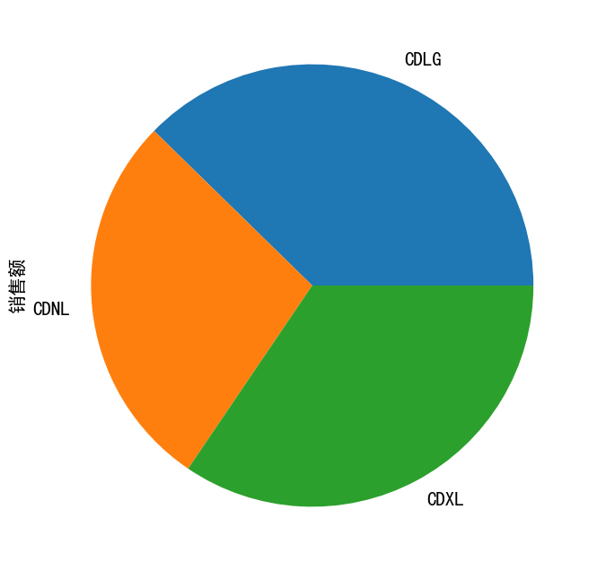
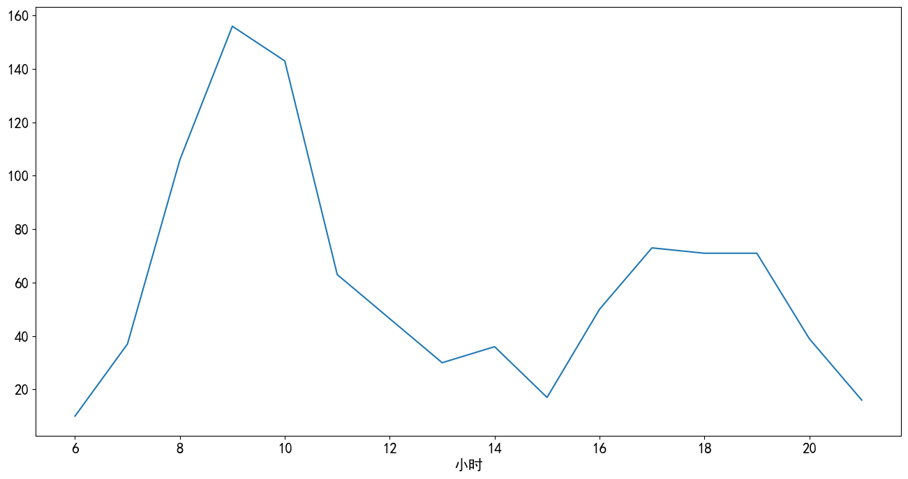

## 项目概览

- 项目领域：电商
- 技术关键词：数据透视表, 销售报表, 自动化分析, Excel
- 项目简介：零售经营最需要稳定、可复用的指标看板。相比复杂模型，自动化报表更贴近日常管理，能够持续回答销售额、利润、品类和区域表现。

## 学习目标

- 练习从业务背景出发提出可分析的问题，而不是只运行代码。
- 熟悉 pandas 数据透视、销售指标计算、自动化报表、经营维度拆解。
- 通过图表、指标和模型结果总结业务现象，并形成自己的理解。
- 将 notebook、图表和代码整理成可复盘、可展示的作品。

## 数据与方法

- 数据概况：超市订单销售数据，包含订单、商品、销售额、利润、地区和日期等字段。
- 技术路线：pandas 数据透视、销售指标计算、自动化报表、经营维度拆解。

## 分析过程与思路

- 先从业务背景出发，明确这份数据要回答什么问题，以及结论会影响什么决策。
- 检查数据口径，包括样本量、字段含义、缺失值、重复值和异常值。
- 围绕核心指标做拆解，例如价格、销量、转化、风险、留存、区域或人群结构。
- 用分组统计和可视化寻找差异，再结合业务常识判断差异是否有解释价值。
- 最后把发现转化为建议，并说明局限性和下一步需要补充的数据。

## 核心发现

- 销售额和利润需要同时看，高销售低利润的品类可能存在折扣或成本问题。
- 区域、品类和时间维度的交叉透视能快速定位经营异常。
- 自动化报表的价值在于降低重复劳动，让分析师把时间放在解释原因和提出动作上。

## 我的业务理解

这个项目的重点不是单纯把数据做成图，而是借助数据理解一个具体场景。整理文章时，我把代码执行过程、图表输出和业务解释放在同一篇文章里，方便以后回看自己当时的分析路径，也能作为个人数据分析作品集的一部分展示。

## 业务建议

- 建议把销售额、毛利、客单价、订单数和退货率作为核心日报指标。
- 对异常波动设置阈值提醒，并自动生成需要复盘的品类和区域清单。
- 后续可接入库存和促销数据，分析缺货、折扣和利润之间的关系。

## 项目复盘

- 亮点：项目不是单纯展示代码，而是从业务问题出发，能体现分析链路完整性。
- 不足：部分数据来自公开或学习数据集，缺少真实业务中的成本、实验和线上反馈。
- 优化：可以把 notebook 拆成数据清洗、特征工程、建模评估和可视化脚本，并补充 README、环境依赖和图表截图。

## 完整分析代码与输出图片

下面内容按原 notebook 的代码单元顺序整理。代码完整保留；如果 notebook 输出中包含 PNG 图表，也会导出为图片并嵌入文章。为了保证文章前半部分更适合阅读，完整代码默认放在折叠区。

<details>
<summary>展开查看完整 notebook 代码和输出图片</summary>


### 代码单元 1

```python
import pandas as pd
from datetime import datetime

# 导入数据源，parse_dates：将时间字符串转为日期时间格式
data=pd.read_csv("order-14.3.csv",parse_dates=["成交时间"],encoding='gbk')
print(data.shape)
data.head()
```

**文本输出**

```text
(3478, 7)
商品ID       类别ID  门店编号     单价     销量                成交时间  \
0  30006206  915000003  CDNL  25.23  0.328 2017-01-03 09:56:00   
1  30163281  914010000  CDNL   2.00  2.000 2017-01-03 09:56:00   
2  30200518  922000000  CDNL  19.62  0.230 2017-01-03 09:56:00   
3  29989105  922000000  CDNL   2.80  2.044 2017-01-03 09:56:00   
4  30179558  915000100  CDNL  47.41  0.226 2017-01-03 09:56:00   

                       订单ID  
0  20170103CDLG000210052759  
1  20170103CDLG000210052759  
2  20170103CDLG000210052759  
3  20170103CDLG000210052759  
4  20170103CDLG000210052759
```

### 代码单元 2

```python
# ascending=False 降序
data.groupby("类别ID")["销量"].sum().reset_index().sort_values(by="销量",ascending=False).head(10)
```

**文本输出**

```text
类别ID       销量
240  922000003  425.328
239  922000002  206.424
251  923000006  190.294
216  915030104  175.059
238  922000001  121.355
367  960000000  121.000
234  920090000  111.565
249  923000002   91.847
237  922000000   86.395
247  923000000   85.845
```

### 代码单元 3

```python
pd.pivot_table(data,index="商品ID",values="销量",aggfunc="sum").reset_index().sort_values(by="销量",ascending=False).head(10)
```

**文本输出**

```text
商品ID       销量
8    29989059  391.549
18   29989072  102.876
469  30022232  101.000
523  30031960   99.998
57   29989157   72.453
476  30023041   64.416
505  30026255   62.375
7    29989058   56.052
510  30027007   48.757
903  30171264   45.000
```

### 代码单元 4

```python
data["销售额"]=data["销量"]*data["单价"]
# 不同门店销售
print(data.groupby("门店编号")["销售额"].sum())
# 不同门店销售额占比
dfbb = data.groupby("门店编号")[["销售额"]].sum()/data["销售额"].sum()
dfbb.rename(columns={'销售额':'销售额占比'},inplace=True)
dfbb
```

**文本输出**

```text
门店编号
CDLG    10908.82612
CDNL     8059.47867
CDXL     9981.76166
Name: 销售额, dtype: float64
销售额占比
门店编号          
CDLG  0.376815
CDNL  0.278392
CDXL  0.344792
```

### 代码单元 5

```python
import matplotlib as plt

plt.rcParams['figure.figsize'] = (16.0, 8.0) # 设置figure_size尺寸
plt.rcParams['font.sans-serif']=['SimHei']    # 用来设置字体样式以正常显示中文标签
plt.rcParams['axes.unicode_minus']=False    # 默认是使用Unicode负号，设置正常显示字符，如正常显示负号
plt.rcParams['font.size'] = 15

(data.groupby("门店编号")["销售额"].sum()/data["销售额"].sum()).plot.pie()
```

**图表输出 1**



### 代码单元 6

```python
# 利用自定义时间格式函数strftime提取小时数
data["小时"]=data["成交时间"].map(lambda x:int(x.strftime("%H")))
# 对小时和订单去重
traffic=data[["小时","订单ID"]].drop_duplicates()
# 求每小时的客流量
traffic.groupby("小时")["订单ID"].count().plot()
```

**图表输出 1**



</details>
