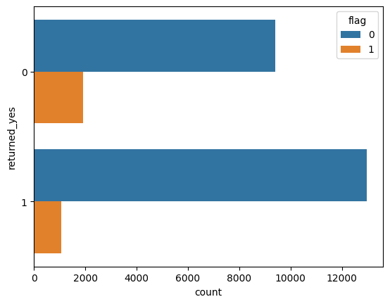
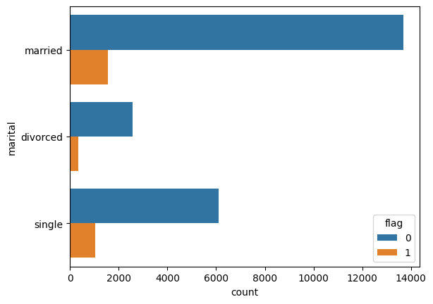
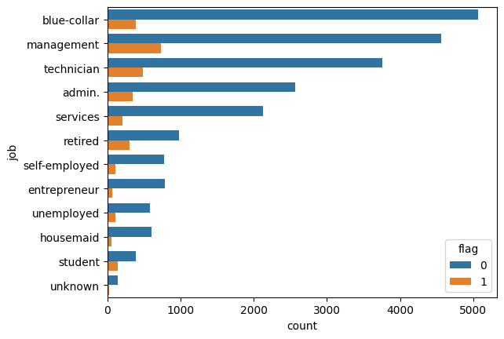
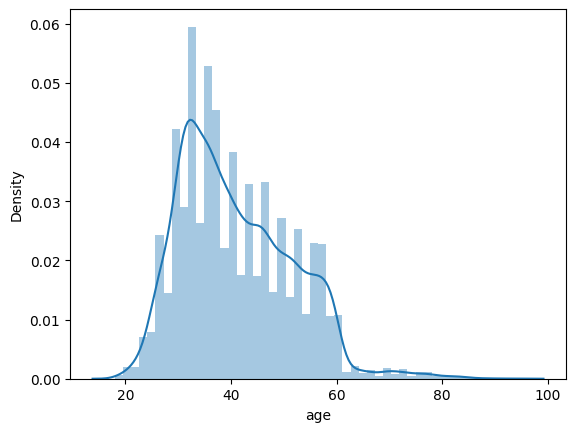
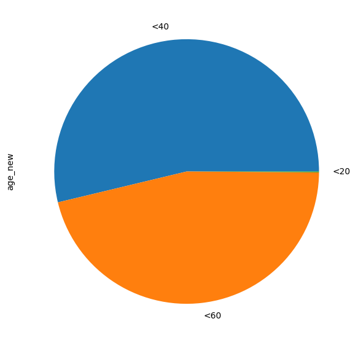
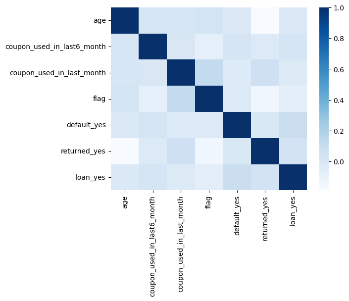

# 预测天猫用户使用优惠券概率：用逻辑回归识别高转化客群

## 摘要

| 模块     | 内容                                                         |
| -------- | ------------------------------------------------------------ |
| 业务场景 | 电商                                                         |
| 数据来源 | 天猫用户优惠券行为数据，包含用户特征、行为记录和是否使用优惠券等标签。 |
| 分析方法 | 特征处理、逻辑回归、分类评估、转化概率预测。                 |
| 结论先行 | 逻辑回归适合优惠券使用预测，因为它能输出概率并解释特征方向。 |

本报告围绕“业务背景、分析目的、数据说明、分析思路、分析过程、核心结论和改进建议”展开，目标是用数据回答具体问题，并把分析结果转化为可执行的判断。

## 一、分析背景

优惠券不是发得越多越好。关键是识别对优惠券敏感且有购买意愿的人群，降低补贴浪费，提高活动 ROI。

## 二、分析目的

本次分析主要回答以下问题：

- 哪些变量或特征最可能影响目标结果？
- 模型能否稳定识别高风险、高价值或高需求样本？
- 模型输出应该如何转化为业务动作，而不是停留在准确率上？

先明确分析目的，再开展数据处理和指标拆解，可以保证报告围绕问题展开，而不是简单罗列代码和图表。

## 三、数据来源与指标说明

| 项目           | 说明                                                         |
| -------------- | ------------------------------------------------------------ |
| 数据来源       | 天猫用户优惠券行为数据，包含用户特征、行为记录和是否使用优惠券等标签。 |
| 分析工具与方法 | 特征处理、逻辑回归、分类评估、转化概率预测。                 |
| 重点分析指标   | 目标变量分布、特征变量、训练/测试集、准确率、召回率、精确率、AUC 或混淆矩阵。 |
| 数据口径       | 本文以项目数据集中的字段为分析范围，先完成缺失值、异常值、重复值或类别字段处理，再围绕核心指标做统计、可视化或建模。 |

数据口径会直接影响分析结论，因此报告先说明数据范围、核心指标和处理方式，便于读者理解结论的适用边界。

## 四、分析思路

| 步骤                | 目的                                                         |
| ------------------- | ------------------------------------------------------------ |
| 1. 明确业务问题     | 确定分析要回答什么，以及结论会影响什么决策。                 |
| 2. 数据读取与清洗   | 处理缺失、重复、异常和字段格式问题，保证分析基础可靠。       |
| 3. 指标拆解与可视化 | 从趋势、结构、对比、分布或空间维度观察数据现象。             |
| 4. 建模或深度分析   | 根据项目需要完成聚类、预测、分类、回归、文本分析或可视化大屏。 |
| 5. 输出结论与建议   | 把数据发现翻译成业务语言，并给出可执行的下一步动作。         |

本项目的具体分析路径如下：

- 先把业务目标转成可建模问题：明确预测对象、标签字段、样本粒度和模型输出的业务含义。
- 做数据检查和探索：查看缺失值、异常值、类别分布、关键变量分布，以及目标变量是否存在不平衡。
- 完成特征处理：对类别变量编码，对数值变量缩放或标准化，并根据业务含义保留可解释变量。
- 建立基准模型并比较效果：优先选择可解释模型作为 baseline，再根据数据复杂度尝试树模型或集成模型。
- 把模型指标翻译成业务动作：例如风控看召回和误报，营销看转化和 ROI，预测类问题看高峰期误差。

## 五、数据处理过程

本项目的数据处理主要包括以下环节：

- 读取原始数据，检查字段类型、样本规模和基础统计信息。
- 处理缺失值、重复值、异常值或文本噪声，保证后续统计和建模结果可靠。
- 根据分析目标构造必要指标、标签或特征，并统一字段口径。
- 按业务维度进行分组、聚合、可视化或模型训练，为结论提供依据。

## 六、数据分析与结果

本部分按照“分析发现 -> 结果解读”的方式组织，重点说明数据体现出的现象及其业务含义。

### 1. 逻辑回归适合优惠券使用预测，因为它能输出概率并解释特征方向。

结果解读：该发现是本项目最核心的结论之一，说明数据中存在值得关注的结构性特征。对应图表或模型结果应围绕这一判断展开，帮助读者理解结论来源。

### 2. 高概率用户不一定都是最值得投放的人，还要区分自然转化用户和补贴驱动用户。

结果解读：该发现进一步解释了不同维度之间的差异。对业务决策而言，重点不只是看到差异，而是判断差异来自哪些对象、场景或指标。

### 3. 模型评估应关注精确率、召回率和分层转化率，而不只是整体准确率。

结果解读：该发现可以作为后续优化策略或模型改进的依据。若用于真实业务，还需要结合成本、资源、实验结果或线上反馈继续验证。

## 七、结论

综合以上分析，可以得到以下结论：

- 逻辑回归适合优惠券使用预测，因为它能输出概率并解释特征方向。
- 高概率用户不一定都是最值得投放的人，还要区分自然转化用户和补贴驱动用户。
- 模型评估应关注精确率、召回率和分层转化率，而不只是整体准确率。

## 八、建议

- 行动 1：优惠券投放应采用分层策略：高意向低补贴、中意向测试补贴、低意向减少打扰。
- 行动 2：建议设计 A/B 实验验证模型带来的增量转化，而不是只看领取或使用率。
- 行动 3：后续可引入 uplift modeling，识别真正因优惠券而增加购买的用户。
- 跟进方式：为每条建议绑定一个可观察指标，后续按周或按月复盘效果。

建议部分应结合具体对象、执行动作和复盘指标，避免停留在泛泛的“加强管理”或“优化运营”。

## 九、局限性与改进方向

- 项目价值：把历史行为转化为可预测信号，支持资源投放、供给调度、用户触达或收益管理。
- 真实限制：用户行为会受到活动、价格、库存、竞品和渠道曝光影响，单一数据集很难完整区分自然转化和营销带来的增量。
- 业务风险：如果直接按模型分数投放优惠券或资源，可能补贴本来就会购买的用户，造成 ROI 虚高和利润损失。
- 改进方向：按时间切分训练集和验证集，增加线上/线下指标对齐，避免随机切分高估模型效果。
- 改进方向：补充模型监控，包括数据漂移、预测分布、召回率、误报率和业务转化效果。
- 改进方向：补充价格、库存、优惠、曝光、退款和复购数据，把短期转化与长期用户价值结合起来评估。

## 附录：完整代码与输出结果

下面内容按原 notebook 的代码单元顺序整理。如果代码单元产生了文本输出或图片输出，也一并附在对应代码后面，便于复现完整分析过程。

### 代码单元 1

```python
#导入模块和数据
import pandas as pd
import matplotlib.pyplot as plt
import seaborn as sns

coupon = pd.read_csv('tianmao.csv')
coupon.head()
```

**文本输出**

```text
ID  age         job   marital default returned loan  \
0   1   43  management   married      no      yes   no   
1   2   42  technician  divorced      no      yes   no   
2   3   47      admin.   married      no      yes  yes   
3   4   28  management    single      no      yes  yes   
4   5   42  technician  divorced      no      yes   no   

   coupon_used_in_last6_month  coupon_used_in_last_month  coupon_ind  
0                           2                          0           0  
1                           1                          1           0  
2                           2                          0           0  
3                           2                          0           0  
4                           5                          0           0
```

### 代码单元 2

```python
#查看数据行列总数
coupon.shape
```

**文本输出**

```text
(25317, 10)
```

### 代码单元 3

```python
#查看数据是否有缺失值
coupon.info()
```

**文本输出**

```text
<class 'pandas.core.frame.DataFrame'>
RangeIndex: 25317 entries, 0 to 25316
Data columns (total 10 columns):
 #   Column                      Non-Null Count  Dtype 
---  ------                      --------------  ----- 
 0   ID                          25317 non-null  int64 
 1   age                         25317 non-null  int64 
 2   job                         25317 non-null  object
 3   marital                     25317 non-null  object
 4   default                     25317 non-null  object
 5   returned                    25317 non-null  object
 6   loan                        25317 non-null  object
 7   coupon_used_in_last6_month  25317 non-null  int64 
 8   coupon_used_in_last_month   25317 non-null  int64 
 9   coupon_ind                  25317 non-null  int64 
dtypes: int64(5), object(5)
memory usage: 1.9+ MB
```

### 代码单元 4

```python
#将类别型变量转换为数字型变量，便于之后分析
#但在本案例中，为了后续分析方便，只处理default, returned, loan这三个变量，保留job, marital
#把default、returned、loan三个变量单独取出来进行哑变量处理get_dummies()。
coupon1 = coupon[['default','returned','loan']]
coupon1 = pd.get_dummies(coupon1)
coupon1.head()
```

**文本输出**

```text
default_no  default_yes  returned_no  returned_yes  loan_no  loan_yes
0           1            0            0             1        1         0
1           1            0            0             1        1         0
2           1            0            0             1        0         1
3           1            0            0             1        0         1
4           1            0            0             1        1         0
```

### 代码单元 5

```python
#把处理后的表格和原表格进行拼接
coupon = pd.concat([coupon, coupon1], axis = 1)
coupon.head()
```

**文本输出**

```text
ID  age         job   marital default returned loan  \
0   1   43  management   married      no      yes   no   
1   2   42  technician  divorced      no      yes   no   
2   3   47      admin.   married      no      yes  yes   
3   4   28  management    single      no      yes  yes   
4   5   42  technician  divorced      no      yes   no   

   coupon_used_in_last6_month  coupon_used_in_last_month  coupon_ind  \
0                           2                          0           0   
1                           1                          1           0   
2                           2                          0           0   
3                           2                          0           0   
4                           5                          0           0   

   default_no  default_yes  returned_no  returned_yes  loan_no  loan_yes  
0           1            0            0             1        1         0  
1           1            0            0             1        1         0  
2           1            0            0             1        0         1  
3           1            0            0             1        0         1  
4           1            0            0       
... 输出过长，博客中已截断
```

### 代码单元 6

```python
#删除包含重复信息和无意义信息的数据
coupon.drop(['ID', 'default', 'default_no', 'returned', 'returned_no', 'loan', 'loan_no'], axis = 1, inplace = True)

#将coupon_ind重新命名为flag，便于之后分析
coupon = coupon.rename(columns = {'coupon_ind' : 'flag'})
coupon.info()
```

**文本输出**

```text
<class 'pandas.core.frame.DataFrame'>
RangeIndex: 25317 entries, 0 to 25316
Data columns (total 9 columns):
 #   Column                      Non-Null Count  Dtype 
---  ------                      --------------  ----- 
 0   age                         25317 non-null  int64 
 1   job                         25317 non-null  object
 2   marital                     25317 non-null  object
 3   coupon_used_in_last6_month  25317 non-null  int64 
 4   coupon_used_in_last_month   25317 non-null  int64 
 5   flag                        25317 non-null  int64 
 6   default_yes                 25317 non-null  uint8 
 7   returned_yes                25317 non-null  uint8 
 8   loan_yes                    25317 non-null  uint8 
dtypes: int64(4), object(2), uint8(3)
memory usage: 1.2+ MB
```

### 代码单元 7

```python
#二分类模型，观察样本(flag)0,1的平衡性
coupon['flag'].value_counts(1)
```

**文本输出**

```text
0    0.883043
1    0.116957
Name: flag, dtype: float64
```

### 代码单元 8

```python
#先按客户是否使用coupon进行分类聚合
summary = coupon.groupby(['flag'])
#求出各种情况均值的占比情况
summary.mean()
```

**文本输出**

```text
C:\Users\Administrator\AppData\Local\Temp\2\ipykernel_12876\2235428395.py:4: FutureWarning: The default value of numeric_only in DataFrameGroupBy.mean is deprecated. In a future version, numeric_only will default to False. Either specify numeric_only or select only columns which should be valid for the function.
  summary.mean()
age  coupon_used_in_last6_month  coupon_used_in_last_month  \
flag                                                                     
0     40.819601                    2.857846                   0.260378   
1     41.809524                    2.124282                   0.537994   

      default_yes  returned_yes  loan_yes  
flag                                       
0        0.018876      0.579755  0.169037  
1        0.008781      0.357649  0.094563
```

### 代码单元 9

```python
#观察returned_yes在flag上的分布
sns.countplot(y = 'returned_yes', hue = 'flag', data = coupon)
```

**图表输出 1**



### 代码单元 10

```python
#观察marital在flag上的分布
sns.countplot(y = 'marital', hue = 'flag', data = coupon)
```

**图表输出 1**



### 代码单元 11

```python
#观察job在flag上的分布
sns.countplot(y = 'job', hue = 'flag', data = coupon, order = coupon['job'].value_counts().index)
```

**图表输出 1**



### 代码单元 12

```python
#观察age在flag上的分布
sns.distplot(coupon['age'])
```

**文本输出**

```text
C:\Users\Administrator\AppData\Local\Temp\2\ipykernel_12876\966048336.py:2: UserWarning: 

`distplot` is a deprecated function and will be removed in seaborn v0.14.0.

Please adapt your code to use either `displot` (a figure-level function with
similar flexibility) or `histplot` (an axes-level function for histograms).

For a guide to updating your code to use the new functions, please see
https://gist.github.com/mwaskom/de44147ed2974457ad6372750bbe5751

  sns.distplot(coupon['age'])
```

**图表输出 1**



### 代码单元 13

```python
#查看age在整体数据的分布情况
coupon['age'].describe()
```

**文本输出**

```text
count    25317.000000
mean        40.935379
std         10.634289
min         18.000000
25%         33.000000
50%         39.000000
75%         48.000000
max         95.000000
Name: age, dtype: float64
```

### 代码单元 14

```python
#对于年龄进行快速分组，探究各个年龄段对于是否使用coupon的影响
age60 = coupon[coupon['age'] < 60]
bins = [0, 20, 40, 60]
labels = ['<20','<40','<60']
age60['age_new'] = pd.cut(age60.age, bins, right=False,labels = labels)
age60.groupby(['age_new'])['age'].describe()
```

**文本输出**

```text
C:\Users\Administrator\AppData\Local\Temp\2\ipykernel_12876\1778155165.py:5: SettingWithCopyWarning: 
A value is trying to be set on a copy of a slice from a DataFrame.
Try using .loc[row_indexer,col_indexer] = value instead

See the caveats in the documentation: https://pandas.pydata.org/pandas-docs/stable/user_guide/indexing.html#returning-a-view-versus-a-copy
  age60['age_new'] = pd.cut(age60.age, bins, right=False,labels = labels)
count       mean       std   min   25%   50%   75%   max
age_new                                                            
<20         25.0  18.760000  0.435890  18.0  19.0  19.0  19.0  19.0
<40      13063.0  32.569624  4.130196  20.0  30.0  33.0  36.0  39.0
<60      11215.0  48.416942  5.720111  40.0  43.0  48.0  53.0  59.0
```

### 代码单元 15

```python
age60['age_new'].describe()
```

**文本输出**

```text
count     24303
unique        3
top         <40
freq      13063
Name: age_new, dtype: object
```

### 代码单元 16

```python
#绘制age60['age_new']的饼图，使数据更加直观
plt.figure(figsize=[9,7])
age60['age_new'].value_counts().plot.pie()
plt.show()
```

**图表输出 1**



### 代码单元 17

```python
#围绕flag变量，观察它与其他变量的关系
coupon.corr()[['flag']].sort_values('flag', ascending = False)
```

**文本输出**

```text
C:\Users\Administrator\AppData\Local\Temp\2\ipykernel_12876\3374003348.py:2: FutureWarning: The default value of numeric_only in DataFrame.corr is deprecated. In a future version, it will default to False. Select only valid columns or specify the value of numeric_only to silence this warning.
  coupon.corr()[['flag']].sort_values('flag', ascending = False)
flag
flag                        1.000000
coupon_used_in_last_month   0.116550
age                         0.029916
default_yes                -0.024608
loan_yes                   -0.065231
coupon_used_in_last6_month -0.075173
returned_yes               -0.143589
```

### 代码单元 18

```python
sns.heatmap(coupon.corr(), cmap = 'Blues')
```

**文本输出**

```text
C:\Users\Administrator\AppData\Local\Temp\2\ipykernel_12876\2228719517.py:1: FutureWarning: The default value of numeric_only in DataFrame.corr is deprecated. In a future version, it will default to False. Select only valid columns or specify the value of numeric_only to silence this warning.
  sns.heatmap(coupon.corr(), cmap = 'Blues')
```

**图表输出 1**



### 代码单元 19

```python
#先设定自变量x和因变量y
x = coupon[['coupon_used_in_last_month', 'returned_yes', 'loan_yes']]
y = coupon['flag']
```

### 代码单元 20

```python
#调用sklearn模块，随机抽取训练集和测试集
from sklearn.model_selection import train_test_split
x_train, x_test, y_train, y_test = train_test_split(x, y, test_size = 0.3, random_state = 100) #训练集和测试集抽取比例为70/30

#调用sklearn中逻辑回归模块
from sklearn import linear_model
lr = linear_model.LogisticRegression()

#拟合
lr.fit(x_train, y_train)
```

**文本输出**

```text
LogisticRegression()
```

### 代码单元 21

```python
#查看系数
lr.coef_
```

**文本输出**

```text
array([[ 0.38674154, -0.95906584, -0.56226592]])
```

### 代码单元 22

```python
#查看截距
lr.intercept_
```

**文本输出**

```text
array([-1.63641623])
```

### 代码单元 23

```python
#通过训练集和测试集的自变量x，分别计算出对应的预测值
y_pred_train = lr.predict(x_train)
y_pred_test = lr.predict(x_test)
```

### 代码单元 24

```python
#搭建训练集混淆矩阵
from sklearn import metrics
metrics.confusion_matrix(y_train, y_pred_train)
```

**文本输出**

```text
array([[15596,    27],
       [ 2092,     6]], dtype=int64)
```

### 代码单元 25

```python
#查看训练集准确率
metrics.accuracy_score(y_train, y_pred_train)
```

**文本输出**

```text
0.8804243552846904
```

### 代码单元 26

```python
#搭建测试集混淆矩阵
metrics.confusion_matrix(y_test, y_pred_test)
```

**文本输出**

```text
array([[6722,   11],
       [ 862,    1]], dtype=int64)
```

### 代码单元 27

```python
#查看测试集准确率
metrics.accuracy_score(y_test, y_pred_test)
```

**文本输出**

```text
0.8850710900473934
```

### 代码单元 28

```python
#使用auc评估模型
from sklearn.metrics import roc_curve, auc
fpr,tpr,threshold = roc_curve(y_train, y_pred_train)
roc_auc = auc(fpr,tpr)

print(roc_auc)
```

**文本输出**

```text
0.5005658226636232
```

### 代码单元 29

```python
#新增变量returned_yes
x = coupon[['coupon_used_in_last_month', 'returned_yes', 'loan_yes', 'coupon_used_in_last6_month', 'default_yes', 'age']]
y = coupon['flag']
```

### 代码单元 30

```python
#调用sklearn模块，随机抽取训练集和测试集
from sklearn.model_selection import train_test_split
x_train, x_test, y_train, y_test = train_test_split(x, y, test_size = 0.3, random_state = 100) #训练集和测试集抽取比例为70/30

#调用sklearn中逻辑回归模块
from sklearn import linear_model
lr = linear_model.LogisticRegression()

#拟合
lr.fit(x_train, y_train)
```

**文本输出**

```text
LogisticRegression()
```

### 代码单元 31

```python
lr.coef_
```

**文本输出**

```text
array([[ 0.433019  , -0.98378658, -0.53258398, -0.16775221, -0.53713798,
         0.00114021]])
```

### 代码单元 32

```python
#使用auc评估模型
from sklearn.metrics import roc_curve, auc
fpr,tpr,threshold = roc_curve(y_train, y_pred_train)
roc_auc = auc(fpr,tpr)

print(roc_auc)
```

**文本输出**

```
0.5005658226636232
```

