# 小红书用户消费金额预测：用线性回归理解销售额驱动因素

## 摘要

| 模块     | 内容                                                         |
| -------- | ------------------------------------------------------------ |
| 业务场景 | 电商                                                         |
| 数据来源 | 小红书用户消费行为数据，包含购买金额、生命周期、最近下单间隔、历史消费和活动参与等字段。 |
| 分析方法 | 缺失值处理、哑变量编码、单变量分析、线性回归、statsmodels 系数解释、模型优化。 |
| 结论先行 | 历史购买金额和最近下单间隔通常能反映用户当前消费能力和活跃度。 |

本报告围绕“业务背景、分析目的、数据说明、分析思路、分析过程、核心结论和改进建议”展开，目标是用数据回答具体问题，并把分析结果转化为可执行的判断。

## 一、分析背景

社区电商的消费金额受用户生命周期、历史消费、近期活跃和活动参与共同影响。预测金额不是单纯为了估值，而是帮助运营找到提升 GMV 的杠杆。

## 二、分析目的

本次分析主要回答以下问题：

- 哪些变量或特征最可能影响目标结果？
- 模型能否稳定识别高风险、高价值或高需求样本？
- 模型输出应该如何转化为业务动作，而不是停留在准确率上？

先明确分析目的，再开展数据处理和指标拆解，可以保证报告围绕问题展开，而不是简单罗列代码和图表。

## 三、数据来源与指标说明

| 项目           | 说明                                                         |
| -------------- | ------------------------------------------------------------ |
| 数据来源       | 小红书用户消费行为数据，包含购买金额、生命周期、最近下单间隔、历史消费和活动参与等字段。 |
| 分析工具与方法 | 缺失值处理、哑变量编码、单变量分析、线性回归、statsmodels 系数解释、模型优化。 |
| 重点分析指标   | 目标变量、解释变量、相关性、回归系数、R2、残差和预测误差。   |
| 数据口径       | 本文以项目数据集中的字段为分析范围，先完成缺失值、异常值、重复值或类别字段处理，再围绕核心指标做统计、可视化或建模。 |

数据口径会直接影响分析结论，因此报告先说明数据范围、核心指标和处理方式，便于读者理解结论的适用边界。

## 四、分析思路

| 步骤                | 目的                                                         |
| ------------------- | ------------------------------------------------------------ |
| 1. 明确业务问题     | 确定分析要回答什么，以及结论会影响什么决策。                 |
| 2. 数据读取与清洗   | 处理缺失、重复、异常和字段格式问题，保证分析基础可靠。       |
| 3. 指标拆解与可视化 | 从趋势、结构、对比、分布或空间维度观察数据现象。             |
| 4. 建模或深度分析   | 根据项目需要完成聚类、预测、分类、回归、文本分析或可视化大屏。 |
| 5. 输出结论与建议   | 把数据发现翻译成业务语言，并给出可执行的下一步动作。         |

本项目的具体分析路径如下：

- 先把业务目标转成可建模问题：明确预测对象、标签字段、样本粒度和模型输出的业务含义。
- 做数据检查和探索：查看缺失值、异常值、类别分布、关键变量分布，以及目标变量是否存在不平衡。
- 完成特征处理：对类别变量编码，对数值变量缩放或标准化，并根据业务含义保留可解释变量。
- 建立基准模型并比较效果：优先选择可解释模型作为 baseline，再根据数据复杂度尝试树模型或集成模型。
- 把模型指标翻译成业务动作：例如风控看召回和误报，营销看转化和 ROI，预测类问题看高峰期误差。

## 五、数据处理过程

本项目的数据处理主要包括以下环节：

- 读取原始数据，检查字段类型、样本规模和基础统计信息。
- 处理缺失值、重复值、异常值或文本噪声，保证后续统计和建模结果可靠。
- 根据分析目标构造必要指标、标签或特征，并统一字段口径。
- 按业务维度进行分组、聚合、可视化或模型训练，为结论提供依据。

## 六、数据分析与结果

本部分按照“分析发现 -> 结果解读”的方式组织，重点说明数据体现出的现象及其业务含义。

### 1. 历史购买金额和最近下单间隔通常能反映用户当前消费能力和活跃度。

结果解读：该发现是本项目最核心的结论之一，说明数据中存在值得关注的结构性特征。对应图表或模型结果应围绕这一判断展开，帮助读者理解结论来源。

### 2. 生命周期变量可以帮助判断用户处于新客培育、成长期还是成熟期。

结果解读：该发现进一步解释了不同维度之间的差异。对业务决策而言，重点不只是看到差异，而是判断差异来自哪些对象、场景或指标。

### 3. 线性模型的优势在于可解释，适合向业务方说明哪些因素正在影响收入。

结果解读：该发现可以作为后续优化策略或模型改进的依据。若用于真实业务，还需要结合成本、资源、实验结果或线上反馈继续验证。

## 七、结论

综合以上分析，可以得到以下结论：

- 历史购买金额和最近下单间隔通常能反映用户当前消费能力和活跃度。
- 生命周期变量可以帮助判断用户处于新客培育、成长期还是成熟期。
- 线性模型的优势在于可解释，适合向业务方说明哪些因素正在影响收入。

## 八、建议

- 行动 1：对高历史消费但近期沉默用户做召回，对近期高活跃用户做关联推荐。
- 行动 2：活动参与变量应和真实增量 GMV 绑定，避免把本来就会购买的用户误判为活动效果。
- 行动 3：后续可使用分位数回归或树模型处理高消费用户长尾分布。
- 跟进方式：为每条建议绑定一个可观察指标，后续按周或按月复盘效果。

建议部分应结合具体对象、执行动作和复盘指标，避免停留在泛泛的“加强管理”或“优化运营”。

## 九、局限性与改进方向

- 项目价值：把历史行为转化为可预测信号，支持资源投放、供给调度、用户触达或收益管理。
- 真实限制：用户行为会受到活动、价格、库存、竞品和渠道曝光影响，单一数据集很难完整区分自然转化和营销带来的增量。
- 业务风险：如果直接按模型分数投放优惠券或资源，可能补贴本来就会购买的用户，造成 ROI 虚高和利润损失。
- 改进方向：按时间切分训练集和验证集，增加线上/线下指标对齐，避免随机切分高估模型效果。
- 改进方向：补充模型监控，包括数据漂移、预测分布、召回率、误报率和业务转化效果。
- 改进方向：补充价格、库存、优惠、曝光、退款和复购数据，把短期转化与长期用户价值结合起来评估。

## 附录：完整代码与输出结果

下面内容按原 notebook 的代码单元顺序整理。如果代码单元产生了文本输出或图片输出，也一并附在对应代码后面，便于复现完整分析过程。

### 代码单元 1

```python
# 本人的python是3.9版本，所以运行下面指令安装
```

**文本输出**

```text
Processing c:\users\administrator\cx_xiangmu\python数据分析\上架\2301-python数据分析与可视化项目\电商-预测小红书用户消费金额-约500行（线性回归模型）\statsmodels-0.13.5-cp39-cp39-win_amd64.whl
Requirement already satisfied: pandas>=0.25 in c:\users\administrator\envs\jv\lib\site-packages (from statsmodels==0.13.5) (1.5.2)
Requirement already satisfied: scipy>=1.3 in c:\users\administrator\envs\jv\lib\site-packages (from statsmodels==0.13.5) (1.10.0)
Requirement already satisfied: numpy>=1.17 in c:\users\administrator\envs\jv\lib\site-packages (from statsmodels==0.13.5) (1.24.1)
Requirement already satisfied: patsy>=0.5.2 in c:\users\administrator\envs\jv\lib\site-packages (from statsmodels==0.13.5) (0.5.3)
Requirement already satisfied: packaging>=21.3 in c:\users\administrator\envs\jv\lib\site-packages (from statsmodels==0.13.5) (22.0)
Requirement already satisfied: pytz>=2020.1 in c:\users\administrator\envs\jv\lib\site-packages (from pandas>=0.25->statsmodels==0.13.5) (2022.7)
Requirement already satisfied: python-dateutil>=2.8.1 in c:\users\administrator\envs\jv\lib\site-packages (from pandas>=0.25->statsmodels==0.13.5) (2.8.2)
Requirement already satisfied: six in c:\users\administrator\envs\jv\lib\site-packages (fr
... 
```

### 代码单元 2

```python
#导入模块
import matplotlib.pyplot as plt
import pandas as pd
import seaborn as sns
from sklearn.linear_model import LinearRegression
from statsmodels.formula.api import ols

#导入数据
red = pd.read_csv('redNew.csv')
red.head()
```

**文本输出**

```text
revenue  gender   age  engaged_last_30 lifecycle   days_since_last_order   \
0    72.98     1.0  59.0              0.0         B                     4.26   
1   200.99     1.0  51.0              0.0         A                     0.94   
2    69.98     1.0  79.0              0.0         C                     4.29   
3   649.99     NaN   NaN              NaN         C                    14.90   
4    83.59     NaN   NaN              NaN         C                    21.13   

   previous_order_amount  3rd_party_stores  
0               2343.870                 0  
1               8539.872                 0  
2               1687.646                 1  
3               3498.846                 0  
4               3968.490                 4
```

### 代码单元 3

```python
#查看数据信息
red.info()
```

**文本输出**

```text
<class 'pandas.core.frame.DataFrame'>
RangeIndex: 29452 entries, 0 to 29451
Data columns (total 8 columns):
 #   Column                   Non-Null Count  Dtype  
---  ------                   --------------  -----  
 0   revenue                  29452 non-null  float64
 1   gender                   17723 non-null  float64
 2   age                      16716 non-null  float64
 3   engaged_last_30          17723 non-null  float64
 4   lifecycle                29452 non-null  object 
 5    days_since_last_order   29452 non-null  float64
 6   previous_order_amount    29452 non-null  float64
 7   3rd_party_stores         29452 non-null  int64  
dtypes: float64(6), int64(1), object(1)
memory usage: 1.8+ MB
```

### 代码单元 4

```python
#查看缺失值占总数的比值
red.isnull().sum()/red.count()
```

**文本输出**

```text
revenue                    0.000000
gender                     0.661795
age                        0.761905
engaged_last_30            0.661795
lifecycle                  0.000000
 days_since_last_order     0.000000
previous_order_amount      0.000000
3rd_party_stores           0.000000
dtype: float64
```

### 代码单元 5

```python
#了解数据分布
red.describe()
```

**文本输出**

```text
revenue        gender           age  engaged_last_30  \
count   29452.000000  17723.000000  16716.000000     17723.000000   
mean      398.288037      0.950742     60.397404         0.073069   
std       960.251728      0.216412     14.823026         0.260257   
min         0.020000      0.000000     18.000000         0.000000   
25%        74.970000      1.000000     50.000000         0.000000   
50%       175.980000      1.000000     60.000000         0.000000   
75%       499.990000      1.000000     70.000000         0.000000   
max    103466.100000      1.000000     99.000000         1.000000   

        days_since_last_order   previous_order_amount  3rd_party_stores  
count             29452.000000           29452.000000      29452.000000  
mean                  7.711348            2348.904830          2.286059  
std                   6.489289            2379.774213          3.538219  
min                   0.130000               0.000000          0.000000  
25%                   2.190000             773.506250          0.000000  
50%                   5.970000            1655.980000          0.000000  
75%                  11.740000            3096.766500          3.000000  
... 输出过长，博客中已截断
```

### 代码单元 6

```python
#对于连续变量，可以用均值、中位数或者根据其他数据模型填充；
#对于类别变量，则可以把变量拆解为哑变量，再删除重复或没有意义的变量
#gender是类别型变量，先把缺失值填充为unknown
#即将gender拆解为gender_0, gender_1, gender_unknown, 每个变量用0/1表示
red['gender'] = red['gender'].fillna('unknown')
```

### 代码单元 7

```python
#engaged_last_30是类别型变量，也把缺失值填充为unknown
red['engaged_last_30'] = red['engaged_last_30'].fillna('unknown')
```

### 代码单元 8

```python
#类别型变量填充完毕后，剩下的连续型变量均可用均值填充和进行哑变量处理
#age是连续变量，用均值填充
red = red.fillna(red.mean(numeric_only=True))
red.info()
```

**文本输出**

```text
<class 'pandas.core.frame.DataFrame'>
RangeIndex: 29452 entries, 0 to 29451
Data columns (total 8 columns):
 #   Column                   Non-Null Count  Dtype  
---  ------                   --------------  -----  
 0   revenue                  29452 non-null  float64
 1   gender                   29452 non-null  object 
 2   age                      29452 non-null  float64
 3   engaged_last_30          29452 non-null  object 
 4   lifecycle                29452 non-null  object 
 5    days_since_last_order   29452 non-null  float64
 6   previous_order_amount    29452 non-null  float64
 7   3rd_party_stores         29452 non-null  int64  
dtypes: float64(4), int64(1), object(3)
memory usage: 1.8+ MB
```

### 代码单元 9

```python
#用户下单金额revenue
sns.distplot(red['revenue'])
```

**文本输出**

```text
C:\Users\Administrator\AppData\Local\Temp\2\ipykernel_18664\1230262749.py:2: UserWarning: 

`distplot` is a deprecated function and will be removed in seaborn v0.14.0.

Please adapt your code to use either `displot` (a figure-level function with
similar flexibility) or `histplot` (an axes-level function for histograms).

For a guide to updating your code to use the new functions, please see
https://gist.github.com/mwaskom/de44147ed2974457ad6372750bbe5751

  sns.distplot(red['revenue'])
```

**图表输出 1**

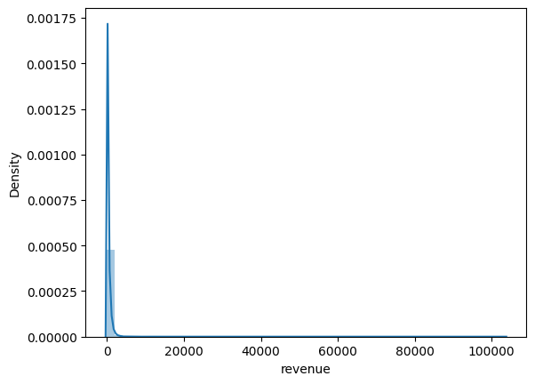

### 代码单元 10

```python
#用户以往累积购买金额previous_order_amount
sns.distplot(red['previous_order_amount'])
```

**文本输出**

```text
C:\Users\Administrator\AppData\Local\Temp\2\ipykernel_18664\696473424.py:2: UserWarning: 

`distplot` is a deprecated function and will be removed in seaborn v0.14.0.

Please adapt your code to use either `displot` (a figure-level function with
similar flexibility) or `histplot` (an axes-level function for histograms).

For a guide to updating your code to use the new functions, please see
https://gist.github.com/mwaskom/de44147ed2974457ad6372750bbe5751

  sns.distplot(red['previous_order_amount'])
```

**图表输出 1**

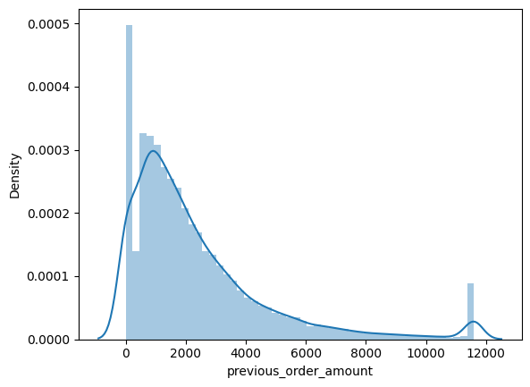

### 代码单元 11

```python
#年龄age
sns.distplot(red['age'])
```

**文本输出**

```text
C:\Users\Administrator\AppData\Local\Temp\2\ipykernel_18664\899722663.py:2: UserWarning: 

`distplot` is a deprecated function and will be removed in seaborn v0.14.0.

Please adapt your code to use either `displot` (a figure-level function with
similar flexibility) or `histplot` (an axes-level function for histograms).

For a guide to updating your code to use the new functions, please see
https://gist.github.com/mwaskom/de44147ed2974457ad6372750bbe5751

  sns.distplot(red['age'])
```

**图表输出 1**

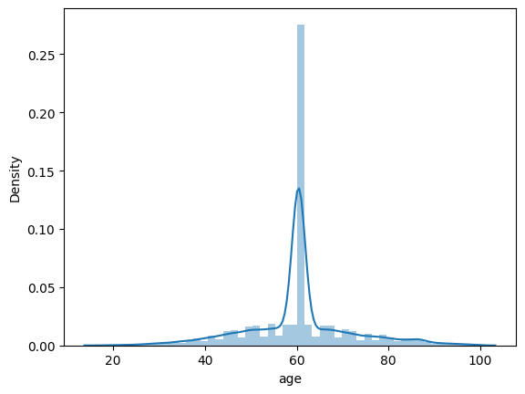

### 代码单元 12

```python
#年龄age的数据分布
red['age'].describe()
```

**文本输出**

```text
count    29452.000000
mean        60.397404
std         11.167091
min         18.000000
25%         58.000000
50%         60.397404
75%         62.000000
max         99.000000
Name: age, dtype: float64
```

### 代码单元 13

```python
#把 days_since_last_order 前面的空格删掉
red.rename(columns = {' days_since_last_order ':'days_since_last_order'}, inplace = True)
# red.info()

#用户最近一次下单距今的天数days_since_last_order
sns.distplot(red['days_since_last_order'])
```

**文本输出**

```text
C:\Users\Administrator\AppData\Local\Temp\2\ipykernel_18664\1827055157.py:6: UserWarning: 

`distplot` is a deprecated function and will be removed in seaborn v0.14.0.

Please adapt your code to use either `displot` (a figure-level function with
similar flexibility) or `histplot` (an axes-level function for histograms).

For a guide to updating your code to use the new functions, please see
https://gist.github.com/mwaskom/de44147ed2974457ad6372750bbe5751

  sns.distplot(red['days_since_last_order'])
```

**图表输出 1**

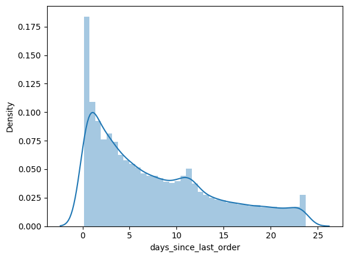

### 代码单元 14

```python
red['days_since_last_order'].describe()
```

**文本输出**

```text
count    29452.000000
mean         7.711348
std          6.489289
min          0.130000
25%          2.190000
50%          5.970000
75%         11.740000
max         23.710000
Name: days_since_last_order, dtype: float64
```

### 代码单元 15

```python
red
```

**文本输出**

```text
revenue   gender        age engaged_last_30 lifecycle  \
0        72.98      1.0  59.000000             0.0         B   
1       200.99      1.0  51.000000             0.0         A   
2        69.98      1.0  79.000000             0.0         C   
3       649.99  unknown  60.397404         unknown         C   
4        83.59  unknown  60.397404         unknown         C   
...        ...      ...        ...             ...       ...   
29447    43.19  unknown  60.397404         unknown         C   
29448    62.97      1.0  53.000000             0.0         C   
29449    87.26  unknown  60.397404         unknown         C   
29450    19.99      1.0  69.000000             0.0         C   
29451   741.93  unknown  60.397404         unknown         C   

       days_since_last_order  previous_order_amount  3rd_party_stores  
0                       4.26               2343.870                 0  
1                       0.94               8539.872                 0  
2                       4.29               1687.646                 1  
3                      14.90               3498.846                 0  
4                      21.13               3968.490                 4  
...   
... 输出过长，博客中已截断
```

### 代码单元 16

```python
#生命周期lifecycle
#不同生命周期(lifecycle)对应的revenue(销售额)是怎样的
#生命周期，分类为A,B,C（分别对应注册后6个月内，1年内，2年内）
red.groupby(red['lifecycle'])['revenue'].describe()
```

**文本输出**

```text
count        mean          std   min    25%      50%       75%  \
lifecycle                                                                     
A           3542.0  433.823171  1902.496280  0.02  71.93  170.945  483.8025   
B           5709.0  381.348012   605.828160  0.10  72.99  179.980  474.9600   
C          20201.0  396.844800   778.374439  0.02  74.99  174.980  513.9600   

                 max  
lifecycle             
A          103466.10  
B           21068.17  
C           62100.00
```

### 代码单元 17

```python
#不同生命周期计数
#red['lifecycle'].value_counts(dropna = False).plot(kind = 'bar')
sns.countplot(x = 'lifecycle', data = red, order = red['lifecycle'].value_counts().index)
```

**图表输出 1**

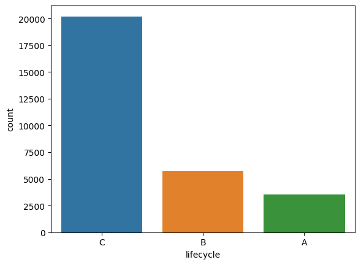

### 代码单元 18

```python
#不同生命周期的销售额平均值
sns.barplot(x = 'lifecycle', y = 'revenue', data = red)
```

**图表输出 1**

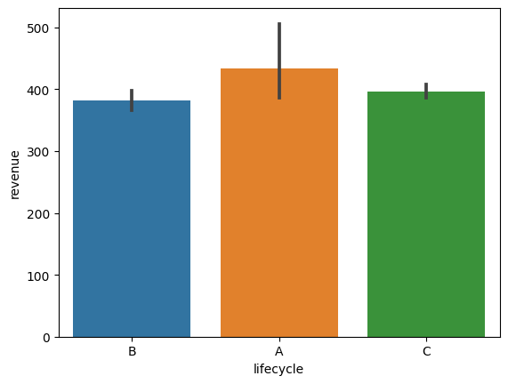

### 代码单元 19

```python
#不同生命周期的销售额总和
sns.barplot(x = 'lifecycle', y = 'revenue', data = red, order = red['lifecycle'].value_counts().index, estimator = sum)
```

**图表输出 1**

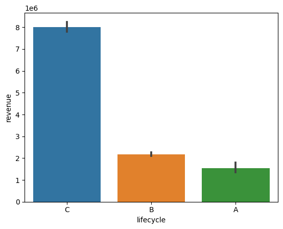

### 代码单元 20

```python
red['lifecycle'].describe()
```

**文本输出**

```text
count     29452
unique        3
top           C
freq      20201
Name: lifecycle, dtype: object
```

### 代码单元 21

```python
#不同性别(gender)对应的revenue(销售额)是怎样的
red.groupby(red['gender'])['revenue'].describe()
```

**文本输出**

```text
count        mean          std   min    25%     50%        75%  \
gender                                                                      
0.0        873.0  316.346802   566.606482  4.99  69.99  139.98  355.97000   
1.0      16850.0  387.972592   655.523780  0.02  73.16  175.98  494.20575   
unknown  11729.0  419.206270  1293.523770  0.02  75.96  179.00  528.99000   

               max  
gender              
0.0       11169.72  
1.0       29080.80  
unknown  103466.10
```

### 代码单元 22

```python
#不同性别计数
sns.countplot(x = 'gender', data = red, order = red['gender'].value_counts().index)
```

**图表输出 1**

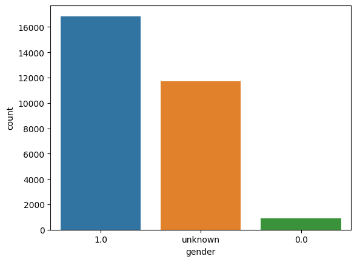

### 代码单元 23

```python
#不同性别的销售额平均值
#barplot() 默认展示的是某种变量分布的平均值（可通过参数修改为max、median 等）
sns.barplot(x = 'gender', y = 'revenue', data = red)
```

**图表输出 1**

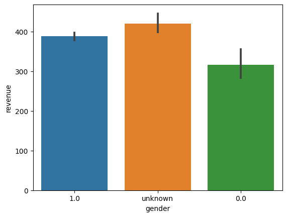

### 代码单元 24

```python
#不同性别的销售额总和
sns.barplot(x = 'gender', y = 'revenue', data = red, estimator = sum)
```

**图表输出 1**

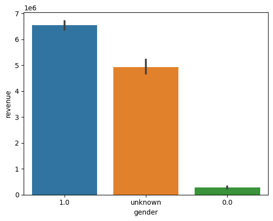

### 代码单元 25

```python
#最近30天在APP上参与重要活动与否对应的销售额是怎样的
red.groupby(['engaged_last_30'])['revenue'].describe()
```

**文本输出**

```text
count        mean          std   min     25%     50%  \
engaged_last_30                                                           
0.0              16428.0  369.839618   579.590923  0.02   71.18  160.37   
1.0               1295.0  569.717137  1230.162096  1.00  109.99  299.99   
unknown          11729.0  419.206270  1293.523770  0.02   75.96  179.00   

                    75%        max  
engaged_last_30                     
0.0              469.98   22214.92  
1.0              674.08   29080.80  
unknown          528.99  103466.10
```

### 代码单元 26

```python
#不同类别计数
sns.countplot(x = 'engaged_last_30', data = red, order = red['engaged_last_30'].value_counts().index)
```

**图表输出 1**

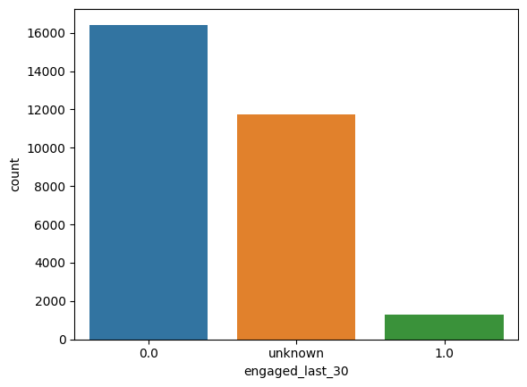

### 代码单元 27

```python
#最近30天在APP上参与重要活动与否对应的销售额平均值
sns.barplot(x = 'engaged_last_30', y = 'revenue', data = red)
```

**图表输出 1**

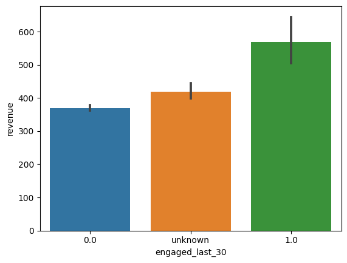

### 代码单元 28

```python
#最近30天在APP上参与重要活动与否对应的销售额总和
sns.barplot(x = 'engaged_last_30', y = 'revenue', data = red, estimator = sum)
```

**图表输出 1**

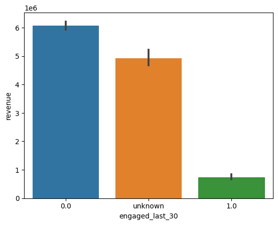

### 代码单元 29

```python
red['engaged_last_30'].describe()
```

**文本输出**

```text
count     29452.0
unique        3.0
top           0.0
freq      16428.0
Name: engaged_last_30, dtype: float64
```

### 代码单元 30

```python
#用户过往在第三方APP购买的数量
red['3rd_party_stores'].describe()
```

**文本输出**

```text
count    29452.000000
mean         2.286059
std          3.538219
min          0.000000
25%          0.000000
50%          0.000000
75%          3.000000
max         10.000000
Name: 3rd_party_stores, dtype: float64
```

### 代码单元 31

```python
#用户过往在第三方APP购买的数量计数
sns.countplot(x = '3rd_party_stores', data = red, order = red['3rd_party_stores'].value_counts().index)
```

**图表输出 1**

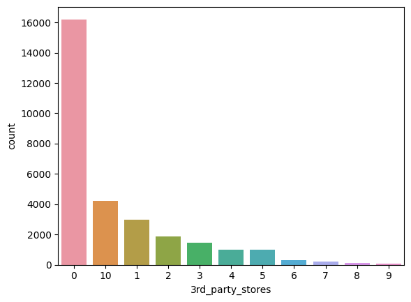

### 代码单元 32

```python
#用户过往在第三方APP购买的数量对应的销售额平均值
sns.barplot(x = '3rd_party_stores', y = 'revenue', data = red)
```

**图表输出 1**

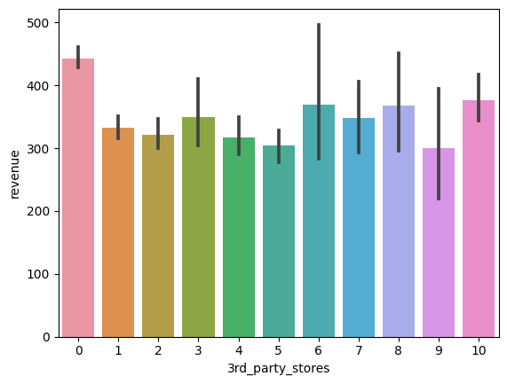

### 代码单元 33

```python
#用户过往在第三方APP购买的数量对应的销售额总和
sns.barplot(x = '3rd_party_stores', y = 'revenue', data = red, estimator = sum)
```

**图表输出 1**

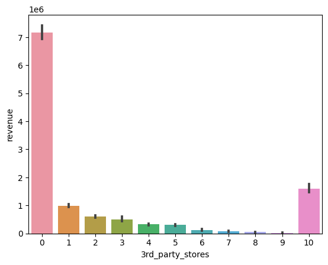

### 代码单元 34

```python
red.info()
```

**文本输出**

```text
<class 'pandas.core.frame.DataFrame'>
RangeIndex: 29452 entries, 0 to 29451
Data columns (total 8 columns):
 #   Column                 Non-Null Count  Dtype  
---  ------                 --------------  -----  
 0   revenue                29452 non-null  float64
 1   gender                 29452 non-null  object 
 2   age                    29452 non-null  float64
 3   engaged_last_30        29452 non-null  object 
 4   lifecycle              29452 non-null  object 
 5   days_since_last_order  29452 non-null  float64
 6   previous_order_amount  29452 non-null  float64
 7   3rd_party_stores       29452 non-null  int64  
dtypes: float64(4), int64(1), object(3)
memory usage: 1.8+ MB
```

### 代码单元 35

```python
# 将gender\lifecycle\engaged_last_30\生成哑变量
red=pd.get_dummies(red)
red.info()
```

**文本输出**

```text
<class 'pandas.core.frame.DataFrame'>
RangeIndex: 29452 entries, 0 to 29451
Data columns (total 14 columns):
 #   Column                   Non-Null Count  Dtype  
---  ------                   --------------  -----  
 0   revenue                  29452 non-null  float64
 1   age                      29452 non-null  float64
 2   days_since_last_order    29452 non-null  float64
 3   previous_order_amount    29452 non-null  float64
 4   3rd_party_stores         29452 non-null  int64  
 5   gender_0.0               29452 non-null  uint8  
 6   gender_1.0               29452 non-null  uint8  
 7   gender_unknown           29452 non-null  uint8  
 8   engaged_last_30_0.0      29452 non-null  uint8  
 9   engaged_last_30_1.0      29452 non-null  uint8  
 10  engaged_last_30_unknown  29452 non-null  uint8  
 11  lifecycle_A              29452 non-null  uint8  
 12  lifecycle_B              29452 non-null  uint8  
 13  lifecycle_C              29452 non-null  uint8  
dtypes: float64(4), int64(1), uint8(9)
memory usage: 1.4 MB
```

### 代码单元 36

```python
#cmap colormap(颜色映射)
sns.heatmap(red.corr(),cmap = 'Blues')
```

**图表输出 1**

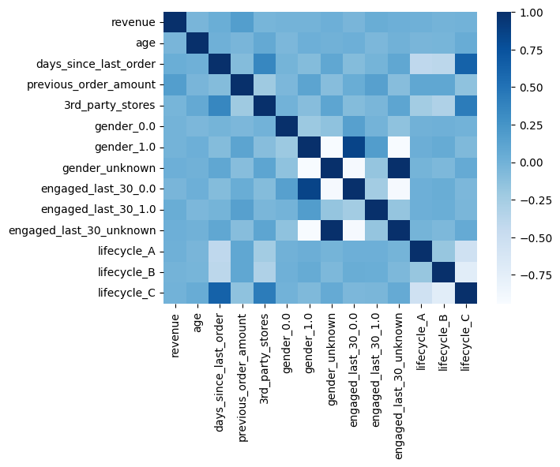

### 代码单元 37

```python
# 仅查看所有变量与revenue的相关性，同时根据相关性做降序排列展示
red.corr()[['revenue']].sort_values('revenue', ascending = False)
```

**文本输出**

```text
revenue
revenue                  1.000000
previous_order_amount    0.168540
engaged_last_30_1.0      0.038287
days_since_last_order    0.036654
gender_unknown           0.017722
engaged_last_30_unknown  0.017722
lifecycle_A              0.013683
lifecycle_C             -0.002221
lifecycle_B             -0.008651
gender_1.0              -0.012422
gender_0.0              -0.014914
3rd_party_stores        -0.026398
engaged_last_30_0.0     -0.033274
age                     -0.035801
```

### 代码单元 38

```python
#对days_since_last_order变量进行线性关系可视化分析
sns.regplot(data=red,x='days_since_last_order',y='revenue')
```

**图表输出 1**

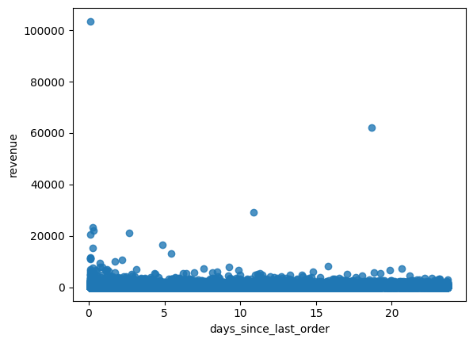

### 代码单元 39

```python
#对previous_order_amount变量进行线性关系可视化分析
sns.regplot(data=red,x='previous_order_amount',y='revenue')
```

**图表输出 1**

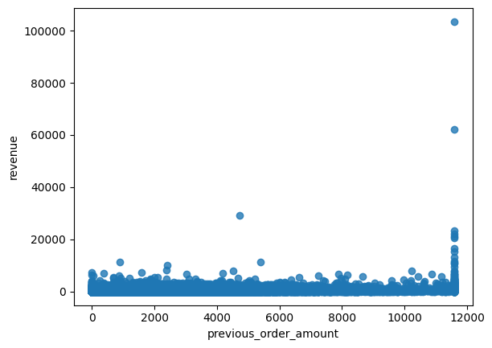

### 代码单元 40

```python
#对engaged_last_30_1.0变量进行线性关系可视化分析
sns.regplot(data=red,x='engaged_last_30_1.0',y='revenue')
```

**图表输出 1**

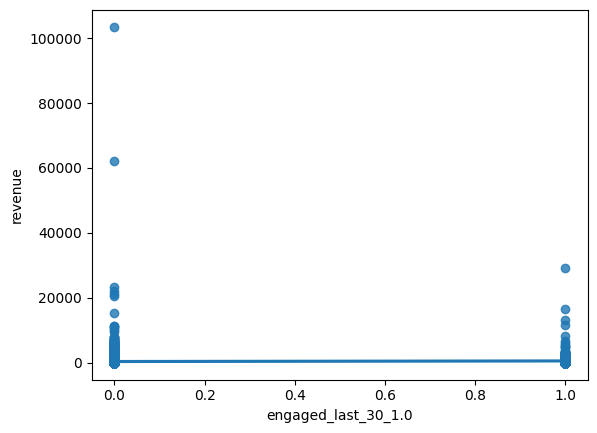

### 代码单元 41

```python
#对3rd_party_stores变量进行线性关系可视化分析
sns.regplot(data=red,x='3rd_party_stores',y='revenue')
```

**图表输出 1**

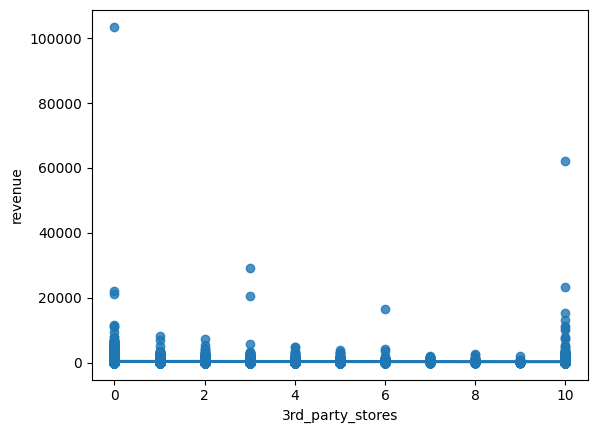

### 代码单元 42

```python
#对age变量进行线性关系可视化分析
sns.regplot(data=red,x='age',y='revenue')
```

**图表输出 1**

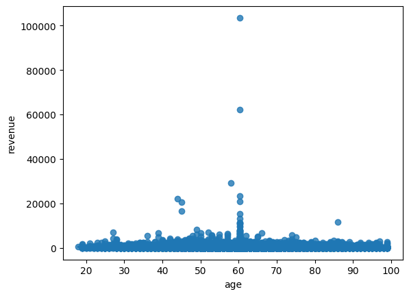

### 代码单元 43

```python
#对lifecycle_C变量进行线性关系可视化分析
sns.regplot(data=red,x='lifecycle_C',y='revenue')
```

**图表输出 1**

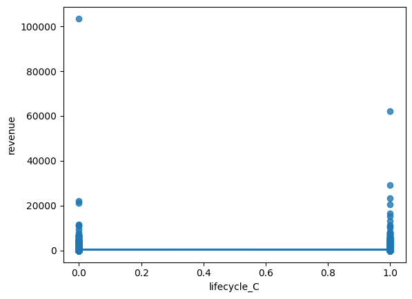

### 代码单元 44

```python
red.info()
```

**文本输出**

```text
<class 'pandas.core.frame.DataFrame'>
RangeIndex: 29452 entries, 0 to 29451
Data columns (total 14 columns):
 #   Column                   Non-Null Count  Dtype  
---  ------                   --------------  -----  
 0   revenue                  29452 non-null  float64
 1   age                      29452 non-null  float64
 2   days_since_last_order    29452 non-null  float64
 3   previous_order_amount    29452 non-null  float64
 4   3rd_party_stores         29452 non-null  int64  
 5   gender_0.0               29452 non-null  uint8  
 6   gender_1.0               29452 non-null  uint8  
 7   gender_unknown           29452 non-null  uint8  
 8   engaged_last_30_0.0      29452 non-null  uint8  
 9   engaged_last_30_1.0      29452 non-null  uint8  
 10  engaged_last_30_unknown  29452 non-null  uint8  
 11  lifecycle_A              29452 non-null  uint8  
 12  lifecycle_B              29452 non-null  uint8  
 13  lifecycle_C              29452 non-null  uint8  
dtypes: float64(4), int64(1), uint8(9)
memory usage: 1.4 MB
```

### 代码单元 45

```python
#导入模块
from sklearn.linear_model import LinearRegression
#建立一个空回归模型
model = LinearRegression()
#设定自变量和因变量
y = red['revenue']
x = red[['previous_order_amount','engaged_last_30_1.0','days_since_last_order']]
#拟合
model.fit(x,y)
#查看系数
model.coef_
```

**文本输出**

```text
array([ 0.06895217, 63.63927387,  7.62191879])
```

### 代码单元 46

```python
#查看截距
model.intercept_
```

**文本输出**

```text
174.7524798566092
```

### 代码单元 47

```python
#给x和y打分
score = model.score(x,y)
#通过x计算y的预测值
predictions = model.predict(x)
#计算误差
error = predictions - y
#计算rmse
rmse = (error**2).mean()**.5
#计算mae
mae = abs(error).mean()

print(rmse)
print(mae)
```

**文本输出**

```text
945.1327326407888
352.9825670606418
```

### 代码单元 48

```python
from statsmodels.formula.api import ols
model = ols('y~x', red).fit()
print(model.summary())
```

**文本输出**

```text
OLS Regression Results                            
==============================================================================
Dep. Variable:                      y   R-squared:                       0.031
Model:                            OLS   Adj. R-squared:                  0.031
Method:                 Least Squares   F-statistic:                     316.2
Date:                Mon, 12 Jun 2023   Prob (F-statistic):          4.33e-202
Time:                        01:01:16   Log-Likelihood:            -2.4358e+05
No. Observations:               29452   AIC:                         4.872e+05
Df Residuals:                   29448   BIC:                         4.872e+05
Df Model:                           3                                         
Covariance Type:            nonrobust                                         
==============================================================================
                 coef    std err          t      P>|t|      [0.025      0.975]
------------------------------------------------------------------------------
Intercept    174.7525     10.466     16.697      0.000     154.238     195.267
x[0]           0.0690      0.002     29.350
... 
```

### 代码单元 49

```python
#新增自变量lifecycle_C
#导入模块
from sklearn.linear_model import LinearRegression
#建立一个空回归模型
model = LinearRegression()
#设定自变量和因变量
y = red['revenue']
x = red[['previous_order_amount','engaged_last_30_1.0','days_since_last_order','lifecycle_C']]
#拟合
model.fit(x,y)
```

**文本输出**

```text
LinearRegression()
```

### 代码单元 50

```python
#给x和y打分
score = model.score(x,y)
#通过x计算y的预测值
predictions = model.predict(x)
#计算误差
error = predictions - y
#计算rmse
rmse = (error**2).mean()**.5
#计算mae
mae = abs(error).mean()

print(rmse)
print(mae)
```

**文本输出**

```text
945.0664751321227
352.6020358581733
```

### 代码单元 51

```python
from statsmodels.formula.api import ols
model = ols('y~x', red).fit()
print(model.summary())
```

**文本输出**

```
OLS Regression Results                            
==============================================================================
Dep. Variable:                      y   R-squared:                       0.031
Model:                            OLS   Adj. R-squared:                  0.031
Method:                 Least Squares   F-statistic:                     238.2
Date:                Mon, 12 Jun 2023   Prob (F-statistic):          1.07e-201
Time:                        01:01:20   Log-Likelihood:            -2.4357e+05
No. Observations:               29452   AIC:                         4.872e+05
Df Residuals:                   29447   BIC:                         4.872e+05
Df Model:                           4                                         
Covariance Type:            nonrobust                                         
==============================================================================
                 coef    std err          t      P>|t|      [0.025      0.975]
------------------------------------------------------------------------------
Intercept    186.8375     12.038     15.521      0.000     163.243     210.432
x[0]           0.0684      0.002     28.933
...
```

