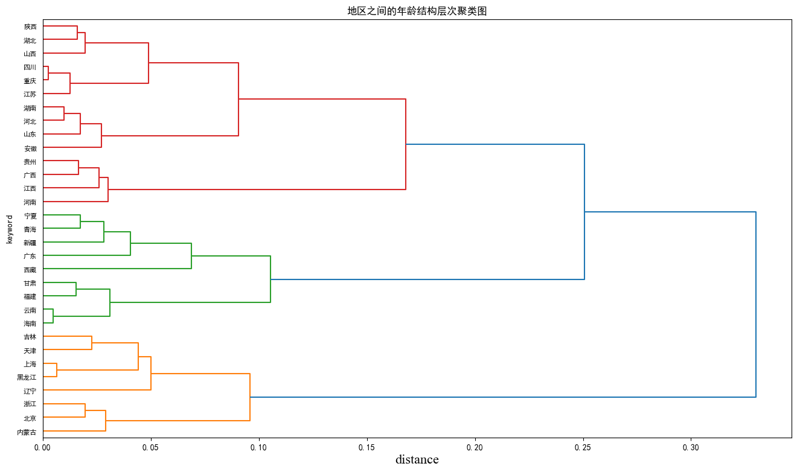

# 人口年龄结构分析：从老龄化、城镇化和 GDP 看区域发展

## 摘要

| 模块     | 内容                                                    |
| -------- | ------------------------------------------------------- |
| 业务场景 | 社会科学                                                |
| 数据来源 | 第七次人口普查年龄结构、地区人口、城镇人口和 GDP 数据。 |
| 分析方法 | 多源数据整合、结构占比计算、地图可视化、趋势对比。      |
| 结论先行 | 老龄化会改变消费结构，医疗、康养和社区服务需求上升。    |

本报告围绕“业务背景、分析目的、数据说明、分析思路、分析过程、核心结论和改进建议”展开，目标是用数据回答具体问题，并把分析结果转化为可执行的判断。

## 一、分析背景

年龄结构是判断区域长期活力的关键变量。年轻人口、劳动年龄人口和老年人口比例会影响消费、就业、产业和公共财政压力。

## 二、分析目的

本次分析主要回答以下问题：

- 数据在时间、区域、类别或人群维度上呈现什么结构？
- 哪些图表最适合承载趋势、对比、分布和异常信息？
- 可视化结果如何帮助读者快速定位重点？

先明确分析目的，再开展数据处理和指标拆解，可以保证报告围绕问题展开，而不是简单罗列代码和图表。

## 三、数据来源与指标说明

| 项目           | 说明                                                         |
| -------------- | ------------------------------------------------------------ |
| 数据来源       | 第七次人口普查年龄结构、地区人口、城镇人口和 GDP 数据。      |
| 分析工具与方法 | 多源数据整合、结构占比计算、地图可视化、趋势对比。           |
| 重点分析指标   | 总量、占比、趋势、排名、区域分布、类别结构和异常变化。       |
| 数据口径       | 本文以项目数据集中的字段为分析范围，先完成缺失值、异常值、重复值或类别字段处理，再围绕核心指标做统计、可视化或建模。 |

数据口径会直接影响分析结论，因此报告先说明数据范围、核心指标和处理方式，便于读者理解结论的适用边界。

## 四、分析思路

| 步骤                | 目的                                                         |
| ------------------- | ------------------------------------------------------------ |
| 1. 明确业务问题     | 确定分析要回答什么，以及结论会影响什么决策。                 |
| 2. 数据读取与清洗   | 处理缺失、重复、异常和字段格式问题，保证分析基础可靠。       |
| 3. 指标拆解与可视化 | 从趋势、结构、对比、分布或空间维度观察数据现象。             |
| 4. 建模或深度分析   | 根据项目需要完成聚类、预测、分类、回归、文本分析或可视化大屏。 |
| 5. 输出结论与建议   | 把数据发现翻译成业务语言，并给出可执行的下一步动作。         |

本项目的具体分析路径如下：

- 先梳理展示对象和受众：判断这篇分析主要给业务、管理层还是面试官阅读。
- 根据问题选择图表：趋势看折线，结构看占比，对比看柱状图，空间分布看地图。
- 先用 pandas 聚合出清晰指标，再用可视化表达核心结论。
- 按照故事线组织图表顺序，避免图很多但结论分散。
- 每张图都配业务解释，让读者知道图表对应什么判断和行动。

## 五、数据处理过程

本项目的数据处理主要包括以下环节：

- 读取原始数据，检查字段类型、样本规模和基础统计信息。
- 处理缺失值、重复值、异常值或文本噪声，保证后续统计和建模结果可靠。
- 根据分析目标构造必要指标、标签或特征，并统一字段口径。
- 按业务维度进行分组、聚合、可视化或模型训练，为结论提供依据。

## 六、数据分析与结果

本部分按照“分析发现 -> 结果解读”的方式组织，重点说明数据体现出的现象及其业务含义。

### 1. 老龄化会改变消费结构，医疗、康养和社区服务需求上升。

结果解读：该发现是本项目最核心的结论之一，说明数据中存在值得关注的结构性特征。对应图表或模型结果应围绕这一判断展开，帮助读者理解结论来源。

### 2. 劳动年龄人口占比影响区域产业承载能力和企业招聘难度。

结果解读：该发现进一步解释了不同维度之间的差异。对业务决策而言，重点不只是看到差异，而是判断差异来自哪些对象、场景或指标。

### 3. 城镇化和 GDP 数据可以帮助解释人口流动背后的经济吸引力。

结果解读：该发现可以作为后续优化策略或模型改进的依据。若用于真实业务，还需要结合成本、资源、实验结果或线上反馈继续验证。

## 七、结论

综合以上分析，可以得到以下结论：

- 老龄化会改变消费结构，医疗、康养和社区服务需求上升。
- 劳动年龄人口占比影响区域产业承载能力和企业招聘难度。
- 城镇化和 GDP 数据可以帮助解释人口流动背后的经济吸引力。

## 八、建议

- 行动 1：企业做区域扩张时应关注目标城市的人口年龄结构和人才供给。
- 行动 2：政府和公共服务应提前规划养老、医疗和教育资源。
- 行动 3：后续可加入出生率、迁入迁出和产业就业数据，提高趋势判断能力。
- 跟进方式：为每条建议绑定一个可观察指标，后续按周或按月复盘效果。

建议部分应结合具体对象、执行动作和复盘指标，避免停留在泛泛的“加强管理”或“优化运营”。

## 九、局限性与改进方向

- 项目价值：把分散数据组织成趋势、结构、对比和空间分布，让管理者能快速识别重点对象和异常变化。
- 真实限制：人口和社会统计数据更新周期长，区域口径、年份口径和统计口径变化会影响跨期比较。
- 业务风险：宏观数据只能支持方向判断，不能直接替代城市选址、产品定价或公共资源配置中的微观调研。
- 改进方向：将静态分析升级为可定期刷新的监控看板，并为异常指标设置阈值提醒。
- 改进方向：为关键图表补充下钻维度，使管理者能从总览进一步定位到地区、品类、用户或时间段。
- 改进方向：结合 GDP、就业、房价、产业结构和迁徙数据，避免只用单一人口指标解释区域差异。

## 附录：完整代码与输出结果

下面内容按原 notebook 的代码单元顺序整理。如果代码单元产生了文本输出或图片输出，也一并附在对应代码后面，便于复现完整分析过程。

### 代码单元 1

```python
# 显示cell运行时长
# %load_ext klab-autotime
```

### 代码单元 2

```python
import pandas as pd
import numpy as np
import altair as alt
from pyecharts.globals import CurrentConfig, NotebookType,OnlineHostType
CurrentConfig.NOTEBOOK_TYPE = NotebookType.JUPYTER_NOTEBOOK

age_dist_data_path  = "./data/各地区人口年龄构成.csv"
raw_age_df = pd.read_csv(age_dist_data_path, skiprows=2)
raw_age_df.head(50)
```

**文本输出**

```text
Unnamed: 0  0—14 岁  15—59 岁    60  岁及以上  其中：65 岁及以上 
0        全 国    17.95      63.35      18.70      13.50 
1        北  京   11.84      68.53      19.63        13.3
2        天  津   13.47      64.87      21.66       14.75
3        河  北   20.22      59.92      19.85       13.92
4        山  西   16.35      64.72      18.92        12.9
5         内蒙古   14.04      66.17      19.78       13.05
6        辽  宁   11.12      63.16      25.72       17.42
7        吉  林   11.71      65.23      23.06       15.61
8         黑龙江   10.32      66.46      23.22       15.61
9        上  海    9.80      66.82      23.38       16.28
10       江  苏   15.21      62.95      21.84        16.2
11       浙  江   13.45      67.86      18.70       13.27
12       安  徽   19.24      61.96      18.79       15.01
13       福  建   19.32      64.70      15.98        11.1
14       江  西   21.96      61.17      16.87       11.89
15       山  东   18.78      60.32      20.90       15.13
16       河  南   23.14      58.79      18.08       13.49
17       湖  北   16.31      63.26      20.42       14.59
18       湖  南   19.52      60.60      19.88       14.81
19       广  东   18.85      68.80      12.35        8.58
20       广  西   23.63      
... 输出过长，博客中已截断
```

### 代码单元 3

```python
column_name_map = {
    "Unnamed: 0":"region",
    "0—14 岁":"a14-",
    "15—59 岁  ":"a15_59",
    "60  岁及以上 ":"a60+",
    "其中：65 岁及以上 ":"a65+",
}

age_df = raw_age_df.rename(column_name_map,axis=1)
age_df["a65+"] = age_df["a65+"].astype(np.float64)
age_df[["a14-","a15_59","a60+","a65+"]] = age_df[["a14-","a15_59","a60+","a65+"]]/100
```

### 代码单元 4

```python
import re

def parse_region(x):
    _x = re.sub(r"[\W\d]","",x)
    if _x[:3] in ["黑龙江","内蒙古"]:
        return _x[:3]
    else:
        return _x[:2]

assert parse_region("广 东") == "广东"
assert parse_region("全 国[1]") == "全国"
assert parse_region("黑龙江省") == "黑龙江"
assert parse_region("广西壮族自治区") == "广西"

age_df["region"] = age_df["region"].map(parse_region)

# age_df[age_df["region"] != "全国"].describe()
age_df.head()
```

**文本输出**

```text
region    a14-  a15_59    a60+    a65+
0     全国  0.1795  0.6335  0.1870  0.1350
1     北京  0.1184  0.6853  0.1963  0.1330
2     天津  0.1347  0.6487  0.2166  0.1475
3     河北  0.2022  0.5992  0.1985  0.1392
4     山西  0.1635  0.6472  0.1892  0.1290
```

### 代码单元 5

```python
edu_data_path = "./data/各地区每10万人口中拥有的各类受教育程度人数.csv"

edu_raw_df = pd.read_csv(edu_data_path,skiprows=1)
edu_raw_df.head()
```

**文本输出**

```text
地区 \n单位：人/10 万人  大学\n（大专及以上）  高中\n(含中专)    初中      小学
0            全 国         15467      15088  34507  24767
1            北  京        41980      17593  23289  10503
2            天  津        26940      17719  32294  16123
3            河  北        12418      13861  39950  24664
4            山  西        17358      16485  38950  19506
```

### 代码单元 6

```python
edu_df = edu_raw_df.copy()
edu_df.columns = ["region","edu_college","edu_senior","edu_junior","edu_primary"]

edu_df["region"] = edu_df["region"].map(parse_region)

divide_base = 100000
edu_df[["edu_college","edu_senior","edu_junior","edu_primary"]] = edu_df[["edu_college","edu_senior","edu_junior","edu_primary"]]/divide_base

edu_df.head()
```

**文本输出**

```text
region  edu_college  edu_senior  edu_junior  edu_primary
0     全国      0.15467     0.15088     0.34507      0.24767
1     北京      0.41980     0.17593     0.23289      0.10503
2     天津      0.26940     0.17719     0.32294      0.16123
3     河北      0.12418     0.13861     0.39950      0.24664
4     山西      0.17358     0.16485     0.38950      0.19506
```

### 代码单元 7

```python
pop_data_path = "./data/各地区人口.csv"

pop_raw_df = pd.read_csv(pop_data_path,skiprows=2)
# pop_raw_df.head(10)
```

### 代码单元 8

```python
pop_df = pop_raw_df.copy()
new_pop_df_columns = ["region",'population','pop_percent_2020','pop_percent_2010']
if len(pop_df.columns) == 4:
    pop_df.columns = new_pop_df_columns
    pop_df.drop(['pop_percent_2020','pop_percent_2010'],axis=1,inplace=True)
pop_df["region"] = pop_df["region"].map(parse_region)

pop_df = pop_df[pop_df["region"] != "现役"]
pop_df
```

**文本输出**

```text
region  population
0      全国  1411778724
1      北京    21893095
2      天津    13866009
3      河北    74610235
4      山西    34915616
5     内蒙古    24049155
6      辽宁    42591407
7      吉林    24073453
8     黑龙江    31850088
9      上海    24870895
10     江苏    84748016
11     浙江    64567588
12     安徽    61027171
13     福建    41540086
14     江西    45188635
15     山东   101527453
16     河南    99365519
17     湖北    57752557
18     湖南    66444864
19     广东   126012510
20     广西    50126804
21     海南    10081232
22     重庆    32054159
23     四川    83674866
24     贵州    38562148
25     云南    47209277
26     西藏     3648100
27     陕西    39528999
28     甘肃    25019831
29     青海     5923957
30     宁夏     7202654
31     新疆    25852345
```

### 代码单元 9

```python
gdp_data_path = "./data/分省年度GDP数据.csv"

gdp_raw_df = pd.read_csv(gdp_data_path)
# gdp_raw_df.head()
```

### 代码单元 10

```python
gdp_df = gdp_raw_df.loc[:,["地区","2020年"]]
gdp_df.columns = ["region", "gdp"]
# GDP的单位：亿元
gdp_df["region"] = gdp_df["region"].map(parse_region)
gdp_df
```

**文本输出**

```text
region       gdp
0      北京   36102.6
1      天津   14083.7
2      河北   36206.9
3      山西   17651.9
4     内蒙古   17359.8
5      辽宁   25115.0
6      吉林   12311.3
7     黑龙江   13698.5
8      上海   38700.6
9      江苏  102719.0
10     浙江   64613.3
11     安徽   38680.6
12     福建   43903.9
13     江西   25691.5
14     山东   73129.0
15     河南   54997.1
16     湖北   43443.5
17     湖南   41781.5
18     广东  110760.9
19     广西   22156.7
20     海南    5532.4
21     重庆   25002.8
22     四川   48598.8
23     贵州   17826.6
24     云南   24521.9
25     西藏    1902.7
26     陕西   26181.9
27     甘肃    9016.7
28     青海    3005.9
29     宁夏    3920.6
30     新疆   13797.6
```

### 代码单元 11

```python
city_pop_data_path = "./data/2005-2019年中国各地区城镇人口数量.csv"
residential_pop_data_path = "./data/2001-2020中国各地区常住人口数量.csv"
city_pop_2000_data_path = "./data/2000年中国各地区城乡人口分布.csv"

city_pop_df = pd.read_csv(city_pop_data_path)
res_pop_df = pd.read_csv(residential_pop_data_path)
city_pop_2000_df = pd.read_csv(city_pop_2000_data_path)

selected_years = [f"{year}年" for year in range(2005,2020)]

urbanization_df_05_19 = city_pop_df.set_index("地区")[selected_years]/res_pop_df.set_index("地区")[selected_years]
urbanization_df_05_19.index.name = "region"
urbanization_df_05_19.index = map(parse_region,urbanization_df_05_19.index.values)
urbanization_df_05_19

city_pop_2000_mdf = city_pop_2000_df.assign(
    region = city_pop_2000_df["地区"].map(parse_region),
    _2000 = city_pop_2000_df["城镇人口比例"] / 100
).set_index("region")[["_2000"]].rename({"_2000":"2000年"},axis=1)

urbanization_df = pd.concat([city_pop_2000_mdf,urbanization_df_05_19],axis=1).round(4)
# urbanization_df
```

### 代码单元 12

```python
urba_first_over_year = pd.concat(
    [(urbanization_df>percent).T.apply(lambda x:x[x==True].index.min())
 for percent in [0.4,0.5,0.6,0.7]],axis=1)

urbs_over_year_columns = ["urba_over_40","urba_over_50","urba_over_60","urba_over_70"]
urba_first_over_year.columns = urbs_over_year_columns

def parse_urba_over_year(year):
    if isinstance(year,str):
        return (2020 - int(year.replace("年","")))/20
    else:
        return np.NaN
for column in urbs_over_year_columns:
    urba_first_over_year[column] = urba_first_over_year[column].map(parse_urba_over_year)
# urba_first_over_year
# urbanization_df.columns.min()
```

### 代码单元 13

```python
urba_year_column_map = {
    "2000年":"urba_2000",
"2005年":"urba_2005",
"2010年":"urba_2010",
"2015年":"urba_2015",
"2019年":"urba_2019",
}

urba_info_df = pd.concat([
    urbanization_df[urba_year_column_map.keys()].rename(urba_year_column_map,axis=1),
    urba_first_over_year],axis=1)
urba_info_df
```

**文本输出**

```text
urba_2000  urba_2005  urba_2010  urba_2015  urba_2019  urba_over_40  \
北京      0.7754     0.8362     0.8593     0.8579     0.8516          1.00   
天津      0.7199     0.7507     0.7960     0.8881     0.9415          1.00   
河北      0.2608     0.3769     0.4450     0.5189     0.5874          0.65   
山西      0.3491     0.4212     0.4804     0.5729     0.6351          0.75   
内蒙古     0.4268     0.4719     0.5550     0.6205     0.6663          1.00   
辽宁      0.5424     0.5871     0.6210     0.6805     0.6930          1.00   
吉林      0.4968     0.5250     0.5333     0.5829     0.6405          1.00   
黑龙江     0.5154     0.5309     0.5567     0.6350     0.7017          1.00   
上海      0.8831     0.8910     0.8927     0.8609     0.8642          1.00   
江苏      0.4149     0.5050     0.6058     0.6381     0.6728          1.00   
浙江      0.4867     0.5602     0.6161     0.6090     0.6424          1.00   
安徽      0.2781     0.3551     0.4301     0.5162     0.5832          0.60   
福建      0.4157     0.4940     0.5711     0.6032     0.6386          1.00   
江西      0.2767     0.3700     0.4406     0.5255     0.5932          0.60   
山东      0.3800     0.4500     0.4970     0.5690     0.6129       
... 输出过长，博客中已截断
```

### 代码单元 14

```python
from io import StringIO

# 数据来自国家统计年鉴2021
floating_pop_data_txt = '''
地区	省内	省外
北京市	4991158	8418418
天津市	2944879	3534816
河北省	16620369	3155272
山西省	11270656	1620518
内蒙古自治区	9776541	1686420
辽宁省	12822813	2847308
吉林省	9349212	1001471
黑龙江省	10720408	829176
上海市	4654606	10479652
江苏省	19671338	10308610
浙江省	13921361	16186454
安徽省	16549409	1550509
福建省	11574735	4889876
江西省	12241920	1279014
山东省	23897755	4129007
河南省	24365959	1273646
湖北省	16226947	2249614
湖南省	15998284	1577563
广东省	31012976	29622110
广西壮族自治区	11879397	1359384
海南省	2410018	1088143
重庆市	10902860	2193575
四川省	25233163	2590041
贵州省	10548217	1146546
云南省	9978920	2230394
西藏自治区	624011	407121
陕西省	11333383	1933712
甘肃省	6586817	765648
青海省	1653356	417304
宁夏回族自治区	2687551	675119
新疆维吾尔自治区	5476334	3390712
'''

floating_pop_df = pd.read_csv(StringIO(floating_pop_data_txt),sep="\t")
floating_pop_df = floating_pop_df.assign(
    region=floating_pop_df["地区"].map(parse_region),
).rename(
    {
        "省内":"floating_pop_inside",
        "省外":"floating_pop_outside"
    },
    axis=1
)[["floating_pop_inside","floating_pop_outside","region"]].set_index("region")

floating_pop_df
```

**文本输出**

```text
floating_pop_inside  floating_pop_outside
region                                           
北京                  4991158               8418418
天津                  2944879               3534816
河北                 16620369               3155272
山西                 11270656               1620518
内蒙古                 9776541               1686420
辽宁                 12822813               2847308
吉林                  9349212               1001471
黑龙江                10720408                829176
上海                  4654606              10479652
江苏                 19671338              10308610
浙江                 13921361              16186454
安徽                 16549409               1550509
福建                 11574735               4889876
江西                 12241920               1279014
山东                 23897755               4129007
河南                 24365959               1273646
湖北                 16226947               2249614
湖南                 15998284               1577563
广东                 31012976              29622110
广西                 11879397               1359384
海南                  2410018               1088143
重庆                 10902860               2193575
四川      
... 输出过长，博客中已截断
```

### 代码单元 15

```python
# age_df.set_index("region")
```

### 代码单元 16

```python
# df = pd.merge(pd.merge(pd.merge(age_df,edu_df,on="region"),pop_df,on="region"),gdp_df,on="region")
df = pd.concat([
    age_df.set_index("region"),
    pop_df.set_index("region"),
    gdp_df.set_index("region"),
    edu_df.set_index("region"),
    urba_info_df,
    floating_pop_df],axis=1).drop("全国")
assert len(df.index) == 31

df = df.assign(
    gdp_avg = df["gdp"] * 10000 / df["population"],
    floating_inside_rate = df["floating_pop_inside"]/df["population"],
    floating_outside_rate = df["floating_pop_outside"]/df["population"],
    floating_rate = (df["floating_pop_inside"] + df["floating_pop_outside"])/df["population"]
)
df.index.name = "region"
df.head(10)
```

**文本输出**

```text
a14-  a15_59    a60+    a65+  population       gdp  edu_college  \
region                                                                      
北京      0.1184  0.6853  0.1963  0.1330    21893095   36102.6      0.41980   
天津      0.1347  0.6487  0.2166  0.1475    13866009   14083.7      0.26940   
河北      0.2022  0.5992  0.1985  0.1392    74610235   36206.9      0.12418   
山西      0.1635  0.6472  0.1892  0.1290    34915616   17651.9      0.17358   
内蒙古     0.1404  0.6617  0.1978  0.1305    24049155   17359.8      0.18688   
辽宁      0.1112  0.6316  0.2572  0.1742    42591407   25115.0      0.18216   
吉林      0.1171  0.6523  0.2306  0.1561    24073453   12311.3      0.16738   
黑龙江     0.1032  0.6646  0.2322  0.1561    31850088   13698.5      0.14793   
上海      0.0980  0.6682  0.2338  0.1628    24870895   38700.6      0.33872   
江苏      0.1521  0.6295  0.2184  0.1620    84748016  102719.0      0.18663   

        edu_senior  edu_junior  edu_primary  ...  urba_over_40  urba_over_50  \
region                                       ...                               
北京         0.17593     0.23289      0.10503  ...          1.00          1.00   
天津         0.17719     0.32294      0.16123  
... 输出过长，博客中已截断
```

### 代码单元 17

```python
font1 = {'family' : 'Times New Roman',
'weight' : 'normal',
'size'   : 16,
}
from pylab import mpl
# 设置中文显示字体
mpl.rcParams["font.sans-serif"] = ["SimHei"]
```

### 代码单元 18

```python
from scipy.cluster import hierarchy
from matplotlib import pyplot as plt

def draw_dendrogram(data, featureNames):
    model = hierarchy.linkage(data, "ward")
    # print(c)
    plt.figure(figsize=(16, 9))
    plt.title("地区之间的年龄结构层次聚类图")
    plt.xlabel("distance",font1)
    plt.ylabel("keyword")
    hierarchy.dendrogram(
        model,
        leaf_rotation=0,
        leaf_font_size=8.0,
        labels=featureNames,
        orientation="right",
    )
    plt.show()
    return model

model = draw_dendrogram(df[["a14-","a15_59","a60+"]].values.tolist(),df.index.values.tolist())
```

**图表输出 1**



### 代码单元 19

```python
from scipy.cluster import hierarchy

gdf = df.assign(
    group = hierarchy.cut_tree(model,3)+1
).sort_values("group")
```

### 代码单元 20

```python
dictcode = {'北京': '北京市',
 '天津': '天津市',
 '河北': '河北省',
 '山西': '山西省',
 '内蒙古': '内蒙古自治区',
 '辽宁': '辽宁省',
 '吉林': '吉林省',
 '黑龙江': '黑龙江省',
 '上海': '上海市',
 '江苏': '江苏省',
 '浙江': '浙江省',
 '安徽': '安徽省',
 '福建': '福建省',
 '江西': '江西省',
 '山东': '山东省',
 '河南': '河南省',
 '湖北': '湖北省',
 '湖南': '湖南省',
 '广东': '广东省',
 '广西': '广西壮族自治区',
 '海南': '海南省',
 '重庆': '重庆市',
 '四川': '四川省',
 '贵州': '贵州省',
 '云南': '云南省',
 '西藏': '西藏自治区',
 '陕西': '陕西省',
 '甘肃': '甘肃省',
 '青海': '青海省',
 '宁夏': '宁夏回族自治区',
 '新疆': '新疆维吾尔自治区'}
```

### 代码单元 21

```python
[dictcode[x] for x in gdf.index.values]
```

**文本输出**

```text
['北京市',
 '天津市',
 '内蒙古自治区',
 '辽宁省',
 '吉林省',
 '黑龙江省',
 '上海市',
 '浙江省',
 '陕西省',
 '贵州省',
 '四川省',
 '重庆市',
 '广西壮族自治区',
 '湖南省',
 '湖北省',
 '河南省',
 '山东省',
 '江西省',
 '安徽省',
 '江苏省',
 '山西省',
 '河北省',
 '广东省',
 '福建省',
 '海南省',
 '云南省',
 '西藏自治区',
 '甘肃省',
 '青海省',
 '宁夏回族自治区',
 '新疆维吾尔自治区']
```

### 代码单元 22

```python
from pyecharts import options as opts
from pyecharts.charts import Map

c = (
    Map()
    .add("分组", [list(z) for z in zip([dictcode[x] for x in gdf.index.values], gdf["group"].values * 1.0)], "china")
    .set_global_opts(
        title_opts=opts.TitleOpts(title="中国人口年龄结构分组地图"),
        visualmap_opts=opts.VisualMapOpts(max_=3),
    )
)
c.render('中国人口年龄结构分组地图.html')
c.render_notebook()
```

### 代码单元 23

```python
gdf_summary = gdf.groupby("group").agg(
    a14=("a14-","mean"),
    a15_59=("a15_59","mean"),
    a60=("a60+","mean"),
).round(2)

alt.Chart(gdf_summary.stack().reset_index().rename({"level_1":"metric",0:"value"},axis=1)).mark_bar().encode(
    x="metric",
    y="value",
    tooltip=["metric:O","value:Q"]
).properties(
    width=200
).facet(
    column="group"
)
```

**文本输出**

```text
alt.FacetChart(...)
```

### 代码单元 24

```python
# import seaborn as sns
corr = df.drop(["floating_pop_inside","floating_pop_outside"],axis=1).corr().round(2)
corr.style.background_gradient(cmap='YlOrRd')
# Set up the matplotlib figure
```

### 代码单元 25

```python
# gdf.groupby("group").agg(
#     a14_mean=("a14-","mean"),
#     a15_59_mean=("a15_59","mean"),
#     a60_mean=("a60+","mean"),
#     edu_college_mean=("edu_college","mean"),
#     edu_senior_mean=("edu_senior","mean"),
#     urba_over_50_mean=("urba_over_50","mean"),
#     urba_2000_mean=("urba_2000","mean"),
#     urba_2019_mean=("urba_2019","mean"),
#     floating_outside_rate=("floating_outside_rate","mean"),
#     floating_rate=("floating_rate","mean")
# )
```

### 代码单元 26

```python
alt.Chart(gdf.reset_index()).mark_point().encode(
    x="urba_over_50",
    y="a14-",
    color="group:N",
    tooltip=["region:N","urba_over_50:Q","a14-:Q"]
).properties(
    title="城市化进度与14岁以下人口年龄结构比例的关系"
)
```

**文本输出**

```text
alt.Chart(...)
```

### 代码单元 27

```python
alt.Chart(gdf.reset_index()).mark_point().encode(
    alt.Y("a15_59",scale=alt.Scale(domain=[0.5,0.7])),
    x="floating_outside_rate",
    color="group:N",
    tooltip=["region:O","floating_outside_rate:Q","a14-:Q"]
).properties(
    title="流动人口比例与15岁到59岁之间人口年龄结构比例的关系"
)
```

**文本输出**

```
alt.Chart(...)
```

