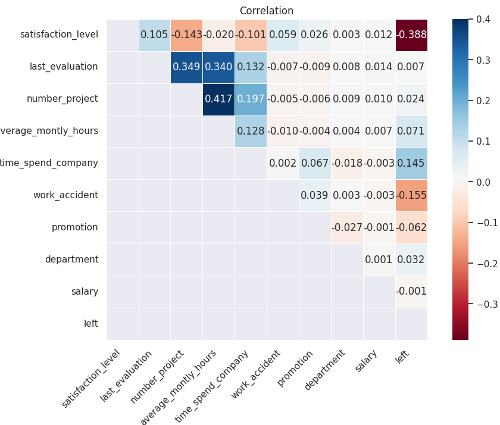

# 员工过早离职原因分析：用相关性和变量对比定位组织风险

## 摘要

| 模块     | 内容                                                         |
| -------- | ------------------------------------------------------------ |
| 业务场景 | 职场                                                         |
| 数据来源 | 员工离职数据，包含满意度、绩效、项目数、月工时、司龄、晋升、部门、薪资和是否离职。 |
| 分析方法 | 缺失值检查、类别编码、描述性统计、相关性分析、plotly 交互可视化、变量对比。 |
| 结论先行 | 满意度、项目数量、平均工时和司龄往往与离职风险存在明显关系。 |

本报告围绕“业务背景、分析目的、数据说明、分析思路、分析过程、核心结论和改进建议”展开，目标是用数据回答具体问题，并把分析结果转化为可执行的判断。

## 一、分析背景

离职分析的目的不是给员工贴标签，而是帮助组织识别管理风险，例如工作负荷、晋升机会、薪酬竞争力和满意度变化。

## 二、分析目的

本次分析主要回答以下问题：

- 当前业务场景下最需要解释的核心指标是什么？
- 不同维度之间是否存在明显差异或异常？
- 分析结果可以转化为哪些具体决策建议？

先明确分析目的，再开展数据处理和指标拆解，可以保证报告围绕问题展开，而不是简单罗列代码和图表。

## 三、数据来源与指标说明

| 项目           | 说明                                                         |
| -------------- | ------------------------------------------------------------ |
| 数据来源       | 员工离职数据，包含满意度、绩效、项目数、月工时、司龄、晋升、部门、薪资和是否离职。 |
| 分析工具与方法 | 缺失值检查、类别编码、描述性统计、相关性分析、plotly 交互可视化、变量对比。 |
| 重点分析指标   | 总量、占比、趋势、排名、区域分布、类别结构和异常变化。       |
| 数据口径       | 本文以项目数据集中的字段为分析范围，先完成缺失值、异常值、重复值或类别字段处理，再围绕核心指标做统计、可视化或建模。 |

数据口径会直接影响分析结论，因此报告先说明数据范围、核心指标和处理方式，便于读者理解结论的适用边界。

## 四、分析思路

| 步骤                | 目的                                                         |
| ------------------- | ------------------------------------------------------------ |
| 1. 明确业务问题     | 确定分析要回答什么，以及结论会影响什么决策。                 |
| 2. 数据读取与清洗   | 处理缺失、重复、异常和字段格式问题，保证分析基础可靠。       |
| 3. 指标拆解与可视化 | 从趋势、结构、对比、分布或空间维度观察数据现象。             |
| 4. 建模或深度分析   | 根据项目需要完成聚类、预测、分类、回归、文本分析或可视化大屏。 |
| 5. 输出结论与建议   | 把数据发现翻译成业务语言，并给出可执行的下一步动作。         |

本项目的具体分析路径如下：

- 先从业务背景出发，明确这份数据要回答什么问题，以及结论会影响什么决策。
- 检查数据口径，包括样本量、字段含义、缺失值、重复值和异常值。
- 围绕核心指标做拆解，例如价格、销量、转化、风险、留存、区域或人群结构。
- 用分组统计和可视化寻找差异，再结合业务常识判断差异是否有解释价值。
- 最后把发现转化为建议，并说明局限性和下一步需要补充的数据。

## 五、数据处理过程

本项目的数据处理主要包括以下环节：

- 读取原始数据，检查字段类型、样本规模和基础统计信息。
- 处理缺失值、重复值、异常值或文本噪声，保证后续统计和建模结果可靠。
- 根据分析目标构造必要指标、标签或特征，并统一字段口径。
- 按业务维度进行分组、聚合、可视化或模型训练，为结论提供依据。

## 六、数据分析与结果

本部分按照“分析发现 -> 结果解读”的方式组织，重点说明数据体现出的现象及其业务含义。

### 1. 满意度、项目数量、平均工时和司龄往往与离职风险存在明显关系。

结果解读：该发现是本项目最核心的结论之一，说明数据中存在值得关注的结构性特征。对应图表或模型结果应围绕这一判断展开，帮助读者理解结论来源。

### 2. 低薪资、缺少晋升机会和过高工作负荷容易形成离职组合风险。

结果解读：该发现进一步解释了不同维度之间的差异。对业务决策而言，重点不只是看到差异，而是判断差异来自哪些对象、场景或指标。

### 3. 不同部门离职率差异需要结合岗位性质解释，不能只凭比例判断管理好坏。

结果解读：该发现可以作为后续优化策略或模型改进的依据。若用于真实业务，还需要结合成本、资源、实验结果或线上反馈继续验证。

## 七、结论

综合以上分析，可以得到以下结论：

- 满意度、项目数量、平均工时和司龄往往与离职风险存在明显关系。
- 低薪资、缺少晋升机会和过高工作负荷容易形成离职组合风险。
- 不同部门离职率差异需要结合岗位性质解释，不能只凭比例判断管理好坏。

## 八、建议

- 行动 1：HR 应建立离职预警看板，关注满意度下降、长期无晋升和高工时员工。
- 行动 2：对高绩效高负荷人群应优先做留存访谈和资源支持。
- 行动 3：后续可构建离职预测模型，但使用时必须注意隐私、伦理和管理边界。
- 跟进方式：为每条建议绑定一个可观察指标，后续按周或按月复盘效果。

建议部分应结合具体对象、执行动作和复盘指标，避免停留在泛泛的“加强管理”或“优化运营”。

## 九、局限性与改进方向

- 项目价值：把分散数据组织成趋势、结构、对比和空间分布，让管理者能快速识别重点对象和异常变化。
- 真实限制：招聘、薪资或离职数据会受到地区、行业、公司规模和样本来源影响，公开数据通常不能完整反映真实组织内部情况。
- 业务风险：如果把相关性直接解释为因果，可能导致错误的人力政策或不公平的员工管理决策。
- 改进方向：将静态分析升级为可定期刷新的监控看板，并为异常指标设置阈值提醒。
- 改进方向：为关键图表补充下钻维度，使管理者能从总览进一步定位到地区、品类、用户或时间段。

## 附录：完整代码与输出结果

下面内容按原 notebook 的代码单元顺序整理。如果代码单元产生了文本输出或图片输出，也一并附在对应代码后面，便于复现完整分析过程。

### 代码单元 1

```python
import pandas as pd
import numpy as np

from plotly import __version__
print (__version__)

from plotly.offline import init_notebook_mode, iplot
init_notebook_mode(connected=True)
from plotly.graph_objs import *
import colorlover as cl

import matplotlib.pyplot as plt
import seaborn as sns
```

**文本输出**

```text
5.13.0
```

### 代码单元 2

```python
colors = ['#e43620', '#f16d30','#d99a6c','#fed976', '#b3cb95', '#41bfb3','#229bac', '#256894']
data = pd.read_csv('./HR_comma_sep.csv')

data.head()
```

**文本输出**

```text
satisfaction_level  last_evaluation  number_project  average_montly_hours  \
0                0.38             0.53               2                   157   
1                0.80             0.86               5                   262   
2                0.11             0.88               7                   272   
3                0.72             0.87               5                   223   
4                0.37             0.52               2                   159   

   time_spend_company  Work_accident  left  promotion_last_5years  sales  \
0                   3              0     1                      0  sales   
1                   6              0     1                      0  sales   
2                   4              0     1                      0  sales   
3                   5              0     1                      0  sales   
4                   3              0     1                      0  sales   

   salary  
0     low  
1  medium  
2  medium  
3     low  
4     low
```

### 代码单元 3

```python
print("共有",data.shape[0],"条员工记录，",data.shape[1],"个员工特征。")
```

**文本输出**

```text
共有 14999 条员工记录， 10 个员工特征。
```

### 代码单元 4

```python
data.isnull().sum()
```

**文本输出**

```text
satisfaction_level       0
last_evaluation          0
number_project           0
average_montly_hours     0
time_spend_company       0
Work_accident            0
left                     0
promotion_last_5years    0
sales                    0
salary                   0
dtype: int64
```

### 代码单元 5

```python
df = data.rename(columns = {"sales":"department","promotion_last_5years":"promotion","Work_accident":"work_accident"})
df.columns
```

**文本输出**

```text
Index(['satisfaction_level', 'last_evaluation', 'number_project',
       'average_montly_hours', 'time_spend_company', 'work_accident', 'left',
       'promotion', 'department', 'salary'],
      dtype='object')
```

### 代码单元 6

```python
df.info()
```

**文本输出**

```text
<class 'pandas.core.frame.DataFrame'>
RangeIndex: 14999 entries, 0 to 14998
Data columns (total 10 columns):
 #   Column                Non-Null Count  Dtype  
---  ------                --------------  -----  
 0   satisfaction_level    14999 non-null  float64
 1   last_evaluation       14999 non-null  float64
 2   number_project        14999 non-null  int64  
 3   average_montly_hours  14999 non-null  int64  
 4   time_spend_company    14999 non-null  int64  
 5   work_accident         14999 non-null  int64  
 6   left                  14999 non-null  int64  
 7   promotion             14999 non-null  int64  
 8   department            14999 non-null  object 
 9   salary                14999 non-null  object 
dtypes: float64(2), int64(6), object(2)
memory usage: 1.1+ MB
```

### 代码单元 7

```python
df.describe(include=['O'])
```

**文本输出**

```text
department salary
count       14999  14999
unique         10      3
top         sales    low
freq         4140   7316
```

### 代码单元 8

```python
# 1. 先设置`salary`与`department`列为**Category**的数据类型
df['department'] = df['department'].astype('category')#, categories=cat.categories)
df['salary'] = df['salary'].astype('category')#, categories=cat.categories)
```

### 代码单元 9

```python
df.info()
```

**文本输出**

```text
<class 'pandas.core.frame.DataFrame'>
RangeIndex: 14999 entries, 0 to 14998
Data columns (total 10 columns):
 #   Column                Non-Null Count  Dtype   
---  ------                --------------  -----   
 0   satisfaction_level    14999 non-null  float64 
 1   last_evaluation       14999 non-null  float64 
 2   number_project        14999 non-null  int64   
 3   average_montly_hours  14999 non-null  int64   
 4   time_spend_company    14999 non-null  int64   
 5   work_accident         14999 non-null  int64   
 6   left                  14999 non-null  int64   
 7   promotion             14999 non-null  int64   
 8   department            14999 non-null  category
 9   salary                14999 non-null  category
dtypes: category(2), float64(2), int64(6)
memory usage: 967.4 KB
```

### 代码单元 10

```python
# 保存类别
# department_categories = pd.Categorical(df['department']).categories
# salary_categories = pd.Categorical(df['salary']).categories
```

### 代码单元 11

```python
# 2. 保存类别与对应数值的映射字典
salary_dict = dict(enumerate(df['salary'].cat.categories))
department_dict = dict(enumerate(df['department'].cat.categories))
salary_dict,department_dict
```

**文本输出**

```text
({0: 'high', 1: 'low', 2: 'medium'},
 {0: 'IT',
  1: 'RandD',
  2: 'accounting',
  3: 'hr',
  4: 'management',
  5: 'marketing',
  6: 'product_mng',
  7: 'sales',
  8: 'support',
  9: 'technical'})
```

### 代码单元 12

```python
# 3. 针对`salary`和`department`这两个`Object`类型的类别特征，将其进行类别数字化。
for feature in df.columns:
    if str(df[feature].dtype) == 'category':
        df[feature] = df[feature].cat.codes
        # df[feature] = pd.Categorical(df[feature]).codes
        df[feature] = df[feature].astype("int64") # 设置数据类型为int64
```

### 代码单元 13

```python
df.head()
```

**文本输出**

```text
satisfaction_level  last_evaluation  number_project  average_montly_hours  \
0                0.38             0.53               2                   157   
1                0.80             0.86               5                   262   
2                0.11             0.88               7                   272   
3                0.72             0.87               5                   223   
4                0.37             0.52               2                   159   

   time_spend_company  work_accident  left  promotion  department  salary  
0                   3              0     1          0           7       1  
1                   6              0     1          0           7       2  
2                   4              0     1          0           7       2  
3                   5              0     1          0           7       1  
4                   3              0     1          0           7       1
```

### 代码单元 14

```python
cols = df.columns
cols = list(cols[:6]) + list(cols[7:]) + [cols[6]]
print('Reordered Columns:',cols)
```

**文本输出**

```text
Reordered Columns: ['satisfaction_level', 'last_evaluation', 'number_project', 'average_montly_hours', 'time_spend_company', 'work_accident', 'promotion', 'department', 'salary', 'left']
```

### 代码单元 15

```python
# 根据排好的列表顺序应用于dataframe上
df = df[cols]
df.head()
```

**文本输出**

```text
satisfaction_level  last_evaluation  number_project  average_montly_hours  \
0                0.38             0.53               2                   157   
1                0.80             0.86               5                   262   
2                0.11             0.88               7                   272   
3                0.72             0.87               5                   223   
4                0.37             0.52               2                   159   

   time_spend_company  work_accident  promotion  department  salary  left  
0                   3              0          0           7       1     1  
1                   6              0          0           7       2     1  
2                   4              0          0           7       2     1  
3                   5              0          0           7       1     1  
4                   3              0          0           7       1     1
```

### 代码单元 16

```python
print(df.shape)
df.info()
```

**文本输出**

```text
(14999, 10)
<class 'pandas.core.frame.DataFrame'>
RangeIndex: 14999 entries, 0 to 14998
Data columns (total 10 columns):
 #   Column                Non-Null Count  Dtype  
---  ------                --------------  -----  
 0   satisfaction_level    14999 non-null  float64
 1   last_evaluation       14999 non-null  float64
 2   number_project        14999 non-null  int64  
 3   average_montly_hours  14999 non-null  int64  
 4   time_spend_company    14999 non-null  int64  
 5   work_accident         14999 non-null  int64  
 6   promotion             14999 non-null  int64  
 7   department            14999 non-null  int64  
 8   salary                14999 non-null  int64  
 9   left                  14999 non-null  int64  
dtypes: float64(2), int64(8)
memory usage: 1.1 MB
```

### 代码单元 17

```python
left_summary = df.groupby(by=['left'])
left_summary.mean()
```

**文本输出**

```text
satisfaction_level  last_evaluation  number_project  \
left                                                        
0               0.666810         0.715473        3.786664   
1               0.440098         0.718113        3.855503   

      average_montly_hours  time_spend_company  work_accident  promotion  \
left                                                                       
0               199.060203            3.380032       0.175009   0.026251   
1               207.419210            3.876505       0.047326   0.005321   

      department    salary  
left                        
0       5.819041  1.347742  
1       6.035284  1.345842
```

### 代码单元 18

```python
df.describe()
```

**文本输出**

```text
satisfaction_level  last_evaluation  number_project  \
count        14999.000000     14999.000000    14999.000000   
mean             0.612834         0.716102        3.803054   
std              0.248631         0.171169        1.232592   
min              0.090000         0.360000        2.000000   
25%              0.440000         0.560000        3.000000   
50%              0.640000         0.720000        4.000000   
75%              0.820000         0.870000        5.000000   
max              1.000000         1.000000        7.000000   

       average_montly_hours  time_spend_company  work_accident     promotion  \
count          14999.000000        14999.000000   14999.000000  14999.000000   
mean             201.050337            3.498233       0.144610      0.021268   
std               49.943099            1.460136       0.351719      0.144281   
min               96.000000            2.000000       0.000000      0.000000   
25%              156.000000            3.000000       0.000000      0.000000   
50%              200.000000            3.000000       0.000000      0.000000   
75%              245.000000            4.000000       0.000000      0.000000   
max     
... 输出过长，博客中已截断
```

### 代码单元 19

```python
corr = df.corr()                 # pearson相关系数
mask = np.zeros_like(corr)
mask[np.tril_indices_from(mask)]=True
```

### 代码单元 20

```python
with sns.axes_style("white"):
    sns.set(rc={'figure.figsize':(11,7)})
    ax = sns.heatmap(corr,
                xticklabels=True, yticklabels=True,
                cmap='RdBu', # cmap='YlGnBu',  # 颜色
                mask=mask,   # 使用掩码只绘制矩阵的一部分
                fmt='.3f',     # 格式设置
                annot=True,    # 方格内写入数据
                linewidths=.5, # 热力图矩阵之间的间隔大小
                vmax=.4,       # 图例中最大值
                square = True
                # center = 0
                )

plt.title("Correlation")
label_x = ax.get_xticklabels()
plt.setp(label_x,rotation=45, horizontalalignment='right')
plt.show()
```

**图表输出 1**



### 代码单元 21

```python
left_count = df['left'].value_counts().reset_index(name = "left_count")
```

### 代码单元 22

```python
df = df.fillna('')
```

### 代码单元 23

```python
trace = Pie(labels = ['在职','离职'], values = left_count.left_count,
            hoverinfo = "label + percent + name",
            marker = dict(colors = colors[3:]), hole = .6, pull = .1)
layout = Layout(title = "员工在职与离职的比率", width = 380, height = 380)
iplot(Figure(data = [trace], layout = layout))
```

### 代码单元 24

```python
time_mean_satifaction = df.groupby(by = ['time_spend_company'])['satisfaction_level'].mean().reset_index(name = "average_satisfaction") # 取满意度的均值的
```

### 代码单元 25

```python
trace = Bar(x=time_mean_satifaction.time_spend_company, y=time_mean_satifaction.average_satisfaction, marker=dict(color = colors),)
layout = Layout(title= "员工满意度与公司在职时间有什么关联？",
                width = 700, height = 400,
                xaxis = dict(title="在公司时间（年）"),
                yaxis = dict(title = "平均满意度"),
                )
iplot(Figure(data=[trace],layout= layout))
```

### 代码单元 26

```python
depart_left_table = pd.crosstab(index=df['department'],columns=df['left'])
```

### 代码单元 27

```python
data = []
left_eles = df.left.unique()
for l in left_eles:
    trace = Bar(x = depart_left_table[l], y = depart_left_table.index, name=('离职' if l == 1 else '在职'),orientation='h',marker=dict(color=colors[l+4]))
    data.append(trace)
layout = Layout(title="每个部门的离职员工数与在职员工数对比", barmode="stack",width=800,height=500,yaxis=dict(title="部门",tickmode="array",tickvals=list(department_dict.keys()),ticktext=list(department_dict.values())))
iplot(Figure(data= data, layout=layout))
```

### 代码单元 28

```python
depart_salary_table = pd.crosstab(index=df['department'], columns=df['salary'])
# depart_salary_table
```

### 代码单元 29

```python
data = []
for i in range(3):
    trace = Bar(x=depart_salary_table.index, y=depart_salary_table[i],name=salary_dict[i],marker=dict(color=colors[i+2]))
    data.append(trace)
layout = Layout(title="公司各部门的员工工资情况",width=800,height=450,xaxis = dict(tickmode="array",tickvals=list(department_dict.keys()),ticktext=list(department_dict.values())))
iplot(Figure(data = data,layout = layout))
```

### 代码单元 30

```python
salary_left_table=pd.crosstab(index=df['salary'],columns=df['left'])
```

### 代码单元 31

```python
data = []
for i in range(2):
    trace = Bar(x=salary_left_table.index, y=salary_left_table[i],name=("在职" if i ==0 else "离职"),marker=dict(color=colors[i+4]))
    data.append(trace)
layout = Layout(title="员工薪资对离职的影响",width=580,height=350,xaxis = dict(tickmode="array",tickvals=list(salary_dict.keys()),ticktext=list(salary_dict.values())))
iplot(Figure(data = data,layout = layout))
```

### 代码单元 32

```python
promotion_left_table=pd.crosstab(index=df['promotion'],columns=df['left'])
```

### 代码单元 33

```python
promotion_dict = {0:"没有升职",1:"升过职"}
data = []
for i in range(2):
    trace = Bar(x=promotion_left_table.index, y=promotion_left_table[i],name=("在职" if i ==0 else "离职"),marker=dict(color=colors[i+4]))
    data.append(trace)
layout = Layout(title="员工过去5年是否升职对离职的影响",width=400,height=350,xaxis = dict(tickmode="array",tickvals=list(promotion_dict.keys()),ticktext=list(promotion_dict.values())))
iplot(Figure(data = data,layout = layout))
```

### 代码单元 34

```python
eva_left_table = pd.crosstab(index=df['last_evaluation'], columns=df['left'])
```

### 代码单元 35

```
data = []
for i in range(2):
    trace = Bar(x=eva_left_table.index, y=eva_left_table[i],name=("在职" if i ==0 else "离职"),marker=dict(color=colors[i+4]))
    data.append(trace)
layout = Layout(title="员工的绩效评估对离职的影响",width=1000,height=400,)#xaxis = dict(tickmode="array",tickvals=list(promotion_dict.keys()),ticktext=list(promotion_dict.values())))
iplot(Figure(data = data,layout = layout))
```

