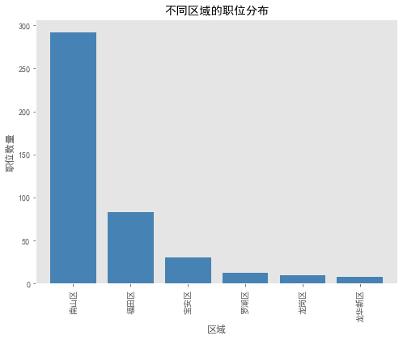
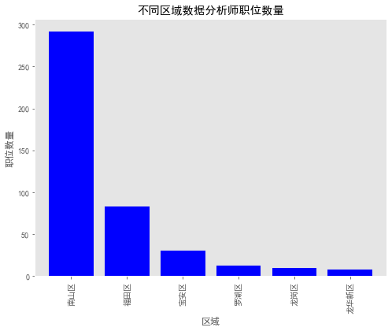
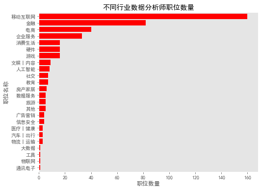
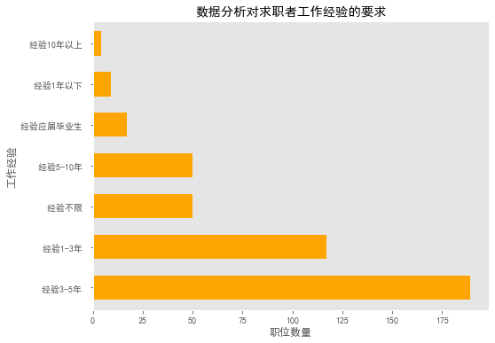
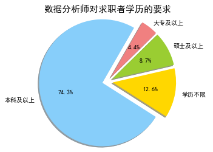
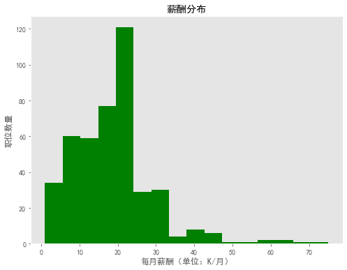
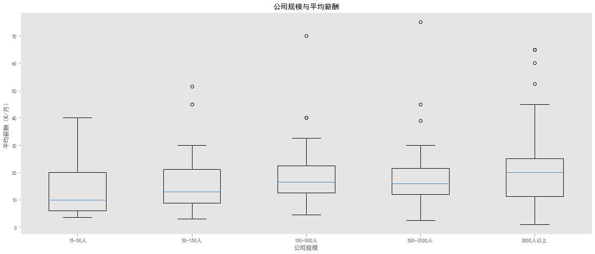
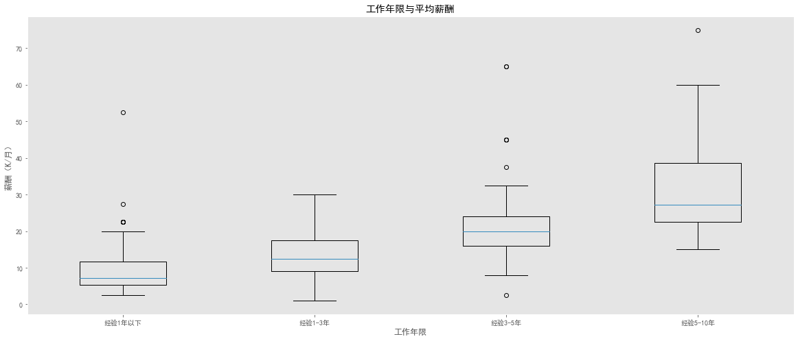
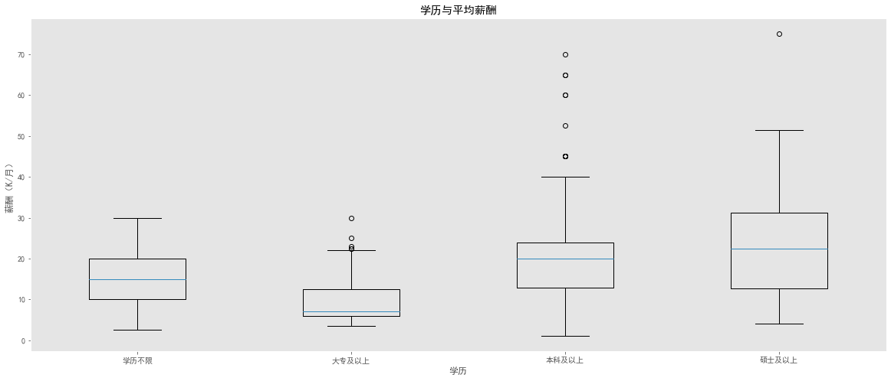

# 数据分析师招聘信息分析：从岗位需求看能力结构

## 摘要

| 模块     | 内容                                                         |
| -------- | ------------------------------------------------------------ |
| 业务场景 | 职场                                                         |
| 数据来源 | 拉钩网深圳数据分析岗位数据，约 400 多条招聘信息，包含区域、行业、薪资、经验、学历、公司规模和岗位描述。 |
| 分析方法 | pandas 清洗、薪资字段解析、分组统计、matplotlib 可视化、jieba 关键词提取、词云。 |
| 结论先行 | 岗位需求集中在互联网、金融、电商和企业服务等数据密集行业。   |

本报告围绕“业务背景、分析目的、数据说明、分析思路、分析过程、核心结论和改进建议”展开，目标是用数据回答具体问题，并把分析结果转化为可执行的判断。

## 一、分析背景

招聘数据本质上是市场需求数据。通过岗位地域、行业、薪资和技能关键词分析，可以观察数据分析岗位在地区、行业、经验、学历和技能上的结构特征。

## 二、分析目的

本次分析主要回答以下问题：

- 文本中用户最关注的主题和关键词是什么？
- 正负向反馈分别集中在哪些具体问题上？
- 这些文本信号能沉淀成哪些产品、运营或服务改进动作？

先明确分析目的，再开展数据处理和指标拆解，可以保证报告围绕问题展开，而不是简单罗列代码和图表。

## 三、数据来源与指标说明

| 项目           | 说明                                                         |
| -------------- | ------------------------------------------------------------ |
| 数据来源       | 拉钩网深圳数据分析岗位数据，约 400 多条招聘信息，包含区域、行业、薪资、经验、学历、公司规模和岗位描述。 |
| 分析工具与方法 | pandas 清洗、薪资字段解析、分组统计、matplotlib 可视化、jieba 关键词提取、词云。 |
| 重点分析指标   | 文本样本量、分词结果、关键词、词频、情感倾向、正负向主题和典型问题。 |
| 数据口径       | 本文以项目数据集中的字段为分析范围，先完成缺失值、异常值、重复值或类别字段处理，再围绕核心指标做统计、可视化或建模。 |

数据口径会直接影响分析结论，因此报告先说明数据范围、核心指标和处理方式，便于读者理解结论的适用边界。

## 四、分析思路

| 步骤                | 目的                                                         |
| ------------------- | ------------------------------------------------------------ |
| 1. 明确业务问题     | 确定分析要回答什么，以及结论会影响什么决策。                 |
| 2. 数据读取与清洗   | 处理缺失、重复、异常和字段格式问题，保证分析基础可靠。       |
| 3. 指标拆解与可视化 | 从趋势、结构、对比、分布或空间维度观察数据现象。             |
| 4. 建模或深度分析   | 根据项目需要完成聚类、预测、分类、回归、文本分析或可视化大屏。 |
| 5. 输出结论与建议   | 把数据发现翻译成业务语言，并给出可执行的下一步动作。         |

本项目的具体分析路径如下：

- 先明确文本分析目标：是识别用户关注点、判断情绪倾向，还是提取岗位/产品关键词。
- 对文本做清洗、分词和停用词过滤，减少无意义词对结果的干扰。
- 通过词频、关键词、词云或情感模型提炼主要信息。
- 结合业务场景解释文本结果，避免只停留在高频词罗列。
- 把文本洞察沉淀成标签、问题清单或运营建议。

## 五、数据处理过程

本项目的数据处理主要包括以下环节：

- 读取原始数据，检查字段类型、样本规模和基础统计信息。
- 处理缺失值、重复值、异常值或文本噪声，保证后续统计和建模结果可靠。
- 根据分析目标构造必要指标、标签或特征，并统一字段口径。
- 按业务维度进行分组、聚合、可视化或模型训练，为结论提供依据。

## 六、数据分析与结果

本部分按照“分析发现 -> 结果解读”的方式组织，重点说明数据体现出的现象及其业务含义。

### 1. 岗位需求集中在互联网、金融、电商和企业服务等数据密集行业。

结果解读：该发现是本项目最核心的结论之一，说明数据中存在值得关注的结构性特征。对应图表或模型结果应围绕这一判断展开，帮助读者理解结论来源。

### 2. 薪资与经验、公司规模和行业有明显关系，初级岗位更看重工具熟练和业务理解。

结果解读：该发现进一步解释了不同维度之间的差异。对业务决策而言，重点不只是看到差异，而是判断差异来自哪些对象、场景或指标。

### 3. 技能关键词通常围绕 SQL、Python、Excel、可视化、统计分析和业务指标。

结果解读：该发现可以作为后续优化策略或模型改进的依据。若用于真实业务，还需要结合成本、资源、实验结果或线上反馈继续验证。

## 七、结论

综合以上分析，可以得到以下结论：

- 岗位需求集中在互联网、金融、电商和企业服务等数据密集行业。
- 薪资与经验、公司规模和行业有明显关系，初级岗位更看重工具熟练和业务理解。
- 技能关键词通常围绕 SQL、Python、Excel、可视化、统计分析和业务指标。

## 八、建议

- 行动 1：简历应突出 SQL/Python/可视化/建模与业务落地，而不是堆工具名。
- 行动 2：作品集最好覆盖电商、金融、用户运营和预测建模等高频岗位场景。
- 行动 3：面试表达要从“我做了图”升级为“我用数据发现问题，并提出可执行建议”。
- 跟进方式：为每条建议绑定一个可观察指标，后续按周或按月复盘效果。

建议部分应结合具体对象、执行动作和复盘指标，避免停留在泛泛的“加强管理”或“优化运营”。

## 九、局限性与改进方向

- 项目价值：把非结构化文本转化为可统计的问题标签和情绪信号，帮助业务更快定位用户关注点和负面体验。
- 真实限制：招聘、薪资或离职数据会受到地区、行业、公司规模和样本来源影响，公开数据通常不能完整反映真实组织内部情况。
- 业务风险：如果把相关性直接解释为因果，可能导致错误的人力政策或不公平的员工管理决策。
- 改进方向：建立人工抽检样本集，评估分词、情感判断和主题归类是否符合业务语境。
- 改进方向：把文本标签与订单、退款、投诉、复购或客服工单关联，验证文本问题对经营结果的影响。

## 附录：完整代码与输出结果

下面内容按原 notebook 的代码单元顺序整理。如果代码单元产生了文本输出或图片输出，也一并附在对应代码后面，便于复现完整分析过程。

### 代码单元 1

```python
import numpy as np
import pandas as pd
import seaborn as sns
import jieba
import jieba.analyse
import re
from wordcloud import WordCloud
from matplotlib import pyplot as plt
from matplotlib import style
style.use('ggplot')
# from matplotlib.font_manager import FontProperties
import pprint
# 让图表直接在jupyter中展示出来
# 解决中文乱码问题
plt.rcParams["font.sans-serif"] = 'SimHei'
# 解决负号无法正常显示问题
plt.rcParams['axes.unicode_minus'] = False
# import matplotlib as mpl
# 关闭警告信息
import warnings
warnings.filterwarnings('ignore')
```

### 代码单元 2

```python
data = pd.read_csv('./lagou.csv')
```

### 代码单元 3

```python
data.head()
```

**文本输出**

```text
company  foursquare  trend     figure               job   salary  \
0  YIDATEC    移动互联网,游戏  不需要融资    2000人以上             数据分析师   7k-10k   
1     希为科技     企业服务,金融  不需要融资    50-150人             数据分析师  15k-25k   
2       传易    移动互联网,社交  不需要融资   150-500人    数据分析专员(J10236)  10k-15k   
3     盛业资本     金融,数据服务   上市公司   150-500人             数据分析师  15k-30k   
4      路行通  移动互联网,消费生活  不需要融资  500-2000人  数据分析师（碰撞场景探索与...  14k-20k   

  experience education                                        description  \
0    经验1-3年     本科及以上   1、1年以上数据分析\数据运营相关工作经验；2、接触过Android App运营、对App质...   
1    经验1-3年     本科及以上   职位诱惑：14薪；年轻有活力的团队；五险一金；职位描述：岗位职责:1.深入理解业务，通过数据...   
2      经验不限      学历不限   工作职责:1、负责运营数据整理规划工作，监控日常关键数据并分析异常变化，提交数据分析报告；2...   
3    经验3-5年      学历不限   岗位职责:1、基于业务需求，规划分析思路，完成从数据提取、数据清洗、数据分析和报告产出的整个...   
4    经验3-5年     本科及以上   岗位职责：1.负责车辆碰撞场景的深度探索及数据建模。2.负责车辆碰撞数据的新特征挖掘和衍生，...   

  address  
0     南山区  
1     南山区  
2     南山区  
3     福田区  
4     南山区
```

### 代码单元 4

```python
data.info()
```

**文本输出**

```text
<class 'pandas.core.frame.DataFrame'>
RangeIndex: 436 entries, 0 to 435
Data columns (total 10 columns):
 #   Column       Non-Null Count  Dtype 
---  ------       --------------  ----- 
 0   company      436 non-null    object
 1   foursquare   436 non-null    object
 2   trend        436 non-null    object
 3   figure       436 non-null    object
 4   job          436 non-null    object
 5   salary       436 non-null    object
 6   experience   436 non-null    object
 7   education    436 non-null    object
 8   description  436 non-null    object
 9   address      436 non-null    object
dtypes: object(10)
memory usage: 34.2+ KB
```

### 代码单元 5

```python
data.describe()
```

**文本输出**

```text
company foursquare  trend   figure    job   salary experience  \
count      436        436    436      436    436      436        436   
unique     261         65      8       57    279       92          7   
top       字节跳动         金融  不需要融资  2000人以上  数据分析师  15k-30k    经验3-5年    
freq         7         71    129      127     53       50        189   

       education                                        description address  
count        436                                                436     436  
unique         4                                                431       6  
top       本科及以上   岗位职责：1、负责业务数据分析平台建设，设计有效的数据指标体系，支持业务日常运营和分析；2、...     南山区  
freq         324                                                  2     292
```

### 代码单元 6

```python
plt.figure(figsize = (8,6))
data['address'].value_counts().sort_values(ascending=False).plot.bar(width = 0.8,color = 'steelblue')
plt.ylabel('职位数量')
plt.xlabel('区域')
plt.title('不同区域的职位分布')
plt.grid(False)
```

**图表输出 1**



### 代码单元 7

```python
plt.figure(figsize = (8,6))
data['address'].value_counts().sort_values(ascending = False).plot.bar(width = 0.8,color = 'blue')
plt.xlabel('区域')
plt.ylabel('职位数量')
plt.title('不同区域数据分析师职位数量')
plt.grid(False)
```

**图表输出 1**



### 代码单元 8

```python
# 存在多个行业，只取第一个
clean_foursquare = [str(i.split(',')[0]) for i in data.foursquare]
data['foursquare'] = clean_foursquare
```

### 代码单元 9

```python
plt.figure(figsize = (8,6))
data['foursquare'].value_counts().sort_values(ascending = True).plot.barh(width = 0.8,color = 'red')
plt.xlabel('职位数量')
plt.ylabel('职位名称')
plt.title('不同行业数据分析师职位数量')
plt.grid(False)
```

**图表输出 1**



### 代码单元 10

```python
plt.figure(figsize = (8,6))
data['experience'].value_counts().plot.barh(width = 0.6,color = 'orange')
plt.xlabel('职位数量')
plt.ylabel('工作经验')
plt.title('数据分析对求职者工作经验的要求',loc = "center")
plt.grid(False)
```

**图表输出 1**



### 代码单元 11

```python
education_count = data['education'].value_counts()
labels='本科及以上','学历不限','硕士及以上','大专及以上'
colors=[ 'lightskyblue', 'gold','yellowgreen', 'lightcoral']
explode=(0.1,0.1,0.1,0.1)
plt.axis('equal')
plt.title('数据分析师对求职者学历的要求',size = 15)
plt.pie(education_count,explode=explode,labels=labels,colors=colors,autopct='%1.1f%%',
        shadow=True,labeldistance=1.1,startangle=60,radius=1.2)
```

**文本输出**

```text
([<matplotlib.patches.Wedge at 0x216eb4bc848>,
  <matplotlib.patches.Wedge at 0x216eb4c2a48>,
  <matplotlib.patches.Wedge at 0x216eb4c9e08>,
  <matplotlib.patches.Wedge at 0x216eb4d7388>],
 [Text(-1.379238185118261, -0.3377899180136765, '本科及以上'),
  Text(1.39940283915846, -0.240980691664792, '学历不限'),
  Text(1.2464528281742129, 0.680261234480186, '硕士及以上'),
  Text(0.8711903060686427, 1.1213507259604485, '大专及以上')],
 [Text(-0.7964614871809674, -0.19506178364170051, '74.3%'),
  Text(0.8081058648661529, -0.13915786420079537, '12.6%'),
  Text(0.7197826190865172, 0.3928269100519384, '8.7%'),
  Text(0.5030817260396386, 0.6475405600616674, '4.4%')])
```

**图表输出 1**



### 代码单元 12

```python
# 去除字段中'k'或'K'字符
clean_salary = [re.sub('[k|K]','',i) for i in data.salary]

# 将salary数据转换为DataFrame格式
salary = pd.DataFrame(clean_salary,columns = ['salary'])
salary_s = pd.DataFrame((x.split('-') for x in salary['salary']),columns = ['bottomSalary','topSalary'])
# 更改字段格式
salary_s['bottomSalary']=salary_s['bottomSalary'].astype(np.int)
salary_s['topSalary']=salary_s['topSalary'].astype(np.int)

# 计算平均值
salary_avg = [(salary_s['bottomSalary'][i] + salary_s['topSalary'][i])/2 for i in range(len(salary_s))]
salary_s['avgSalary'] = salary_avg
# for i in range(len(salary_s)):
#     avg.append((salary_s['bottomSalary'][i]+salary_s['topSalary'][i])/2)
# salary_s['avgSalary']=avg

# 将salary_s表与原表进行拼接
data = pd.merge(data,salary_s,right_index=True,left_index=True)
data.head()
```

**文本输出**

```text
company foursquare  trend     figure               job   salary experience  \
0  YIDATEC      移动互联网  不需要融资    2000人以上             数据分析师   7k-10k    经验1-3年    
1     希为科技       企业服务  不需要融资    50-150人             数据分析师  15k-25k    经验1-3年    
2       传易      移动互联网  不需要融资   150-500人    数据分析专员(J10236)  10k-15k      经验不限    
3     盛业资本         金融   上市公司   150-500人             数据分析师  15k-30k    经验3-5年    
4      路行通      移动互联网  不需要融资  500-2000人  数据分析师（碰撞场景探索与...  14k-20k    经验3-5年    

  education                                        description address  \
0    本科及以上   1、1年以上数据分析\数据运营相关工作经验；2、接触过Android App运营、对App质...     南山区   
1    本科及以上   职位诱惑：14薪；年轻有活力的团队；五险一金；职位描述：岗位职责:1.深入理解业务，通过数据...     南山区   
2     学历不限   工作职责:1、负责运营数据整理规划工作，监控日常关键数据并分析异常变化，提交数据分析报告；2...     南山区   
3     学历不限   岗位职责:1、基于业务需求，规划分析思路，完成从数据提取、数据清洗、数据分析和报告产出的整个...     福田区   
4    本科及以上   岗位职责：1.负责车辆碰撞场景的深度探索及数据建模。2.负责车辆碰撞数据的新特征挖掘和衍生，...     南山区   

   bottomSalary  topSalary  avgSalary  
0             7         10        8.5  
1            15         25       20.0  
2            10         15       12.5  
3            15         30       22.5  
4            14         20       17.0
```

### 代码单元 13

```python
plt.figure(figsize = (8,6))
plt.hist(data['avgSalary'],bins=16,color='green')
plt.axis('tight')
plt.title('薪酬分布')
plt.xlabel('每月薪酬（单位：K/月）')
plt.ylabel('职位数量')
plt.grid(False)
```

**图表输出 1**



### 代码单元 14

```python
data['figure'] = data['figure'].map(str.strip)
data.groupby(['figure']).count()

size1=data.loc[data['figure'] == '15-50人',['figure','avgSalary']]
size2=data.loc[data['figure'] == '50-150人',['figure','avgSalary']]
size3=data.loc[data['figure'] == '150-500人',['figure','avgSalary']]
size4=data.loc[data['figure'] == '500-2000人',['figure','avgSalary']]
size5=data.loc[data['figure'] == '2000人以上',['figure','avgSalary']]

plt.figure(figsize = (20,8))
plt.xlabel('公司规模')
plt.ylabel('平均薪酬（K/月）')
plt.title('公司规模与平均薪酬')
plt.grid(False)
plt.boxplot((size1['avgSalary'],size2['avgSalary'],size3['avgSalary'],size4['avgSalary'],size5['avgSalary']),
            labels=('15-50人','50-150人','150-500人','500-2000人','2000人以上'))
# plt.grid(color='#95a5a6',linestyle='--',linewidth=0.8,axis='y',alpha=0.4)
```

**文本输出**

```text
{'whiskers': [<matplotlib.lines.Line2D at 0x216eb5dc188>,
  <matplotlib.lines.Line2D at 0x216eb606fc8>,
  <matplotlib.lines.Line2D at 0x216eb616d08>,
  <matplotlib.lines.Line2D at 0x216eb60dbc8>,
  <matplotlib.lines.Line2D at 0x216eb626f88>,
  <matplotlib.lines.Line2D at 0x216eb62f448>,
  <matplotlib.lines.Line2D at 0x216eb639e88>,
  <matplotlib.lines.Line2D at 0x216eb639ec8>,
  <matplotlib.lines.Line2D at 0x216eb64df48>,
  <matplotlib.lines.Line2D at 0x216eb64da88>],
 'caps': [<matplotlib.lines.Line2D at 0x216eb606f88>,
  <matplotlib.lines.Line2D at 0x216eb60d848>,
  <matplotlib.lines.Line2D at 0x216eb61c9c8>,
  <matplotlib.lines.Line2D at 0x216eb61ce08>,
  <matplotlib.lines.Line2D at 0x216eb62f888>,
  <matplotlib.lines.Line2D at 0x216eb62fd08>,
  <matplotlib.lines.Line2D at 0x216eb639f88>,
  <matplotlib.lines.Line2D at 0x216eb643b88>,
  <matplotlib.lines.Line2D at 0x216eb654d48>,
  <matplotlib.lines.Line2D at 0x216eb654d88>],
 'boxes': [<matplotlib.lines.Line2D at 0x216eb606648>,
  <matplotlib.lines.Line2D at 0x216eb60ddc8>,
  <matplotlib.lines.Line2D at 0x216eb626b08>,
  <matplotlib.lines.Line2D at 0x216eb639a08>,
  <matplotlib.lines.Line2D at 0x216eb64d988>],
 'medians': [<matp
... 输出过长，博客中已截断
```

**图表输出 1**



### 代码单元 15

```python
data['experience'] = data['experience'].map(str.strip)

# 把经验应届毕业生和经验不限归为经验1年以下
for i in range(len(data['experience'])):
    if data['experience'][i] in ['经验应届毕业生','经验不限']:
        data['experience'][i]='经验1年以下'
# data['experience']
```

### 代码单元 16

```python
year1=data.loc[data['experience'] == '经验1年以下',['experience','avgSalary']]
year2=data.loc[data['experience'] == '经验1-3年',['experience','avgSalary']]
year3=data.loc[data['experience'] == '经验3-5年',['experience','avgSalary']]
year4=data.loc[data['experience'] == '经验5-10年',['experience','avgSalary']]

plt.figure(figsize = (20,8))
plt.xlabel('工作年限')
plt.ylabel('薪酬（K/月）')
plt.title('工作年限与平均薪酬')
plt.grid(False)
# plt.grid(color='#95a5a6',linestyle='--',linewidth=0.8,axis='y',alpha=0.4)
plt.boxplot((year1['avgSalary'],year2['avgSalary'],year3['avgSalary'],year4['avgSalary']),
            labels=('经验1年以下','经验1-3年','经验3-5年','经验5-10年'))
```

**文本输出**

```text
{'whiskers': [<matplotlib.lines.Line2D at 0x216eb6c4e88>,
  <matplotlib.lines.Line2D at 0x216eb6f3788>,
  <matplotlib.lines.Line2D at 0x216eb6fdf08>,
  <matplotlib.lines.Line2D at 0x216eb6fd448>,
  <matplotlib.lines.Line2D at 0x216eb710ec8>,
  <matplotlib.lines.Line2D at 0x216eb71a7c8>,
  <matplotlib.lines.Line2D at 0x216eb723f48>,
  <matplotlib.lines.Line2D at 0x216eb72c808>],
 'caps': [<matplotlib.lines.Line2D at 0x216eb6f3c08>,
  <matplotlib.lines.Line2D at 0x216eb6f3b88>,
  <matplotlib.lines.Line2D at 0x216eb706c08>,
  <matplotlib.lines.Line2D at 0x216eb706b88>,
  <matplotlib.lines.Line2D at 0x216eb71ac48>,
  <matplotlib.lines.Line2D at 0x216eb723148>,
  <matplotlib.lines.Line2D at 0x216eb72cc88>,
  <matplotlib.lines.Line2D at 0x216eb72cc08>],
 'boxes': [<matplotlib.lines.Line2D at 0x216eb6ecf48>,
  <matplotlib.lines.Line2D at 0x216eb6fde88>,
  <matplotlib.lines.Line2D at 0x216eb710e48>,
  <matplotlib.lines.Line2D at 0x216eb723ec8>],
 'medians': [<matplotlib.lines.Line2D at 0x216eb6f3d48>,
  <matplotlib.lines.Line2D at 0x216eb706d48>,
  <matplotlib.lines.Line2D at 0x216eb71ad88>,
  <matplotlib.lines.Line2D at 0x216eb72cdc8>],
 'fliers': [<matplotlib.lines.Line2D at 0x216eb6fda0
... 输出过长，博客中已截断
```

**图表输出 1**



### 代码单元 17

```python
data['education']=data['education'].map(str.strip)
 
edu1=data.loc[data['education'] == '学历不限',['education','avgSalary']]
edu2=data.loc[data['education'] == '大专及以上',['education','avgSalary']]
edu3=data.loc[data['education'] == '本科及以上',['education','avgSalary']]
edu4=data.loc[data['education'] == '硕士及以上',['education','avgSalary']]

plt.figure(figsize = (20,8))
plt.xlabel('学历')
plt.ylabel('薪酬（K/月）')
plt.title('学历与平均薪酬')
plt.grid(False)
# plt.grid(color='#95a5a6',linestyle='--',linewidth=0.8,axis='y',alpha=0.4)
plt.boxplot((edu1['avgSalary'],edu2['avgSalary'],edu3['avgSalary'],edu4['avgSalary']),labels=('学历不限','大专及以上','本科及以上','硕士及以上'))
```

**文本输出**

```text
{'whiskers': [<matplotlib.lines.Line2D at 0x216eb796ec8>,
  <matplotlib.lines.Line2D at 0x216eb7c2908>,
  <matplotlib.lines.Line2D at 0x216eb7cdd48>,
  <matplotlib.lines.Line2D at 0x216eb7cd5c8>,
  <matplotlib.lines.Line2D at 0x216eb7ded08>,
  <matplotlib.lines.Line2D at 0x216eb7e9948>,
  <matplotlib.lines.Line2D at 0x216eb7f9e88>,
  <matplotlib.lines.Line2D at 0x216eb7f9dc8>],
 'caps': [<matplotlib.lines.Line2D at 0x216eb7c2d88>,
  <matplotlib.lines.Line2D at 0x216eb7c2d08>,
  <matplotlib.lines.Line2D at 0x216eb7d5d88>,
  <matplotlib.lines.Line2D at 0x216eb7d5d08>,
  <matplotlib.lines.Line2D at 0x216eb7e9dc8>,
  <matplotlib.lines.Line2D at 0x216eb7f2348>,
  <matplotlib.lines.Line2D at 0x216eb7f9fc8>,
  <matplotlib.lines.Line2D at 0x216eb7ffb88>],
 'boxes': [<matplotlib.lines.Line2D at 0x216eb7c20c8>,
  <matplotlib.lines.Line2D at 0x216eb7cdf88>,
  <matplotlib.lines.Line2D at 0x216eb7defc8>,
  <matplotlib.lines.Line2D at 0x216eb7f2b48>],
 'medians': [<matplotlib.lines.Line2D at 0x216eb7c2ec8>,
  <matplotlib.lines.Line2D at 0x216eb7d5ec8>,
  <matplotlib.lines.Line2D at 0x216eb7e9f08>,
  <matplotlib.lines.Line2D at 0x216eb7ffd88>],
 'fliers': [<matplotlib.lines.Line2D at 0x216eb7cdb8
... 输出过长，博客中已截断
```

**图表输出 1**



### 代码单元 18

```python
# 把每个岗位描述连接起来保存在文件中
description_text = ' '.join([i for i in data['description']])

with open('des.txt','w',encoding = 'utf-8') as f:
    f.write(description_text)
    f.close()
```

### 代码单元 19

```python
text = open('des.txt', 'r',encoding='utf-8').read()
stop_word = ['岗位职责','任职要求','工作职责','岗位要求','任职资格','本科及以上学历','本科以上学历','职位描述',
             '工作职责','岗位职责1','职位诱惑','职位要求','任职要求1','工作职责1','职位职责','计算机','数据分析',
             'and','to','with','the','in','for','of']
wordcloud = WordCloud(font_path="./SimHei.ttf",
                      stopwords=stop_word,  # 去掉停用词
                      max_words=100,
                      width=2000,
                      height=1200).generate(text)
# 保存词云
wordcloud.to_file('DT.jpg')
# 显示词云文件
plt.imshow(wordcloud)
plt.axis("off")
plt.show()
```

**图表输出 1**


