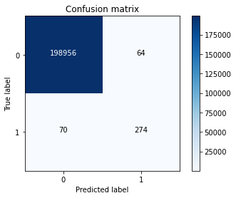
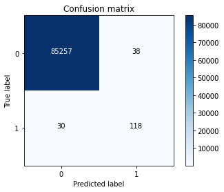

# 信用卡欺诈交易预测：处理极度不平衡样本的分类建模实践

## 摘要

| 模块     | 内容                                                         |
| -------- | ------------------------------------------------------------ |
| 业务场景 | 金融                                                         |
| 数据来源 | 脱敏信用卡交易数据，包含 PCA 主成分特征、交易时间、金额和欺诈标签。 |
| 分析方法 | EDA、RobustScaler 标准化、样本不平衡处理、逻辑回归、决策树、混淆矩阵、ROC 评估。 |
| 结论先行 | 数据中欺诈交易占比约 0.17%，如果直接追求准确率，模型可能全部预测为正常仍然看似很高。 |

本报告围绕“业务背景、分析目的、数据说明、分析思路、分析过程、核心结论和改进建议”展开，目标是用数据回答具体问题，并把分析结果转化为可执行的判断。

## 一、分析背景

欺诈检测是典型低频高损场景。欺诈样本占比极低，模型不能被整体准确率误导，必须关注召回、误报成本和业务处置能力。

## 二、分析目的

本次分析主要回答以下问题：

- 哪些变量或特征最可能影响目标结果？
- 模型能否稳定识别高风险、高价值或高需求样本？
- 模型输出应该如何转化为业务动作，而不是停留在准确率上？

先明确分析目的，再开展数据处理和指标拆解，可以保证报告围绕问题展开，而不是简单罗列代码和图表。

## 三、数据来源与指标说明

| 项目           | 说明                                                         |
| -------------- | ------------------------------------------------------------ |
| 数据来源       | 脱敏信用卡交易数据，包含 PCA 主成分特征、交易时间、金额和欺诈标签。 |
| 分析工具与方法 | EDA、RobustScaler 标准化、样本不平衡处理、逻辑回归、决策树、混淆矩阵、ROC 评估。 |
| 重点分析指标   | 目标变量分布、特征变量、训练/测试集、准确率、召回率、精确率、AUC 或混淆矩阵。 |
| 数据口径       | 本文以项目数据集中的字段为分析范围，先完成缺失值、异常值、重复值或类别字段处理，再围绕核心指标做统计、可视化或建模。 |

数据口径会直接影响分析结论，因此报告先说明数据范围、核心指标和处理方式，便于读者理解结论的适用边界。

## 四、分析思路

| 步骤                | 目的                                                         |
| ------------------- | ------------------------------------------------------------ |
| 1. 明确业务问题     | 确定分析要回答什么，以及结论会影响什么决策。                 |
| 2. 数据读取与清洗   | 处理缺失、重复、异常和字段格式问题，保证分析基础可靠。       |
| 3. 指标拆解与可视化 | 从趋势、结构、对比、分布或空间维度观察数据现象。             |
| 4. 建模或深度分析   | 根据项目需要完成聚类、预测、分类、回归、文本分析或可视化大屏。 |
| 5. 输出结论与建议   | 把数据发现翻译成业务语言，并给出可执行的下一步动作。         |

本项目的具体分析路径如下：

- 先把业务目标转成可建模问题：明确预测对象、标签字段、样本粒度和模型输出的业务含义。
- 做数据检查和探索：查看缺失值、异常值、类别分布、关键变量分布，以及目标变量是否存在不平衡。
- 完成特征处理：对类别变量编码，对数值变量缩放或标准化，并根据业务含义保留可解释变量。
- 建立基准模型并比较效果：优先选择可解释模型作为 baseline，再根据数据复杂度尝试树模型或集成模型。
- 把模型指标翻译成业务动作：例如风控看召回和误报，营销看转化和 ROI，预测类问题看高峰期误差。

## 五、数据处理过程

本项目的数据处理主要包括以下环节：

- 读取原始数据，检查字段类型、样本规模和基础统计信息。
- 处理缺失值、重复值、异常值或文本噪声，保证后续统计和建模结果可靠。
- 根据分析目标构造必要指标、标签或特征，并统一字段口径。
- 按业务维度进行分组、聚合、可视化或模型训练，为结论提供依据。

## 六、数据分析与结果

本部分按照“分析发现 -> 结果解读”的方式组织，重点说明数据体现出的现象及其业务含义。

### 1. 数据中欺诈交易占比约 0.17%，如果直接追求准确率，模型可能全部预测为正常仍然看似很高。

结果解读：该发现是本项目最核心的结论之一，说明数据中存在值得关注的结构性特征。对应图表或模型结果应围绕这一判断展开，帮助读者理解结论来源。

### 2. 交易金额和时间分布能提供初步业务线索，小额欺诈和低频时段异常值得关注。

结果解读：该发现进一步解释了不同维度之间的差异。对业务决策而言，重点不只是看到差异，而是判断差异来自哪些对象、场景或指标。

### 3. 样本平衡、类别权重和阈值调整会显著影响模型在召回率和误报率之间的取舍。

结果解读：该发现可以作为后续优化策略或模型改进的依据。若用于真实业务，还需要结合成本、资源、实验结果或线上反馈继续验证。

## 七、结论

综合以上分析，可以得到以下结论：

- 数据中欺诈交易占比约 0.17%，如果直接追求准确率，模型可能全部预测为正常仍然看似很高。
- 交易金额和时间分布能提供初步业务线索，小额欺诈和低频时段异常值得关注。
- 样本平衡、类别权重和阈值调整会显著影响模型在召回率和误报率之间的取舍。

## 八、建议

- 行动 1：风控系统应采用分层处置：高风险拦截、中风险二次验证、低风险放行并监控。
- 行动 2：评估模型时建议使用 PR-AUC、召回率、误报率和人工审核成本，而不是只看 ROC-AUC。
- 行动 3：上线后要监控欺诈模式漂移，定期更新模型和规则。
- 跟进方式：为每条建议绑定一个可观察指标，后续按周或按月复盘效果。

建议部分应结合具体对象、执行动作和复盘指标，避免停留在泛泛的“加强管理”或“优化运营”。

## 九、局限性与改进方向

- 项目价值：把风险识别从事后复盘前移到贷前、交易中或贷后预警阶段，帮助业务在损失扩大前做分层处置。
- 真实限制：金融数据通常存在强监管约束，脱敏字段会降低解释性，且风险表现具有时间滞后，短期样本无法完全代表长期违约或欺诈变化。
- 业务风险：模型误判会带来资金损失或客户体验损害，高风险拦截、人工审核和客户申诉流程必须一起设计。
- 改进方向：按时间切分训练集和验证集，增加线上/线下指标对齐，避免随机切分高估模型效果。
- 改进方向：补充模型监控，包括数据漂移、预测分布、召回率、误报率和业务转化效果。
- 改进方向：增加审批、还款、催收和客户申诉链路数据，形成从识别到处置再到反馈的闭环。

## 附录：完整代码与输出结果

下面内容按原 notebook 的代码单元顺序整理。如果代码单元产生了文本输出或图片输出，也一并附在对应代码后面，便于复现完整分析过程。

### 代码单元 1

```python
# 使用前卸载旧版本plotly，安装新版本
# pip uninstall plotly
```

### 代码单元 2

```python
import numpy as np
import pandas as pd
import time

import plotly.express as px
import matplotlib.pyplot as plt
```

### 代码单元 3

```python
import warnings
warnings.filterwarnings("ignore")
```

### 代码单元 4

```python
data = pd.read_csv('./creditcardfraud.csv')
data.shape
```

**文本输出**

```text
(284807, 31)
```

### 代码单元 5

```python
data.head(3)
```

**文本输出**

```text
Time        V1        V2        V3        V4        V5        V6        V7  \
0   0.0 -1.359807 -0.072781  2.536347  1.378155 -0.338321  0.462388  0.239599   
1   0.0  1.191857  0.266151  0.166480  0.448154  0.060018 -0.082361 -0.078803   
2   1.0 -1.358354 -1.340163  1.773209  0.379780 -0.503198  1.800499  0.791461   

         V8        V9  ...       V21       V22       V23       V24       V25  \
0  0.098698  0.363787  ... -0.018307  0.277838 -0.110474  0.066928  0.128539   
1  0.085102 -0.255425  ... -0.225775 -0.638672  0.101288 -0.339846  0.167170   
2  0.247676 -1.514654  ...  0.247998  0.771679  0.909412 -0.689281 -0.327642   

        V26       V27       V28  Amount  Class  
0 -0.189115  0.133558 -0.021053  149.62      0  
1  0.125895 -0.008983  0.014724    2.69      0  
2 -0.139097 -0.055353 -0.059752  378.66      0  

[3 rows x 31 columns]
```

### 代码单元 6

```python
data.isnull().values.sum()
```

**文本输出**

```text
0
```

### 代码单元 7

```python
tran_class = data.Class.value_counts().reset_index()
tran_class.rename(columns={'index':'交易类别', 'Class':'频数'}, inplace=True)
tran_class['交易类别'] = tran_class['交易类别'].map({0:'正常',1:'欺诈'})
tran_class['占比'] = tran_class['频数']/tran_class['频数'].sum()

# 绘制柱状图
tran_class_fig = px.bar(tran_class, y='交易类别', x='频数', height = 300, width = 800,
    text=['频数:{}<br>占比:{:.2f}%'.format(a,100*b) for a,b in zip(tran_class['频数'],tran_class['占比'])],
    orientation='h'
    )
tran_class_fig.update_layout(title={'text':'交易类别分布', 'y':0.97, 'x':0.5, 'xanchor':'center','yanchor':'top'})
```

### 代码单元 8

```python
all_normal = data[data['Class'] == 0] # 正常交易
all_fraud = data[data['Class'] == 1]  # 欺诈交易
```

### 代码单元 9

```python
def draw_hist(dataframe, x_name, x_rename, title, color, nbins_count = 100, height = 400, width = 900, log_y=False):
    fig = px.histogram(dataframe, x=x_name, nbins=nbins_count, labels={x_name:x_rename},
                    opacity=0.9, color_discrete_sequence=[color], # color of histogram bars
                    height= height, width = width, log_y = log_y,
                    # range_x = [dataframe[x_name].min(),dataframe[x_name].max()],
                    # marginal='box', # 绘制辅助图：箱线图
    )
    fig.update_layout(title={'text':title, 'y':0.97, 'x':0.5, 'xanchor':'center','yanchor':'top'})
    fig.show()
```

### 代码单元 10

```python
draw_hist(all_normal, 'Time', '交易时间', '正常交易时间分布', 'rgb(156,219,165)')
draw_hist(all_fraud, 'Time', '交易时间', '欺诈交易时间分布', 'rgb(214,96,77)')
```

### 代码单元 11

```python
draw_hist(all_normal, 'Time', '交易时间', '正常交易时间分布', 'rgb(156,219,165)', log_y = True)
draw_hist(all_fraud, 'Time', '交易时间', '欺诈交易时间分布', 'rgb(214,96,77)', log_y = True)
```

### 代码单元 12

```python
normal_amount_box = px.box(all_normal, x='Amount', width = 700, height = 200)
normal_amount_box.update_layout(title={'text':'正常交易金额箱线图', 'y':0.97, 'x':0.5, 'xanchor':'center','yanchor':'top'})
normal_amount_box.show()
fraud_amount_box = px.box(all_fraud, x='Amount', width = 700, height = 200)
fraud_amount_box.update_layout(title={'text':'欺诈交易金额箱线图', 'y':0.97, 'x':0.5, 'xanchor':'center','yanchor':'top'})
fraud_amount_box.show()
```

### 代码单元 13

```python
draw_hist(all_normal, 'Amount', '交易金额', '正常交易金额分布', 'rgb(156,219,165)', nbins_count=30, height = 300, width = 700)
draw_hist(all_fraud, 'Amount', '交易金额', '欺诈交易金额分布', 'rgb(214,96,77)', nbins_count=30, height = 300, width = 700)
```

### 代码单元 14

```python
normal_time_amount_fig = px.scatter(all_normal, x='Time', y = 'Amount', height = 380, width = 700)
normal_time_amount_fig.update_layout(title={'text':'正常交易时间与金额的分布', 'y':0.97, 'x':0.5, 'xanchor':'center','yanchor':'top'})
# normal_time_amount_fig.show()

fraud_time_amount_fig = px.scatter(all_fraud, x='Time', y = 'Amount', height = 380, width = 700)
fraud_time_amount_fig.update_layout(title={'text':'欺诈交易时间与金额的分布', 'y':0.97, 'x':0.5, 'xanchor':'center','yanchor':'top'})
fraud_time_amount_fig.show()
```

### 代码单元 15

```python
from sklearn.preprocessing import StandardScaler, RobustScaler

# std_scaler = StandardScaler()
rub_scaler = RobustScaler() # 鲁棒性更强

# reshape(-1,1) 将data['Amount']变成只有一列，行数不限定的np.array
data['scaledAmount'] = rub_scaler.fit_transform(data['Amount'].values.reshape(-1,1))
data['scaledTime'] = rub_scaler.fit_transform(data['Time'].values.reshape(-1,1))

print('未标准化的Amount：',data['Amount'].values.reshape(-1,1))
print('标准化后的Amount：',rub_scaler.fit_transform(data['Amount'].values.reshape(-1,1)))
print('未标准化的Time：',data['Time'].values.reshape(-1,1))
print('标准化后的Time：',rub_scaler.fit_transform(data['Time'].values.reshape(-1,1)))

# 新建子数据集：删除不需要使用到的两列数据
new_data = data.drop(['Time','Amount'], axis = 1)
new_data.head()
```

**文本输出**

```text
未标准化的Amount： [[149.62]
 [  2.69]
 [378.66]
 ...
 [ 67.88]
 [ 10.  ]
 [217.  ]]
标准化后的Amount： [[ 1.78327395]
 [-0.26982463]
 [ 4.98372109]
 ...
 [ 0.64109551]
 [-0.16767973]
 [ 2.72479564]]
未标准化的Time： [[0.00000e+00]
 [0.00000e+00]
 [1.00000e+00]
 ...
 [1.72788e+05]
 [1.72788e+05]
 [1.72792e+05]]
标准化后的Time： [[-0.99498349]
 [-0.99498349]
 [-0.99497175]
 ...
 [ 1.03497457]
 [ 1.03497457]
 [ 1.03502156]]
V1        V2        V3        V4        V5        V6        V7  \
0 -1.359807 -0.072781  2.536347  1.378155 -0.338321  0.462388  0.239599   
1  1.191857  0.266151  0.166480  0.448154  0.060018 -0.082361 -0.078803   
2 -1.358354 -1.340163  1.773209  0.379780 -0.503198  1.800499  0.791461   
3 -0.966272 -0.185226  1.792993 -0.863291 -0.010309  1.247203  0.237609   
4 -1.158233  0.877737  1.548718  0.403034 -0.407193  0.095921  0.592941   

         V8        V9       V10  ...       V22       V23       V24       V25  \
0  0.098698  0.363787  0.090794  ...  0.277838 -0.110474  0.066928  0.128539   
1  0.085102 -0.255425 -0.166974  ... -0.638672  0.101288 -0.339846  0.167170   
2  0.247676 -1.514654  0.207643  ...  0.771679  0.909412 -0.689281 -0.327642   
3  0.377436 -1.387024 -0.054952  ...
... 输出过长，博客中已截断
```

### 代码单元 16

```python
from sklearn.model_selection import train_test_split       # 随机抽样
from sklearn.model_selection import StratifiedShuffleSplit # 分层抽样

# 划分特征数据 和标签数据
X = new_data.iloc[:, new_data.columns != 'Class'] # 选取特征列数据
y = new_data.iloc[:, new_data.columns == 'Class'] # 选取类别label
print('X shape:',X.shape, '\ny shape:',y.shape)

# 方式一：随机抽样
# X = np.array(new_data.iloc[:, new_data.columns != 'Class']) # 选取特征列数据
# y = np.array(new_data.iloc[:, new_data.columns == 'Class']) # 选取类别label
# X_train, X_test, y_train, y_test = train_test_split(X, y, test_size=0.3, random_state=1234)

# 方式二：按比例分层抽样
#  cross-validator中划分迭代次数设为10
sss = StratifiedShuffleSplit(n_splits=10,test_size=0.3,train_size=None, random_state=12345)

for train_index, test_index in sss.split(X,y):
    print('Train:', train_index, 'Test:', test_index)
    original_Xtrain, original_Xtest = X.iloc[train_index], X.iloc[test_index]
    original_ytrain, original_ytest = y.iloc[train_index], y.iloc[test_index]

# 矩阵化训练集与测试集
original_X_train = np.array(original_Xtrain)
original_X_test = np.array(original_Xtest)
original_y_train = np.array(original_ytrain)
original_y_test = np.array(original_ytest)
```

**文本输出**

```text
X shape: (284807, 30) 
y shape: (284807, 1)
Train: [234895  81040  12679 ... 179943  57581  54682] Test: [202944 205048  37352 ...  18041   1087 261151]
Train: [151109  18598 210321 ... 234503 114302  70150] Test: [258660 235588 165332 ...  92130 126053 102834]
Train: [256516 107647  65073 ...  57791  14666 220097] Test: [ 34282 144908 134138 ...  23767  80528 109572]
Train: [211460  59514 268303 ...  16278  28835 282029] Test: [255174  17598 199922 ...  32446 152270 154563]
Train: [241128  34322  20381 ... 237164  91241 104721] Test: [137959 243766  14175 ... 116200   6773 221703]
Train: [229596 129637 164247 ...  98365 276493 192991] Test: [ 64785  87630 246573 ...  99937 175348  41425]
Train: [243014 257876 260065 ... 279081 138792  56873] Test: [275811 246143  39316 ... 105549  67752 265426]
Train: [ 34660 266451 224571 ... 176956 203995 205710] Test: [ 84597 127302 178467 ...  99294 177698 133543]
Train: [ 19204 112900  67747 ... 206708 221080  70908] Test: [ 84811  24757  82120 ...  97133 119289 180388]
Train: [272482  36286 210665 ... 154371  86727 107795] Test: [ 67792 218682 214552 ... 232470 263109  16669]
```

### 代码单元 17

```python
# 查看训练集和测试集标签分布
train_unique_label, train_label_count = np.unique(original_y_train, return_counts=True)
test_unique_label, test_label_count = np.unique(original_y_test, return_counts=True)

train_label_rate = train_label_count / len(original_ytrain)
test_label_rate = test_label_count / len(original_ytest)

print("\n训练集标签{}:{}个, 标签{}:{}个".format(train_unique_label[0],train_label_count[0], train_unique_label[1],train_label_count[1] ))
print("\n训练集标签分布比例：")
for label,rate in zip(train_unique_label, train_label_rate):
    print('标签{} 占比:{:.2f}%'.format(label,100*rate))

print("\n测试集标签{}:{}个, 标签{}:{}个".format(test_unique_label[0],test_label_count[0], test_unique_label[1],test_label_count[1] ))
print("\n测试集标签分布比例：")
for label,rate in zip(test_unique_label,test_label_rate):
    print('标签{} 占比:{:.2f}%'.format(label,100*rate))
```

**文本输出**

```text
训练集标签0:199020个, 标签1:344个

训练集标签分布比例：
标签0 占比:99.83%
标签1 占比:0.17%

测试集标签0:85295个, 标签1:148个

测试集标签分布比例：
标签0 占比:99.83%
标签1 占比:0.17%
```

### 代码单元 18

```python
# pip uninstall imbalanced-learn
```

### 代码单元 19

```python
# 安装 imblearn 0.7.0
```

### 代码单元 20

```python
from imblearn.over_sampling import RandomOverSampler, SMOTE
from imblearn.combine import SMOTETomek
```

### 代码单元 21

```python
ros = RandomOverSampler(random_state=0)
sos = SMOTE(random_state = 0)
kos = SMOTETomek(random_state = 0)

# 这一步耗时较长
X_ros, y_ros = ros.fit_sample(original_X_train, original_y_train)
X_sos, y_sos = sos.fit_sample(original_X_train, original_y_train)
X_kos, y_kos = kos.fit_sample(original_X_train, original_y_train)

print('ros:{}, sos:{}, kos:{}'.format(len(y_ros), len(y_sos), len(y_kos)))
```

**文本输出**

```text
ros:398040, sos:398040, kos:398040
```

### 代码单元 22

```python
print('训练集正样本数统计，原始训练集:{} \n随机过采样后训练集:{}, SMOTE过采样后训练集:{}, 综合过采样后训练集:{}\
      '.format(original_y_train.sum(), y_ros.sum(), y_sos.sum(), y_kos.sum()))
print('原始训练集中敷眼部占比为{:.2f}%, 通过3种过采样方式后训练集的负样本占比都提升至：{:.0f}%'.format(100*original_y_train.sum()/len(original_y_train), 100*y_ros.sum()/len(y_ros)))
```

**文本输出**

```text
训练集正样本数统计，原始训练集:344 
随机过采样后训练集:199020, SMOTE过采样后训练集:199020, 综合过采样后训练集:199020      
原始训练集中敷眼部占比为0.17%, 通过3种过采样方式后训练集的负样本占比都提升至：50%
```

### 代码单元 23

```python
from sklearn.linear_model import LogisticRegression
from sklearn import metrics
from sklearn.model_selection import GridSearchCV
from sklearn.metrics import confusion_matrix, roc_curve, auc, recall_score, classification_report
```

### 代码单元 24

```python
lr = LogisticRegression(max_iter = 500)

# 定义正则化权重参数，用以控制过拟合
paramaters = {'C':[0.01,0.1,1,5,10,100]}
# 10 folds, n jobs run in parallel
lr_cv1 = GridSearchCV(lr, param_grid = paramaters, cv=10, n_jobs=-1, verbose=5, scoring='f1')  # n_jobs=-1
```

### 代码单元 25

```python
data = [[original_X_train, original_y_train],
        [X_ros, y_ros],
        [X_sos, y_sos],
        [X_kos, y_kos]]

for features, labels in data:
    lr_cv1.fit(features, labels)
    predict_test = lr_cv1.predict(original_X_test)
    print('AUC:{} Recall:{} Precision:{}'.format(
        metrics.roc_auc_score(original_y_test, predict_test),
        metrics.recall_score(original_y_test, predict_test),
        metrics.precision_score(original_y_test, predict_test)
    ))
```

**文本输出**

```text
Fitting 10 folds for each of 6 candidates, totalling 60 fits
AUC:0.8343949773678949 Recall:0.668918918918919 Precision:0.9
Fitting 10 folds for each of 6 candidates, totalling 60 fits
AUC:0.9408555838797938 Recall:0.9054054054054054 Precision:0.062180974477958235
Fitting 10 folds for each of 6 candidates, totalling 60 fits
AUC:0.9404511053054343 Recall:0.9054054054054054 Precision:0.06025179856115108
Fitting 10 folds for each of 6 candidates, totalling 60 fits
AUC:0.9404511053054343 Recall:0.9054054054054054 Precision:0.06025179856115108
```

### 代码单元 26

```python
print('最好的参数：', lr_cv1.best_params_)
```

**文本输出**

```text
最好的参数： {'C': 100}
```

### 代码单元 27

```python
lr = LogisticRegression(max_iter = 500)
param_grid= {'C':[0.01,0.1,1,5,10,100],
            'class_weight':[{0:1,1:3}, {0:1,1:5},{0:1,1:10}, {0:1,1:15}]
            }

lr_cv2 = GridSearchCV(lr, param_grid = param_grid, cv=10, n_jobs=-1, verbose=5, scoring='f1')  # n_jobs=-1

#
lr_cv2.fit(original_X_train, original_y_train)
predict2 = lr_cv2.predict(original_X_test)

print('AUC:{:.3f} Recall:{:.3f} Precision:{:.3f}'.format(
        metrics.roc_auc_score(original_y_test, predict2),
        metrics.recall_score(original_y_test, predict2),
        metrics.precision_score(original_y_test, predict2)
    ))
```

**文本输出**

```text
Fitting 10 folds for each of 24 candidates, totalling 240 fits
AUC:0.898 Recall:0.797 Precision:0.756
```

### 代码单元 28

```python
print('模型最优参数：',lr_cv2.best_params_)
```

**文本输出**

```text
模型最优参数： {'C': 1, 'class_weight': {0: 1, 1: 5}}
```

### 代码单元 29

```python
import itertools

def plot_confusion_matrix(cm, classes, title='Confusion matrix', cmap=plt.cm.Blues):
    """
    This function prints and plots the confusion matrix.
    Normalization can be applied by setting `normalize=True`.
    """
    plt.imshow(cm, interpolation='nearest', cmap=cmap)
    plt.title(title)
    plt.colorbar()
    tick_marks = np.arange(len(classes))
    plt.xticks(tick_marks, classes, rotation=0)
    plt.yticks(tick_marks, classes)

    thresh = cm.max() / 2.
    for i, j in itertools.product(range(cm.shape[0]), range(cm.shape[1])):
        plt.text(j, i, cm[i, j],
                 horizontalalignment="center",
                 color="white" if cm[i, j] > thresh else "black")

    # plt.tight_layout()
    plt.ylabel('True label')
    plt.xlabel('Predicted label')
```

### 代码单元 30

```python
# 对原训练集进行预测
y_train_pre = lr_cv2.predict(original_X_train)

# 训练集的混淆矩阵
cnf_matrix_train = confusion_matrix(original_y_train, y_train_pre)

print("训练集实际标签数量统计：\n标签{}:{}个, 标签{}:{}个".format(train_unique_label[0],train_label_count[0], train_unique_label[1],train_label_count[1] ))
print("Recall: {:.2f}%".format(100*cnf_matrix_train[1,1]/(cnf_matrix_train[1,0]+cnf_matrix_train[1,1])))

class_names = [0,1]
plt.figure()
plot_confusion_matrix(cnf_matrix_train , classes=class_names, title='Confusion matrix')
plt.show()
```

**文本输出**

```text
训练集实际标签数量统计：
标签0:199020个, 标签1:344个
Recall: 79.65%
```

**图表输出 1**



### 代码单元 31

```python
# 对测试集进行预测
y_pre = lr_cv2.predict(original_X_test)

# 测试集的混淆矩阵
cnf_matrix = confusion_matrix(original_y_test, y_pre)

print("测试集实际标签数量统计：\n标签{}:{}个, 标签{}:{}个".format(test_unique_label[0],test_label_count[0], test_unique_label[1],test_label_count[1] ))
print("测试集Recall: {:.2f}%".format(100*cnf_matrix[1,1]/(cnf_matrix[1,0]+cnf_matrix[1,1])))

class_names = [0,1]
plt.figure()
plot_confusion_matrix(cnf_matrix , classes=class_names, title='Confusion matrix')
plt.show()
```

**文本输出**

```text
测试集实际标签数量统计：
标签0:85295个, 标签1:148个
测试集Recall: 79.73%
```

**图表输出 1**



### 代码单元 32

```python
from sklearn.tree import DecisionTreeClassifier
from sklearn.tree import export_graphviz
```

### 代码单元 33

```python
tree_params = {
    "criterion": ["gini", "entropy"], # 损失函数：基尼、熵
    "max_depth": list(range(2, 4, 1)), # 最大深度 2、3
    "min_samples_leaf": list(range(5, 7, 1)) # 叶子数需要为奇数
}
dt_cv = GridSearchCV(DecisionTreeClassifier(), tree_params, scoring='f1')
dt_cv.fit(original_X_train, original_y_train.ravel())
```

### 代码单元 34

```python
print('模型最优参数：',dt_cv.best_params_)
```

### 代码单元 35

```python
predict3 = dt_cv.predict(original_X_test)
print('AUC:{:.3f} Recall:{:.3f} Precision:{:.3f}'.format(
        metrics.roc_auc_score(original_y_test, predict3),
        metrics.recall_score(original_y_test, predict3),
        metrics.precision_score(original_y_test, predict3)
    ))
```

### 代码单元 36

```python
# 基于最优参数构造决策树分类器
dt_clf = DecisionTreeClassifier(criterion='entropy', max_depth=3, min_samples_leaf=5)
dt_clf.fit(original_X_train, original_y_train.ravel())
```

**文本输出**

```text
DecisionTreeClassifier(criterion='entropy', max_depth=3, min_samples_leaf=5)
```

### 代码单元 37

```python
import pydotplus
from IPython.display import display, Image

dot_data = export_graphviz(dt_clf,  # 决策树模型
                            out_file=None, # 输出文件格式
                            feature_names=X.columns, # 特征矩阵
                            class_names = ['normal', 'fraud'], # 标签，按数字升序
                            filled = True, # 由颜色标识不纯度
                            rounded =True  # 树节点为圆角矩形
                        )
                               
graph = pydotplus.graph_from_dot_data(dot_data)
display(Image(graph.create_png()))
```

### 代码单元 38

```python
# 逻辑回归
fpr, tpr, thresholds = roc_curve(original_y_test, predict2)
roc_auc = auc(fpr, tpr)
print('Logistic Regression AUC：{:.2f}%'.format(100*roc_auc))

# 决策树
dt_fpr, dt_tpr, dt_thresholds = roc_curve(original_y_test, predict3)
dt_roc_auc = auc(dt_fpr, dt_tpr)
print('Decision Tree AUC：{:.2f}%'.format(100*dt_roc_auc))

# Plot ROC

plt.title('Receiver Operating Characteristic')
plt.plot(fpr, tpr, 'b',label='Logistic Regression AUC = %0.3f'% roc_auc)
plt.plot(dt_fpr, dt_tpr, 'y', label='Decision Tress AUC = %0.3f'% dt_roc_auc)
plt.legend(loc='lower right') # 设置legend的位置
plt.plot([0,1],[0,1],'r--') # red, --
plt.xlim([-0.1,1.0])
plt.ylim([-0.1,1.01])
plt.ylabel('True Positive Rate')
plt.xlabel('False Positive Rate')
plt.show()
```

**文本输出**

```
Logistic Regression AUC：89.84%
Decision Tree AUC：89.85%
```

