# 拍拍贷平台业务数据分析：从借款、投资和还款理解信贷平台经营

## 摘要

| 模块     | 内容                                                         |
| -------- | ------------------------------------------------------------ |
| 业务场景 | 金融                                                         |
| 数据来源 | 拍拍贷平台业务数据，包含借款、投资、还款及相关数据字典。     |
| 分析方法 | 多表理解、数据清洗、指标计算、借款与还款行为分析、matplotlib 可视化。 |
| 结论先行 | 金融平台分析应同时覆盖增长和风险，规模增长如果伴随坏账上升，长期价值会被侵蚀。 |

本报告围绕“业务背景、分析目的、数据说明、分析思路、分析过程、核心结论和改进建议”展开，目标是用数据回答具体问题，并把分析结果转化为可执行的判断。

## 一、分析背景

网贷平台的经营核心是资产质量、资金匹配效率和风险定价。单看成交规模不够，还要关注逾期、还款、借款人画像和投资人行为。

## 二、分析目的

本次分析主要回答以下问题：

- 当前业务场景下最需要解释的核心指标是什么？
- 不同维度之间是否存在明显差异或异常？
- 分析结果可以转化为哪些具体决策建议？

先明确分析目的，再开展数据处理和指标拆解，可以保证报告围绕问题展开，而不是简单罗列代码和图表。

## 三、数据来源与指标说明

| 项目           | 说明                                                         |
| -------------- | ------------------------------------------------------------ |
| 数据来源       | 拍拍贷平台业务数据，包含借款、投资、还款及相关数据字典。     |
| 分析工具与方法 | 多表理解、数据清洗、指标计算、借款与还款行为分析、matplotlib 可视化。 |
| 重点分析指标   | 样本量、核心业务指标、分组维度、趋势变化、异常值和关键对比结果。 |
| 数据口径       | 本文以项目数据集中的字段为分析范围，先完成缺失值、异常值、重复值或类别字段处理，再围绕核心指标做统计、可视化或建模。 |

数据口径会直接影响分析结论，因此报告先说明数据范围、核心指标和处理方式，便于读者理解结论的适用边界。

## 四、分析思路

| 步骤                | 目的                                                         |
| ------------------- | ------------------------------------------------------------ |
| 1. 明确业务问题     | 确定分析要回答什么，以及结论会影响什么决策。                 |
| 2. 数据读取与清洗   | 处理缺失、重复、异常和字段格式问题，保证分析基础可靠。       |
| 3. 指标拆解与可视化 | 从趋势、结构、对比、分布或空间维度观察数据现象。             |
| 4. 建模或深度分析   | 根据项目需要完成聚类、预测、分类、回归、文本分析或可视化大屏。 |
| 5. 输出结论与建议   | 把数据发现翻译成业务语言，并给出可执行的下一步动作。         |

本项目的具体分析路径如下：

- 先从业务背景出发，明确这份数据要回答什么问题，以及结论会影响什么决策。
- 检查数据口径，包括样本量、字段含义、缺失值、重复值和异常值。
- 围绕核心指标做拆解，例如价格、销量、转化、风险、留存、区域或人群结构。
- 用分组统计和可视化寻找差异，再结合业务常识判断差异是否有解释价值。
- 最后把发现转化为建议，并说明局限性和下一步需要补充的数据。

## 五、数据处理过程

本项目的数据处理主要包括以下环节：

- 读取原始数据，检查字段类型、样本规模和基础统计信息。
- 处理缺失值、重复值、异常值或文本噪声，保证后续统计和建模结果可靠。
- 根据分析目标构造必要指标、标签或特征，并统一字段口径。
- 按业务维度进行分组、聚合、可视化或模型训练，为结论提供依据。

## 六、数据分析与结果

本部分按照“分析发现 -> 结果解读”的方式组织，重点说明数据体现出的现象及其业务含义。

### 1. 金融平台分析应同时覆盖增长和风险，规模增长如果伴随坏账上升，长期价值会被侵蚀。

结果解读：该发现是本项目最核心的结论之一，说明数据中存在值得关注的结构性特征。对应图表或模型结果应围绕这一判断展开，帮助读者理解结论来源。

### 2. 借款期限、利率、评级和还款表现之间的关系，是理解平台风险收益结构的关键。

结果解读：该发现进一步解释了不同维度之间的差异。对业务决策而言，重点不只是看到差异，而是判断差异来自哪些对象、场景或指标。

### 3. 多表数据分析需要先建立业务实体关系，避免指标口径混乱。

结果解读：该发现可以作为后续优化策略或模型改进的依据。若用于真实业务，还需要结合成本、资源、实验结果或线上反馈继续验证。

## 七、结论

综合以上分析，可以得到以下结论：

- 金融平台分析应同时覆盖增长和风险，规模增长如果伴随坏账上升，长期价值会被侵蚀。
- 借款期限、利率、评级和还款表现之间的关系，是理解平台风险收益结构的关键。
- 多表数据分析需要先建立业务实体关系，避免指标口径混乱。

## 八、建议

- 行动 1：平台应按风险等级和期限拆分成交额、逾期率和收益率，避免平均指标掩盖风险。
- 行动 2：投资人侧可提供风险收益分层产品，借款人侧则优化授信和定价策略。
- 行动 3：后续可构建违约预测模型，并与贷前审批和贷后预警流程结合。
- 跟进方式：为每条建议绑定一个可观察指标，后续按周或按月复盘效果。

建议部分应结合具体对象、执行动作和复盘指标，避免停留在泛泛的“加强管理”或“优化运营”。

## 九、局限性与改进方向

- 项目价值：把原始业务数据整理成可解释的指标体系，为后续经营分析、策略制定和效果复盘提供基础。
- 真实限制：金融数据通常存在强监管约束，脱敏字段会降低解释性，且风险表现具有时间滞后，短期样本无法完全代表长期违约或欺诈变化。
- 业务风险：模型误判会带来资金损失或客户体验损害，高风险拦截、人工审核和客户申诉流程必须一起设计。
- 改进方向：补充更多业务维度和时间跨度，并建立固定口径的指标看板用于持续复盘。
- 改进方向：增加审批、还款、催收和客户申诉链路数据，形成从识别到处置再到反馈的闭环。

## 附录：完整代码与输出结果

下面内容按原 notebook 的代码单元顺序整理。如果代码单元产生了文本输出或图片输出，也一并附在对应代码后面，便于复现完整分析过程。

### 代码单元 1

```python
import pandas as pd
import numpy as np
import matplotlib.pyplot as plt

LC = pd.read_csv('./data/LC.csv')
LP = pd.read_csv('./data/LP.csv')
```

### 代码单元 2

```python
LC.info()
```

**文本输出**

```text
<class 'pandas.core.frame.DataFrame'>
RangeIndex: 328553 entries, 0 to 328552
Data columns (total 21 columns):
 #   Column     Non-Null Count   Dtype  
---  ------     --------------   -----  
 0   ListingId  328553 non-null  int64  
 1   借款金额       328553 non-null  int64  
 2   借款期限       328553 non-null  int64  
 3   借款利率       328553 non-null  float64
 4   借款成功日期     328553 non-null  object 
 5   初始评级       328553 non-null  object 
 6   借款类型       328553 non-null  object 
 7   是否首标       328553 non-null  object 
 8   年龄         328553 non-null  int64  
 9   性别         328553 non-null  object 
 10  手机认证       328553 non-null  object 
 11  户口认证       328553 non-null  object 
 12  视频认证       328553 non-null  object 
 13  学历认证       328553 non-null  object 
 14  征信认证       328553 non-null  object 
 15  淘宝认证       328553 non-null  object 
 16  历史成功借款次数   328553 non-null  int64  
 17  历史成功借款金额   328553 non-null  float64
 18  总待还本金      328553 non-null  float64
 19  历史正常还款期数   328553 non-null  int64  
 20  历史逾期还款期数   328553 non-null  int64  
dtypes: float64(3), int64(7), object(11)
memory usage: 52.6+ MB
```

### 代码单元 3

```python
LC.describe()
```

**文本输出**

```text
ListingId           借款金额           借款期限           借款利率  \
count  3.285530e+05  328553.000000  328553.000000  328553.000000   
mean   1.907948e+07    4423.816906      10.213594      20.601439   
std    8.375769e+06   11219.664024       2.780444       1.772408   
min    1.265410e+05     100.000000       1.000000       6.500000   
25%    1.190887e+07    2033.000000       6.000000      20.000000   
50%    1.952325e+07    3397.000000      12.000000      20.000000   
75%    2.629862e+07    5230.000000      12.000000      22.000000   
max    3.281953e+07  500000.000000      24.000000      24.000000   

                  年龄       历史成功借款次数      历史成功借款金额         总待还本金  \
count  328553.000000  328553.000000  3.285530e+05  3.285530e+05   
mean       29.143042       2.323159  8.785857e+03  3.721665e+03   
std         6.624286       2.922361  3.502736e+04  8.626061e+03   
min        17.000000       0.000000  0.000000e+00  0.000000e+00   
25%        24.000000       0.000000  0.000000e+00  0.000000e+00   
50%        28.000000       2.000000  5.000000e+03  2.542410e+03   
75%        33.000000       3.000000  1.035500e+04  5.446810e+03   
max        56.000000     649.000000  7.405926e+06  1.172653e+
... 输出过长，博客中已截断
```

### 代码单元 4

```python
LP.info()
```

**文本输出**

```text
<class 'pandas.core.frame.DataFrame'>
RangeIndex: 3203276 entries, 0 to 3203275
Data columns (total 10 columns):
 #   Column      Dtype  
---  ------      -----  
 0   ListingId   int64  
 1   期数          int64  
 2   还款状态        int64  
 3   应还本金        float64
 4   应还利息        float64
 5   剩余本金        float64
 6   剩余利息        float64
 7   到期日期        object 
 8   还款日期        object 
 9   recorddate  object 
dtypes: float64(4), int64(3), object(3)
memory usage: 244.4+ MB
```

### 代码单元 5

```python
LP.describe()
```

**文本输出**

```text
ListingId            期数          还款状态          应还本金          应还利息  \
count  3.203276e+06  3.203276e+06  3.203276e+06  3.203276e+06  3.203276e+06   
mean   1.947391e+07  5.904377e+00  6.037828e-01  4.604506e+02  4.232540e+01   
std    8.312219e+06  3.455267e+00  6.684636e-01  2.041906e+03  8.346626e+01   
min    1.265410e+05  1.000000e+00  0.000000e+00  0.000000e+00  0.000000e+00   
25%    1.222287e+07  3.000000e+00  0.000000e+00  1.881500e+02  1.301000e+01   
50%    2.025666e+07  6.000000e+00  1.000000e+00  3.309400e+02  2.978000e+01   
75%    2.661693e+07  9.000000e+00  1.000000e+00  5.123400e+02  5.539000e+01   
max    3.281953e+07  2.400000e+01  4.000000e+00  5.000000e+05  1.875000e+04   

               剩余本金          剩余利息  
count  3.203276e+06  3.203276e+06  
mean   1.846682e+02  1.472581e+01  
std    4.012435e+02  2.999337e+01  
min    0.000000e+00  0.000000e+00  
25%    0.000000e+00  0.000000e+00  
50%    0.000000e+00  0.000000e+00  
75%    2.991400e+02  1.968000e+01  
max    1.000000e+05  3.978370e+03
```

### 代码单元 6

```python
LP = LP.dropna(how='any')
print(LP.info())
LC = LC.dropna(how='any')
print(LC.info())
```

**文本输出**

```text
<class 'pandas.core.frame.DataFrame'>
Int64Index: 3203276 entries, 0 to 3203275
Data columns (total 10 columns):
 #   Column      Dtype  
---  ------      -----  
 0   ListingId   int64  
 1   期数          int64  
 2   还款状态        int64  
 3   应还本金        float64
 4   应还利息        float64
 5   剩余本金        float64
 6   剩余利息        float64
 7   到期日期        object 
 8   还款日期        object 
 9   recorddate  object 
dtypes: float64(4), int64(3), object(3)
memory usage: 268.8+ MB
None
<class 'pandas.core.frame.DataFrame'>
Int64Index: 328553 entries, 0 to 328552
Data columns (total 21 columns):
 #   Column     Non-Null Count   Dtype  
---  ------     --------------   -----  
 0   ListingId  328553 non-null  int64  
 1   借款金额       328553 non-null  int64  
 2   借款期限       328553 non-null  int64  
 3   借款利率       328553 non-null  float64
 4   借款成功日期     328553 non-null  object 
 5   初始评级       328553 non-null  object 
 6   借款类型       328553 non-null  object 
 7   是否首标       328553 non-null  object 
 8   年龄         328553 non-null  int64  
 9   性别         328553 non-null  object 
 10  手机认证       328553 non-null  object 
 11  户口认证       328553 non-null  object 
 12  视频认证       328553 non-null  
... 输出过长，博客中已截断
```

### 代码单元 7

```python
# 让图表直接在jupyter中展示出来
# 解决中文乱码问题
plt.rcParams["font.sans-serif"] = 'SimHei'
# 解决负号无法正常显示问题
plt.rcParams['axes.unicode_minus'] = False
```

### 代码单元 8

```python
#性别分析
male = LC[LC['性别'] == '男']
female = LC[LC['性别'] == '女']
sex = (male,female)
sex_data = (male['借款金额'].sum(), female['借款金额'].sum())
sex_idx = ('男', '女')
plt.figure(figsize=(15, 6))
plt.subplot(1,3,1)
plt.pie(sex_data, labels=sex_idx, autopct='%.1f%%')

#新老客户分析
new = LC[LC['是否首标'] == '是']
old = LC[LC['是否首标'] == '否']
newold_data = (new['借款金额'].sum(), old['借款金额'].sum())
newold_idx = ('新客户', '老客户')
plt.subplot(1,3,2)
plt.pie(newold_data, labels=newold_idx, autopct='%.1f%%')

#学历分析
ungraduate = LC[LC['学历认证'] == '未成功认证']
graduate = LC[LC['学历认证'] == '成功认证']
education_data = (ungraduate['借款金额'].sum(), graduate['借款金额'].sum())
education_idx = ('大专以下', '大专及以上')
plt.subplot(1,3,3)
plt.pie(education_data, labels=education_idx, autopct='%.1f%%')
plt.show()

#年龄分析
ageA = LC.loc[(LC['年龄'] >= 15) & (LC['年龄'] < 20)]
ageB = LC.loc[(LC['年龄'] >= 20) & (LC['年龄'] < 25)]
ageC = LC.loc[(LC['年龄'] >= 25) & (LC['年龄'] < 30)]
ageD = LC.loc[(LC['年龄'] >= 30) & (LC['年龄'] < 35)]
ageE = LC.loc[(LC['年龄'] >= 35) & (LC['年龄'] < 40)]
ageF = LC.loc[LC['年龄'] >= 40]
age = (ageA, ageB, ageC, ageD, ageE, ageF)
age_total = 0
age_percent =[]
for i in age:
    tmp = i['借款金额'].sum()
    age_percent.append(tmp)
    age_total  += tmp
age_percent /= age_total
age_idx = ['15-20', '20-25', '25-30', '30-35', '35-40', '40+']
plt.figure(figsize=(15, 8))
plt.bar(age_idx, age_percent)
for (a, b) in zip(age_idx, age_percent):
    plt.text(a, b+0.001, '%.2f%%' % (b * 100), ha='center', va='bottom', fontsize=10)
plt.show()
```

**图表输出 1**

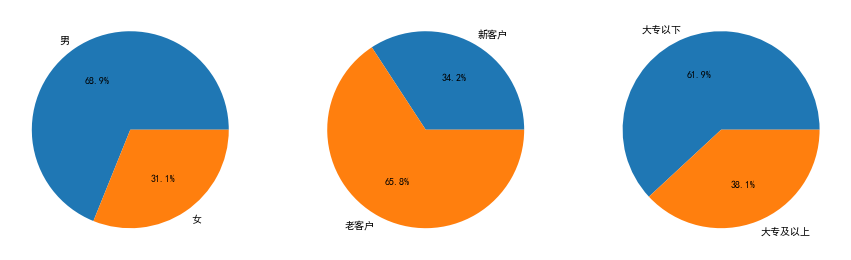

**图表输出 2**

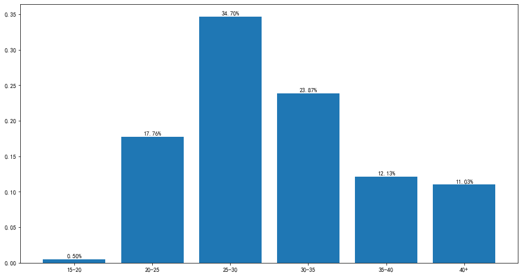

### 代码单元 9

```python
from datetime import datetime

#分析每日贷款金额的走势
loan = LC[['借款成功日期', '借款金额']].copy()
loan['借款日期'] = pd.to_datetime(loan['借款成功日期'])
loan1 = loan.pivot_table(index='借款日期', aggfunc='sum').copy()
plt.figure(figsize=(15, 6))
plt.subplot(1,2,1)
plt.plot(loan1)
plt.xlabel('日期')
plt.ylabel('借款金额')
plt.title('每天贷款金额波动图')

#分析每月贷款金额的走势
loan['借款成功月份'] = [datetime.strftime(x, '%Y-%m') for x in loan['借款日期']]
loan2 = loan.pivot_table(index='借款成功月份', aggfunc='sum').copy()
plt.subplot(1,2,2)
plt.plot(loan2)
plt.xlabel('月份')
plt.xticks(['2015-01','2015-07','2016-01','2016-07','2017-01'])
plt.ylabel('借款金额')
plt.title('每月贷款金额波动图')
plt.show()

# 对2017年1月的数据继续进行分析，并求出平均值和标准差
loan3 = loan1.loc['2017-01']
avg = loan3['借款金额'].mean()
std = loan3['借款金额'].std()
print(avg, std)
```

**文本输出**

```text
5204663.8 2203394.1435809094
```

**图表输出 1**

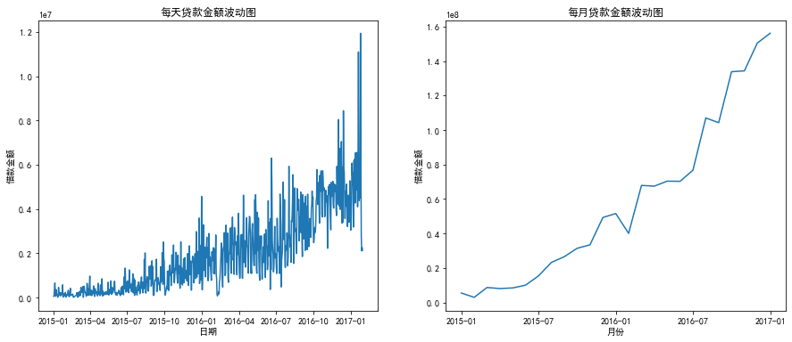

### 代码单元 10

```python
#初始评级的数据划分
level_idx = ('A','B','C','D','E','F')
lev = []
for i in level_idx:
    temp = LC[LC['初始评级'] == i]
    lev.append(temp)
    
#借款类型的数据划分
kind_idx = ('电商', 'APP闪电','普通', '其他')
kind = []
for i in kind_idx:
    temp = LC[LC['借款类型'] == i]
    kind.append(temp)
    
#不同借款金额的数据划分
amount_idx = ('0-2000', '2000-3000', '3000-4000', '4000-5000', '5000-6000', '6000+')
amountA = LC.loc[(LC['借款金额'] > 0) & (LC['借款金额'] < 2000)]
amountB = LC.loc[(LC['借款金额'] >= 2000) & (LC['借款金额'] < 3000)]
amountC = LC.loc[(LC['借款金额'] >= 3000) & (LC['借款金额'] < 4000)]
amountD = LC.loc[(LC['借款金额'] >= 4000) & (LC['借款金额'] < 5000)]
amountE = LC.loc[(LC['借款金额'] >= 5000) & (LC['借款金额'] < 6000)]
amountF = LC.loc[(LC['借款金额'] >= 6000)]
amount = (amountA, amountB, amountC, amountD,amountE,amountF)

#逾期还款率的分析图
def depayplot(i,idx,data,xlabel,title,index):
    depay = []
    for a in data:
        a['逾期还款率'] = a['历史逾期还款期数']/(a['历史逾期还款期数']+a['历史正常还款期数'])*100
        tmp = a[index].mean()
        depay.append(tmp)
    plt.subplot(2,3,i)
    plt.bar(idx, depay)
    for (a, b) in zip(idx, depay):
        plt.text(a, b+0.001, '%.2f%%'% b, ha='center', va='bottom', fontsize=10)
    plt.xlabel(xlabel)
    plt.ylabel(index)
    plt.title(title)
```

### 代码单元 11

```python
plt.figure(figsize=(15, 10))
index = '逾期还款率'
# 根据初始评级对逾期还款率进行分析
depayplot(1,level_idx,lev,'初始评级','不同初始评级客户逾期还款率',index)

# 根据年龄对逾期还款率进行分析
depayplot(2,age_idx,age,'年龄','不同年龄客户逾期还款率',index)

# 根据借款类型对逾期还款率进行分析
depayplot(3,kind_idx,kind,'借款类型','不同借款类型客户逾期还款率',index)

# 根据性别对逾期还款率进行分析
depayplot(4,sex_idx,sex,'性别','不同性别客户逾期还款率',index)

# 根据借款金额对逾期还款率进行分析
depayplot(5,amount_idx,amount,'借款金额','不同借款金额客户逾期还款率',index)

plt.show()
```

**文本输出**

```text
c:\users\administrator\envs\jupytervir\lib\site-packages\ipykernel_launcher.py:31: SettingWithCopyWarning: 
A value is trying to be set on a copy of a slice from a DataFrame.
Try using .loc[row_indexer,col_indexer] = value instead

See the caveats in the documentation: https://pandas.pydata.org/pandas-docs/stable/user_guide/indexing.html#returning-a-view-versus-a-copy
```

**图表输出 1**

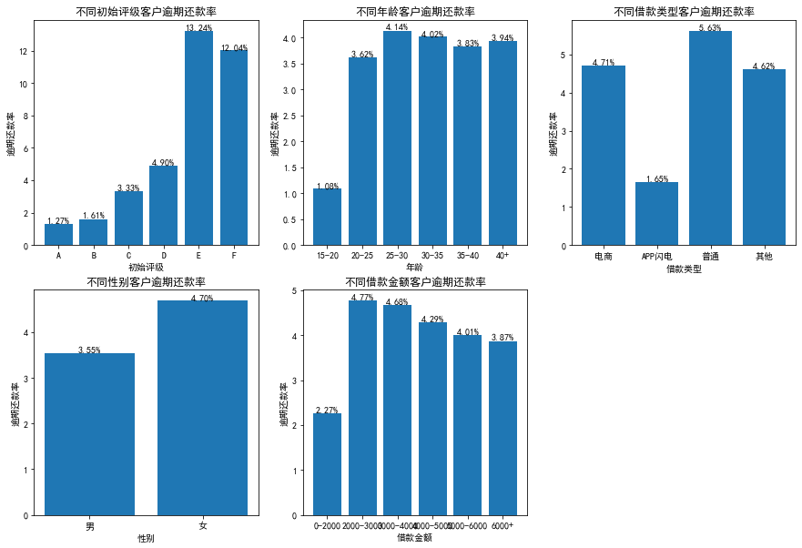

### 代码单元 12

```python
#借款利率的分析图
plt.figure(figsize=(15, 10))
index1 = '借款利率'

# 根据初始评级对借款利率进行分析
depayplot(1,level_idx,lev,'初始评级','不同初始评级客户借款利率',index1)

# 根据年龄对借款利率进行分析
depayplot(2,age_idx,age,'年龄','不同年龄客户借款利率',index1)

# 根据借款类型对借款利率进行分析
depayplot(3,kind_idx,kind,'借款类型','不同借款类型客户借款利率',index1)

# 根据性别对借款利率进行分析
depayplot(4,sex_idx,sex,'性别','不同性别客户借款利率',index1)

# 根据借款金额对借款利率进行分析
depayplot(5,amount_idx,amount,'借款金额','不同借款金额客户借款利率',index1)

plt.show()
```

**文本输出**

```text
c:\users\administrator\envs\jupytervir\lib\site-packages\ipykernel_launcher.py:31: SettingWithCopyWarning: 
A value is trying to be set on a copy of a slice from a DataFrame.
Try using .loc[row_indexer,col_indexer] = value instead

See the caveats in the documentation: https://pandas.pydata.org/pandas-docs/stable/user_guide/indexing.html#returning-a-view-versus-a-copy
```

**图表输出 1**

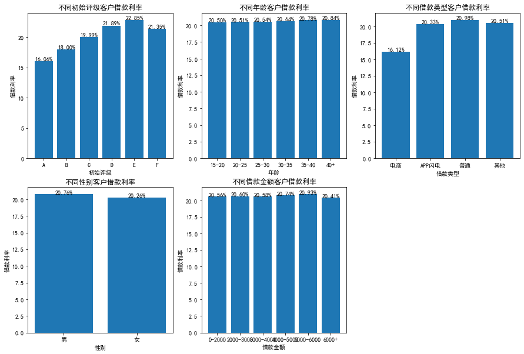

### 代码单元 13

```python
# 删除尚未到期的记录
LP = LP[LP['到期日期'] <= LP['recorddate']]
#LP.info()
#LP.describe()
# 将LC和LP两个表融合起来
LCLP = pd.merge(LC, LP, how='left', on=['ListingId'])
# 删除数据不全的记录
LCLP = LCLP.dropna(how='any')
LCLP.info()
#LCLP.describe()
```

**文本输出**

```text
<class 'pandas.core.frame.DataFrame'>
Int64Index: 1023959 entries, 0 to 1603587
Data columns (total 31 columns):
 #   Column      Non-Null Count    Dtype  
---  ------      --------------    -----  
 0   ListingId   1023959 non-null  int64  
 1   借款金额        1023959 non-null  int64  
 2   借款期限        1023959 non-null  int64  
 3   借款利率        1023959 non-null  float64
 4   借款成功日期      1023959 non-null  object 
 5   初始评级        1023959 non-null  object 
 6   借款类型        1023959 non-null  object 
 7   是否首标        1023959 non-null  object 
 8   年龄          1023959 non-null  int64  
 9   性别          1023959 non-null  object 
 10  手机认证        1023959 non-null  object 
 11  户口认证        1023959 non-null  object 
 12  视频认证        1023959 non-null  object 
 13  学历认证        1023959 non-null  object 
 14  征信认证        1023959 non-null  object 
 15  淘宝认证        1023959 non-null  object 
 16  历史成功借款次数    1023959 non-null  int64  
 17  历史成功借款金额    1023959 non-null  float64
 18  总待还本金       1023959 non-null  float64
 19  历史正常还款期数    1023959 non-null  int64  
 20  历史逾期还款期数    1023959 non-null  int64  
 21  逾期还款率       1023959 non-null  float64
 22  期数          1023959 non-null  float64
 23  还款状态   
... 输出过长，博客中已截断
```

### 代码单元 14

```python
#定义用户还款习惯分析可视化函数
def repayhabit(group,num,idx,xlabel,color):
    # 一次性全部还款
    onetime = []
    for a in group:
        ot = a.loc[a['还款状态'] == 3]['应还本金'].sum(
            ) + a.loc[a['还款状态'] == 3]['应还利息'].sum()
        onetime.append(ot)
    # 部分提前还款
    partial = []
    for a in group:
        pa = a.loc[(a['还款状态'] == 1) & (a['还款日期'] < a['到期日期'])]['应还本金'].sum(
            ) + a.loc[(a['还款状态'] == 1) & (a['还款日期'] < a['到期日期'])]['应还利息'].sum()
        partial.append(pa)
    # 逾期还款
    pastdue = []
    for a in group:
        pas = a.loc[(a['还款状态'] == 2) | (a['还款状态'] == 4)|(a['还款状态'] == 0)]['应还本金'].sum() + \
            a.loc[(a['还款状态'] == 2) | (a['还款状态'] == 4)|(a['还款状态'] == 0)]['应还利息'].sum()
        pastdue.append(pas)
    # 正常还款
    normal = []
    for a in group:
        nm = a.loc[(a['还款状态'] == 1) & (a['还款日期'] == a['到期日期'])]['应还本金'].sum(
        ) + a.loc[(a['还款状态'] == 1) & (a['还款日期'] == a['到期日期'])]['应还利息'].sum()
        normal.append(nm)
    
    tot = []
    for i in range(num):
        t = onetime[i]+partial[i]+pastdue[i]+normal[i]
        tot.append(t)

    print(tot)

    temp = []
    for i in range(num):
        tp = (100 * onetime[i] / tot[i], 100 * partial[i] / tot[i],
                100 * normal[i] / tot[i], 100 * pastdue[i] / tot[i])
        temp.append(tp)
        
    df = pd.DataFrame(temp)
    df.index = idx
    df.columns = ('提前一次性', '部分提前', '正常', '逾期')
    print(df)

    df.plot(kind='bar', colormap=color, stacked=True)
    plt.ylabel('还款金额')
    plt.xlabel(xlabel)
    plt.legend(loc='best')
    plt.show()
```

### 代码单元 15

```python
amountA = LCLP.loc[(LCLP['借款金额'] > 0) & (LCLP['借款金额'] < 2000)]
amountB = LCLP.loc[(LCLP['借款金额'] >= 2000) & (LCLP['借款金额'] < 3000)]
amountC = LCLP.loc[(LCLP['借款金额'] >= 3000) & (LCLP['借款金额'] < 4000)]
amountD = LCLP.loc[(LCLP['借款金额'] >= 4000) & (LCLP['借款金额'] < 5000)]
amountE = LCLP.loc[(LCLP['借款金额'] >= 5000) & (LCLP['借款金额'] < 6000)]
amountF = LCLP.loc[(LCLP['借款金额'] >= 6000)]
amountgroup = [amountA, amountB, amountC, amountD,amountE,amountF]

repayhabit(amountgroup,6,amount_idx,'借款金额','Greys_r')
```

**文本输出**

```text
[28456834.85, 69903191.44000001, 99595369.9, 72161874.03, 51083566.29000001, 269236628.2506]
               提前一次性       部分提前         正常         逾期
0-2000     10.204426  60.954742  16.233811  12.607020
2000-3000  10.208217  54.959603  20.400835  14.431346
3000-4000  14.874141  50.961604  21.902815  12.261440
4000-5000  14.678874  50.698304  22.775784  11.847038
5000-6000  15.703463  50.299053  23.239861  10.757622
6000+      11.688029  39.376116  39.790049   9.145806
```

**图表输出 1**

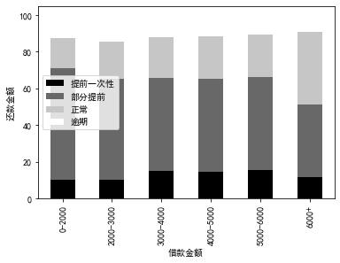

### 代码单元 16

```python
ageA = LCLP.loc[(LCLP['年龄'] >= 15) & (LCLP['年龄'] < 20)]
ageB = LCLP.loc[(LCLP['年龄'] >= 20) & (LCLP['年龄'] < 25)]
ageC = LCLP.loc[(LCLP['年龄'] >= 25) & (LCLP['年龄'] < 30)]
ageD = LCLP.loc[(LCLP['年龄'] >= 30) & (LCLP['年龄'] < 35)]
ageE = LCLP.loc[(LCLP['年龄'] >= 35) & (LCLP['年龄'] < 40)]
ageF = LCLP.loc[LCLP['年龄'] >= 40]
agegroup = [ageA, ageB, ageC, ageD, ageE, ageF]

repayhabit(agegroup,6,age_idx,'年龄','Reds_r')
```

**文本输出**

```text
[1325708.5400000003, 85978811.91999999, 203407279.9106, 149443150.8962, 79947743.0043, 70334770.4895]
           提前一次性       部分提前         正常         逾期
15-20  10.441107  62.896452  13.114767  13.547674
20-25  13.428313  53.199581  20.048697  13.323409
25-30  14.002901  47.665900  26.687108  11.644091
30-35  12.363756  43.932650  33.824134   9.879460
35-40  10.805522  44.388718  34.672769  10.132990
40+    10.882495  42.854777  37.205296   9.057432
```

**图表输出 1**

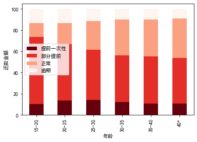

### 代码单元 17

```python
male = LCLP.loc[LCLP['性别'] == "男"]
female = LCLP.loc[LCLP['性别'] == "女"]
sexgroup = (male,female)

repayhabit(sexgroup,2,sex_idx,'性别','Greens_r')
```

**文本输出**

```text
[431899402.1953, 158538062.5653]
       提前一次性       部分提前         正常         逾期
男  13.159444  45.775236  30.093425  10.971895
女  11.417458  48.638828  29.114713  10.829001
```

**图表输出 1**

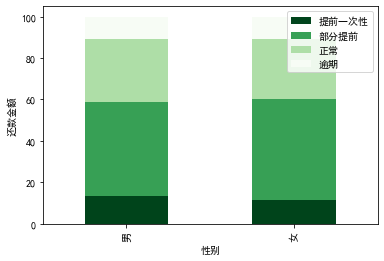

### 代码单元 18

```python
levelgroup = []
for i in level_idx:
    l = LCLP[(LCLP['初始评级'] == i)]
    levelgroup.append(l)
    
repayhabit(levelgroup,6,level_idx,'初始评级','Blues_r')
```

**文本输出**

```text
[24260113.047399998, 129789781.91, 292672443.2151, 131419854.39039999, 10771732.247699998, 1523539.95]
       提前一次性       部分提前         正常         逾期
A  10.951641  42.540019  39.727788   6.780552
B   7.686131  37.447042  47.651688   7.215139
C  14.192953  49.919494  24.995052  10.892502
D  14.592841  49.269359  21.846049  14.291750
E  13.213394  40.965391  22.906776  22.914440
F  10.752586  41.241621  20.679682  27.326111
```

**图表输出 1**

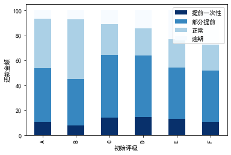

### 代码单元 19

```python
kindgroup = []
for i in kind_idx:
    l = LCLP[(LCLP['借款类型'] == i)]
    kindgroup.append(l)
    
repayhabit(kindgroup,4,kind_idx,'借款类型','Reds_r')
```

**文本输出**

```text
[85700890.47, 74452365.96, 234675993.36, 195608214.9706]
           提前一次性       部分提前         正常         逾期
电商      4.218635  26.927505  62.071671   6.782188
APP闪电   8.959958  61.125398  18.677700  11.236944
普通     17.162002  45.092948  26.095824  11.649226
其他     12.461221  51.329790  24.430785  11.778204
```

**图表输出 1**

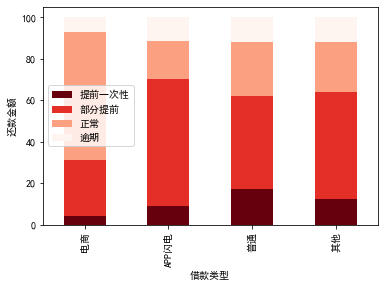

### 代码单元 20

```python
term_idx = ('1','2','3','4','5','6','7','8','9','10','11','12','13','14','15','16','17','18','19','20','21','22','23','24')
termgroup = []
for i in range(1,25):
    term = LCLP.loc[(LCLP['期数'] == i)]
    termgroup.append(term)

repayhabit(termgroup,24,term_idx,'期数','Reds_r')
```

**文本输出**

```text
[135981578.1922, 108408463.47999999, 93715601.03, 75294688.9507, 60648276.0339, 47917912.09030001, 19092666.1202, 15699880.5325, 12331986.870000001, 9339947.0008, 6687098.62, 4416541.7700000005, 301461.70999999996, 169327.15999999997, 143667.96000000002, 83483.42, 69138.15, 50308.28, 36507.18, 19895.030000000002, 17235.37, 7340.29, 4459.52, 0.0]
        提前一次性       部分提前         正常         逾期
1   11.445900  47.586534  33.902811   7.064756
2   12.167250  50.653062  28.728319   8.451370
3   15.843928  46.505031  28.396910   9.254131
4   14.029461  44.266042  30.340452  11.364045
5   12.805724  44.175306  30.414081  12.604889
6    9.611442  44.158815  31.276022  14.953720
7   15.717427  44.974685  22.785384  16.522504
8   14.343482  44.269646  23.244959  18.141913
9   11.168077  44.718088  23.378983  20.734852
10  10.209341  44.175032  23.368664  22.246963
11   7.335732  43.147448  24.866896  24.649924
12   3.498742  46.299654  23.112021  27.089583
13  40.902773  19.437918  24.870807  14.788502
14  11.418682  31.512434  29.150120  27.918764
15  16.023385  28.828836  24.818436  30.329344
16   0.000000  29.785926  27.199592  43.014481
17   0.000000  17.118002  31.699792  51.182205
18   0
... 输出过长，博客中已截断
```

**图表输出 1**

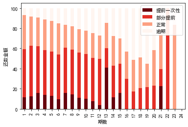

### 代码单元 21

```python
from datetime import datetime,timedelta

#LCLP.info()
LCLP['recorddate'] = pd.to_datetime(LCLP['recorddate'])
LCLP['到期日期'] = pd.to_datetime(LCLP['到期日期'])
LCLP['还款日期'] = pd.to_datetime(LCLP['还款日期'], errors='coerce')
LCLP['lateday'] = LCLP['还款日期']-LCLP['到期日期']

depay = LCLP[LCLP['lateday']>timedelta(days=0)]

#不同等级（A-F）随逾期天数催收还款率的走势
df = depay.groupby(['初始评级','lateday'])['应还本金'].sum()
df1 = df.to_frame().pivot_table(index='lateday',columns = '初始评级', values ='应还本金')
tmp = df1.fillna(0)
df2 = depay.groupby(['初始评级'])['应还本金'].sum()
tmp_1 = tmp[tmp.index <= timedelta(days=90)]
tmp_1 = tmp_1/df2

plt.figure(figsize=(15, 8))
for i in range(6):
    plt.subplot(2,3,i+1)
    plt.plot(range(90),tmp_1[level_idx[i]])
    plt.title(level_idx[i])
plt.show()
```

**图表输出 1**

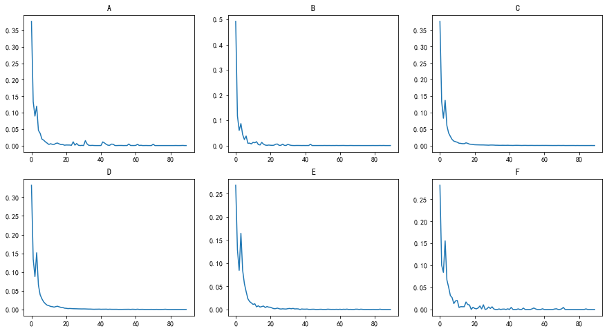

### 代码单元 22

```python
depay['期数'].unique()
```

**文本输出**

```text
array([ 7.,  9., 10., 11., 12.,  4.,  8.,  2.,  3.,  6.,  1.,  5., 13.,
       14., 15., 16., 17., 18., 19., 20., 21., 23.])
```

### 代码单元 23

```python
#不同借款期数随逾期天数催收还款率的走势
df = depay.groupby(['期数','lateday'])['应还本金'].sum()
df1 = df.to_frame().pivot_table(index='lateday',columns = '期数', values ='应还本金')
tmp = df1.fillna(0)
df2 = depay.groupby(['期数'])['应还本金'].sum()
tmp_1 = tmp[tmp.index <= timedelta(days=90)]
tmp_1 = tmp_1/df2

plt.figure(figsize=(15, 12))
for i in range(1,22):
    plt.subplot(4,6,i)
    plt.plot(range(90),tmp_1[i])
    plt.xticks([0,30,60,90])
    plt.title(str(i))
plt.show()
```

**图表输出 1**

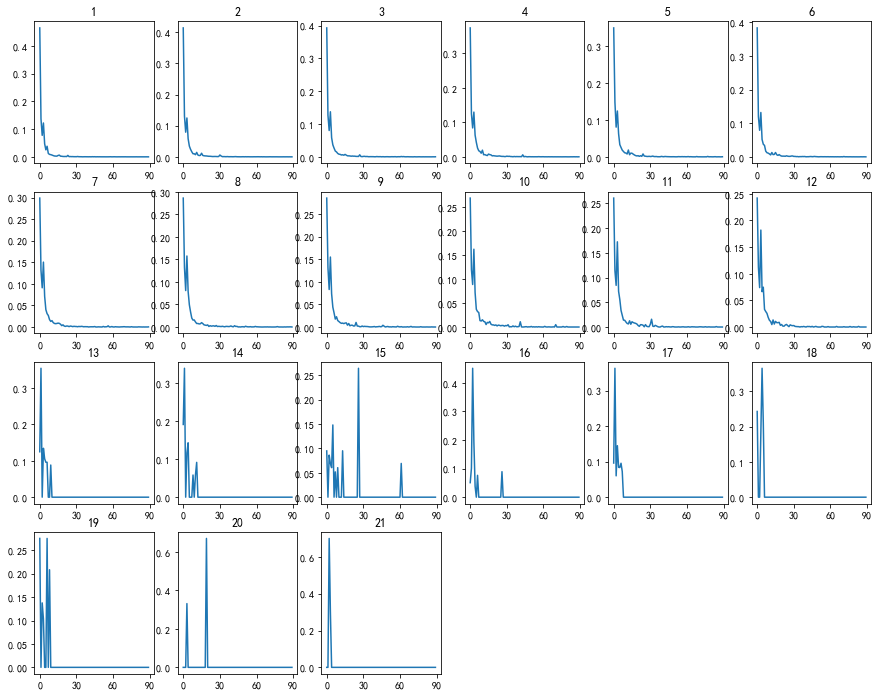

### 代码单元 24

```python
#不同借款金额随逾期天数催收还款率的走势
def function(a):
    if a>0 and a<2000:
        return '0-2000'
    elif a>=2000 and a<3000:
        return '2000-3000'
    elif a>=3000 and a<4000:
        return '3000-4000'
    elif a>=4000 and a<5000:
        return '4000-5000'
    elif a>=5000 and a<6000:
        return '5000-6000'
    else:
        return '6000+'

depay['金额类型'] = depay.apply(lambda x:function(x['借款金额']),axis=1)

df = depay.groupby(['金额类型','lateday'])['应还本金'].sum().copy()
df1 = df.to_frame().pivot_table(index='lateday',columns = '金额类型', values ='应还本金')
tmp = df1.fillna(0)
df2 = depay.groupby(['金额类型'])['应还本金'].sum()
tmp_1 = tmp[tmp.index <= timedelta(days=90)]
tmp_1 = tmp_1/df2

plt.figure(figsize=(15, 8))
for i in range(6):
    plt.subplot(2,3,i+1)
    plt.plot(range(90),tmp_1[amount_idx[i]])
    plt.xticks([0,30,60,90])
    plt.title(amount_idx[i])
plt.show()
```

### 代码单元 25

```python
from datetime import datetime,timedelta
LCIS = pd.read_csv("./data/LCIS.csv",encoding = 'utf-8')

# 计算从2016年9月至2017年2月所有的利息
def getinterest(df):
    df_1 = df[['ListingId','标当前状态','上次还款日期','上次还款利息']]
    df_1 = df_1[(df_1['标当前状态'] =='正常还款中') | (df_1['标当前状态'] =='已还清')]
    df_1['上次还款日期'] = df_1['上次还款日期'].where(df_1['上次还款日期'].notnull(),'2016/08/31')
    df_1['上次还款日期'] = pd.to_datetime(df_1['上次还款日期'], errors='coerce')
    df_1 = df_1[df_1['上次还款日期']>='2016-09-01'].drop_duplicates()
    df_1_1 = df_1.groupby(['上次还款日期'])['上次还款利息'].sum().to_frame().reset_index()
    return df_1_1

# 计算从2016年9月至2017年2月所有的亏损
def getloss(df):
    df_2 = df[['ListingId', '待还本金', '标当前状态', '上次还款日期', '下次计划还款日期', 'recorddate']]
    df_2 = df_2[(df_2['标当前状态']=='逾期中')]
    df_2['下次计划还款日期'] = pd.to_datetime(df_2['下次计划还款日期'], errors='coerce')
    df_2['recorddate'] = pd.to_datetime(df_2['recorddate'], errors='coerce')
    
    # 往回看90天到2016-06-03
    df_2 = df_2[df_2['下次计划还款日期']>='2016-06-03']
    df_2['delay'] = df_2.apply(lambda x: (x['recorddate'] - x['下次计划还款日期']).days, axis = 1)
    df_2_1 = df_2[df_2['delay']>=90].sort_values(['ListingId','delay'])
    df_2_1['date'] = df_2['下次计划还款日期'] + timedelta(days=90)
    df_2_2 = df_2_1.loc[df_2_1.sort_values('recorddate').iloc[:,0].drop_duplicates().index]
    df_2_2 = df_2_2[['date','待还本金']].groupby(['date'])['待还本金'].sum().to_frame().reset_index()
    return df_2_2

# merge gain and loss
def profit(df):
    df_1_1 = getinterest(df)
    df_2_2 = getloss(df)
    df_now = pd.merge(df_1_1,df_2_2, how = 'left', left_on = '上次还款日期', right_on = 'date')
    df_now['待还本金'] = df_now['待还本金'].where(df_now['待还本金'].notnull(),0)
    df_now['差别'] = df_now['上次还款利息'] - df_now['待还本金']
    return df_now

def draw(df):
    df_now = profit(df)
    plt.plot(df_now['上次还款日期'], np.cumsum(df_now['差别']), label="利息")
    plt.title('累积收益曲线')
    plt.xlabel('时间')
    plt.ylabel('收益金额')
    plt.show()

draw(LCIS)
```

**图表输出 1**

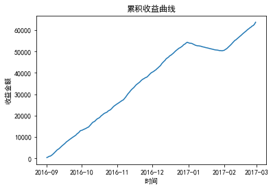
